```mermaid
flowchart TB
    subgraph upstream["Dependants (3)"]
        P1["<b>📦&nbsp;FinanceManager.Web.csproj</b><br/><small>net9.0</small>"]
        P5["<b>📦&nbsp;FinanceManager.Infrastructure.csproj</b><br/><small>net9.0</small>"]
        P6["<b>📦&nbsp;FinanceManager.Tests.csproj</b><br/><small>net9.0</small>"]
        click P1 "#financemanagerwebfinancemanagerwebcsproj"
        click P5 "#financemanagerinfrastructurefinancemanagerinfrastructurecsproj"
        click P6 "#financemanagertestsfinancemanagertestscsproj"
    end
    subgraph current["FinanceManager.Application.csproj"]
        MAIN["<b>📦&nbsp;FinanceManager.Application.csproj</b><br/><small>net9.0</small>"]
        click MAIN "#financemanagerapplicationfinancemanagerapplicationcsproj"
    end
    subgraph downstream["Dependencies (2"]
        P3["<b>📦&nbsp;FinanceManager.Domain.csproj</b><br/><small>net9.0</small>"]
        P2["<b>📦&nbsp;FinanceManager.Shared.csproj</b><br/><small>net9.0</small>"]
        click P3 "#financemanagerdomainfinancemanagerdomaincsproj"
        click P2 "#financemanagersharedfinancemanagersharedcsproj"
    end
    P1 --> MAIN
    P5 --> MAIN
    P6 --> MAIN
    MAIN --> P3
    MAIN --> P2

```

```mermaid
flowchart TB
    subgraph upstream["Dependants (4)"]
        P1["<b>📦&nbsp;FinanceManager.Web.csproj</b><br/><small>net9.0</small>"]
        P4["<b>📦&nbsp;FinanceManager.Application.csproj</b><br/><small>net9.0</small>"]
        P5["<b>📦&nbsp;FinanceManager.Infrastructure.csproj</b><br/><small>net9.0</small>"]
        P6["<b>📦&nbsp;FinanceManager.Tests.csproj</b><br/><small>net9.0</small>"]
        click P1 "#financemanagerwebfinancemanagerwebcsproj"
        click P4 "#financemanagerapplicationfinancemanagerapplicationcsproj"
        click P5 "#financemanagerinfrastructurefinancemanagerinfrastructurecsproj"
        click P6 "#financemanagertestsfinancemanagertestscsproj"
    end
    subgraph current["FinanceManager.Domain.csproj"]
        MAIN["<b>📦&nbsp;FinanceManager.Domain.csproj</b><br/><small>net9.0</small>"]
        click MAIN "#financemanagerdomainfinancemanagerdomaincsproj"
    end
    subgraph downstream["Dependencies (1"]
        P2["<b>📦&nbsp;FinanceManager.Shared.csproj</b><br/><small>net9.0</small>"]
        click P2 "#financemanagersharedfinancemanagersharedcsproj"
    end
    P1 --> MAIN
    P4 --> MAIN
    P5 --> MAIN
    P6 --> MAIN
    MAIN --> P2

```

```mermaid
flowchart TB
    subgraph upstream["Dependants (2)"]
        P1["<b>📦&nbsp;FinanceManager.Web.csproj</b><br/><small>net9.0</small>"]
        P6["<b>📦&nbsp;FinanceManager.Tests.csproj</b><br/><small>net9.0</small>"]
        click P1 "#financemanagerwebfinancemanagerwebcsproj"
        click P6 "#financemanagertestsfinancemanagertestscsproj"
    end
    subgraph current["FinanceManager.Infrastructure.csproj"]
        MAIN["<b>📦&nbsp;FinanceManager.Infrastructure.csproj</b><br/><small>net9.0</small>"]
        click MAIN "#financemanagerinfrastructurefinancemanagerinfrastructurecsproj"
    end
    subgraph downstream["Dependencies (2"]
        P3["<b>📦&nbsp;FinanceManager.Domain.csproj</b><br/><small>net9.0</small>"]
        P4["<b>📦&nbsp;FinanceManager.Application.csproj</b><br/><small>net9.0</small>"]
        click P3 "#financemanagerdomainfinancemanagerdomaincsproj"
        click P4 "#financemanagerapplicationfinancemanagerapplicationcsproj"
    end
    P1 --> MAIN
    P6 --> MAIN
    MAIN --> P3
    MAIN --> P4

```

```mermaid
flowchart TB
    subgraph current["FinanceManager.Tests.Integration.csproj"]
        MAIN["<b>📦&nbsp;FinanceManager.Tests.Integration.csproj</b><br/><small>net9.0</small>"]
        click MAIN "#financemanagertestsintegrationfinancemanagertestsintegrationcsproj"
    end
    subgraph downstream["Dependencies (2"]
        P1["<b>📦&nbsp;FinanceManager.Web.csproj</b><br/><small>net9.0</small>"]
        P2["<b>📦&nbsp;FinanceManager.Shared.csproj</b><br/><small>net9.0</small>"]
        click P1 "#financemanagerwebfinancemanagerwebcsproj"
        click P2 "#financemanagersharedfinancemanagersharedcsproj"
    end
    MAIN --> P1
    MAIN --> P2

```

```mermaid
flowchart TB
    subgraph upstream["Dependants (2)"]
        P6["<b>📦&nbsp;FinanceManager.Tests.csproj</b><br/><small>net9.0</small>"]
        P7["<b>📦&nbsp;FinanceManager.Tests.Integration.csproj</b><br/><small>net9.0</small>"]
        click P6 "#financemanagertestsfinancemanagertestscsproj"
        click P7 "#financemanagertestsintegrationfinancemanagertestsintegrationcsproj"
    end
    subgraph current["FinanceManager.Web.csproj"]
        MAIN["<b>📦&nbsp;FinanceManager.Web.csproj</b><br/><small>net9.0</small>"]
        click MAIN "#financemanagerwebfinancemanagerwebcsproj"
    end
    subgraph downstream["Dependencies (4"]
        P2["<b>📦&nbsp;FinanceManager.Shared.csproj</b><br/><small>net9.0</small>"]
        P5["<b>📦&nbsp;FinanceManager.Infrastructure.csproj</b><br/><small>net9.0</small>"]
        P3["<b>📦&nbsp;FinanceManager.Domain.csproj</b><br/><small>net9.0</small>"]
        P4["<b>📦&nbsp;FinanceManager.Application.csproj</b><br/><small>net9.0</small>"]
        click P2 "#financemanagersharedfinancemanagersharedcsproj"
        click P5 "#financemanagerinfrastructurefinancemanagerinfrastructurecsproj"
        click P3 "#financemanagerdomainfinancemanagerdomaincsproj"
        click P4 "#financemanagerapplicationfinancemanagerapplicationcsproj"
    end
    P6 --> MAIN
    P7 --> MAIN
    MAIN --> P2
    MAIN --> P5
    MAIN --> P3
    MAIN --> P4

```

# Projects and dependencies analysis

This document provides a comprehensive overview of the projects and their dependencies in the context of upgrading to .NETCoreApp,Version=v10.0.

## Table of Contents

- [Executive Summary](#executive-Summary)
  - [Highlevel Metrics](#highlevel-metrics)
  - [Projects Compatibility](#projects-compatibility)
  - [Package Compatibility](#package-compatibility)
  - [API Compatibility](#api-compatibility)
- [Aggregate NuGet packages details](#aggregate-nuget-packages-details)
- [Top API Migration Challenges](#top-api-migration-challenges)
  - [Technologies and Features](#technologies-and-features)
  - [Most Frequent API Issues](#most-frequent-api-issues)
- [Projects Relationship Graph](#projects-relationship-graph)
- [Project Details](#project-details)

  - [FinanceManager.Application\FinanceManager.Application.csproj](#financemanagerapplicationfinancemanagerapplicationcsproj)
  - [FinanceManager.Domain\FinanceManager.Domain.csproj](#financemanagerdomainfinancemanagerdomaincsproj)
  - [FinanceManager.Infrastructure\FinanceManager.Infrastructure.csproj](#financemanagerinfrastructurefinancemanagerinfrastructurecsproj)
  - [FinanceManager.Shared\FinanceManager.Shared.csproj](#financemanagersharedfinancemanagersharedcsproj)
  - [FinanceManager.Tests.Integration\FinanceManager.Tests.Integration.csproj](#financemanagertestsintegrationfinancemanagertestsintegrationcsproj)
  - [FinanceManager.Tests\FinanceManager.Tests.csproj](#financemanagertestsfinancemanagertestscsproj)
  - [FinanceManager.Web\FinanceManager.Web.csproj](#financemanagerwebfinancemanagerwebcsproj)

## Executive Summary

### Highlevel Metrics

| Metric | Count | Status |
| :--- | :---: | :--- |
| Total Projects | 7 | All require upgrade |
| Total NuGet Packages | 35 | 13 need upgrade |
| Total Code Files | 765 |  |
| Total Code Files with Incidents | 74 |  |
| Total Lines of Code | 178507 |  |
| Total Number of Issues | 468 |  |
| Estimated LOC to modify | 419+ | at least 0,2% of codebase |

### Projects Compatibility

| Project | Target Framework | Difficulty | Package Issues | API Issues | Est. LOC Impact | Description |
| :--- | :---: | :---: | :---: | :---: | :---: | :--- |
| [FinanceManager.Application\FinanceManager.Application.csproj](#financemanagerapplicationfinancemanagerapplicationcsproj) | net9.0 | 🟢 Low | 5 | 0 |  | ClassLibrary, Sdk Style = True |
| [FinanceManager.Domain\FinanceManager.Domain.csproj](#financemanagerdomainfinancemanagerdomaincsproj) | net9.0 | 🟢 Low | 5 | 0 |  | ClassLibrary, Sdk Style = True |
| [FinanceManager.Infrastructure\FinanceManager.Infrastructure.csproj](#financemanagerinfrastructurefinancemanagerinfrastructurecsproj) | net9.0 | 🟢 Low | 9 | 31 | 31+ | ClassLibrary, Sdk Style = True |
| [FinanceManager.Shared\FinanceManager.Shared.csproj](#financemanagersharedfinancemanagersharedcsproj) | net9.0 | 🟢 Low | 0 | 188 | 188+ | ClassLibrary, Sdk Style = True |
| [FinanceManager.Tests.Integration\FinanceManager.Tests.Integration.csproj](#financemanagertestsintegrationfinancemanagertestsintegrationcsproj) | net9.0 | 🟢 Low | 2 | 0 |  | DotNetCoreApp, Sdk Style = True |
| [FinanceManager.Tests\FinanceManager.Tests.csproj](#financemanagertestsfinancemanagertestscsproj) | net9.0 | 🟢 Low | 11 | 64 | 64+ | DotNetCoreApp, Sdk Style = True |
| [FinanceManager.Web\FinanceManager.Web.csproj](#financemanagerwebfinancemanagerwebcsproj) | net9.0 | 🟡 Medium | 10 | 136 | 136+ | AspNetCore, Sdk Style = True |

### Package Compatibility

| Status | Count | Percentage |
| :--- | :---: | :---: |
| ✅ Compatible | 22 | 62,9% |
| ⚠️ Incompatible | 1 | 2,9% |
| 🔄 Upgrade Recommended | 12 | 34,3% |
| ***Total NuGet Packages*** | ***35*** | ***100%*** |

### API Compatibility

| Category | Count | Impact |
| :--- | :---: | :--- |
| 🔴 Binary Incompatible | 46 | High - Require code changes |
| 🟡 Source Incompatible | 38 | Medium - Needs re-compilation and potential conflicting API error fixing |
| 🔵 Behavioral change | 335 | Low - Behavioral changes that may require testing at runtime |
| ✅ Compatible | 262512 |  |
| ***Total APIs Analyzed*** | ***262931*** |  |

## Aggregate NuGet packages details

| Package | Current Version | Suggested Version | Projects | Description |
| :--- | :---: | :---: | :--- | :--- |
| bunit | 2.1.1 |  | [FinanceManager.Tests.csproj](#financemanagertestsfinancemanagertestscsproj) | ✅Compatible |
| coverlet.collector | 6.0.4 |  | [FinanceManager.Tests.csproj](#financemanagertestsfinancemanagertestscsproj) | ✅Compatible |
| DocumentFormat.OpenXml | 3.3.0 |  | [FinanceManager.Infrastructure.csproj](#financemanagerinfrastructurefinancemanagerinfrastructurecsproj) | ✅Compatible |
| FluentAssertions | 6.12.0 |  | [FinanceManager.Tests.Integration.csproj](#financemanagertestsintegrationfinancemanagertestsintegrationcsproj) | ✅Compatible |
| FluentAssertions | 6.12.1 |  | [FinanceManager.Tests.csproj](#financemanagertestsfinancemanagertestscsproj) | ✅Compatible |
| itext | 9.4.0 |  | [FinanceManager.Infrastructure.csproj](#financemanagerinfrastructurefinancemanagerinfrastructurecsproj) | ✅Compatible |
| itext.bouncy-castle-adapter | 9.4.0 |  | [FinanceManager.Infrastructure.csproj](#financemanagerinfrastructurefinancemanagerinfrastructurecsproj) [FinanceManager.Tests.csproj](#financemanagertestsfinancemanagertestscsproj) [FinanceManager.Web.csproj](#financemanagerwebfinancemanagerwebcsproj) | ✅Compatible |
| Microsoft.AspNetCore.Authentication.JwtBearer | 9.0.11 | 10.0.3 | [FinanceManager.Tests.csproj](#financemanagertestsfinancemanagertestscsproj) [FinanceManager.Web.csproj](#financemanagerwebfinancemanagerwebcsproj) | Ein NuGet-Paketupgrade wird empfohlen |
| Microsoft.AspNetCore.Cryptography.KeyDerivation | 9.0.11 | 10.0.3 | [FinanceManager.Application.csproj](#financemanagerapplicationfinancemanagerapplicationcsproj) [FinanceManager.Domain.csproj](#financemanagerdomainfinancemanagerdomaincsproj) [FinanceManager.Infrastructure.csproj](#financemanagerinfrastructurefinancemanagerinfrastructurecsproj) [FinanceManager.Tests.csproj](#financemanagertestsfinancemanagertestscsproj) [FinanceManager.Web.csproj](#financemanagerwebfinancemanagerwebcsproj) | Ein NuGet-Paketupgrade wird empfohlen |
| Microsoft.AspNetCore.Identity | 2.3.1 |  | [FinanceManager.Infrastructure.csproj](#financemanagerinfrastructurefinancemanagerinfrastructurecsproj) | ✅Compatible |
| Microsoft.AspNetCore.Identity.EntityFrameworkCore | 9.0.11 | 10.0.3 | [FinanceManager.Domain.csproj](#financemanagerdomainfinancemanagerdomaincsproj) [FinanceManager.Infrastructure.csproj](#financemanagerinfrastructurefinancemanagerinfrastructurecsproj) [FinanceManager.Tests.csproj](#financemanagertestsfinancemanagertestscsproj) [FinanceManager.Web.csproj](#financemanagerwebfinancemanagerwebcsproj) | Ein NuGet-Paketupgrade wird empfohlen |
| Microsoft.AspNetCore.Mvc.Core | 2.3.0 |  | [FinanceManager.Tests.csproj](#financemanagertestsfinancemanagertestscsproj) | ✅Compatible |
| Microsoft.AspNetCore.Mvc.Testing | 9.0.11 | 10.0.3 | [FinanceManager.Tests.Integration.csproj](#financemanagertestsintegrationfinancemanagertestsintegrationcsproj) | Ein NuGet-Paketupgrade wird empfohlen |
| Microsoft.EntityFrameworkCore | 9.0.11 | 10.0.3 | [FinanceManager.Application.csproj](#financemanagerapplicationfinancemanagerapplicationcsproj) [FinanceManager.Domain.csproj](#financemanagerdomainfinancemanagerdomaincsproj) [FinanceManager.Infrastructure.csproj](#financemanagerinfrastructurefinancemanagerinfrastructurecsproj) [FinanceManager.Tests.csproj](#financemanagertestsfinancemanagertestscsproj) [FinanceManager.Web.csproj](#financemanagerwebfinancemanagerwebcsproj) | Ein NuGet-Paketupgrade wird empfohlen |
| Microsoft.EntityFrameworkCore.Design | 9.0.11 | 10.0.3 | [FinanceManager.Infrastructure.csproj](#financemanagerinfrastructurefinancemanagerinfrastructurecsproj) [FinanceManager.Web.csproj](#financemanagerwebfinancemanagerwebcsproj) | Ein NuGet-Paketupgrade wird empfohlen |
| Microsoft.EntityFrameworkCore.InMemory | 9.0.11 | 10.0.3 | [FinanceManager.Tests.csproj](#financemanagertestsfinancemanagertestscsproj) | Ein NuGet-Paketupgrade wird empfohlen |
| Microsoft.EntityFrameworkCore.Sqlite | 9.0.11 | 10.0.3 | [FinanceManager.Infrastructure.csproj](#financemanagerinfrastructurefinancemanagerinfrastructurecsproj) [FinanceManager.Tests.csproj](#financemanagertestsfinancemanagertestscsproj) [FinanceManager.Web.csproj](#financemanagerwebfinancemanagerwebcsproj) | Ein NuGet-Paketupgrade wird empfohlen |
| Microsoft.Extensions.Caching.Memory | 9.0.11 | 10.0.3 | [FinanceManager.Application.csproj](#financemanagerapplicationfinancemanagerapplicationcsproj) [FinanceManager.Domain.csproj](#financemanagerdomainfinancemanagerdomaincsproj) [FinanceManager.Infrastructure.csproj](#financemanagerinfrastructurefinancemanagerinfrastructurecsproj) [FinanceManager.Tests.csproj](#financemanagertestsfinancemanagertestscsproj) [FinanceManager.Web.csproj](#financemanagerwebfinancemanagerwebcsproj) | Ein NuGet-Paketupgrade wird empfohlen |
| Microsoft.Extensions.Hosting.Abstractions | 9.0.11 | 10.0.3 | [FinanceManager.Application.csproj](#financemanagerapplicationfinancemanagerapplicationcsproj) [FinanceManager.Infrastructure.csproj](#financemanagerinfrastructurefinancemanagerinfrastructurecsproj) [FinanceManager.Tests.csproj](#financemanagertestsfinancemanagertestscsproj) [FinanceManager.Web.csproj](#financemanagerwebfinancemanagerwebcsproj) | Ein NuGet-Paketupgrade wird empfohlen |
| Microsoft.Extensions.Http | 9.0.11 | 10.0.3 | [FinanceManager.Infrastructure.csproj](#financemanagerinfrastructurefinancemanagerinfrastructurecsproj) [FinanceManager.Tests.csproj](#financemanagertestsfinancemanagertestscsproj) [FinanceManager.Web.csproj](#financemanagerwebfinancemanagerwebcsproj) | Ein NuGet-Paketupgrade wird empfohlen |
| Microsoft.Extensions.Identity.Core | 9.0.11 | 10.0.3 | [FinanceManager.Application.csproj](#financemanagerapplicationfinancemanagerapplicationcsproj) [FinanceManager.Domain.csproj](#financemanagerdomainfinancemanagerdomaincsproj) [FinanceManager.Infrastructure.csproj](#financemanagerinfrastructurefinancemanagerinfrastructurecsproj) [FinanceManager.Tests.csproj](#financemanagertestsfinancemanagertestscsproj) [FinanceManager.Web.csproj](#financemanagerwebfinancemanagerwebcsproj) | Ein NuGet-Paketupgrade wird empfohlen |
| Microsoft.IdentityModel.Tokens | 8.15.0 |  | [FinanceManager.Infrastructure.csproj](#financemanagerinfrastructurefinancemanagerinfrastructurecsproj) [FinanceManager.Tests.csproj](#financemanagertestsfinancemanagertestscsproj) [FinanceManager.Web.csproj](#financemanagerwebfinancemanagerwebcsproj) | ✅Compatible |
| Microsoft.NET.Test.Sdk | 18.0.1 |  | [FinanceManager.Tests.csproj](#financemanagertestsfinancemanagertestscsproj) [FinanceManager.Tests.Integration.csproj](#financemanagertestsintegrationfinancemanagertestsintegrationcsproj) | ✅Compatible |
| Moq | 4.20.72 |  | [FinanceManager.Tests.csproj](#financemanagertestsfinancemanagertestscsproj) | ✅Compatible |
| PdfPig | 0.1.13 |  | [FinanceManager.Infrastructure.csproj](#financemanagerinfrastructurefinancemanagerinfrastructurecsproj) [FinanceManager.Tests.csproj](#financemanagertestsfinancemanagertestscsproj) [FinanceManager.Tests.Integration.csproj](#financemanagertestsintegrationfinancemanagertestsintegrationcsproj) [FinanceManager.Web.csproj](#financemanagerwebfinancemanagerwebcsproj) | ✅Compatible |
| Portable.BouncyCastle | 1.9.0 |  | [FinanceManager.Infrastructure.csproj](#financemanagerinfrastructurefinancemanagerinfrastructurecsproj) | ✅Compatible |
| Serilog.AspNetCore | 9.0.0 |  | [FinanceManager.Web.csproj](#financemanagerwebfinancemanagerwebcsproj) | ✅Compatible |
| Serilog.Enrichers.Environment | 3.0.1 |  | [FinanceManager.Web.csproj](#financemanagerwebfinancemanagerwebcsproj) | ✅Compatible |
| Serilog.Enrichers.Process | 3.0.0 |  | [FinanceManager.Web.csproj](#financemanagerwebfinancemanagerwebcsproj) | ✅Compatible |
| Serilog.Enrichers.Thread | 4.0.0 |  | [FinanceManager.Web.csproj](#financemanagerwebfinancemanagerwebcsproj) | ✅Compatible |
| Serilog.Settings.Configuration | 9.0.0 |  | [FinanceManager.Web.csproj](#financemanagerwebfinancemanagerwebcsproj) | ✅Compatible |
| Serilog.Sinks.Console | 6.1.1 |  | [FinanceManager.Tests.csproj](#financemanagertestsfinancemanagertestscsproj) [FinanceManager.Web.csproj](#financemanagerwebfinancemanagerwebcsproj) | ✅Compatible |
| System.IdentityModel.Tokens.Jwt | 8.15.0 |  | [FinanceManager.Infrastructure.csproj](#financemanagerinfrastructurefinancemanagerinfrastructurecsproj) [FinanceManager.Tests.csproj](#financemanagertestsfinancemanagertestscsproj) [FinanceManager.Web.csproj](#financemanagerwebfinancemanagerwebcsproj) | ✅Compatible |
| xunit | 2.9.3 |  | [FinanceManager.Tests.csproj](#financemanagertestsfinancemanagertestscsproj) [FinanceManager.Tests.Integration.csproj](#financemanagertestsintegrationfinancemanagertestsintegrationcsproj) | ⚠️Das NuGet-Paket ist veraltet |
| xunit.runner.visualstudio | 3.1.5 |  | [FinanceManager.Tests.csproj](#financemanagertestsfinancemanagertestscsproj) [FinanceManager.Tests.Integration.csproj](#financemanagertestsintegrationfinancemanagertestsintegrationcsproj) | ✅Compatible |

## Top API Migration Challenges

### Technologies and Features

| Technology | Issues | Percentage | Migration Path |
| :--- | :---: | :---: | :--- |
| IdentityModel & Claims-based Security | 39 | 9,3% | Windows Identity Foundation (WIF), SAML, and claims-based authentication APIs that have been replaced by modern identity libraries. WIF was the original identity framework for .NET Framework. Migrate to Microsoft.IdentityModel.* packages (modern identity stack). |

### Most Frequent API Issues

| API | Count | Percentage | Category |
| :--- | :---: | :---: | :--- |
| T:System.Net.Http.HttpContent | 184 | 43,9% | Behavioral Change |
| T:System.Uri | 90 | 21,5% | Behavioral Change |
| P:System.Uri.AbsolutePath | 21 | 5,0% | Behavioral Change |
| T:System.Text.Json.JsonDocument | 19 | 4,5% | Behavioral Change |
| M:System.Uri.#ctor(System.String) | 12 | 2,9% | Behavioral Change |
| T:System.IdentityModel.Tokens.Jwt.JwtRegisteredClaimNames | 10 | 2,4% | Binary Incompatible |
| M:System.String.Format(System.IFormatProvider,System.String,System.ReadOnlySpan{System.Object}) | 5 | 1,2% | Source Incompatible |
| M:System.TimeSpan.FromMinutes(System.Int64) | 5 | 1,2% | Source Incompatible |
| T:System.IdentityModel.Tokens.Jwt.JwtSecurityTokenHandler | 4 | 1,0% | Binary Incompatible |
| M:System.IdentityModel.Tokens.Jwt.JwtSecurityTokenHandler.#ctor | 4 | 1,0% | Binary Incompatible |
| M:System.TimeSpan.FromHours(System.Int32) | 4 | 1,0% | Source Incompatible |
| M:System.TimeSpan.FromSeconds(System.Int64) | 4 | 1,0% | Source Incompatible |
| M:Microsoft.Extensions.Configuration.ConfigurationBinder.GetValue''1(Microsoft.Extensions.Configuration.IConfiguration,System.String) | 4 | 1,0% | Binary Incompatible |
| T:System.IdentityModel.Tokens.Jwt.JwtSecurityToken | 3 | 0,7% | Binary Incompatible |
| F:System.IdentityModel.Tokens.Jwt.JwtRegisteredClaimNames.Sub | 3 | 0,7% | Binary Incompatible |
| F:System.IdentityModel.Tokens.Jwt.JwtRegisteredClaimNames.Exp | 3 | 0,7% | Binary Incompatible |
| M:Microsoft.Extensions.DependencyInjection.OptionsConfigurationServiceCollectionExtensions.Configure''1(Microsoft.Extensions.DependencyInjection.IServiceCollection,Microsoft.Extensions.Configuration.IConfiguration) | 3 | 0,7% | Binary Incompatible |
| M:System.IO.Compression.ZipArchive.CreateEntry(System.String,System.IO.Compression.CompressionLevel) | 2 | 0,5% | Behavioral Change |
| M:System.IdentityModel.Tokens.Jwt.JwtSecurityTokenHandler.WriteToken(Microsoft.IdentityModel.Tokens.SecurityToken) | 2 | 0,5% | Binary Incompatible |
| M:System.IdentityModel.Tokens.Jwt.JwtSecurityToken.#ctor(System.String,System.String,System.Collections.Generic.IEnumerable{System.Security.Claims.Claim},System.Nullable{System.DateTime},System.Nullable{System.DateTime},Microsoft.IdentityModel.Tokens.SigningCredentials) | 2 | 0,5% | Binary Incompatible |
| F:System.IdentityModel.Tokens.Jwt.JwtRegisteredClaimNames.UniqueName | 2 | 0,5% | Binary Incompatible |
| P:System.IdentityModel.Tokens.Jwt.JwtSecurityToken.Claims | 2 | 0,5% | Binary Incompatible |
| P:Microsoft.AspNetCore.Authentication.JwtBearer.MessageReceivedContext.Token | 2 | 0,5% | Source Incompatible |
| T:Microsoft.AspNetCore.Authentication.JwtBearer.JwtBearerEvents | 2 | 0,5% | Source Incompatible |
| M:System.Text.Json.JsonSerializer.Deserialize(System.String,System.Type,System.Text.Json.JsonSerializerOptions) | 1 | 0,2% | Behavioral Change |
| M:System.Uri.#ctor(System.String,System.UriKind) | 1 | 0,2% | Behavioral Change |
| M:System.Threading.Tasks.Task.WhenAll(System.ReadOnlySpan{System.Threading.Tasks.Task}) | 1 | 0,2% | Source Incompatible |
| M:System.String.Join(System.Char,System.ReadOnlySpan{System.String}) | 1 | 0,2% | Source Incompatible |
| F:System.IdentityModel.Tokens.Jwt.JwtRegisteredClaimNames.Iat | 1 | 0,2% | Binary Incompatible |
| F:System.IdentityModel.Tokens.Jwt.JwtRegisteredClaimNames.Nbf | 1 | 0,2% | Binary Incompatible |
| M:System.IdentityModel.Tokens.Jwt.JwtSecurityTokenHandler.ValidateToken(System.String,Microsoft.IdentityModel.Tokens.TokenValidationParameters,Microsoft.IdentityModel.Tokens.SecurityToken@) | 1 | 0,2% | Binary Incompatible |
| M:System.TimeSpan.FromMinutes(System.Double) | 1 | 0,2% | Source Incompatible |
| M:System.IdentityModel.Tokens.Jwt.JwtSecurityTokenHandler.ReadJwtToken(System.String) | 1 | 0,2% | Binary Incompatible |
| M:System.Net.Http.HttpContent.ReadAsStreamAsync(System.Threading.CancellationToken) | 1 | 0,2% | Behavioral Change |
| M:System.TimeSpan.FromMilliseconds(System.Double) | 1 | 0,2% | Source Incompatible |
| M:Microsoft.AspNetCore.Builder.ExceptionHandlerExtensions.UseExceptionHandler(Microsoft.AspNetCore.Builder.IApplicationBuilder,System.String,System.Boolean) | 1 | 0,2% | Behavioral Change |
| T:Microsoft.Extensions.DependencyInjection.IdentityEntityFrameworkBuilderExtensions | 1 | 0,2% | Source Incompatible |
| M:Microsoft.Extensions.DependencyInjection.IdentityEntityFrameworkBuilderExtensions.AddEntityFrameworkStores''1(Microsoft.AspNetCore.Identity.IdentityBuilder) | 1 | 0,2% | Source Incompatible |
| P:Microsoft.AspNetCore.Authentication.JwtBearer.JwtBearerEvents.OnMessageReceived | 1 | 0,2% | Source Incompatible |
| M:Microsoft.AspNetCore.Authentication.JwtBearer.JwtBearerEvents.#ctor | 1 | 0,2% | Source Incompatible |
| P:Microsoft.AspNetCore.Authentication.JwtBearer.JwtBearerOptions.Events | 1 | 0,2% | Source Incompatible |
| P:Microsoft.AspNetCore.Authentication.JwtBearer.JwtBearerOptions.TokenValidationParameters | 1 | 0,2% | Source Incompatible |
| P:Microsoft.AspNetCore.Authentication.JwtBearer.JwtBearerOptions.SaveToken | 1 | 0,2% | Source Incompatible |
| P:Microsoft.AspNetCore.Authentication.JwtBearer.JwtBearerOptions.RequireHttpsMetadata | 1 | 0,2% | Source Incompatible |
| T:Microsoft.AspNetCore.Authentication.JwtBearer.JwtBearerDefaults | 1 | 0,2% | Source Incompatible |
| F:Microsoft.AspNetCore.Authentication.JwtBearer.JwtBearerDefaults.AuthenticationScheme | 1 | 0,2% | Source Incompatible |
| T:Microsoft.Extensions.DependencyInjection.JwtBearerExtensions | 1 | 0,2% | Source Incompatible |
| M:Microsoft.Extensions.DependencyInjection.JwtBearerExtensions.AddJwtBearer(Microsoft.AspNetCore.Authentication.AuthenticationBuilder,System.Action{Microsoft.AspNetCore.Authentication.JwtBearer.JwtBearerOptions}) | 1 | 0,2% | Source Incompatible |
| M:Microsoft.Extensions.DependencyInjection.HttpClientFactoryServiceCollectionExtensions.AddHttpClient(Microsoft.Extensions.DependencyInjection.IServiceCollection,System.String,System.Action{System.Net.Http.HttpClient}) | 1 | 0,2% | Behavioral Change |
| M:Microsoft.Extensions.DependencyInjection.HttpClientFactoryServiceCollectionExtensions.AddHttpClient(Microsoft.Extensions.DependencyInjection.IServiceCollection,System.String,System.Action{System.IServiceProvider,System.Net.Http.HttpClient}) | 1 | 0,2% | Behavioral Change |

## Projects Relationship Graph

Legend:
📦 SDK-style project
⚙️ Classic project

```mermaid
flowchart LR
    P1["<b>📦&nbsp;FinanceManager.Web.csproj</b><br/><small>net9.0</small>"]
    P2["<b>📦&nbsp;FinanceManager.Shared.csproj</b><br/><small>net9.0</small>"]
    P3["<b>📦&nbsp;FinanceManager.Domain.csproj</b><br/><small>net9.0</small>"]
    P4["<b>📦&nbsp;FinanceManager.Application.csproj</b><br/><small>net9.0</small>"]
    P5["<b>📦&nbsp;FinanceManager.Infrastructure.csproj</b><br/><small>net9.0</small>"]
    P6["<b>📦&nbsp;FinanceManager.Tests.csproj</b><br/><small>net9.0</small>"]
    P7["<b>📦&nbsp;FinanceManager.Tests.Integration.csproj</b><br/><small>net9.0</small>"]
    P1 --> P2
    P1 --> P5
    P1 --> P3
    P1 --> P4
    P3 --> P2
    P4 --> P3
    P4 --> P2
    P5 --> P3
    P5 --> P4
    P6 --> P1
    P6 --> P2
    P6 --> P5
    P6 --> P3
    P6 --> P4
    P7 --> P1
    P7 --> P2
    click P1 "#financemanagerwebfinancemanagerwebcsproj"
    click P2 "#financemanagersharedfinancemanagersharedcsproj"
    click P3 "#financemanagerdomainfinancemanagerdomaincsproj"
    click P4 "#financemanagerapplicationfinancemanagerapplicationcsproj"
    click P5 "#financemanagerinfrastructurefinancemanagerinfrastructurecsproj"
    click P6 "#financemanagertestsfinancemanagertestscsproj"
    click P7 "#financemanagertestsintegrationfinancemanagertestsintegrationcsproj"

```

## Project Details

### FinanceManager.Application\FinanceManager.Application.csproj

#### Project Info

- **Current Target Framework:** net9.0
- **Proposed Target Framework:** net10.0
- **SDK-style**: True
- **Project Kind:** ClassLibrary
- **Dependencies**: 2
- **Dependants**: 3
- **Number of Files**: 55
- **Number of Files with Incidents**: 1
- **Lines of Code**: 3081
- **Estimated LOC to modify**: 0+ (at least 0,0% of the project)

#### Dependency Graph

Legend:
📦 SDK-style project
⚙️ Classic project

### API Compatibility

| Category | Count | Impact |
| :--- | :---: | :--- |
| 🔴 Binary Incompatible | 0 | High - Require code changes |
| 🟡 Source Incompatible | 0 | Medium - Needs re-compilation and potential conflicting API error fixing |
| 🔵 Behavioral change | 0 | Low - Behavioral changes that may require testing at runtime |
| ✅ Compatible | 1811 |  |
| ***Total APIs Analyzed*** | ***1811*** |  |

### FinanceManager.Domain\FinanceManager.Domain.csproj

#### Project Info

- **Current Target Framework:** net9.0
- **Proposed Target Framework:** net10.0
- **SDK-style**: True
- **Project Kind:** ClassLibrary
- **Dependencies**: 1
- **Dependants**: 4
- **Number of Files**: 42
- **Number of Files with Incidents**: 1
- **Lines of Code**: 5323
- **Estimated LOC to modify**: 0+ (at least 0,0% of the project)

#### Dependency Graph

Legend:
📦 SDK-style project
⚙️ Classic project

### API Compatibility

| Category | Count | Impact |
| :--- | :---: | :--- |
| 🔴 Binary Incompatible | 0 | High - Require code changes |
| 🟡 Source Incompatible | 0 | Medium - Needs re-compilation and potential conflicting API error fixing |
| 🔵 Behavioral change | 0 | Low - Behavioral changes that may require testing at runtime |
| ✅ Compatible | 3888 |  |
| ***Total APIs Analyzed*** | ***3888*** |  |

### FinanceManager.Infrastructure\FinanceManager.Infrastructure.csproj

#### Project Info

- **Current Target Framework:** net9.0
- **Proposed Target Framework:** net10.0
- **SDK-style**: True
- **Project Kind:** ClassLibrary
- **Dependencies**: 2
- **Dependants**: 2
- **Number of Files**: 224
- **Number of Files with Incidents**: 12
- **Lines of Code**: 103529
- **Estimated LOC to modify**: 31+ (at least 0,0% of the project)

#### Dependency Graph

Legend:
📦 SDK-style project
⚙️ Classic project

### API Compatibility

| Category | Count | Impact |
| :--- | :---: | :--- |
| 🔴 Binary Incompatible | 9 | High - Require code changes |
| 🟡 Source Incompatible | 5 | Medium - Needs re-compilation and potential conflicting API error fixing |
| 🔵 Behavioral change | 17 | Low - Behavioral changes that may require testing at runtime |
| ✅ Compatible | 155591 |  |
| ***Total APIs Analyzed*** | ***155622*** |  |

#### Project Technologies and Features

| Technology | Issues | Percentage | Migration Path |
| :--- | :---: | :---: | :--- |
| IdentityModel & Claims-based Security | 9 | 29,0% | Windows Identity Foundation (WIF), SAML, and claims-based authentication APIs that have been replaced by modern identity libraries. WIF was the original identity framework for .NET Framework. Migrate to Microsoft.IdentityModel.* packages (modern identity stack). |

### FinanceManager.Shared\FinanceManager.Shared.csproj

#### Project Info

- **Current Target Framework:** net9.0
- **Proposed Target Framework:** net10.0
- **SDK-style**: True
- **Project Kind:** ClassLibrary
- **Dependencies**: 0
- **Dependants**: 5
- **Number of Files**: 174
- **Number of Files with Incidents**: 27
- **Lines of Code**: 7126
- **Estimated LOC to modify**: 188+ (at least 2,6% of the project)

#### Dependency Graph

Legend:
📦 SDK-style project
⚙️ Classic project

### API Compatibility

| Category | Count | Impact |
| :--- | :---: | :--- |
| 🔴 Binary Incompatible | 0 | High - Require code changes |
| 🟡 Source Incompatible | 0 | Medium - Needs re-compilation and potential conflicting API error fixing |
| 🔵 Behavioral change | 188 | Low - Behavioral changes that may require testing at runtime |
| ✅ Compatible | 10796 |  |
| ***Total APIs Analyzed*** | ***10984*** |  |

### FinanceManager.Tests.Integration\FinanceManager.Tests.Integration.csproj

#### Project Info

- **Current Target Framework:** net9.0
- **Proposed Target Framework:** net10.0
- **SDK-style**: True
- **Project Kind:** DotNetCoreApp
- **Dependencies**: 2
- **Dependants**: 0
- **Number of Files**: 27
- **Number of Files with Incidents**: 1
- **Lines of Code**: 4138
- **Estimated LOC to modify**: 0+ (at least 0,0% of the project)

#### Dependency Graph

Legend:
📦 SDK-style project
⚙️ Classic project

### API Compatibility

| Category | Count | Impact |
| :--- | :---: | :--- |
| 🔴 Binary Incompatible | 0 | High - Require code changes |
| 🟡 Source Incompatible | 0 | Medium - Needs re-compilation and potential conflicting API error fixing |
| 🔵 Behavioral change | 0 | Low - Behavioral changes that may require testing at runtime |
| ✅ Compatible | 7590 |  |
| ***Total APIs Analyzed*** | ***7590*** |  |

### FinanceManager.Tests\FinanceManager.Tests.csproj

#### Project Info

- **Current Target Framework:** net9.0
- **Proposed Target Framework:** net10.0
- **SDK-style**: True
- **Project Kind:** DotNetCoreApp
- **Dependencies**: 5
- **Dependants**: 0
- **Number of Files**: 107
- **Number of Files with Incidents**: 5
- **Lines of Code**: 26549
- **Estimated LOC to modify**: 64+ (at least 0,2% of the project)

#### Dependency Graph

Legend:
📦 SDK-style project
⚙️ Classic project

### API Compatibility

| Category | Count | Impact |
| :--- | :---: | :--- |
| 🔴 Binary Incompatible | 0 | High - Require code changes |
| 🟡 Source Incompatible | 4 | Medium - Needs re-compilation and potential conflicting API error fixing |
| 🔵 Behavioral change | 60 | Low - Behavioral changes that may require testing at runtime |
| ✅ Compatible | 28502 |  |
| ***Total APIs Analyzed*** | ***28566*** |  |

### FinanceManager.Web\FinanceManager.Web.csproj

#### Project Info

- **Current Target Framework:** net9.0
- **Proposed Target Framework:** net10.0
- **SDK-style**: True
- **Project Kind:** AspNetCore
- **Dependencies**: 4
- **Dependants**: 2
- **Number of Files**: 351
- **Number of Files with Incidents**: 27
- **Lines of Code**: 28761
- **Estimated LOC to modify**: 136+ (at least 0,5% of the project)

#### Dependency Graph

Legend:
📦 SDK-style project
⚙️ Classic project

### API Compatibility

| Category | Count | Impact |
| :--- | :---: | :--- |
| 🔴 Binary Incompatible | 37 | High - Require code changes |
| 🟡 Source Incompatible | 29 | Medium - Needs re-compilation and potential conflicting API error fixing |
| 🔵 Behavioral change | 70 | Low - Behavioral changes that may require testing at runtime |
| ✅ Compatible | 54334 |  |
| ***Total APIs Analyzed*** | ***54470*** |  |

#### Project Technologies and Features

| Technology | Issues | Percentage | Migration Path |
| :--- | :---: | :---: | :--- |
| IdentityModel & Claims-based Security | 30 | 22,1% | Windows Identity Foundation (WIF), SAML, and claims-based authentication APIs that have been replaced by modern identity libraries. WIF was the original identity framework for .NET Framework. Migrate to Microsoft.IdentityModel.* packages (modern identity stack). |

