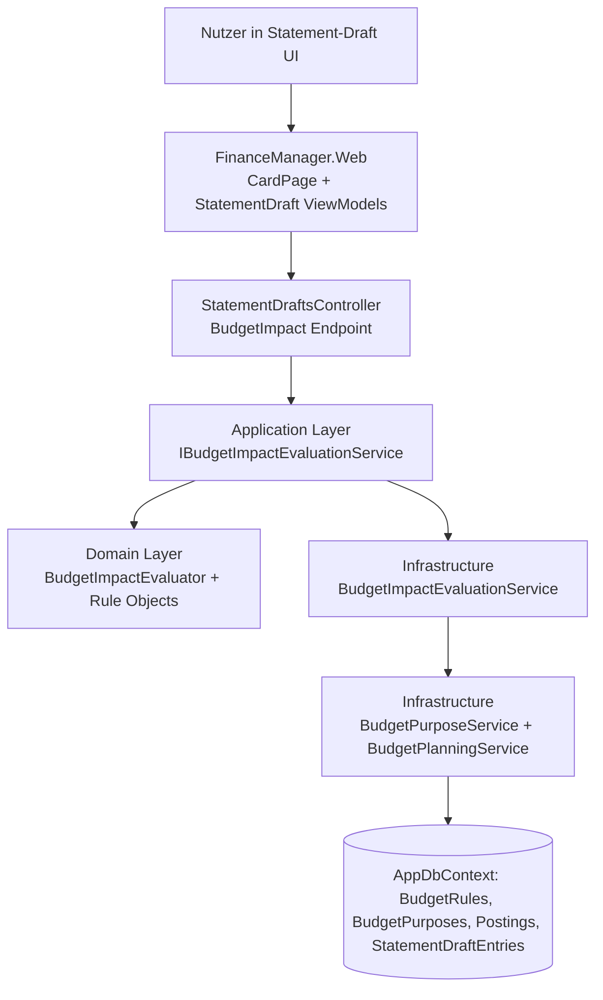
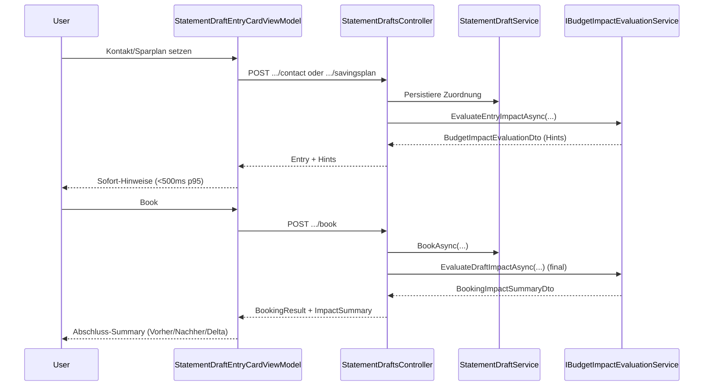

# Architektur-Blueprint: Budget Impact Visibility während Buchung

> **Feature:** Budget Impact Booking  
> **Status:** 📋 Geplant  
> **Version:** 0.2  
> **Datum:** 2026-05-31  
> **Autor:** Architektur- & Lösungsdesign Agent  
> **Anforderungsquelle:** `../requirements/requirements-budget-impact-booking.md`

---

## 1. Zielbild und Scope

Während der Bearbeitung von `StatementDraftEntry` soll das System **direkt nach Kontakt-/Sparplan-Zuordnung** eine Budget-Impact-Bewertung liefern und nach dem Buchen eine **Abschluss-Summary** ausgeben.

Im Fokus:
- Budgetüberschreitung erkennen
- Fast-Ausschöpfung erkennen
- Starke Änderung der Zielerreichung erkennen
- Vorher/Nachher/Delta je betroffenem `BudgetPurpose` transparent machen

Out-of-Scope:
- automatische Budgetanpassung
- autonome Neuplanung von Regeln/Zielen

---

## 2. Systemarchitektur (Schichten, Module, Integrationen)



### 2.1 Hauptmodule
- **Statement Draft Booking Flow** (`StatementDraftsController`, `StatementDraftService`, `StatementDraftCardViewModel`, `StatementDraftEntryCardViewModel`)
- **Budget Read Model** (`BudgetPurposeService`, `BudgetPlanningService`, `BudgetRuleService`)
- **Neues Modul Budget Impact** (Domain + Application + Infrastructure + DTOs)

### 2.2 Integrationspunkte (bestehende Endpunkte, erweiterte Response)
- Trigger 1 (Sofort-Hinweis): `POST /api/statement-drafts/{draftId}/entries/{entryId}/contact`
- Trigger 2 (Sofort-Hinweis): `POST /api/statement-drafts/{draftId}/entries/{entryId}/savingsplan`
- Trigger 3 (Sofort-Hinweis, Sammeländerung): `POST /api/statement-drafts/{draftId}/entries/{entryId}/save-all`
- Abschluss-Summary:
  - `POST /api/statement-drafts/{draftId}/entries/{entryId}/book`
  - `POST /api/statement-drafts/{draftId}/book`

Die Endpunkte bleiben stabil; ergänzt wird die Response um `BudgetImpactEvaluationDto` (Hint-Phase) bzw. `BookingImpactSummaryDto` (Abschluss).

---

## 3. Komponenten- und Schnittstellendesign

```mermaid
flowchart LR
    A[StatementDraftEntry Context] --> B[BudgetImpactEvaluationService]
    B --> C[BudgetPurpose Resolver<br/>SourceType Contact/ContactGroup/SavingsPlan]
    B --> D[Target Calculator<br/>BudgetRules + Dynamic Targets]
    B --> E[Actuals Calculator<br/>Postings + simulated new booking]
    C --> F[Impact Classifier<br/>Exceeded/AlmostExhausted/StronglyChanged]
    D --> F
    E --> F
    F --> G[BudgetImpactHintDto[]]
    F --> H[BookingImpactSummaryDto]
```

### 3.1 Neue Application-Interfaces (implementation-ready)
- `IBudgetImpactEvaluationService`
  - `EvaluateEntryImpactAsync(draftId, entryId, ownerUserId, ct)`
  - `EvaluateDraftImpactAsync(draftId, ownerUserId, ct)` (für Massen-/Gesamtbuchung)

### 3.2 Neue DTOs (Shared)
- `BudgetImpactHintDto` (PurposeId, PurposeName, HintType, BeforeRate, AfterRate, Delta, TargetValue, ActualBefore, ActualAfter, Reason)
- `BudgetImpactEvaluationDto` (EntryId, EvaluatedAt, Hints[])
- `BookingImpactSummaryDto` (DraftId/EntryId, Items[], Totals, HighestSeverity)
- `BookingImpactSummaryItemDto` (Purpose, Before/After/Delta, HintType)

### 3.3 Domain-Regeln
- `BudgetPurpose.SourceType` bestimmt Zuordnung der Buchung zu betroffenen Budgetzwecken.
- `BudgetRules` + dynamische Zielwerte bilden `TargetValue`.
- Ist-Werte = bestehende Postings + simulierte neue Buchung.
- Hint-Klassifikation:
  - `Exceeded`
  - `AlmostExhausted`
  - `StronglyChanged`

---

## 4. Sequenzdesign (Echtzeit-Hinweis + Abschluss-Summary)



---

## 5. Technologie- und Designentscheidungen (für bestehende .NET-Lösung)

1. **Keine neue externe Engine**  
   Umsetzung im bestehenden .NET-Stack (`Domain/Application/Infrastructure/Web`) für geringe Komplexität und hohe Testbarkeit.

2. **Serverseitige Bewertung statt reinem UI-Rechnen**  
   Einheitliche Berechnungslogik für Hinweis und Summary; verhindert Divergenzen zwischen Frontend und Backend.

3. **Wiederverwendung existierender Budget-Bausteine**  
   `BudgetPurposeService`, `BudgetPlanningService`, `BudgetRuleService`, `AppDbContext` bleiben zentrale Datenquellen.

4. **DTO-Erweiterung im Shared-Layer**  
   Saubere API-Verträge für Hints/Summary ohne UI-spezifische Logik im Domain-Layer.

5. **Nicht-blockierende UX mit priorisierten Hints**  
   Hinweise sind guidance-orientiert; Buchung bleibt möglich (wie bestehendes Warning/forceWarnings-Muster).

---

## 6. UI/UX-Konzept

### 6.1 Informationsarchitektur
- **Inline-Hinweisbereich** im Entry-Card-Kontext (direkt nach Kontakt/Sparplan-Feld)
- **Severity-Badges**: Exceeded > AlmostExhausted > StronglyChanged
- **Abschluss-Summary-Panel** nach erfolgreicher Buchung (Entry oder Draft)

### 6.2 Interaktionsdesign
- Trigger bei jeder fachlich relevanten Änderung (`contact`, `savingsplan`, optional `save-all`)
- Debounced API-Aufruf (kurzes Throttling) zur Vermeidung von Request-Spam
- Bei fehlender Zuordnung: neutraler Status statt Warnung

### 6.3 Layout-Skizze

```mermaid
flowchart TB
    A[Entry Card Fields] --> B[Budget Impact Hint Panel]
    B --> C1[Exceeded]
    B --> C2[Almost Exhausted]
    B --> C3[Strongly Changed]
    D[Book Action] --> E[Completion Summary Modal/Panel]
    E --> F[Purpose | Before | After | Delta | Hint]
```

---

## 7. Qualitätsziele (priorisiert)

| Priorität | Ziel | Maßnahme | Messkriterium |
|---|---|---|---|
| P1 | Performance | Evaluationspfad mit vorgefilterten Purpose-/Rule-Queries | Hinweisanzeige < 500ms (p95) |
| P1 | Korrektheit | Zentrale Berechnungsfunktion für Hint + Summary | 100% Konsistenz zwischen Sofort-Hinweis und Abschluss-Summary |
| P1 | Sicherheit | Owner-Scoping über `ownerUserId`; keine Cross-User-Daten | Keine Fremddaten in Integrationstests |
| P2 | Skalierbarkeit | Query-Batching, nur betroffene Zwecke evaluieren | stabile Laufzeit bei steigender Purpose-Anzahl |
| P2 | Testbarkeit | klare Trennung Domain-Klassifikation / Infrastruktur-Datenzugriff | Unit- + Integrationstestabdeckung für Kernpfade |
| P2 | Observability | strukturierte Logs + Metriken (Dauer, Treffer, Severity) | Auswertbare Telemetrie pro Evaluation |

---

## 8. Explizite Verantwortungsschnitte (implementation-ready)

### Domain (`FinanceManager.Domain`)
- Value Objects/Regeln für Impact-Bewertung und Hint-Klassifikation
- Keine DB-/HTTP-Abhängigkeiten

### Application (`FinanceManager.Application`)
- `IBudgetImpactEvaluationService` + Use-Case-Orchestrierung
- Request/Response-Modelle und Geschäftsablauf

### Infrastructure (`FinanceManager.Infrastructure`)
- Implementierung `BudgetImpactEvaluationService`
- Datenzugriff via `AppDbContext`, Reuse von Budget-Services
- Einbezug simulierten neuen Buchungswerts in Actuals

### API (`FinanceManager.Web/Controllers`)
- Erweiterung `StatementDraftsController`-Responses um Budget-Impact-DTOs
- Optional neuer Read-Endpoint: `GET /api/statement-drafts/{draftId}/entries/{entryId}/budget-impact`

### UI (`FinanceManager.Web/ViewModels + Components`)
- `StatementDraftEntryCardViewModel`: direkte Hints nach Zuordnung
- `StatementDraftCardViewModel`: Summary-Render nach Book
- Komponente `BudgetImpactHintPanel` + `BookingImpactSummaryPanel`

---

## 9. Mapping auf Anforderungen

Quelle: [`../requirements/requirements-budget-impact-booking.md`](../requirements/requirements-budget-impact-booking.md)

| Requirement | Architektur-Abdeckung |
|---|---|
| FR-1 / FR-1.1 | Trigger an Kontakt-/Sparplan-Endpoints + `EvaluateEntryImpactAsync` |
| FR-1.2 | Evaluation liefert Liste aller betroffenen `BudgetPurpose` inkl. Konsolidierung |
| FR-2 / FR-2.1 | Hint-Klassifikation `Exceeded`, `AlmostExhausted`, `StronglyChanged` |
| FR-3 | `BookingImpactSummaryDto` nach `BookAsync` mit Vorher/Nachher/Delta |
| FR-4 | UI-Panel mit Zweck, Status, Auslastung, Ursache |
| NFR-1 | Performanceziel <500ms (p95), Query-Batching & fokussierte Evaluation |
| NFR-2 | Eine zentrale Berechnungslogik für Hint + Summary |
| NFR-3 | Klartext-Hinweise, Severity-Badges, konsistente Summary-Struktur |
| NFR-4 | Regel-/Schwellwertlogik aus `BudgetRules` statt UI-Hardcoding |
| NFR-5 | Neutralstatus bei unvollständiger Zuordnung; keine Fehlwarnungs-Spamlogik |

### 9.1 Direkte Abdeckung der Feature-Eingabe
| Eingabeforderung | Architektur-Umsetzung |
|---|---|
| During statement booking, evaluate whether new booking exceeds budgets or changes fulfillment rates. | Serverseitige Impact-Evaluation mit `ActualBefore` + simuliertem `ActualAfter` inkl. neuer Buchung; Klassifikation in Domain-Regeln. |
| Immediate hints after contact/savings plan is determined. | Trigger auf `/contact`, `/savingsplan` und `/save-all`; UI zeigt Inline-Hinweise direkt im Entry-Kontext. |
| End-of-booking summary showing fulfillment before/after/delta and affected budget purposes. | Abschlussantwort für `/entries/{entryId}/book` und `/book` enthält `BookingImpactSummaryDto` mit Vorher/Nachher/Delta je `BudgetPurpose`. |
| Evaluation based on BudgetPurpose.SourceType, BudgetRules, dynamic target values, and actual values incl. new booking. | Resolver + Target/Actual-Calculator nutzen `BudgetPurpose.SourceType`, `BudgetRules`, dynamische Zielwerte (`IBudgetPlanningService`) und simulierte Ist-Werte. |
| Hint types: exceeded, almost exhausted, strongly changed. | Domain-Klassifikation mit genau drei Hint-Typen: `Exceeded`, `AlmostExhausted`, `StronglyChanged`. |

---

## 10. Test- und Rollout-Ansatz (kurz)

1. **Unit-Tests (Domain):** Schwellenlogik, Delta-Berechnung, Hint-Typen  
2. **Integration-Tests:** Controller + Service mit realen BudgetRules/Postings  
3. **UI-Tests (bUnit):** Hint-Panel nach Kontakt/Sparplan, Summary nach Booking  
4. **Rollout:** Feature-Flag `BudgetImpactHintsEnabled` (optional), Monitoring auf Latenz/Fehlerrate

---

## 11. Versionshistorie

| Version | Datum | Änderung |
|---|---|---|
| 0.1 | 2026-05-31 | Initialer Architektur-Blueprint für Budget Impact Visibility im Buchungsprozess |
| 0.2 | 2026-05-31 | Integrationspunkte auf bestehende StatementDraft-Endpunkte präzisiert, Eingabeforderungen explizit gemappt |
