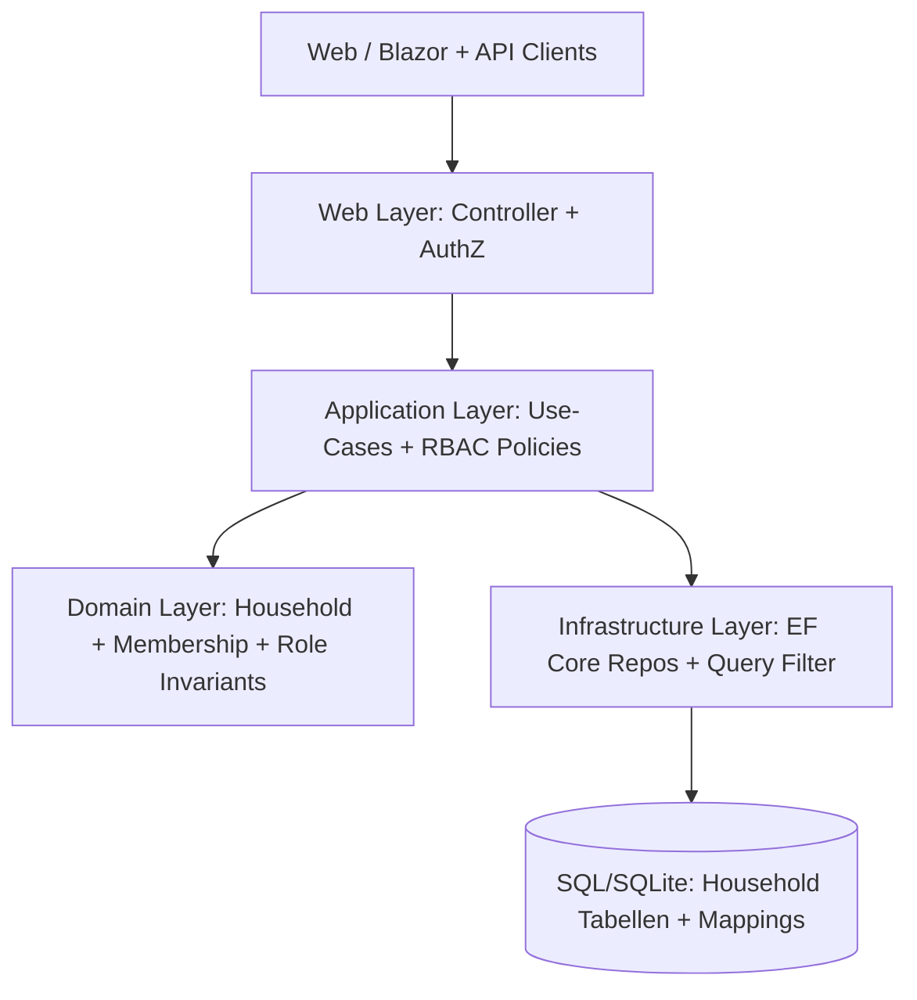
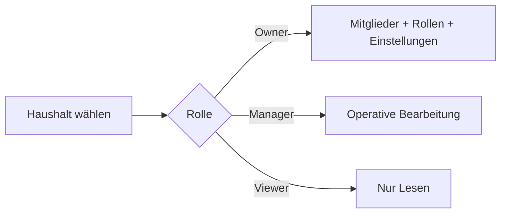

# Architektur-Blueprint: Household-RBAC (Owner/Manager/Viewer)

> **Feature:** Household-RBAC  
> **Status:** 📋 Geplant  
> **Version:** 0.1  
> **Datum:** 2026-05-30  
> **Autor:** Architektur- & Lösungsdesign Agent  
> **Quellen:** `06102d51-0369-438d-b08a-8cd5f738ab23.copilot-task.md`, `docs/requirements/requirements-analysis.md` (fachliche Referenz), bestehende Schichten in `FinanceManager.Domain/Application/Infrastructure/Web`

---

## 1. Zielbild und Scope

Ein Haushalt wird zur neuen fachlichen Zugriffseinheit. Benutzer erhalten **pro Haushalt** genau eine Rolle:

- **Owner**: volle Kontrolle inkl. Rollenverwaltung, Haushaltseinstellungen, Löschung/Archivierung
- **Manager**: operative Bearbeitung (Konten/Buchungen/Budgets/Reports), aber keine Owner-kritischen Admin-Aktionen
- **Viewer**: ausschließlich lesender Zugriff

Der Entwurf integriert RBAC über alle Schichten (Domain/Application/Infrastructure/Web), erweitert API & UI und beschreibt Migration, Tests, Qualitätsziele und Rollout.

---

## 2. Systemarchitektur und Schichtenintegration

### 2.1 Domain
- Neue Aggregate/Entities:
  - `Household` (Id, Name, CreatedByUserId, Status)
  - `HouseholdMembership` (HouseholdId, UserId, Role, Invited/Active/Revoked)
  - Enum `HouseholdRole = Owner | Manager | Viewer`
- Kerninvarianten:
  - Haushalt hat mindestens einen Owner
  - Owner kann nicht entfernt werden, wenn letzter Owner
  - genau eine aktive Membership pro (HouseholdId, UserId)

### 2.2 Application
- Einführung eines zentralen Authorizers:
  - `IHouseholdAuthorizationService`
  - `EnsureCanRead`, `EnsureCanWrite`, `EnsureCanManageMembers`, `EnsureCanManageSettings`
- Alle Use-Cases erhalten `householdId` als Pflichtkontext.
- Mapping bisheriger `ownerUserId`-Logik auf `householdId + actorUserId`.

### 2.3 Infrastructure
- EF-Core-Modelle + Indizes:
  - `Households`
  - `HouseholdMemberships` (Unique: HouseholdId+UserId)
  - optional `HouseholdInvitations`
- Query-Strategie:
  - zentrale Helper für `AccessibleHouseholds(userId)`
  - Write-Operationen nur bei Role >= Manager (Owner-spezifisch separat)

### 2.4 Web
- JWT bleibt AuthN-Basis, RBAC wird als Fach-AuthZ umgesetzt (haushaltsbezogen, nicht nur globale ASP.NET-Role).
- Controller-Endpunkte mit `householdId`-Scope und konsistenten 403-Antworten.

---

## 3. API-Änderungen

## 3.1 Neue Endpunkte (Beispiel)
- `GET /api/households` – sichtbare Haushalte
- `POST /api/households` – Haushalt anlegen (Creator wird Owner)
- `GET /api/households/{householdId}/members`
- `POST /api/households/{householdId}/members/invite`
- `PATCH /api/households/{householdId}/members/{userId}` – Rollenwechsel (Owner-only für kritische Aktionen)
- `DELETE /api/households/{householdId}/members/{userId}`

## 3.2 Bestehende Endpunkte
- Ressourcen-Endpunkte (Accounts, Postings, Budgets, Reports, Securities, …) werden um `householdId`-Kontext ergänzt:
  - Query-Parameter oder Header (`X-Household-Id`) in Übergangsphase
  - langfristig bevorzugt im Route-Scope (`/api/households/{householdId}/accounts`)
- Fehlersemantik:
  - `401` nicht authentifiziert
  - `403` authentifiziert, aber Rolle unzureichend
  - `404` Ressource im Haushalt nicht vorhanden

---

## 4. UI/UX-Steuerung

- Globaler Haushalt-Switcher im Header.
- Rollenabhängige UI-Gates:
  - Owner: Mitgliederverwaltung, kritische Konfiguration
  - Manager: Bearbeiten/Erstellen ohne Owner-Adminfunktionen
  - Viewer: Read-only, Buttons deaktiviert/ausgeblendet
- Klare UX bei 403: „Keine Berechtigung in diesem Haushalt“ inkl. Link zum Rolleninhaber/Owner-Kontakt.

---

## 5. Datenmigration

## 5.1 Migrationsprinzip
1. Neue Tabellen für Household-RBAC hinzufügen (additiv, rückwärtskompatibel).
2. Backfill:
   - pro bisherigem `OwnerUserId` Standard-Haushalt erzeugen (`<Username> Haushalt`)
   - Owner-Membership für diesen User anlegen
   - bestehende Daten (`Accounts`, `Contacts`, `Postings`, `Budgets`, …) mit `HouseholdId` befüllen
3. Dual-Read-Phase:
   - falls `HouseholdId` null (legacy), fallback auf `OwnerUserId`
4. Nach Stabilisierung: `HouseholdId` NOT NULL + Legacy-Pfade entfernen.

## 5.2 Safety
- Migration idempotent ausführbar (Re-Run-fähig).
- Vorab Snapshot/Backup.
- Batchweise Datenaktualisierung mit Fortschrittslogging.

---

## 6. Teststrategie

- **Unit-Tests**
  - Rollenmatrix (Owner/Manager/Viewer) für Read/Write/Admin-Aktionen
  - Domäneninvarianten (mind. 1 Owner)
- **Application-Tests**
  - Authorizer in zentralen Use-Cases
  - negativer Zugriff => 403/Forbidden-Fehler
- **Integration-Tests**
  - API-Endpunkte mit JWT + Haushaltkontext
  - Mandantentrennung zwischen Haushalten
  - Migrations-Tests mit Legacy-Daten
- **UI-Tests (bUnit/Playwright)**
  - Sichtbarkeit/Deaktivierung von Aktionen je Rolle
  - Haushaltswechsel aktualisiert Daten- und Rechtekontext korrekt
- **Regression**
  - bisherige owner-scoped Szenarien bleiben fachlich korrekt (jetzt via Default-Haushalt)

---

## 7. Qualitätsziele (priorisiert)

| Priorität | Ziel | Maßnahme | Messkriterium |
|---|---|---|---|
| P1 | Sicherheit / Mandantentrennung | zentraler Household-Authorizer + DB-Filter | keine Cross-Household-Zugriffe in Integrationstests |
| P1 | Korrektheit RBAC | feste Rollenmatrix + Invarianten | 100% Pass in RBAC-Unit-/Integrationstests |
| P2 | Performance | Indizes auf Membership/HouseholdId, gecachte Membership-Lookups | keine signifikante API-Latenzerhöhung (>10%) |
| P2 | Testbarkeit | klare Schichttrennung + Authorizer abstrahiert | deterministische Tests ohne UI-Kopplung |
| P3 | Betriebsfähigkeit | Migrations-Logs, Feature-Flags, Rollbackpfad | reproduzierbarer Rollout ohne Datenverlust |

---

## 8. Rolloutplan

1. **Phase 0 – Vorbereitung**
   - Feature-Flag `HouseholdRbacEnabled`
   - DB-Migration additiv deployen
2. **Phase 1 – Schattenbetrieb**
   - Datenbackfill + Dual-Read aktiv
   - Monitoring auf 401/403/500 und Migrationsfehler
3. **Phase 2 – Aktivierung**
   - API/UI-RBAC für Pilotnutzer aktivieren
   - Support-Runbook für Rollen-/Haushaltsprobleme
4. **Phase 3 – General Availability**
   - Feature-Flag global aktiv
   - Legacy `OwnerUserId`-Only-Pfade entfernen
5. **Phase 4 – Nachhärtung**
   - Performance-Tuning, Audit-Logging schärfen, Doku finalisieren

Rollback: Feature-Flag zurücksetzen, Dual-Read beibehalten, keine destruktiven Schemaänderungen vor Abschluss.

---

## 9. Offene Architekturentscheidungen (ADR-Kandidaten)

1. Haushaltkontext per Route (`/households/{id}/...`) vs Header (`X-Household-Id`)
2. Einladungssystem intern (Token) vs E-Mail-basiert
3. Soft-Delete vs Hard-Delete für Membership-Historie/Audit

---

## 10. Versionshistorie

| Version | Datum | Änderung |
|---|---|---|
| 0.1 | 2026-05-30 | Initialer RBAC-Architektur-Blueprint inkl. Schichtenintegration, API/UI, Migration, Tests, Qualitätsziele, Rollout |

