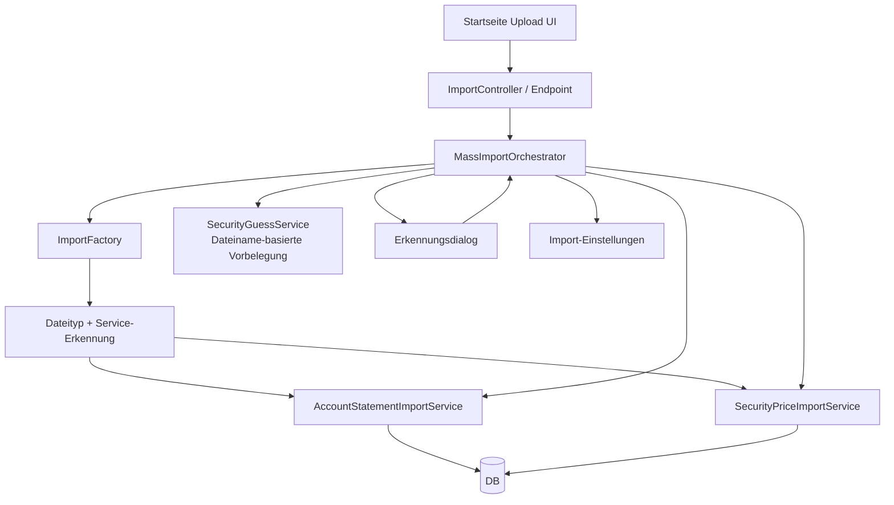
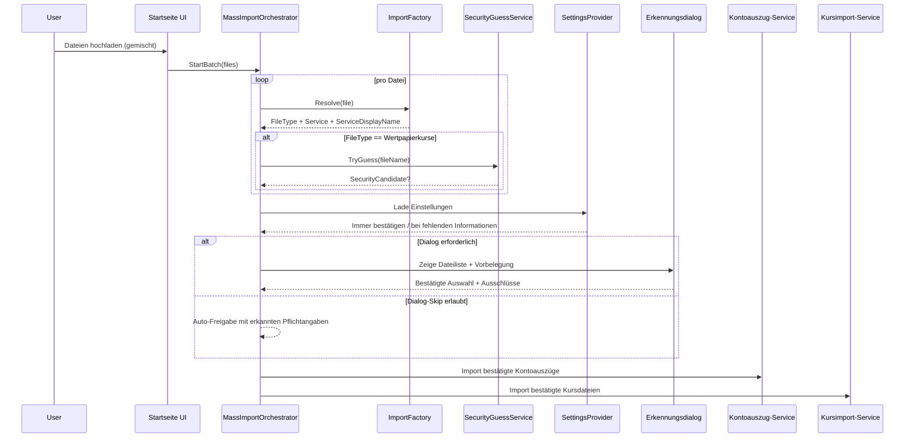

# Architektur-Blueprint: Startseiten-Massenimport (Kontoauszug + ING-Wertpapierkurse)

> **Feature:** Massenimport auf der Startseite mit gemischten Dateien inkl. Erkennungsdialog  
> **Status:** ✅ Implementiert  
> **Version:** 1.1  
> **Datum:** 2026-07-03  
> **Primärquelle:** [`../../issue.md`](../../issue.md)  
> **Requirements-Referenz:** [`../requirements/massenimport-ing-wertpapierkurse-requirements.md`](../requirements/massenimport-ing-wertpapierkurse-requirements.md)

## 1. Systemarchitektur

Der bestehende Startseiten-Import wird zu einem gemeinsamen Batch-Flow für Kontoauszüge und Kursdateien erweitert. Kern ist eine **ImportFactory**, die pro Datei den **Dateityp** und den **zuständigen Service inkl. Anzeigename** ermittelt. Bei Kursdateien erfolgt zusätzlich eine Dateiname-basierte Wertpapiervorerkennung.  
Der eigentliche Import startet erst nach Bestätigung im Dialog – außer wenn der Dialog gemäß Einstellungen regelkonform übersprungen werden darf.

## 2. Module und Schnittstellen

### 2.1 Kernmodule (implementiert)
- **MassImportOrchestrator** (`FinanceManager.Infrastructure/Statements/MassImportOrchestrator.cs`)
  - Koordiniert Voranalyse, Dialog-Skip-Entscheidung, Bestätigung und Ausführung.
- **Dateierkennung im Orchestrator**
  - Ermittelt je Datei: `FileType` (`AccountStatement`, `SecurityPrices`, `Unknown`), `ServiceKey`, `ServiceDisplayName`.
- **Security-Guess im Orchestrator**
  - Versucht für erkannte Kursdateien aus dem Dateinamen ein Wertpapier vorzubelegen (`GuessSecurity(...)`).
- **Recognition-Dialog in Home UI**
  - Zeigt je Datei: Dateiname, Dateityp, Service-Anzeigename, Ausschlussstatus, Wertpapierauswahl (nur Kursdatei).
- **ImportSettings über UserSettingsController**
  - Liefert Importverhalten (`AlwaysConfirm`, `OnMissingInformation`) über `GET /api/user/settings/import-split`.

### 2.2 Interface-Skizze (logisch)
- `IImportFactory.Resolve(file) -> FileRecognitionResult`
- `IFileRecognitionResult`
  - `FileType`
  - `ServiceKey`
  - `ServiceDisplayName`
  - `CanImport`
- `ISecurityGuessService.TryGuess(fileName) -> SecurityCandidate?`
- `IMassImportOrchestrator.PlanAndExecute(batch, settings, userDecision)`

## 3. Technologieentscheidungen

| Entscheidung | Option | Begründung |
|---|---|---|
| Erkennung pro Datei | Factory-Pattern mit Service-Metadaten | Erweiterbar für weitere Banken/Dateitypen ohne Controller-Anpassung (FR-2, NFR-5) |
| Wertpapiervorerkennung | Regelbasiert über Dateiname | Schnell, transparent, ohne zusätzliche Infrastruktur (FR-3) |
| Dialogsteuerung | Einstellungsbasierte Entscheidungslogik | Balance zwischen Kontrolle und Geschwindigkeit (FR-9) |
| Importausführung | Zwei-Phasen-Flow (Voranalyse → bestätigte Ausführung) | Verhindert ungewollten Kursimport (FR-4, FR-8) |
| Logging | Strukturierte Datei-Status-Logs ohne Inhaltsdaten | Nachvollziehbarkeit bei Datenschutzkonformität (NFR-4) |

## 4. UI/UX-Konzept (Erkennungsdialog)

Der Dialog wird nach Upload eines Batches angezeigt, sofern nicht regelkonform geskippt.

### Dialoginhalte je Datei
- Dateiname
- Erkannter Dateityp (`Kontoauszug`, `Wertpapierkurse`, `Unbekannt`)
- Erkannter Service inkl. Anzeigename (z. B. ING, Wüstenrot)
- Checkbox „Vom Import ausschließen“
- Für Kursdateien: Wertpapierauswahl (vorbelegt aus Dateiname, manuell änderbar)

### Interaktion
1. Nutzer lädt gemischte Dateien hoch.
2. System führt Voranalyse durch (Factory + ggf. Wertpapier-Guess).
3. Dialog zeigt Erkennungsergebnis.
4. Nutzer kann Dateien ausschließen und Wertpapierzuordnung anpassen.
5. Erst **nach Bestätigung** wird importiert.

### Dialog-Skip-Regeln über Einstellungen
- **Immer bestätigen**: Dialog wird immer angezeigt.
- **bei fehlenden Informationen**: Dialog wird nur angezeigt, wenn Pflichtangaben fehlen (insb. keine valide Wertpapierzuordnung bei Kursdateien, unbekannter Typ/Service).
- **Wichtig:** Kein automatischer Kursimport ohne Bestätigung, **außer** wenn der Dialog gemäß obiger Regeln explizit übersprungen werden darf.

## 5. Daten- und Kontrollfluss

## 6. Fehlerbehandlung

- **Voranalysefehler je Datei** (z. B. Typ unbekannt, Service nicht auflösbar): Datei als `Unbekannt`, Import standardmäßig nicht ausführbar ohne Nutzereingriff.
- **Fehlende Wertpapierzuordnung bei Kursdatei**:
  - bei `Immer bestätigen`: Dialog zur manuellen Zuordnung.
  - bei `bei fehlenden Informationen`: Dialog wird erzwungen.
- **Teilimport statt Komplettabbruch**: Fehlerhafte/eingeschlossene Dateien blockieren valide Dateien nicht (NFR-3).
- **Technische Fehler**: ProblemDetails mit `traceId`, Dateiname, Status; keine sensiblen Dateiinhalte im Log.

## 7. Qualitätsziele

| Ziel | Maßnahme | Metrik |
|---|---|---|
| Sicherheit | Keine Rohdateiinhalte in Logs, nur Metadaten | 0 sensible Inhaltslogs |
| Korrektheit | Bestätigungs-/Skip-Gate vor Kursimport | Kein unbestätigter Kursimport |
| Performance | Voranalyse im Speicher, leichte Dateiname-Regeln | ≤2s bei Batch bis 50 Dateien (NFR-2) |
| Erweiterbarkeit | Factory + ServiceDescriptor (inkl. Anzeigename) | Neue Services ohne Controller-Änderung |
| Usability | Einheitlicher Dialog mit direkter Bearbeitung | Max. 3 Interaktionen bis Start (NFR-1) |

## 8. Teststrategie

- **Unit-Tests**
  - ImportFactory: korrekte Zuordnung von Dateityp, Service, Anzeigename.
  - Dateiname-Guess: Treffer/Nicht-Treffer, Mehrdeutigkeiten.
  - Dialog-Skip-Policy: Matrix für `Immer bestätigen` vs. `bei fehlenden Informationen`.
- **Integrationstests**
  - Gemischter Batch (Kontoauszug + Kursdatei) inkl. Ausschluss einzelner Dateien.
  - Kursdatei ohne Wertpapierzuordnung erzwingt Dialog.
  - Skip-Pfad nur bei vollständigen Pflichtangaben.
- **UI-Tests**
  - Dialog zeigt alle Muss-Spalten.
  - Wertpapierauswahl nur bei Kursdateien sichtbar/editierbar.
  - Bestätigung startet Import; Abbruch startet keinen Import.
- **Nicht-funktional**
  - Laufzeitmessung Voranalyse.
  - Log-Validierung auf fehlende sensible Inhaltsdaten.

## 9. Annahmen

1. Pflichtangaben umfassen mindestens Dateityp, Service und bei Kursdateien eine gültige Wertpapierzuordnung.
2. Dateiname-basierte Wertpapiererkennung erfolgt zunächst regelbasiert (keine ML-Komponente).
3. Service-Anzeigenamen werden zentral an den Importservices gepflegt und von der Factory mitgeliefert.
4. Unbekannte Dateien können im Dialog sichtbar bleiben, sind aber standardmäßig vom Import ausgeschlossen.
5. Die bestehende Startseiten-Upload-Komponente kann um tabellarischen Dialog und Dateizeilenaktionen erweitert werden.

## 10. Implementierungsabgleich (Stand 2026-07-03)

- **Skip-Matrix umgesetzt:** `IsDialogRequired(...)` unterscheidet `AlwaysConfirm` vs. `OnMissingInformation`.
- **Re-Validierung umgesetzt:** vor Kurs-Persistierung wird die ausgewählte Security erneut über `_securityService.GetAsync(...)` geladen und auf `IsActive` geprüft.
- **Audit-Logging umgesetzt:** strukturierter Logeintrag `MassImportAudit ... batchId/fileId/.../traceId` wird pro Datei in Analyse- und Ausführungsphase geschrieben.
- **API/DTO-Flow umgesetzt:** `MassImportBatchRequestDto` + `MassImportBatchResultDto` mit Analyse (`ConfirmExecution=false`) und Confirm (`ConfirmExecution=true`).
- **UI-Integration umgesetzt:** Home-Dialog (`PendingMassImport`) und Setup-Policy (`MassImportDialogPolicy`) sind in Razor/ViewModels integriert.

## 11. Konsistente Verweise auf Artefakte

- Primärquelle: [`../../issue.md`](../../issue.md)
- Requirements: [`../requirements/massenimport-ing-wertpapierkurse-requirements.md`](../requirements/massenimport-ing-wertpapierkurse-requirements.md)
- Geplantes ERM: [`./entity-relationship-model-massenimport-ing-wertpapierkurse.md`](./entity-relationship-model-massenimport-ing-wertpapierkurse.md)
- Geplantes Architektur-Review: [`../improvements/review-architecture-massenimport-ing-wertpapierkurse.md`](../improvements/review-architecture-massenimport-ing-wertpapierkurse.md)
- Geplante Feature-Planung: [`../planning/planning-massenimport-ing-wertpapierkurse.md`](../planning/planning-massenimport-ing-wertpapierkurse.md)

## 12. Versionshistorie

| Version | Datum | Autor | Änderung |
|---|---|---|---|
| 1.0 | 2026-07-03 | Architektur- & Lösungsdesign | Initialer vollständiger Architektur-Blueprint für Startseiten-Massenimport mit Erkennungsdialog |
| 1.1 | 2026-07-03 | documentation-orchestrator | Status auf implementiert aktualisiert; Modulabbild auf tatsächliche Implementierung präzisiert |
