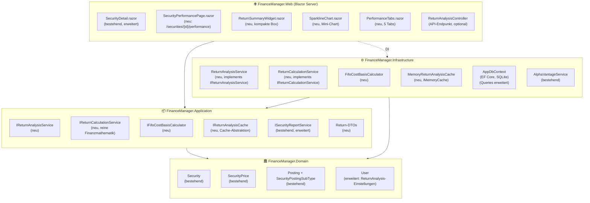
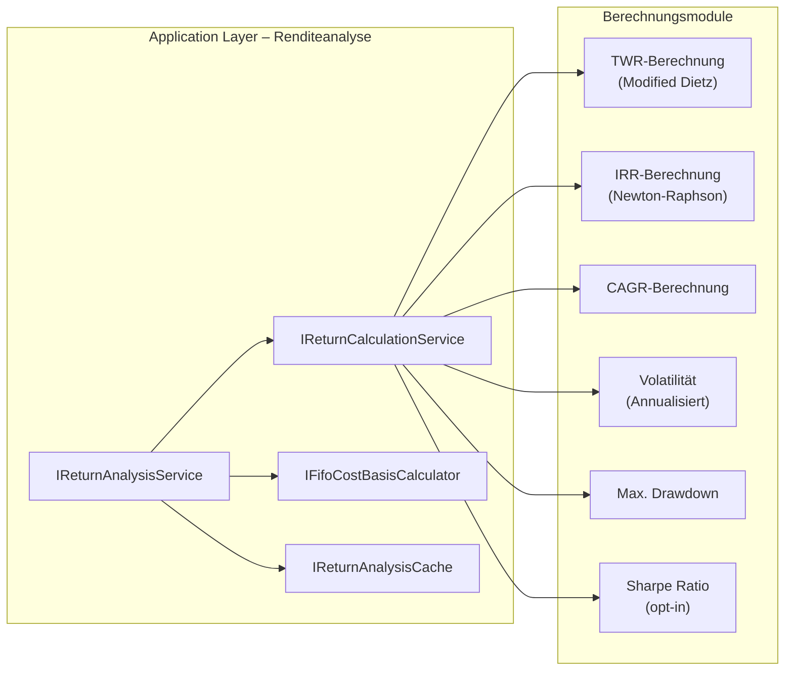
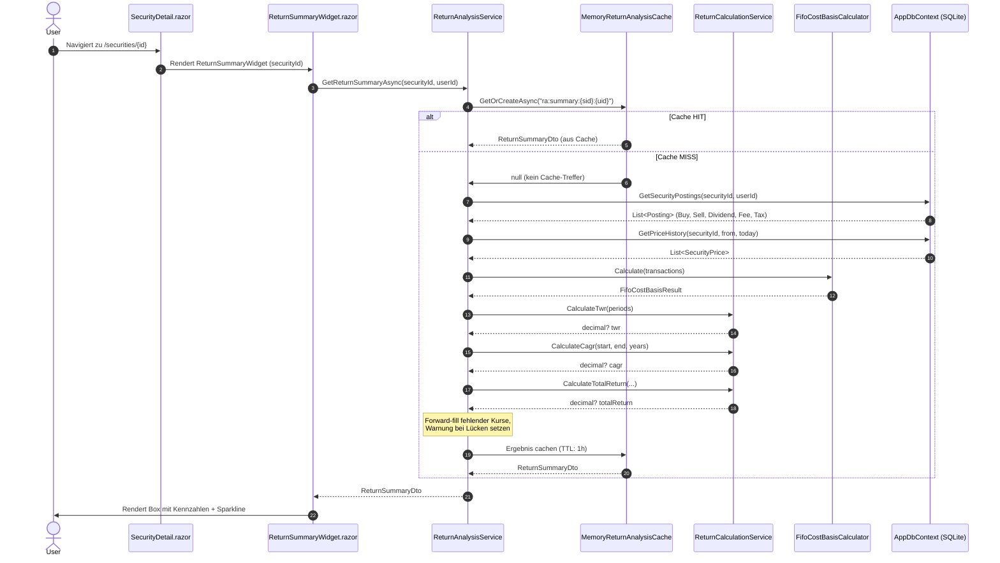
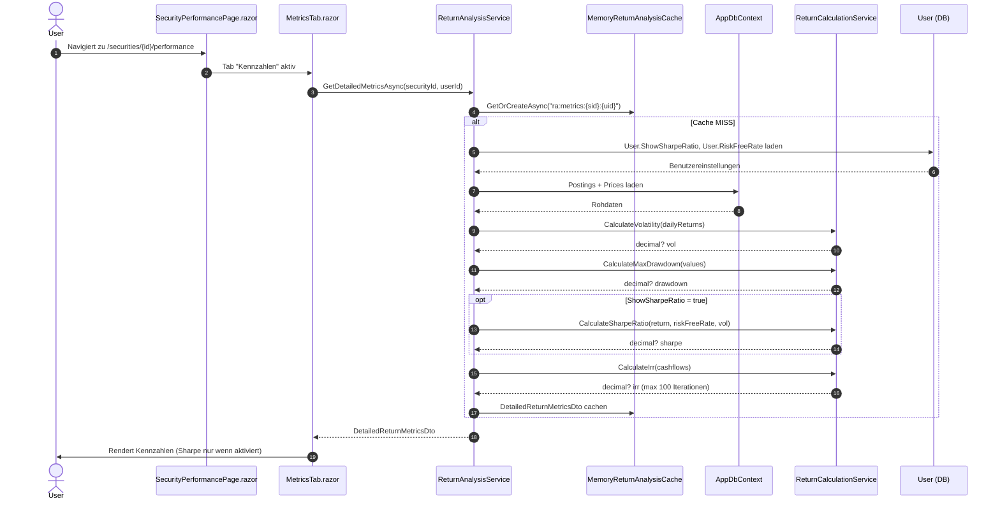
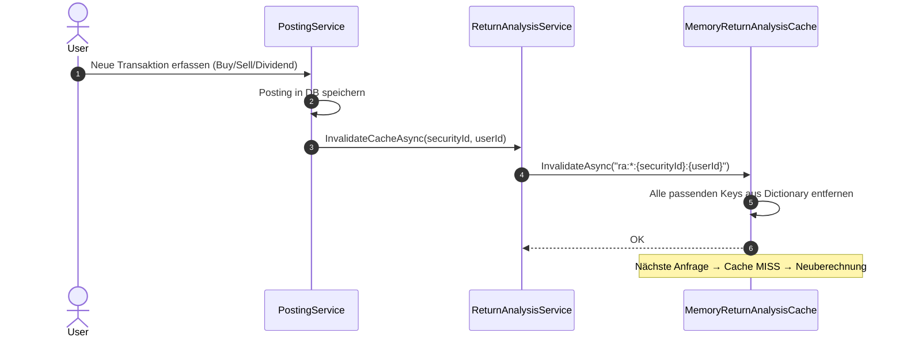

# Architektur-Blueprint: Renditeanalyse (Return Analysis)

> **Feature:** FA-WERT-REN-001 – Renditeanalyse für Wertpapiere  
> **Status:** 📋 Entwurf  
> **Version:** 1.0  
> **Datum:** 2025-07-14  
> **Autor:** Architektur-Agent  
> **Querverweise:**
> - Anforderungsdokument: [`docs/requirements/FA-WERT-REN-001_Renditeanalyse.md`](../requirements/FA-WERT-REN-001_Renditeanalyse.md)
> - ERM (geplant): [`docs/architecture/entity-relationship-model-renditeanalyse.md`](./entity-relationship-model-renditeanalyse.md)

---

## Inhaltsverzeichnis

1. [Überblick & Einordnung](#1-überblick--einordnung)
2. [Systemarchitektur](#2-systemarchitektur)
3. [Neue Komponenten & Erweiterungen](#3-neue-komponenten--erweiterungen)
4. [Technologieentscheidungen](#4-technologieentscheidungen)
5. [Datenfluss](#5-datenfluss)
6. [UI/UX-Konzept](#6-uiux-konzept)
7. [Qualitätsziele](#7-qualitätsziele)
8. [Risiken & Offene Punkte](#8-risiken--offene-punkte)
9. [Querverweise](#9-querverweise)

---

## 1. Überblick & Einordnung

### 1.1 Ziel und Motivation

Der FinanceManager enthält bereits alle Rohdaten für eine vollständige Renditeanalyse:  
tägliche Kursdaten (`SecurityPrice`) und transaktionale Buchungszeilen (`Posting` mit `SecurityPostingSubType`).  
**Bisher fehlt** die fachliche Aufbereitung dieser Daten zu aussagekräftigen Finanzkennzahlen.

Das Feature **Renditeanalyse** schließt diese Lücke mit zwei Ausbaustufen:

| Stufe | Umfang | Route |
|-------|--------|-------|
| **Stufe 1** | Kompakte Rendite-Box + Mini-Chart auf bestehender Wertpapier-Detailseite | (eingebettet) |
| **Stufe 2** | Vollständige Rendite-Detailseite mit 5 Tabs | `/securities/{id}/performance` |

### 1.2 Abgrenzung zum bestehenden System

| Bereich | Bestehend | Neu (dieses Feature) |
|---------|-----------|----------------------|
| Dividendenaggregation | `ISecurityReportService.GetDividendAggregatesAsync` (quartalsbezogen, alle Wertpapiere) | Dividenden pro Wertpapier, zeitlich aufgelöst, brutto/netto |
| Kursdaten | `ISecurityPriceService` (CRUD, AlphaVantage-Sync) | Nutzung zur Kurshistorie-Auswertung (read-only) |
| Transaktionen | `Posting`-Tabelle mit `SecuritySubType` | FIFO-Kostenbasismethode, Cashflow-Timeline |
| Benutzereinstellungen | `User` (Sprache, Import-Einstellungen) | Benchmark-Wertpapier, Sharpe-Ratio-Aktivierung, risikofreier Zinssatz |
| UI | Wertpapier-Übersicht und -Detailseite | Rendite-Box (embedded), neue Unterseite `/performance` |

### 1.3 Nicht-Ziele (Out of Scope)

- Währungsumrechnung (Alle Wertpapiere werden in ihrer nativen `CurrencyCode`-Währung berechnet)
- Portfolio-Gesamtrendite (mehrere Wertpapiere kombiniert)
- Export der Rendite-Daten als CSV/PDF
- Steuerliche Jahresbescheinigung

---

## 2. Systemarchitektur

### 2.1 Schichtenmodell



### 2.2 Modulübersicht



### 2.3 Integrationen & Abhängigkeiten

| Integration | Richtung | Zweck |
|-------------|----------|-------|
| `SecurityPrice` (DB) | Lesen | Kurshistorie für TWR, Benchmark-Chart, Volatilität |
| `Posting` (DB) | Lesen | Transaktionsbasis für FIFO, IRR, Cashflow-Timeline |
| `User` (DB) | Lesen/Schreiben | Benchmark-Einstellung, Sharpe-Einstellungen |
| `IMemoryCache` (.NET) | Schreiben/Lesen | Caching berechneter Zeitreihen (TTL: 1 Stunde) |
| AlphaVantage | Indirekt | Kursabruf (bereits bestehend, kein direkter neuer Aufruf) |
| ApexCharts.Blazor | Frontend | Chart-Rendering (Linien, Balken, Heatmap) |

---

## 3. Neue Komponenten & Erweiterungen

### 3.1 Domain-Layer

**Keine neuen Entitäten oder Value Objects erforderlich.**  
Die bestehenden Entitäten liefern alle Rohdaten. Neue Berechnungsergebnisse werden als DTOs im Application-Layer modelliert (kein Domain-Overkill).

**Erweiterung: `User`-Entität**

Neue Partial-Class `User.ReturnAnalysis.cs` mit Feldern für Renditeanalyse-Einstellungen:

```csharp
// User.ReturnAnalysis.cs (neue Partial Class)
public sealed partial class User
{
    /// <summary>
    /// Optional: SecurityId des Benchmark-Wertpapiers für die Renditeanalyse.
    /// </summary>
    public Guid? BenchmarkSecurityId { get; private set; }

    /// <summary>
    /// Gibt an, ob die Sharpe Ratio in der Renditeanalyse angezeigt werden soll.
    /// </summary>
    public bool ShowSharpeRatio { get; private set; }

    /// <summary>
    /// Risikofreier Zinssatz für die Sharpe-Ratio-Berechnung (z.B. 0.04 = 4 %).
    /// Muss >= 0 sein.
    /// </summary>
    public decimal RiskFreeRate { get; private set; }

    /// <summary>
    /// Setzt die Renditeanalyse-Einstellungen des Benutzers.
    /// </summary>
    public void SetReturnAnalysisSettings(
        Guid? benchmarkSecurityId,
        bool showSharpeRatio,
        decimal riskFreeRate)
    {
        if (riskFreeRate < 0)
            throw new ArgumentOutOfRangeException(nameof(riskFreeRate), "Risk-free rate must be >= 0.");
        BenchmarkSecurityId = benchmarkSecurityId;
        ShowSharpeRatio = showSharpeRatio;
        RiskFreeRate = riskFreeRate;
    }
}
```

**EF Core Migration:** Neue Spalten `BenchmarkSecurityId (Guid?, nullable)`, `ShowSharpeRatio (bool, default false)`, `RiskFreeRate (decimal, default 0)` in der `AspNetUsers`-Tabelle.

---

### 3.2 Application-Layer

#### 3.2.1 Service-Interfaces

```csharp
/// <summary>
/// Orchestriert die Renditeanalyse für ein einzelnes Wertpapier.
/// Alle Methoden sind user-scopig (ownerUserId-Parameter).
/// </summary>
public interface IReturnAnalysisService
{
    /// <summary>
    /// Liefert die Kennzahlen für die kompakte Rendite-Box (FR-1).
    /// Gecacht für 1 Stunde.
    /// </summary>
    Task<ReturnSummaryDto?> GetReturnSummaryAsync(Guid securityId, Guid ownerUserId, CancellationToken ct);

    /// <summary>
    /// Liefert die vollständigen Renditekennzahlen für den Tab "Kennzahlen" (FR-2.1).
    /// </summary>
    Task<DetailedReturnMetricsDto?> GetDetailedMetricsAsync(Guid securityId, Guid ownerUserId, CancellationToken ct);

    /// <summary>
    /// Liefert Jahres- und Monatsrenditen für Tab "Zeitliche Entwicklung" (FR-2.2).
    /// </summary>
    Task<PeriodicReturnsDto?> GetPeriodicReturnsAsync(Guid securityId, Guid ownerUserId, CancellationToken ct);

    /// <summary>
    /// Liefert die Cashflow-Timeline für Tab "Cashflows" (FR-2.3).
    /// </summary>
    Task<CashflowTimelineDto?> GetCashflowTimelineAsync(Guid securityId, Guid ownerUserId, CancellationToken ct);

    /// <summary>
    /// Liefert Zeitreihendaten für den Performance-Chart (FR-2.4).
    /// </summary>
    Task<PerformanceChartDataDto?> GetPerformanceChartDataAsync(
        Guid securityId, Guid ownerUserId, ChartTimeRange timeRange, CancellationToken ct);

    /// <summary>
    /// Liefert Benchmark-Vergleichsdaten (FR-7). Gibt null zurück, wenn kein Benchmark konfiguriert.
    /// </summary>
    Task<BenchmarkComparisonDto?> GetBenchmarkComparisonAsync(Guid securityId, Guid ownerUserId, CancellationToken ct);

    /// <summary>
    /// Invalidiert den Cache für ein Wertpapier (bei neuer Transaktion oder neuem Kurs).
    /// </summary>
    Task InvalidateCacheAsync(Guid securityId, Guid ownerUserId);
}

/// <summary>
/// Reine Finanzmathematik ohne Datenbankzugriff.
/// Alle Methoden sind zustandslos und thread-safe.
/// Jede Formel ist vollständig in XML-Dokumentation beschrieben.
/// </summary>
public interface IReturnCalculationService
{
    /// <summary>
    /// Berechnet den Total Return (Kursgewinn + Dividenden - Steuern/Gebühren).
    /// Formel: (Marktwert + Dividenden_netto - Investiertes_Kapital) / Investiertes_Kapital
    /// </summary>
    decimal? CalculateTotalReturn(decimal investedCapital, decimal currentMarketValue, decimal netDividends);

    /// <summary>
    /// Berechnet die zeitgewichtete Rendite (TWR) per Modified Dietz über verkettete Perioden.
    /// Industrie-Standard: GIPS-konform.
    /// </summary>
    decimal? CalculateTwr(IReadOnlyList<TwrPeriodInput> periods);

    /// <summary>
    /// Berechnet den internen Zinsfuß (IRR/XIRR) via Newton-Raphson.
    /// Bricht nach maxIterations (default: 100) ab, gibt null zurück wenn keine Konvergenz.
    /// </summary>
    decimal? CalculateIrr(IReadOnlyList<CashflowPoint> cashflows, int maxIterations = 100);

    /// <summary>
    /// Berechnet den CAGR (Compound Annual Growth Rate).
    /// Formel: (Endwert/Anfangswert)^(1/Jahre) - 1
    /// </summary>
    decimal? CalculateCagr(decimal startValue, decimal endValue, double years);

    /// <summary>
    /// Berechnet die annualisierte Volatilität (Standardabweichung der Tagesrenditen × √252).
    /// </summary>
    decimal? CalculateVolatility(IReadOnlyList<decimal> dailyReturns);

    /// <summary>
    /// Berechnet den maximalen Drawdown vom Höchststand.
    /// Formel: (Tief - Hochpunkt) / Hochpunkt
    /// </summary>
    decimal? CalculateMaxDrawdown(IReadOnlyList<decimal> portfolioValues);

    /// <summary>
    /// Berechnet die Sharpe Ratio.
    /// Formel: (Rendite_p.a. - RisikofreierZins) / Volatilität
    /// Gibt null zurück, wenn Volatilität = 0.
    /// </summary>
    decimal? CalculateSharpeRatio(decimal annualizedReturn, decimal riskFreeRate, decimal volatility);
}

/// <summary>
/// FIFO-Kostenbasismethode für Teilverkäufe (FR-6).
/// </summary>
public interface IFifoCostBasisCalculator
{
    /// <summary>
    /// Berechnet die FIFO-Kostenbasis und Realized Gains für eine Folge von Käufen und Verkäufen.
    /// Sortierung der Käufe: BookingDate aufsteigend, bei Gleichheit Einfügereihenfolge (EntityId).
    /// </summary>
    FifoCostBasisResult Calculate(IReadOnlyList<SecurityTransaction> transactions);
}
```

#### 3.2.2 DTOs (Application/Securities/Dtos/)

```csharp
// Kompakte Rendite-Box (FR-1)
public sealed record ReturnSummaryDto(
    decimal InvestedCapital,
    decimal CurrentMarketValue,
    decimal TotalReturnAbsolute,
    decimal TotalReturnPercent,
    decimal? Cagr,
    decimal? Twr,
    decimal CostBasisPerShare,
    decimal CurrentPricePerShare,
    decimal NetDividends,
    bool HasMissingPrices,
    string? MissingPricesHint,
    IReadOnlyList<SparklinePoint> SparklineData   // FR-1.1: Mini-Chart
);

// Detaillierte Kennzahlen (FR-2.1)
public sealed record DetailedReturnMetricsDto(
    decimal GrossReturn,
    decimal NetReturn,
    decimal TotalTaxes,
    decimal TotalFees,
    decimal TaxRate,
    decimal? Volatility,
    decimal? MaxDrawdown,
    decimal? SharpeRatio,           // null wenn deaktiviert
    decimal RealizedGains,
    decimal UnrealizedGains,
    decimal? Irr,
    decimal DividendYieldCurrentYear
);

// Perioden-Renditen (FR-2.2)
public sealed record PeriodicReturnsDto(
    IReadOnlyList<AnnualReturnPoint> AnnualReturns,         // Balkendiagramm
    IReadOnlyList<MonthlyReturnPoint> MonthlyReturns,       // Heatmap
    IReadOnlyList<AnnualDividendPoint> AnnualDividends      // FR-2.5
);

// Cashflow-Timeline (FR-2.3)
public sealed record CashflowTimelineDto(
    IReadOnlyList<CashflowEntry> Entries,
    IReadOnlyList<AnnualCashflowSummary> AnnualSummaries    // FR-2.6
);

// Performance-Chart (FR-2.4)
public sealed record PerformanceChartDataDto(
    ChartTimeRange TimeRange,
    IReadOnlyList<ChartPoint> PortfolioValues,
    IReadOnlyList<ChartPoint> InvestedCapitalValues
);

// Benchmark-Vergleich (FR-7)
public sealed record BenchmarkComparisonDto(
    string BenchmarkName,
    IReadOnlyList<ChartPoint> SecurityNormalizedValues,
    IReadOnlyList<ChartPoint> BenchmarkNormalizedValues
);

// Hilfsobjekte
public sealed record SparklinePoint(DateTime Date, decimal Value);
public sealed record ChartPoint(DateTime Date, decimal Value);
public sealed record AnnualReturnPoint(int Year, decimal ReturnPercent, bool IsYtd);
public sealed record MonthlyReturnPoint(int Year, int Month, decimal? ReturnPercent);
public sealed record CashflowEntry(DateTime Date, string Type, decimal Amount, string Description, Guid PostingId);

// Eingabetypen für Berechnungen
public sealed record TwrPeriodInput(DateTime Start, DateTime End, decimal StartValue, decimal EndValue, decimal ExternalCashflow);
public sealed record CashflowPoint(DateTime Date, decimal Amount);
public sealed record SecurityTransaction(Guid Id, DateTime Date, SecurityPostingSubType Type, decimal Amount, decimal? Quantity);

// Ergebnis FIFO
public sealed record FifoCostBasisResult(
    decimal TotalCostBasis,
    decimal RealizedGains,
    IReadOnlyList<FifoLot> RemainingLots
);
public sealed record FifoLot(DateTime PurchaseDate, decimal Quantity, decimal CostPerUnit);

// Enum Zeitraum
public enum ChartTimeRange { OneMonth, ThreeMonths, SixMonths, OneYear, ThreeYears, All }
```

#### 3.2.3 Cache-Abstraktion

```csharp
/// <summary>
/// Abstrahiert den Cache-Zugriff für Renditeanalyse-Daten.
/// Ermöglicht einfache Austauschbarkeit (z.B. Distributed Cache in Zukunft).
/// </summary>
public interface IReturnAnalysisCache
{
    Task<T?> GetOrCreateAsync<T>(string cacheKey, Func<Task<T>> factory, TimeSpan ttl) where T : class;
    Task InvalidateAsync(string pattern);
}
```

---

### 3.3 Infrastructure-Layer

#### 3.3.1 `ReturnAnalysisService` (Orchestrierung)

- Implementiert `IReturnAnalysisService`
- Lädt Postings und SecurityPrices via EF Core (optimierte Queries, siehe 3.3.3)
- Delegiert Berechnungen an `IReturnCalculationService` und `IFifoCostBasisCalculator`
- Verwendet `IReturnAnalysisCache` für alle cachbaren Ergebnisse
- Prüft Ownership (ownerUserId) vor jedem Datenzugriff (NFR-8)

#### 3.3.2 Cache-Implementierung: `MemoryReturnAnalysisCache`

```csharp
public class MemoryReturnAnalysisCache : IReturnAnalysisCache
{
    private readonly IMemoryCache _cache;

    // Cache-Keys (Konstanten in separater Klasse ReturnAnalysisCacheKeys)
    // "ra:summary:{securityId}:{userId}"
    // "ra:metrics:{securityId}:{userId}"
    // "ra:periodic:{securityId}:{userId}"
    // "ra:cashflow:{securityId}:{userId}"
    // "ra:chart:{securityId}:{userId}:{timeRange}"
    // "ra:benchmark:{securityId}:{userId}"
}
```

**Cache-Invalidierung** wird aufgerufen in:
- `PostingService.CreateAsync` → wenn `SecurityId != null`
- `SecurityPriceService.UpsertAsync` → für die betroffene SecurityId
- Aufruf via `IReturnAnalysisCache.InvalidateAsync("ra:*:{securityId}:{userId}")`

#### 3.3.3 EF Core Queries (Optimierung)

Neue, dedizierte Query-Methoden im `AppDbContext` bzw. Repository:

```csharp
// Lese alle Postings eines Wertpapiers (für FIFO und IRR)
// Optimiert: Nur benötigte Felder, kein .Include(), OrderBy BookingDate
IQueryable<Posting> GetSecurityPostings(Guid securityId, Guid ownerUserId)
    => _db.Postings
        .Where(p => p.SecurityId == securityId && p.OwnerUserId == ownerUserId)
        .OrderBy(p => p.BookingDate)
        .ThenBy(p => p.Id);  // FIFO-Reihenfolge bei Gleichstand

// Lese Kurshistorie eines Wertpapiers (für TWR, Volatilität, Chart)
// Tipp: Index auf (SecurityId, Date) prüfen / anlegen
IQueryable<SecurityPrice> GetPriceHistory(Guid securityId, DateTime from, DateTime to)
    => _db.SecurityPrices
        .Where(p => p.SecurityId == securityId && p.Date >= from && p.Date <= to)
        .OrderBy(p => p.Date);
```

**Index-Empfehlung:** Falls nicht vorhanden, Migration mit Index auf `SecurityPrices(SecurityId, Date)` und `Postings(SecurityId, BookingDate)`.

---

### 3.4 Web-Layer (Blazor)

#### 3.4.1 Neue Seiten & Komponenten

| Datei | Typ | Beschreibung |
|-------|-----|--------------|
| `Pages/Securities/SecurityPerformancePage.razor` | Seite | Route `/securities/{id}/performance`, 5-Tab-Layout |
| `Components/Securities/ReturnSummaryWidget.razor` | Komponente | Kompakte Rendite-Box (FR-1) |
| `Components/Securities/SparklineChart.razor` | Komponente | Mini-Chart via ApexCharts (FR-1.1) |
| `Components/Securities/Performance/OverviewTab.razor` | Komponente | Tab: Übersicht (Performance-Chart) |
| `Components/Securities/Performance/TimeSeriesTab.razor` | Komponente | Tab: Zeitliche Entwicklung (Jahres-/Monatsrenditen) |
| `Components/Securities/Performance/CashflowTab.razor` | Komponente | Tab: Cashflows (Timeline + Diagramm) |
| `Components/Securities/Performance/MetricsTab.razor` | Komponente | Tab: Kennzahlen (alle Finanzkennzahlen) |
| `Components/Securities/Performance/BenchmarkTab.razor` | Komponente | Tab: Benchmark (Vergleichschart) |
| `Components/Securities/Performance/ReturnKpiCard.razor` | Komponente | Wiederverwendbare KPI-Karte mit Tooltip und Farb-Feedback |
| `Components/Securities/Performance/MissingPricesWarning.razor` | Komponente | Hinweis bei fehlenden Kursdaten |

#### 3.4.2 Erweiterungen bestehender Komponenten

- **`SecurityDetail.razor`** (bestehend): Einbettung von `ReturnSummaryWidget` unterhalb der bestehenden Wertpapier-Metadaten. Button „Detaillierte Renditeanalyse →" mit Navigation zu `/securities/{id}/performance`.
- **`Setup/`-Seiten**: Erweiterung um neue Felder für Benchmark und Sharpe-Einstellungen (eigene `SetupSection`-Komponente oder Integration in bestehende Benutzereinstellungen).

#### 3.4.3 Lokalisierung

Neue Ressource-Dateien (analog zum bestehenden Muster):

- `Resources/Components/Securities/Performance/ReturnAnalysis.de.resx`
- `Resources/Components/Securities/Performance/ReturnAnalysis.en.resx`

Enthält alle UI-Texte, Formel-Beschreibungen und Fehlermeldungen der Renditeanalyse.

---

## 4. Technologieentscheidungen

### 4.1 Caching-Strategie

**Entscheidung: `IMemoryCache` (In-Process Memory Cache)**

| Kriterium | Begründung |
|-----------|-----------|
| Einfachheit | SQLite + Single-Instance Blazor Server → kein Distributed Cache nötig |
| Latenz | In-Memory ist am schnellsten für < 1s Anforderung (NFR-2) |
| Kompatibilität | Blazor Server ist Single-Process; kein Scale-Out-Szenario |
| Erweiterbarkeit | Abstraktion via `IReturnAnalysisCache` erlaubt späteren Wechsel zu `IDistributedCache` |

**Cache-Key-Schema:**

```
ra:{datentyp}:{securityId}:{userId}[:{parameter}]
```

| Cache-Key | TTL | Invalidierung |
|-----------|-----|--------------|
| `ra:summary:{sid}:{uid}` | 1h | Neue Posting oder SecurityPrice für Security |
| `ra:metrics:{sid}:{uid}` | 1h | Neue Posting oder SecurityPrice für Security |
| `ra:periodic:{sid}:{uid}` | 1h | Neue Posting oder SecurityPrice für Security |
| `ra:cashflow:{sid}:{uid}` | 1h | Neue Posting für Security |
| `ra:chart:{sid}:{uid}:{range}` | 1h | Neue Posting oder SecurityPrice für Security |
| `ra:benchmark:{sid}:{uid}` | 1h | Neue SecurityPrice für Benchmark-Security |

**Invalidierungs-Pattern:** `IReturnAnalysisCache.InvalidateAsync` iteriert über alle Keys mit `MemoryCache.GetCurrentStatistics()` (oder alternativ: Key-Tracking via eigenem `ConcurrentDictionary`) und entfernt passende Einträge.

> **Implementierungshinweis:** Da `IMemoryCache` keine Mustersuche unterstützt, werden alle Cache-Keys für ein Wertpapier in einem separaten `ConcurrentDictionary<string, byte>` pro (securityId, userId) geführt. Invalidierung iteriert über dieses Dictionary und ruft `_cache.Remove(key)` auf.

---

### 4.2 Chart-Bibliothek

**Entscheidung: [ApexCharts.Blazor](https://github.com/apexcharts/Blazor-ApexCharts)**

| Kriterium | Begründung |
|-----------|-----------|
| Blazor-Integration | Native Blazor-Wrapper, kein JS-Interop manuell nötig |
| Diagramm-Typen | Unterstützt Line, Bar, Heatmap, Sparkline – alle für dieses Feature benötigten Typen |
| Zeitreihen | Eingebaute Unterstützung für DateTime-Achsen |
| Aktive Pflege | MIT-Lizenz, aktive Community, regelmäßige Updates |
| Blazor Server | Funktioniert mit Blazor Server (SignalR-basierter Rendering-Modus) |
| Alternativ | `Radzen.Blazor` (kostenpflichtig für erweiterte Features), `ChartJs.Blazor` (weniger aktiv) |

**NuGet-Paket:** `Blazor-ApexCharts`

---

### 4.3 Berechnungsmodul im Application-Layer

**Entscheidung: Reines Berechnungsmodul im Application-Layer, kein Domain-Service**

| Aspekt | Begründung |
|--------|-----------|
| **Kein Domain-Service** | Finanzmathematik enthält keine Geschäftsregeln, die Domain-Invarianten schützen. Ein Domain-Service wäre Überarchitektur. |
| **Application-Layer** | `IReturnCalculationService` ist ein reiner Rechendienst ohne Datenbankzugriff → Application-Layer ist korrekte Heimat |
| **Testbarkeit** | Zustandslose, parameterbasierte Methoden ohne externe Abhängigkeiten → trivial unit-testbar |
| **Open/Closed** | Neue Kennzahlen werden als neue Methoden in `IReturnCalculationService` hinzugefügt; bestehende Berechnungen bleiben unverändert |
| **Erweiterbarkeit** | `IReturnCalculationService` ist über DI austauschbar (z.B. Mock für Tests) |

**TWR-Methode:** Modified Dietz (industry standard, approximative aber praktisch exakt für tägliche Perioden):
```
Perioden-Return = (Endwert - Anfangswert - ExternerCashflow) / (Anfangswert + 0.5 × ExternerCashflow)
TWR = Π(1 + Perioden-Return_i) - 1
```

**IRR-Methode:** Newton-Raphson mit Bisection als Fallback. Abbruchbedingung: `|f(r)| < 1e-10` oder `Iterationen > 100`.

---

### 4.4 FIFO-Algorithmus

**Entscheidung: Reine In-Memory FIFO-Berechnung im Application-Layer**

```
Algorithm FIFO Cost Basis:
1. Lade alle Postings (Buy/Sell) für SecurityId, sortiert nach BookingDate ASC, Id ASC
2. Verwalte eine Queue<FifoLot> (geordnet nach Kaufdatum)
3. Buy-Posting → neues FifoLot mit (Datum, Menge, Kosten/Einheit) enqueueuen
4. Sell-Posting → FIFO-Auflösung:
   a. Solange Verkaufsmenge > 0:
      b. Lot aus Queue nehmen (FIFO)
      c. Realisierter Gewinn += (Verkaufspreis - Einstandspreis) × min(Lot.Menge, Restmenge)
      d. Lot-Menge anpassen (Teilauflösung → Lot wieder enqueueuen mit Rest)
5. Ergebnis: RealizedGains, RemainingLots (für UnrealizedGains-Berechnung)
```

**Kostenbasis-Definition:** Kostenbasis = Kaufpreis (Amount) + Gebühren (zugehörige Fee-Postings, die zeitlich zu einem Kauf gehören → gleiche GroupId).

---

## 5. Datenfluss

### 5.1 Kompakte Rendite-Box (FR-1)



### 5.2 Detailseite – Tab "Kennzahlen" (FR-2.1)



### 5.3 Cache-Invalidierung (bei neuer Transaktion)



---

## 6. UI/UX-Konzept

### 6.1 Informationsarchitektur (Seitenstruktur)

```
FinanceManager
└── Wertpapiere (/securities)
    └── Wertpapier-Detail (/securities/{id})
        │
        ├── [Bestehend] Stammdaten (Name, ISIN, Kurs, Kategorie)
        │
        ├── [NEU] Rendite-Box (ReturnSummaryWidget)
        │     ├── KPI-Karten: Total Return, CAGR, TWR
        │     ├── KPI-Karten: Einstandskurs, akt. Kurs, Investiert, Marktwert
        │     ├── Mini-Chart (Sparkline: Marktwert vs. investiertes Kapital)
        │     └── Button → "Detaillierte Renditeanalyse →"
        │
        └── [NEU] Performance-Detailseite (/securities/{id}/performance)
              ├── Tab: Übersicht
              │     ├── Performance-Chart (Zeitraumauswahl: 1M/3M/6M/1J/3J/Gesamt)
              │     └── Kompakte KPI-Zusammenfassung
              ├── Tab: Zeitliche Entwicklung
              │     ├── Jahresrenditen-Balkendiagramm (YTD + vergangene Jahre)
              │     ├── Monatsrenditen-Heatmap
              │     └── Dividendenverlauf pro Jahr (Brutto/Netto)
              ├── Tab: Cashflows
              │     ├── Cashflow-Timeline (chronologisch)
              │     └── Jahres-Balkendiagramm Gebühren/Steuern
              ├── Tab: Kennzahlen
              │     ├── Bruttorendite / Nettorendite
              │     ├── Volatilität, Max. Drawdown
              │     ├── IRR, Realized/Unrealized Gains
              │     ├── Dividendenrendite, Steuerquote
              │     └── Sharpe Ratio (nur wenn aktiviert)
              └── Tab: Benchmark
                    └── Vergleichs-Chart (normiert auf Basis 100)
                          (nur sichtbar wenn Benchmark konfiguriert)
```

### 6.2 Wireframe: Kompakte Rendite-Box (ReturnSummaryWidget)

```
┌─────────────────────────────────────────────────────────────────────┐
│  📊 Renditeanalyse                               [i] Hilfe          │
├──────────────────┬──────────────────┬──────────────────────────────┤
│ Total Return     │ CAGR (Ø p.a.)    │ TWR (zeitgewichtet)          │
│ ▲ +2.345,00 €   │ ▲ +8,42 % [?]   │ ▲ +34,7 % [?]               │
│ ▲ +23,45 % [?]  │                  │                               │
├──────────────────┼──────────────────┼──────────────────────────────┤
│ Einstandskurs    │ Akt. Kurs        │ Investiert / Marktwert        │
│ 45,20 €         │ 55,78 € [?]     │ 9.040 € / 11.156 € [?]       │
├─────────────────────────────────────────────────────────────────────┤
│                                                                     │
│  ▁▂▃▄▅▅▆▇█▇▆▅▅▄▅▆▇█▇▆▇▇▇▇▇▇▇▇▇▇▇ (Mini-Chart: Wertentwicklung)  │
│                                                                     │
├─────────────────────────────────────────────────────────────────────┤
│  [→ Detaillierte Renditeanalyse öffnen]                             │
└─────────────────────────────────────────────────────────────────────┘

Legende:
  ▲/▼  = Richtungs-Icon (grün/rot + Icon, nicht nur Farbe)
  [?]  = Tooltip-Button mit Formel-Erklärung
  [i]  = Glossar-Link
```

**Farb- und Icon-Konventionen (NFR-10):**
- Positiver Wert → Grün (`--color-success`) + `▲`-Icon
- Negativer Wert → Rot (`--color-danger`) + `▼`-Icon
- Neutral/kein Wert → Grau, Anzeige „–"
- Farbe immer in Kombination mit Icon (keine alleinige Farb-Unterscheidung)

### 6.3 Wireframe: Performance-Detailseite

```
/securities/{id}/performance
┌─────────────────────────────────────────────────────────────────────┐
│ ← Zurück zu Apple Inc. (AAPL)                                       │
│ 📊 Renditeanalyse                                                   │
│━━━━━━━━━━━━━━━━━━━━━━━━━━━━━━━━━━━━━━━━━━━━━━━━━━━━━━━━━━━━━━━━━━━│
│ [Übersicht] [Zeitl. Entwicklung] [Cashflows] [Kennzahlen] [Benchmark]│
│━━━━━━━━━━━━━━━━━━━━━━━━━━━━━━━━━━━━━━━━━━━━━━━━━━━━━━━━━━━━━━━━━━━│
│                                                                     │
│  TAB: ÜBERSICHT                                                     │
│  ┌──────────────────────────────────────────────────────────────┐   │
│  │  Zeitraum: [1M] [3M] [6M] [1J] [3J] [Gesamt*]              │   │
│  │                                                              │   │
│  │  ╭────────────────────────────────────────────────────────╮ │   │
│  │  │                    📈 Wertentwicklung                  │ │   │
│  │  │                                                        │ │   │
│  │  │   12.000 ─┤                              ╭────────    │ │   │
│  │  │   11.000 ─┤                         ╭───╯             │ │   │
│  │  │   10.000 ─┤──────────╮         ╭───╯                  │ │   │
│  │  │    9.000 ─┤          ╰────────╯                        │ │   │
│  │  │           └──────────────────────────────────────────  │ │   │
│  │  │    ─── Marktwert   ─ ─ Investiertes Kapital           │ │   │
│  │  ╰────────────────────────────────────────────────────────╯ │   │
│  └──────────────────────────────────────────────────────────────┘   │
│                                                                     │
│  TAB: ZEITLICHE ENTWICKLUNG                                         │
│  ┌──────────────────────────────────────────────────────────────┐   │
│  │  Jahresrenditen                          Dividenden/Jahr     │   │
│  │  ╭──────────────────────────────╮  ╭────────────────────╮   │   │
│  │  │ 2021 ████████ +18,3 %       │  │ 2021 ▓▓▓ 120 €    │   │   │
│  │  │ 2022 ██▌ -12,1 % (rot)     │  │ 2022 ▓▓▓▓▓ 200 €  │   │   │
│  │  │ 2023 ████████████ +28,4 %  │  │ 2023 ▓▓▓▓▓▓ 240 € │   │   │
│  │  │ 2024 ██████ +14,2 %        │  │ 2024 ▓▓ 80 € (ytd)│   │   │
│  │  │ 2025 ███ YTD +6,1 %        │  ╰────────────────────╯   │   │
│  │  ╰──────────────────────────────╯                           │   │
│  │                                                              │   │
│  │  Monatsrenditen (Heatmap)                                    │   │
│  │       Jan  Feb  Mar  Apr  Mai  Jun  Jul  Aug  Sep  Okt  Nov  Dez │
│  │  2023 [+3] [-1] [+5] [+2] [-2] [+8] [+1] [-3] [+4] [+2] [+1] [+7]│
│  │  2024 [+1] [+3] [-2] [+4] [+6] [-1] [+2] [+1] [+3] [-1] [+2] [-]│
│  └──────────────────────────────────────────────────────────────┘   │
│                                                                     │
│  TAB: KENNZAHLEN                                                    │
│  ┌──────────────────────────────────────────────────────────────┐   │
│  │ Bruttorendite    +26,3 % ▲ [?]   Nettorendite +21,1 % ▲ [?]│   │
│  │ Volatilität      14,2 % [?]      Max. Drawdown -18,5 % [?]  │   │
│  │ IRR (pers.)      +9,8 % p.a.[?]  Realized Gains 1.240 €[?] │   │
│  │ Unrealized G.    1.105 € [?]     Steuerquote    19,8 % [?]  │   │
│  │ Sharpe Ratio     0,62 [?]        (nur wenn aktiviert)        │   │
│  └──────────────────────────────────────────────────────────────┘   │
└─────────────────────────────────────────────────────────────────────┘
```

### 6.4 Interaktionsdesign

#### Tooltips (NFR-4)
- Jede KPI-Karte enthält ein `[?]`-Icon (ARIA: `aria-label="Formel anzeigen"`)
- Tooltip öffnet sich bei Hover/Fokus, enthält:
  - Formelname (z.B. „CAGR – Compound Annual Growth Rate")
  - Kurzformel (z.B. `(Endwert/Anfangswert)^(1/Jahre) - 1`)
  - 1-Satz-Erklärung in der aktiven UI-Sprache

#### Drill-Down (FR-11)
- Klick auf Cashflow-Eintrag → öffnet Posting-Detail-Overlay (bestehende Detail-Komponente)
- Klick auf Jahresrendite-Balken → filtert Cashflow-Tab auf dieses Jahr
- Klick auf IRR/TWR → öffnet Overlay mit Berechnungsschritten (Periode-für-Periode)

#### Zeitraumauswahl (FR-2.4)
- Segmented-Button-Gruppe: `[1M] [3M] [6M] [1J] [3J] [Gesamt]`
- Auswahl aktualisiert nur den Chart via `StateHasChanged()`, kein Seiten-Reload
- Ausgewählter Zeitraum wird via URL-Fragment (`#1Y`) persistiert

#### Fehlerzustände (NFR-6)
- Kein aktueller Kurs → Hinweis-Banner: „Kein aktueller Kurs verfügbar. Letzer Kurs: {Datum}"
- Weniger als 2 Transaktionen → Renditeanalyse nicht möglich, erklärender Text
- IRR konvergiert nicht → Feld zeigt „–" mit Tooltip „Berechnung nicht konvergiert"
- Ladezeit > 3s → Skeleton-Loader während Berechnung, kein leeres Layout

---

## 7. Qualitätsziele

### 7.1 Performance-Budgets

| Metrik | Ziel | Maßnahme |
|--------|------|----------|
| Rendite-Box Ladezeit | ≤ 1 Sekunde | Caching (1h TTL), optimierte EF-Queries mit Index |
| Detailseite Erstladezeit | ≤ 3 Sekunden | Lazy Loading pro Tab, Cache, Skeleton-Loader |
| Detailseite bei Cache HIT | ≤ 500ms | Nur Rendern, kein DB-Zugriff |
| TWR-Berechnung (10J Daten) | ≤ 100ms | In-Memory, keine DB-Zugriffe in Schleife |
| IRR-Berechnung | ≤ 50ms | Newton-Raphson, max 100 Iterationen |
| EF-Query SecurityPrices | ≤ 200ms | Index auf (SecurityId, Date) |

### 7.2 Testbarkeit

| Testtyp | Scope | Werkzeug |
|---------|-------|---------|
| Unit Tests | `IReturnCalculationService` (alle Kennzahlen) | xUnit |
| Unit Tests | `IFifoCostBasisCalculator` (inkl. Grenzfälle) | xUnit |
| Unit Tests | `ReturnAnalysisService` (mit gemockter DB und Cache) | xUnit + Moq/NSubstitute |
| Integration Tests | HTTP-Endpunkt `/api/securities/{id}/return-summary` | `WebApplicationFactory` (bestehend) |
| E2E Tests | Rendite-Box erscheint, Werte korrekt | Playwright (falls vorhanden) |

**Mindest-Testfälle je Methode (NFR-7):** ≥ 5, inkl.:
- `0 Transaktionen` → null / Fallback
- `Nur Käufe (keine Verkäufe)` → kein Realized Gain
- `Teilverkauf FIFO` → korrekte Kostenbasis
- `Dividenden ohne Kauf` → nur Dividendenrendite
- `IRR ohne Konvergenz` → null (max 100 Iterationen)

### 7.3 Erweiterbarkeit

- **Neue Kennzahlen:** Neue Methode in `IReturnCalculationService` + neues Feld in `DetailedReturnMetricsDto` → keine bestehende Logik ändert sich (OCP)
- **Neue Chart-Typen:** Neue Komponente unter `Components/Securities/Performance/` + neuer Tab
- **Distributed Cache:** Austausch von `MemoryReturnAnalysisCache` gegen `DistributedReturnAnalysisCache` via DI ohne Änderung an `IReturnAnalysisService`
- **Weitere Währungen:** `CurrencyCode`-Feld in DTOs bereits vorhanden → Währungsumrechnung nachrüstbar

### 7.4 Sicherheit (NFR-8)

- **Ownership-Check:** Jede Methode in `ReturnAnalysisService` filtert DB-Queries mit `ownerUserId`
- **Benchmark-Sicherheit:** Beim Laden des Benchmarks wird geprüft, ob `BenchmarkSecurityId` dem User gehört
- **JWT/Identity:** Kein neuer Auth-Mechanismus nötig; bestehende `ICurrentUserService`-Abstraktion wird verwendet
- **Keine Bulk-Operationen ohne Auth-Check**

---

## 8. Risiken & Offene Punkte

### 8.1 Risiken

| ID | Risiko | Wahrscheinlichkeit | Auswirkung | Maßnahme |
|----|--------|-------------------|-----------|----------|
| R-1 | **Fehlende Kursdaten** (Datenlücken in `SecurityPrice`) | Mittel | Mittel | Forward-fill (letzter bekannter Kurs); Warnung in UI anzeigen; Berechnungsperioden mit > 30 Tagen Lücke überspringen |
| R-2 | **IRR konvergiert nicht** (ungünstiger Cashflow-Mix) | Niedrig | Gering | Max. 100 Iterationen, danach `null`; UI zeigt „–" mit Hinweis |
| R-3 | **Performance bei großen Datenmengen** (> 10 Jahre, > 1000 Postings) | Niedrig | Hoch | Benchmark-Messung vor Go-Live; ggf. Server-seitige Vorberechnung via Background-Task (NFA-REL-003) |
| R-4 | **Benchmark nicht verfügbar** (Security gelöscht oder deaktiviert) | Niedrig | Gering | Beim Laden prüfen; Tab ausblenden und Hinweis anzeigen, Einstellung automatisch zurücksetzen |
| R-5 | **FIFO-Sortierung bei gleichem Datum** | Niedrig | Mittel | Definierte Tiebreak-Regel: `ThenBy(p.Id)` (Einfügungsreihenfolge); dokumentiert in Annahme A-4 |
| R-6 | **ApexCharts-Blazor Server Kompatibilität** | Niedrig | Mittel | Frühzeitiger PoC; Blazor Server erfordert JS-Interop, das bei Reconnect neu initialisiert werden muss |
| R-7 | **Cache-Größe bei vielen Wertpapieren** | Niedrig | Gering | `IMemoryCache` mit Größenbeschränkung (`SizeLimit`); älteste Einträge werden automatisch evicted |

### 8.2 Offene Punkte

| ID | Punkt | Entscheidung erforderlich von |
|----|-------|-------------------------------|
| O-1 | **Dividenden-Zuordnung zu Perioden**: Ex-Datum oder Zahlungsdatum? | Fachlich: Anforderung A-3 sagt BookingDate → klar, aber UI-Hinweis nötig |
| O-2 | **Gebühren-Zuordnung zu Käufen**: Werden Fee-Postings zur Kostenbasis addiert? Kriterium: gleiche `GroupId` wie Kauf? | Technisch: Definition der Kostenbasis in `FifoCostBasisCalculator` |
| O-3 | **Heatmap-Darstellung**: Heatmap-Farbskala (absolut vs. relativ zu Jahres-Min/Max) | UX-Entscheidung |
| O-4 | **Seiten-Index für `SecurityPrices`**: Existiert Index auf `(SecurityId, Date)` bereits? | DB-Schema-Check erforderlich (Migration wenn nötig) |
| O-5 | **Benchmark global vs. pro Wertpapier**: Einstellung gilt global (1 Benchmark für alle Wertpapiere) oder pro Wertpapier? | FA sagt global per User → laut FR-9 bestätigt; dennoch nochmals prüfen |
| O-6 | **Vorberechnung via Background-Task** (NFA-REL-003): Soll der Cache beim Start oder bei Invalidierung aktiv aufgewärmt werden? | Performance-Analyse nach Implementierung |

---

## 9. Querverweise

| Dokument | Beschreibung | Pfad |
|----------|-------------|------|
| Anforderungsdokument | FA-WERT-REN-001: Vollständige FR/NFR/Akzeptanzkriterien | [`docs/requirements/FA-WERT-REN-001_Renditeanalyse.md`](../requirements/FA-WERT-REN-001_Renditeanalyse.md) |
| ERM | Entity-Relationship-Modell (geplant) | [`docs/architecture/entity-relationship-model-renditeanalyse.md`](./entity-relationship-model-renditeanalyse.md) |
| Anforderungskatalog | Übergeordneter Anforderungskatalog (FA-WERT-008, FA-REP-005) | [`docs/Anforderungskatalog.md`](../Anforderungskatalog.md) |
| Background-Tasks | NFA-REL-003: Hintergrundaufgaben-Queue (optional für Cache-Rebuild) | [`docs/requirements/NFA-REL-003_BackgroundTask_Queue.md`](../requirements/NFA-REL-003_BackgroundTask_Queue.md) |
| AlphaVantage-Integration | FA-WERT-004: Kursdaten-Abruf (Basis für SecurityPrice-Daten) | *(Anforderungsdokument existiert)* |

---

*Erstellt von: Architektur-Agent (GitHub Copilot)*  
*Datum: 2025-07-14*  
*Nächste Review: Nach Fertigstellung des ERM und vor Implementierungsbeginn*
