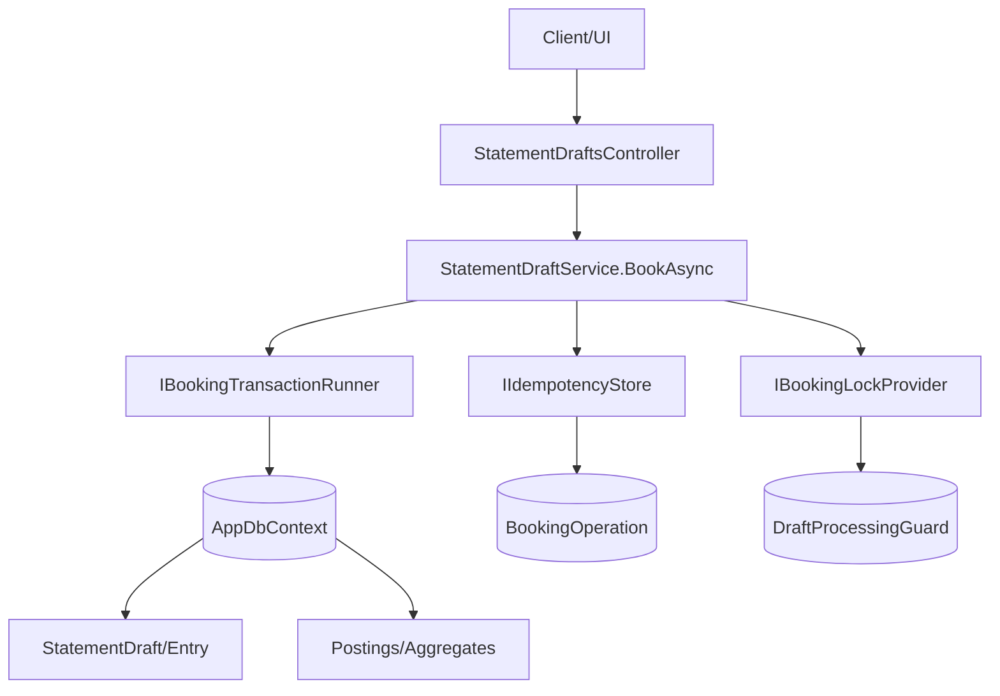
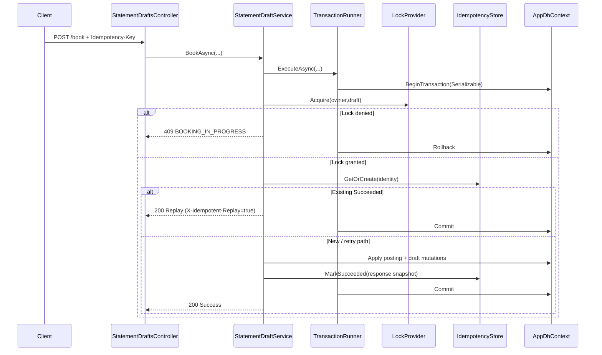
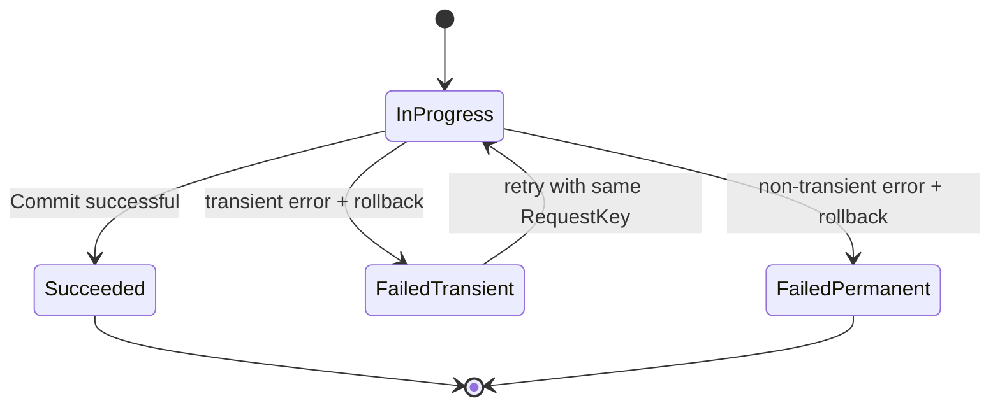

# Architektur-Blueprint: Transaction-Safe Statement Booking

> **Feature:** Transaction-safe statement booking  
> **Status:** ✅ Implementation-ready  
> **Version:** 0.2  
> **Datum:** 2026-06-06  
> **Autor:** Architektur- & Lösungsdesign Agent  
> **Verweise:**  
> - Requirements: [`../requirements/statement-booking-transaction-safety-requirements.md`](../requirements/statement-booking-transaction-safety-requirements.md)  
> - ERM: [`./entity-relationship-model-statement-booking-transaction-safety.md`](./entity-relationship-model-statement-booking-transaction-safety.md)  
> - Architecture Review: [`../improvements/review-architecture-statement-booking-transaction-safety.md`](../improvements/review-architecture-statement-booking-transaction-safety.md)

---

## 1) Zielbild und verbindlicher Scope

Dieser Blueprint definiert verbindlich die Umsetzung für:
- `POST /api/statement-drafts/{draftId}/book`
- `POST /api/statement-drafts/{draftId}/entries/{entryId}/book`

Pflichtziele:
1. **Atomare Verarbeitung:** genau ein Commit-/Rollback-Pfad pro Buchungsoperation.
2. **Idempotenz:** Retrigger/Replays erzeugen keine zusätzlichen Postings.
3. **Parallelitätsschutz:** derselbe Draft wird nie parallel fachlich verarbeitet.
4. **Deterministische Fehler-/Retry-Semantik:** klare ProblemDetails-Codes und Retry-Regeln.

Domänenregel bleibt unverändert:
- `StatementDraftStatus`: `Draft | Committed | Expired`
- Buchung nur `Draft -> Committed`; bei Fehler bleibt `Draft`.

Out of scope:
- Redesign der kompletten Posting-Domäne
- Einführung externer Lock-Infrastruktur ohne Feature-Notwendigkeit

---

## 2) Projektkontext und Architekturrahmen

### 2.1 Laufzeitkontext (bestehend)
- EF Core mit `AppDbContext`
- aktuelle Standardlaufzeit: **SQLite** (`UseSqlite`, Default `Data Source=financemanager.db`)
- Service-orientierte Buchungsorchestrierung über `StatementDraftService.BookAsync(...)`

### 2.2 Zielarchitektur (Schichten/Module)



Neue Bausteine:
- `IBookingTransactionRunner`: einheitlicher EF-ExecutionStrategy + Transaktionsrahmen
- `IBookingLockProvider`: single-flight Lock pro `(OwnerUserId, DraftId)`
- `IIdempotencyStore`: durable Request-Identität + Replay-Zustand

---

## 3) Verbindliche Transaktionsgrenze (ein Commit-/Rollback-Pfad)

### 3.1 Atomare Grenze
Eine Buchungsoperation umfasst **in genau einer DB-Transaktion**:
- Lock-Acquire (Guard-Bezug)
- `BookingOperation` Read/Create/Update
- Erzeugung/Mutation aller `Posting`/`PostingAggregate`-Änderungen
- Draft-/Entry-Mutationen inkl. Statusübergang
- Persistierung des Ergebniszustands (`Succeeded`/`Failed*`)

Außerhalb der Transaktion:
- Telemetrie, Logging, Cache-Invalidation, UI-seitige Folgeaktionen

### 3.2 Orchestrierungsreihenfolge (verbindlich)
1. Request-Identity bestimmen.
2. `ExecutionStrategy.ExecuteAsync(...)` starten.
3. `BeginTransactionAsync(IsolationLevel.Serializable)` starten.
4. Exklusiven Draft-Lock erwerben.
5. Idempotenzstatus prüfen (Replay/Kollision/neu).
6. Fachliche Buchung einmalig ausführen.
7. `BookingOperation` final auf `Succeeded` oder `Failed*` setzen.
8. **Genau ein** `CommitAsync` bei Erfolg, sonst `RollbackAsync`.

### 3.3 Normative Invarianten
- Es gibt keinen fachlichen `SaveChangesAsync` außerhalb dieses Transaktionsrahmens.
- Bei jeder Exception im Rahmen gilt vollständiges Rollback.
- Commit erfolgt nur, wenn Draft-/Entry-/Posting-/Operation-Zustand konsistent ist.

---

## 4) Idempotenzstrategie (Request-Identität + Replay-Semantik)

### 4.1 Request-Identität
`BookingRequestIdentity` ist:
- `OwnerUserId`
- `DraftId`
- `OperationScope` (`Draft` oder `Entry`)
- `EntryId` (nullable nur bei Scope `Draft`)
- `RequestKey`

`RequestKey`-Quelle:
1. Primär: HTTP-Header `Idempotency-Key`
2. Fallback: deterministischer Server-Key aus `(OwnerUserId, DraftId, EntryId|Draft, ForceWarnings)`

### 4.2 Persistenzmodell (gemäß ERM)
- Tabelle: `BookingOperation`
- harter Unique Constraint:  
  `UX_BookingOperation_Owner_Draft_Scope_Entry_RequestKey`

### 4.3 Replay-Semantik (verbindlich)

| Gefundener Zustand | API-Verhalten | Persistenzverhalten |
|---|---|---|
| `Succeeded` | 200 + ursprüngliches Ergebnis, `X-Idempotent-Replay: true` | keine neue Fachpersistenz |
| `InProgress` (nicht stale) | 409 `BOOKING_IN_PROGRESS` | keine neue Fachpersistenz |
| `FailedTransient` | 503 `BOOKING_TRANSIENT_FAILURE` (retryable) | gleicher Key darf erneut ausführen |
| `FailedPermanent` | deterministische ProblemDetails-Wiederholung | keine neue Fachpersistenz |

Determinismus:
- Erfolgs-Replay liefert gespeichertes Ergebnis (`ResponseCode`, `ResponsePayloadJson`) statt Neuberechnung.
- Replay erzeugt niemals zusätzliche Postings.

---

## 5) Locking-Strategie gegen parallele Requests

### 5.1 Primärstrategie (SQLite-first, provider-neutral)
- Durable Guard-Tabelle `DraftProcessingGuard`
- Exklusivität via Unique `(OwnerUserId, DraftId)`
- Acquire:
  - `INSERT`, wenn keine aktive Guard vorhanden
  - oder takeover via `UPDATE`, wenn `ExpiresUtc < now` (stale lease)

### 5.2 Lock-Lebenszyklus
- Guard wird innerhalb desselben DB-Transaktionspfads geführt.
- `LockTimeout`: 0-200ms (fast-fail, kein Queueing im API-Thread)
- Bei Lock-Kollision: 409 `BOOKING_IN_PROGRESS`

### 5.3 Provider-Adapter
- Optional bei künftigem SQL Server: `sp_getapplock` als Implementierung von `IBookingLockProvider`.
- Primärpfad bleibt für aktuelle SQLite-Laufzeit die Guard-/Lease-Tabelle.

---

## 6) Fehlerklassifikation, Retry-Semantik, ProblemDetails-Vertrag

### 6.1 Fehlerklassifikation (verbindlich)

| Klasse | HTTP | Code | Retryable | Rollback |
|---|---:|---|---|---|
| Validierung/Fachregel | 400/409 | `BOOKING_VALIDATION_FAILED`, `BOOKING_INVALID_STATE` | false | vollständig |
| Warning-Precondition | 428 | `BOOKING_WARNING_PRECONDITION` | true (mit geänderten Parametern) | vollständig |
| Lock-Kollision | 409 | `BOOKING_IN_PROGRESS` | true | vollständig |
| Transient technisch | 503 | `BOOKING_TRANSIENT_FAILURE` | true | vollständig |
| Permanent technisch | 500 | `BOOKING_INTERNAL_ERROR` | false | vollständig |

### 6.2 Retry-Semantik
- Auto-Retry nur bei `retryable=true`.
- Für 503 muss `Retry-After` gesetzt werden.
- Client-Retry nutzt denselben `Idempotency-Key`.
- Exponential Backoff + Jitter empfohlen.

### 6.3 ProblemDetails-Vertrag (additiv, verbindlich)
Alle Fehlerantworten enthalten mindestens:
- `type`, `title`, `status`, `traceId`
- `code` (maschinenlesbar)
- `retryable` (bool)

Beispiel:
```json
{
  "type": "https://financemanager/errors/booking-in-progress",
  "title": "Booking is already running",
  "status": 409,
  "traceId": "00-...-...",
  "code": "BOOKING_IN_PROGRESS",
  "retryable": true
}
```

---

## 7) Sequenzfluss (implementation-ready)



---

## 8) State-Machine (Operation + Recovery)



Recovery-Regeln:
- `InProgress` mit abgelaufener Lease (`ExpiresUtc`) gilt als stale und darf übernommen werden.
- Übernahme erzeugt neuen Attempt-Eintrag; bisherige Fachpersistenz bleibt durch Rollback-Invariante leer/konsistent.

---

## 9) Risiken und Gegenmaßnahmen

| Risiko | Auswirkung | Gegenmaßnahme |
|---|---|---|
| Stale `InProgress` blockiert neue Versuche | unnötige 409/503 | Lease-Expiry + Takeover-Regel, Cleanup-Job |
| Hohe Lock-Contention | erhöhte Konfliktrate | kurzer kritischer Abschnitt, Backoff im Client |
| Falsche Key-Wahl im Client | semantische Kollisionen | `Idempotency-Key` dokumentieren, serverseitiger Fallback |
| Lange Transaktion | Timeout/Deadlock-Risiko | Vorab-Lesen außerhalb kritischer Schreibphase, kurze Schreibphase |
| Rollout-Regressions bei Fehlercodes | Client-Inkompatibilität | additiver Fehlervertrag, stabile `code`-Werte |

---

## 10) FR/NFR-Mapping

| Requirement | Verbindliche Architekturmaßnahme |
|---|---|
| FR-1 | Ein transaktionaler `BookAsync`-Pfad mit genau einem Commit/Rollback |
| FR-1.1 | Status-Guard `Draft -> Committed` nur im Commit-Pfad |
| FR-2 | Durable `BookingOperation` + Replay mit persisted response |
| FR-2.1 | Entry-/Draft-spezifische Request-Identity mit Unique Constraint |
| FR-3 | Exklusiver Draft-Lock über `DraftProcessingGuard` |
| FR-4 | Fehlerklassifikation transient/permanent + retryable Flag |
| FR-5 | Standardisierte ProblemDetails inkl. `code`, `traceId`, `retryable` |
| NFR-1 | Vollständiger Rollback in jedem Fehlerpfad |
| NFR-2 | Single-flight pro Draft, deterministische 409-Kollision |
| NFR-3 | Replays bleiben ohne zusätzliche Postings |
| NFR-4 | 100% ProblemDetails mit maschinenlesbarem Vertrag |
| NFR-5 | Fast-fail Locking + kurze kritische Sektion für P95-Ziel |
| NFR-6 | Retry nur mit gleicher Request-Identity, keine Mehrfachbuchung |

---

## 11) Umsetzungsschritte (verbindliche Reihenfolge)

1. Migrationen für `BookingOperation`, `DraftProcessingGuard`, Indizes/Constraints.
2. Implementierung `IBookingLockProvider` (SQLite-first) und `IIdempotencyStore`.
3. Umbau `StatementDraftService.BookAsync` auf zentralen TransactionRunner.
4. ProblemDetails-Mapping + Header (`Idempotency-Key`, `X-Idempotent-Replay`, `Retry-After`).
5. Integrations-/Parallelitäts-/Replay-Tests gemäß NFR-1..NFR-6.

---

## 12) Traceability auf ERM und Review-Findings

- ERM-Konsistenz: [`./entity-relationship-model-statement-booking-transaction-safety.md`](./entity-relationship-model-statement-booking-transaction-safety.md)
- Review-Findings-Abdeckung:
  - F-01: SQLite-first Locking als Primärpfad festgelegt
  - F-02: State-Machine + stale-recovery verbindlich definiert
  - F-03: additiver, stabiler ProblemDetails-Vertrag präzisiert
  - F-04: deterministisches Replay mit persisted response verbindlich

---

## 13) Versionshistorie

| Version | Datum | Änderung |
|---|---|---|
| 0.1 | 2026-06-06 | Initialer Architektur-Blueprint |
| 0.2 | 2026-06-06 | Implementation-ready präzisiert: atomare Transaktionsgrenze, Idempotenz/Replays, Locking, Fehler-/Retry-/ProblemDetails-Vertrag, State-Machine, Risiko- und FR/NFR-Mapping |
