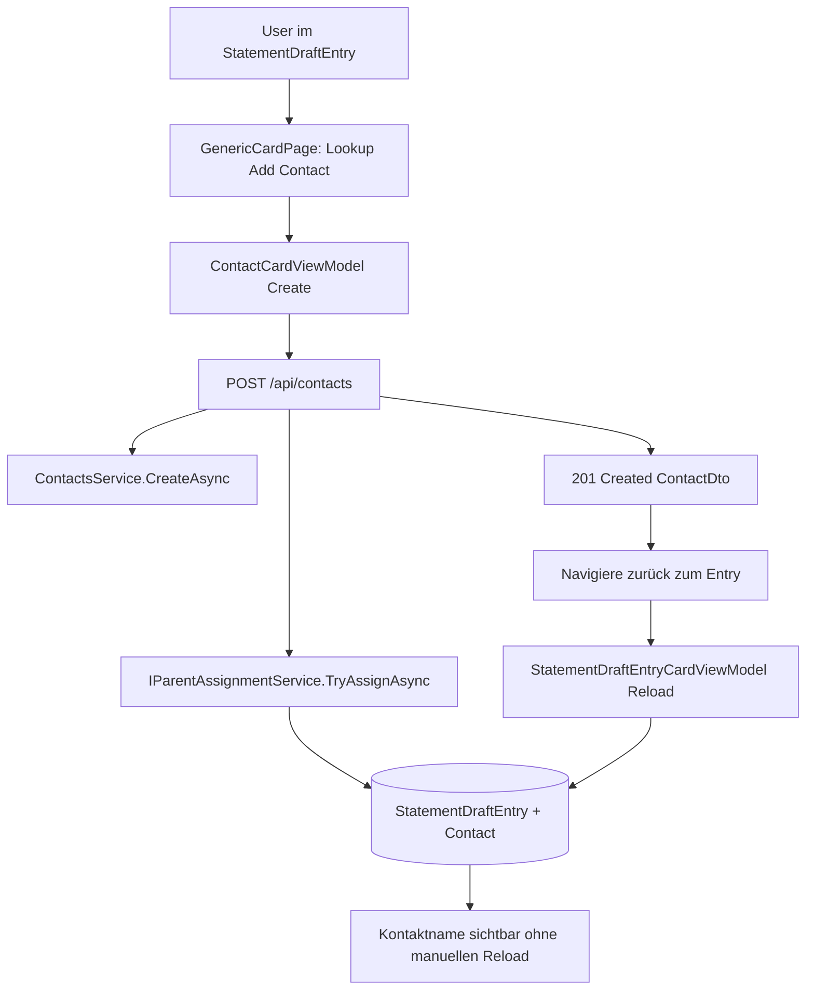
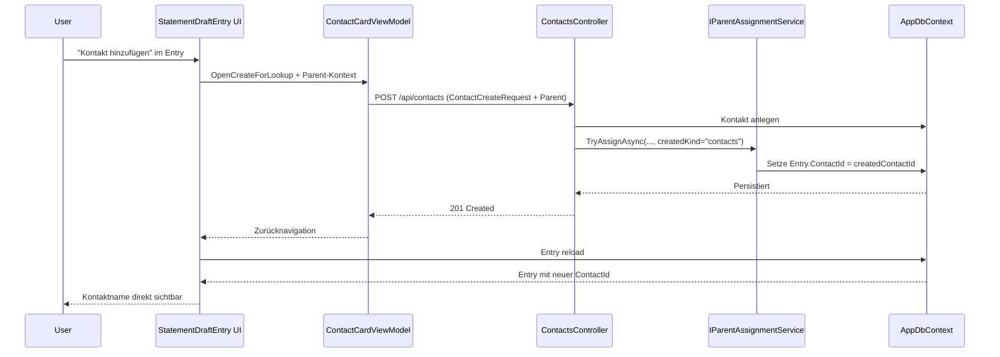

# Architektur-Blueprint: Automatische Kontaktzuordnung bei Kontakt-Neuanlage aus Kontoauszugeinträgen

> **Feature:** Statement Contact Auto Assignment  
> **Status:** ✅ Implementation-ready  
> **Version:** 0.1  
> **Datum:** 2026-07-01  
> **Autor:** Architektur- & Lösungsdesign Agent  
> **Verweise:**  
> - Requirements: [`../requirements/statement-contact-auto-assignment-requirements.md`](../requirements/statement-contact-auto-assignment-requirements.md)  
> - ERM: [`./entity-relationship-model-statement-contact-auto-assignment.md`](./entity-relationship-model-statement-contact-auto-assignment.md)  
> - Architecture Review: [`../improvements/review-architecture-statement-contact-auto-assignment.md`](../improvements/review-architecture-statement-contact-auto-assignment.md)  
> - Planung: [`../planning/planning-statement-contact-auto-assignment.md`](../planning/planning-statement-contact-auto-assignment.md)

---

## 1) Zielbild und Scope

Wenn ein Nutzer im Kontext eines `StatementDraftEntry` einen neuen Kontakt erstellt, muss dieser Kontakt **direkt nach erfolgreicher Speicherung** dem auslösenden Eintrag zugeordnet, persistiert und im UI sichtbar sein (FR-1, FR-1.2).

Verbindlicher Scope:
1. Wiederherstellung des End-to-End-Flows „Kontakt im Entry-Kontext erstellen → Entry erhält neue `ContactId`“.
2. Kontextsichere Zuordnung nur auf den auslösenden Eintrag (FR-1.1).
3. Robuste Fehlerbehandlung mit konsistentem Zustand und klarer Rückmeldung (FR-2).
4. Beibehaltung manueller Änderbarkeit/Löschbarkeit der Kontaktzuordnung (FR-3).

Out of Scope:
- Generelles Redesign der Kontaktverwaltung.
- Umbau des gesamten Statement-Buchungsprozesses.

---

## 2) Systemarchitektur (Schichten, Module, Integrationen)

### 2.1 Architekturkontext

Die Lösung bleibt im bestehenden Stack:
- **UI:** Blazor (`GenericCardPage`, `StatementDraftEntryCardViewModel`, `ContactCardViewModel`)
- **API:** ASP.NET Core Controller (`ContactsController`)
- **Application/Domain:** `IParentAssignmentService` + Domänenlogik `StatementDraftEntry`
- **Persistenz:** EF Core / `AppDbContext` (SQLite-first Laufzeit)

### 2.2 Zielarchitektur (Flow)



### 2.3 Relevante Module/Schnittstellen

- **UI-Trigger:** `GenericCardPage.OpenCreateForLookup(...)` übergibt `parentKind=statement-drafts/entries`, `parentId=<EntryId>`, `parentField=ContactId`.
- **Kontaktanlage:** `ContactCardViewModel` sendet `ContactCreateRequest` inklusive `Parent`.
- **API-Endpunkt:** `ContactsController.CreateAsync`.
- **Parent Assignment:** `IParentAssignmentService.TryAssignAsync(...)`, Handler `statement-drafts/entries:contacts`.
- **Persistenzzuordnung:** `ParentAssignmentService.AssignContactToStatementDraftEntryAsync(...)` setzt `entry.AssignContactWithoutAccounting(createdId)`.

---

## 3) Verbindliche Designentscheidung zur Wiederherstellung

### Entscheidung A (MUST)
`ContactsController.CreateAsync` ruft nach erfolgreicher Kontaktanlage verpflichtend auf:

```text
_parentAssign.TryAssignAsync(
  ownerUserId: _current.UserId,
  parent: req.Parent,
  createdKind: "contacts",
  createdId: created.Id,
  ct)
```

Begründung:
- `ParentAssignmentService` enthält bereits den Handler `statement-drafts/entries:contacts`.
- Gleiches Muster wird bereits konsistent für `SavingsPlansController` und `SecuritiesController` genutzt.
- Schließt die funktionale Lücke, durch die FR-1 verloren ging.

### Entscheidung B (MUST)
Parent-Assignment-Fehler dürfen nicht still bleiben:
- Bei ungültigem Parent-Kontext oder nicht auffindbarem Entry: kontrollierter Fehlerpfad (4xx) mit klarer Fehlerbeschreibung.
- Kein „Created ohne Assignment“, wenn Parent-Assignment explizit angefordert wurde.

### Entscheidung C (SHOULD)
Ergänzende strukturierte Logs für Nachvollziehbarkeit (NFR-4):
- `DraftId`, `EntryId`, `ContactId`, `OwnerUserId`, `AssignmentResult`, `TraceId`.

---

## 4) Sequenzdiagramm (Soll-Prozess)



---

## 5) Technologieentscheidungen

1. **Kein neuer Technologiestack:** Umsetzung im bestehenden ASP.NET Core + EF Core + Blazor Stack (geringes Risiko, schnelle Wiederherstellung).
2. **Wiederverwendung Parent-Assignment-Service:** Vermeidet neue Speziallogik, erhöht Konsistenz über Entity-Typen.
3. **Server-seitige Zuordnung als Source of Truth:** UI liefert Kontext, Zuordnung wird atomar serverseitig persistiert.
4. **SQLite-first kompatibel:** Keine provider-spezifischen Features erforderlich.

---

## 6) UI/UX-Konzept

### 6.1 Informationsarchitektur
- Nutzer bleibt im fachlichen Entry-Kontext.
- Kontaktanlage erfolgt in separater Card, Rückkehr mit erhaltenem Kontext.
- Entry-Card zeigt den neu angelegten Kontakt unmittelbar nach Rückkehr.

### 6.2 Interaktionsdesign
1. Nutzer klickt „+“ im Kontakt-Lookup des Entries.
2. Kontakt-Card öffnet sich mit `prefill` (z. B. Empfängername).
3. Nach Speichern: Rücknavigation zum Entry.
4. Entry lädt Details neu und zeigt den Kontakt ohne manuelles Refresh.

### 6.3 UX-Fehlerfälle
- Bei Assignment-Fehler: verständliche Fehlermeldung „Kontakt erstellt, aber Zuordnung fehlgeschlagen“ **oder** transaktional bevorzugt „Anlage nicht abgeschlossen“, je nach finaler Fehlerstrategie.
- Keine stille Inkonsistenz im UI.

---

## 7) Qualitätsziele (priorisiert)

| Priorität | Qualitätsziel | Zielwert/Messung |
|---|---|---|
| MUST | Datenintegrität & Mandantenschutz (NFR-1) | 0 Cross-User-Zuordnungen |
| MUST | Funktionssicherheit Regression (NFR-5) | 1+ stabiler E2E-Regressionstest, CI 100% grün |
| HIGH | Kontexttreue (FR-1.1/NFR-3) | 0 Fehlzuordnungen bei parallelen Entry-Kontexten |
| HIGH | Reaktionszeit (NFR-2) | P95 < 2s bis sichtbare Zuordnung |
| MEDIUM | Nachvollziehbarkeit (NFR-4) | 100% strukturierte Assignment-Logs |

---

## 8) Fehlerbehandlung

### 8.1 Fehlerklassen

| Fall | Verhalten API | Verhalten UI |
|---|---|---|
| Kontakt-Validierung fehlerhaft | 400 Bad Request | Feld-/Fehlermeldung auf Contact-Card |
| Parent-Kontext ungültig/Entry nicht vorhanden | 409/422 (domänennah) | Klare Meldung, keine stille Rückkehr |
| Berechtigung/Mandantenverletzung | 403/404 | Sichere Fehlermeldung ohne Datenleck |
| Unerwarteter Fehler | 500 + ProblemDetails/API-Error | Allgemeine Fehlermeldung + Retry-Möglichkeit |

### 8.2 Invarianten
- Kein Cross-User-Assignment.
- Kein Assignment auf falschen Entry.
- Bei Fehlern deterministisches Verhalten, kein teilweiser „erfolgreich aber unsichtbar“-Zustand.

---

## 9) Teststrategie

### 9.1 Unit-Tests
- `ParentAssignmentService.AssignContactToStatementDraftEntryAsync`:
  - Erfolgspfad (gültiger Owner, Entry, Contact).
  - Fehlerpfade (falscher Owner, Entry fehlt, Contact fehlt).

### 9.2 API-/Integrationstests
- `POST /api/contacts` mit `Parent(statement-drafts/entries, ContactId)`:
  - erstellt Kontakt und setzt `Entry.ContactId`.
  - validiert Owner-Isolation.
- Negativfall: ungültiger Parent → erwarteter Fehlervertrag.

### 9.3 UI-/E2E-Tests (MUST)
- Szenario FR-1: Kontakt aus Entry anlegen → Rückkehr → Kontakt sichtbar ohne manuellen Reload.
- Parallelitätsszenario FR-1.1: Zwei offene Entries, Zuordnung nur auf auslösenden Entry.
- Änderbarkeit FR-3: Auto-zugewiesenen Kontakt manuell ändern/entfernen.

### 9.4 Regression-Gate
- Mindestens ein stabiler E2E-Test in CI als Blocker gegen erneuten Funktionsverlust.

---

## 10) FR/NFR-Traceability

| Requirement | Architekturmaßnahme |
|---|---|
| FR-1 | `ContactsController.CreateAsync` + verpflichtendes `TryAssignAsync(... createdKind="contacts")` |
| FR-1.1 | Parent-Kontext (`parentId=EntryId`) + serverseitige Owner-Prüfung in `ParentAssignmentService` |
| FR-1.2 | Rücknavigation + Entry-Reload im `StatementDraftEntryCardViewModel` |
| FR-2 | Deterministische Fehlerklassen + klare API/UI-Rückmeldungen |
| FR-3 | Bestehender `SaveEntryAll`-Pfad bleibt unverändert für manuelle Korrektur |
| NFR-1 | Ownership-Checks (`StatementDraft.OwnerUserId`, `Contact.OwnerUserId`) |
| NFR-2 | Leichtgewichtiger Assignment-Pfad ohne zusätzliche Roundtrips |
| NFR-3 | Eindeutiger Parent-Kontext, tests für parallele Kontexte |
| NFR-4 | Strukturierte Assignment-Logs mit Korrelation |
| NFR-5 | API + UI + E2E Regressionstestpaket |

---

## 11) Umsetzungsreihenfolge

1. `ContactsController` um `IParentAssignmentService` ergänzen (DI + Constructor).
2. In `CreateAsync` nach `CreateAsync` des Kontakts `TryAssignAsync(... createdKind="contacts")` aufrufen.
3. Fehlervertrag für Parent-Assignment-Fehler präzisieren.
4. Logging/Telemetry für Assignment-Erfolg und -Fehler ergänzen.
5. Tests (Unit/Integration/E2E) implementieren und CI-Gate aktivieren.

---

## 12) Versionshistorie

| Version | Datum | Änderung |
|---|---|---|
| 0.1 | 2026-07-01 | Initialer Architektur-Blueprint für Wiederherstellung der automatischen Kontaktzuordnung im Statement-Entry-Kontext |

