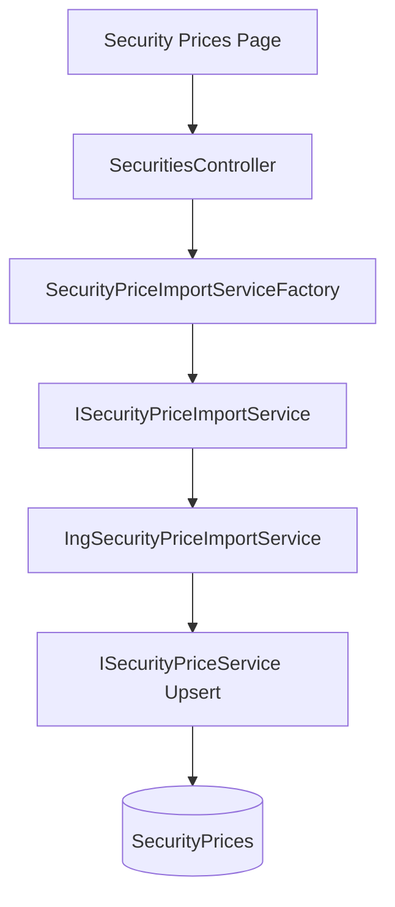
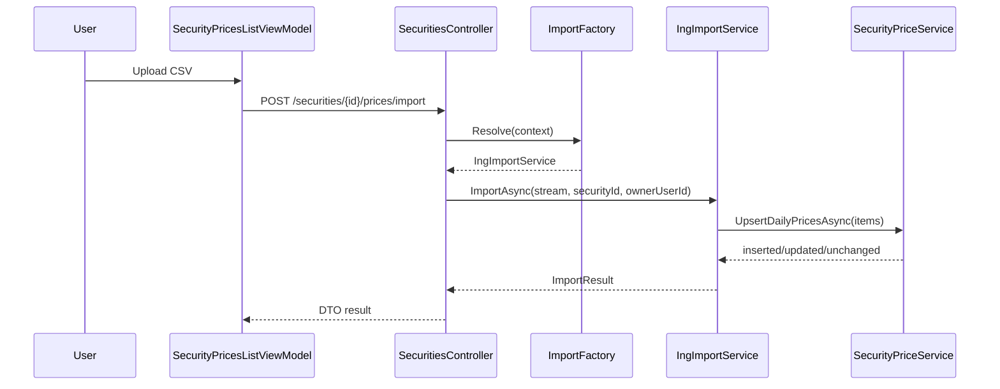

# Architektur-Blueprint: Wertpapierkurse-Import (ING CSV)

> **Feature:** Wertpapierkurse-Import (ING)  
> **Status:** ✅ Umgesetzt  
> **Version:** 1.0  
> **Datum:** 2026-07-02  
> **Primäranforderung:** [`../requirements/wertpapierkurse-ing-requirements.md`](../requirements/wertpapierkurse-ing-requirements.md)

## 1. Systemarchitektur

Der Import erweitert den bestehenden Wertpapier-Kursseiten-Flow (`/list/securities/prices/{id}`) um einen Datei-Upload, der über eine Factory einen provider-spezifischen Importservice auswählt.

## 2. Module und Schnittstellen

### 2.1 Neue/erweiterte Backend-Bausteine
- `ISecurityPriceImportService`
  - `bool CanHandle(SecurityPriceImportContext context)`
  - `Task<SecurityPriceImportResult> ImportAsync(...)`
- `ISecurityPriceImportServiceFactory`
  - `ISecurityPriceImportService Resolve(SecurityPriceImportContext context)`
- `IngSecurityPriceImportService`
  - Parsing von ING-CSV (`sep=;`, `dd.MM.yyyy HH:mm:ss`, Dezimal `,`)
- `ISecurityPriceService` Erweiterung
  - `UpsertDailyPricesAsync(ownerUserId, securityId, IReadOnlyList<SecurityPriceImportItem>, ct)`

### 2.2 API-Design
- Neuer Endpoint: `POST /api/securities/{id}/prices/import`
  - `multipart/form-data` (`file`, optional `provider=ing`)
  - Response: `SecurityPriceImportResultDto` mit Zählern + Fehlern

## 3. Technologieentscheidungen

| Entscheidung | Option | Begründung |
|---|---|---|
| Provider-Erkennung | Factory + `CanHandle` | Erfüllung Erweiterbarkeitsanforderung (FR-5) |
| Parsing | Streaming via `StreamReader` | Speicherarm, robust für größere Dateien |
| Persistenzstrategie | Service-seitiges Upsert | Vermeidet Unique-Index-Konflikte bei Re-Import |
| UI-Integration | Aktionsleisten-Action auf Wertpapier-Kursseite | Konsistent mit der Regel "Einzelaktion auf Detailkontext", hier konkret die Kursdetailansicht |

## 4. Daten- und Kontrollfluss

## 5. Fehlerbehandlung

- **400 BadRequest**
  - Datei fehlt/leer
  - Unbekanntes Provider-Format (kein Service über Factory gefunden)
  - CSV enthält keine validen Kurszeilen
- **404 NotFound**
  - Security nicht vorhanden oder nicht owner-scoped
- **200 OK mit Fehlerliste**
  - Teilimporte werden als Erfolg mit `errors[]` und `skipped` zurückgegeben
- **500**
  - Unerwartete technische Fehler

ProblemDetails enthält `traceId`, `provider`, `lineNumber` (falls vorhanden), aber keine sensiblen Nutzerdaten.

## 6. UI/UX-Konzept

- Auf `SecurityPricesListViewModel` wird in der Aktionsleiste eine neue Aktion ergänzt, z. B. **Import Prices** (Icon aus `sprite.svg`).
- Aktion nur im Kursseiten-Kontext eines konkreten Wertpapiers aktiv (`Id != Guid.Empty`).
- Nach Upload zeigt UI Ergebnisbanner mit:
  - `Imported`: neu angelegt
  - `Updated`: bestehende Tage geändert
  - `Unchanged`: identische Tage übersprungen
  - `Errors`: fehlerhafte Zeilen
- Nach erfolgreichem Import bleibt der Nutzer auf der Kursseite `/list/securities/prices/{id}` und sieht dort direkt die Ergebniszusammenfassung.

## 7. Qualitätsziele

| Ziel | Maßnahme | Metrik |
|---|---|---|
| Sicherheit | Owner-Prüfung vor Persistenz | 0 Cross-User-Mutationen |
| Zuverlässigkeit | Deterministische Parser-Validierung | Reproduzierbare Fehler je Zeile |
| Wartbarkeit | Interface + Factory + Provider-Implementierung | Neue Provider ohne Controller-Änderung |
| Performance | Batch-Upsert im Service | Interaktiver Import für typische CSV-Dateien |

## 8. Teststrategie

- **Unit**
  - ING Parser: Header, Semikolon, Dezimal-Komma, Zeitnormalisierung
  - Factory Resolve-Verhalten
  - Upsert-Regeln (insert/update/unchanged)
- **Integration**
  - Controller Upload-Endpunkt mit InMemory-DB
  - Owner-Scoping und Fehlercodes
- **UI/ViewModel**
  - Aktionsleisten-Action verfügbar auf der Kursseite
  - Ergebnisanzeige nach Import

## 9. Annahmen

1. Erste CSV-Spalte wird auf Tagesdatum (`Date`) normalisiert, Zeitzone wird nicht separat verarbeitet.
2. Providerauswahl erfolgt initial über expliziten Provider `ing` oder Dateistrukturprüfung.
3. Für den ersten Schritt ist kein neuer Hintergrundprozess nötig.

## 10. Verlinkte Artefakte

- Anforderungen: [`../requirements/wertpapierkurse-ing-requirements.md`](../requirements/wertpapierkurse-ing-requirements.md)
- ERM: [`./entity-relationship-model-wertpapierkurse-ing.md`](./entity-relationship-model-wertpapierkurse-ing.md)
- Review: [`../improvements/review-architecture-wertpapierkurse-ing.md`](../improvements/review-architecture-wertpapierkurse-ing.md)
- Planung: [`../planning/planning-wertpapierkurse-ing.md`](../planning/planning-wertpapierkurse-ing.md)
- API: [`../api/SecuritiesController.md`](../api/SecuritiesController.md#post-apisecuritiesidpricesimport)
- Flow: [`../flows/security-price-import-ing.md`](../flows/security-price-import-ing.md)
- Business: [`../business/features/F007-wertpapierpreise-ing-csv-import.md`](../business/features/F007-wertpapierpreise-ing-csv-import.md)
- Tests: [`../tests/wertpapierkurse-ing-testplan.md`](../tests/wertpapierkurse-ing-testplan.md)

## 11. Versionshistorie

| Version | Datum | Autor | Änderung |
|---|---|---|---|
| 1.0 | 2026-07-02 | planning-architecture-blueprint | Initialer Architektur-Blueprint für ING-Wertpapierkursimport |
| 1.1 | 2026-07-02 | documentation-orchestrator | UI-Platzierung auf Kursseite präzisiert und auf `SecurityPricesListViewModel` aktualisiert |
