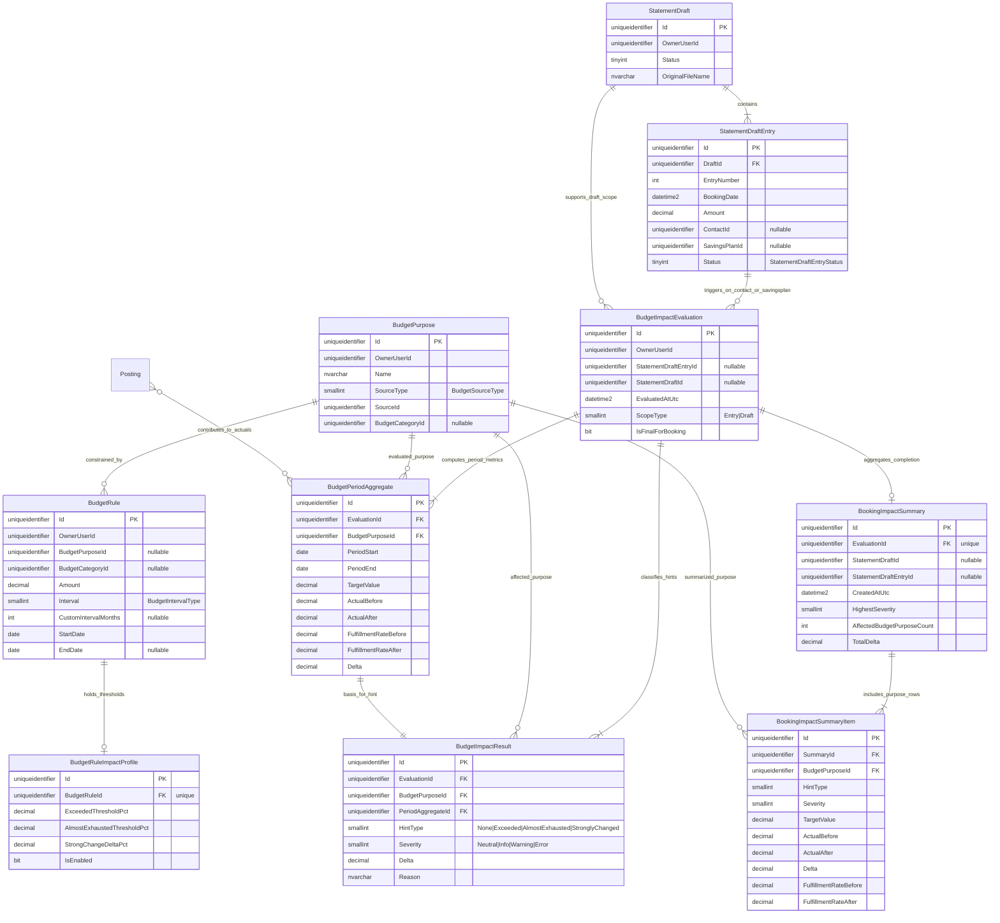

# Entity-Relationship-Modell: Budget Impact Booking

> **Feature:** Budget Impact Visibility während Buchung  
> **Status:** 📋 Geplant  
> **Version:** 0.3  
> **Datum:** 2026-05-31  
> **Basis:** `7c1c60b3-841d-4c4a-86b6-7a00fe6484df.copilot.task.md`, `requirements-budget-impact-booking.md`, `architecture-blueprint-budget-impact-booking.md`

---

## 1) ER-Diagramm (Mermaid)

---

## 2) Entitätstabelle (inkl. Aggregate Boundary)

| Entität | Status | Aggregate Boundary | Zweck |
|---|---|---|---|
| `StatementDraft`, `StatementDraftEntry` | Bestehend | **Write Aggregate:** StatementDraft | Buchungskontext und Triggerpunkt für Evaluation (Kontakt/Sparplan). |
| `BudgetPurpose` | Bestehend | **Write Aggregate:** BudgetPurpose | Zielobjekt der Bewertung inkl. `SourceType`/`SourceId` Mapping. |
| `BudgetRule` | Bestehend | **Write Aggregate:** BudgetRule | Plan-/Periodenlogik pro Zweck/Kategorie. |
| `BudgetRuleImpactProfile` | Neu (Erweiterung) | Teil von BudgetRule | Schwellen für Exceeded/AlmostExhausted/StronglyChanged. |
| `BudgetImpactEvaluation`, `BudgetPeriodAggregate`, `BudgetImpactResult` | Neu | **Compute Aggregate** | Berechnung von Target/Actual before-after, Delta, HintType/Severity. |
| `BookingImpactSummary`, `BookingImpactSummaryItem` | Neu | **Completion Read Model** | Abschlussaggregation nach Buchung (Vorher/Nachher/Delta, höchste Schwere). |
| `Posting` | Bestehend | Eigenes Aggregate | Datenquelle für `ActualBefore`/`ActualAfter`. |

---

## 3) Attribut-/Key-Tabelle (EF-Core orientiert)

| Entität | PK | Wichtige FK | Kernattribute | Enum/Conversion-Hinweis |
|---|---|---|---|---|
| `StatementDraft` | `Id` | – | `OwnerUserId`, `Status`, `OriginalFileName` | `Status` als `tinyint` Enum |
| `StatementDraftEntry` | `Id` | `DraftId -> StatementDraft.Id` | `EntryNumber`, `BookingDate`, `Amount`, `ContactId?`, `SavingsPlanId?`, `Status` | `Status` als `tinyint`; `Amount` `decimal(18,2)` |
| `BudgetPurpose` | `Id` | `BudgetCategoryId?` | `OwnerUserId`, `Name`, `SourceType`, `SourceId` | `SourceType` (`BudgetSourceType`) via `HasConversion<short>()` |
| `BudgetRule` | `Id` | `BudgetPurposeId?`, `BudgetCategoryId?` | `Amount`, `Interval`, `CustomIntervalMonths?`, `StartDate`, `EndDate?` | `Interval` (`BudgetIntervalType`) via `HasConversion<short>()` |
| `BudgetRuleImpactProfile` | `Id` | `BudgetRuleId` (unique) | `ExceededThresholdPct`, `AlmostExhaustedThresholdPct`, `StrongChangeDeltaPct`, `IsEnabled` | Thresholds als `decimal(9,6)` |
| `BudgetImpactEvaluation` | `Id` | `StatementDraftEntryId?`, `StatementDraftId?` | `OwnerUserId`, `EvaluatedAtUtc`, `ScopeType`, `IsFinalForBooking` | `ScopeType` Enum als `smallint` |
| `BudgetPeriodAggregate` | `Id` | `EvaluationId`, `BudgetPurposeId` | `PeriodStart`, `PeriodEnd`, `TargetValue`, `ActualBefore`, `ActualAfter`, `FulfillmentRateBefore`, `FulfillmentRateAfter`, `Delta` | Beträge `decimal(18,2)`, Quoten `decimal(9,6)` |
| `BudgetImpactResult` | `Id` | `EvaluationId`, `BudgetPurposeId`, `PeriodAggregateId` | `HintType`, `Severity`, `Delta`, `Reason` | `HintType`/`Severity` als `smallint` |
| `BookingImpactSummary` | `Id` | `EvaluationId` (unique), `StatementDraftId?`, `StatementDraftEntryId?` | `CreatedAtUtc`, `HighestSeverity`, `AffectedBudgetPurposeCount`, `TotalDelta` | `HighestSeverity` Enum |
| `BookingImpactSummaryItem` | `Id` | `SummaryId`, `BudgetPurposeId` | `HintType`, `Severity`, `TargetValue`, `ActualBefore`, `ActualAfter`, `Delta`, `FulfillmentRateBefore`, `FulfillmentRateAfter` | Enum + decimal precision wie oben |

---

## 4) Beziehungstabelle (Kardinalitäten)

| Von | Nach | Kardinalität | Bedeutung |
|---|---|---|---|
| `StatementDraft` | `StatementDraftEntry` | 1 : n | Ein Draft enthält viele Entries. |
| `StatementDraftEntry` | `BudgetImpactEvaluation` | 1 : n (optional) | Mehrere Re-Evaluierungen während Eingabe. |
| `StatementDraft` | `BudgetImpactEvaluation` | 1 : n (optional) | Draft-Gesamtevaluation bei Gesamtbuchung. |
| `BudgetPurpose` | `BudgetRule` | 1 : n | Zweck hat mehrere Regeln. |
| `BudgetRule` | `BudgetRuleImpactProfile` | 1 : 0..1 | Optionale Schwellwert-Konfiguration pro Regel. |
| `BudgetImpactEvaluation` | `BudgetPeriodAggregate` | 1 : n | Pro Zweck/Periode ein Aggregat mit Target/Actual before/after. |
| `BudgetImpactEvaluation` | `BudgetImpactResult` | 1 : n | Pro betroffenem Zweck eine Hint-Klassifikation. |
| `BudgetPurpose` | `BudgetPeriodAggregate` | 1 : n | Periodenmetriken sind zweckbezogen. |
| `BudgetPurpose` | `BudgetImpactResult` | 1 : n | Hint-Ergebnis ist zweckbezogen. |
| `BudgetPeriodAggregate` | `BudgetImpactResult` | 1 : 1 | Klassifikation basiert auf genau einem Aggregat. |
| `BudgetImpactEvaluation` | `BookingImpactSummary` | 1 : 0..1 | Finale Summary zu einer finalen Evaluation. |
| `BookingImpactSummary` | `BookingImpactSummaryItem` | 1 : n | Summary fasst alle betroffenen Zwecke zusammen. |
| `BudgetPurpose` | `BookingImpactSummaryItem` | 1 : n | Summary-Item referenziert konkreten Budgetzweck. |

---

## 5) Modellierungsrationale + Änderungen

1. **StatementDraft/StatementDraftEntry explizit als Context** für FR-1.1 Trigger im Buchungsdialog.  
2. **`BudgetPurpose.SourceType` + `SourceId`** bleibt zentrales Resolver-Paar für betroffene Zwecke (Kontakt/Gruppe/Sparplan).  
3. **`BudgetRuleImpactProfile` ergänzt `BudgetRule`** um thresholds + Klassifikationsparameter ohne UI-Hardcoding (NFR-4).  
4. **`BudgetPeriodAggregate`** erzwingt konsistente Datenbasis (`TargetValue`, `ActualBefore`, `ActualAfter`, Quoten, `Delta`) für Hint und Summary (NFR-2).  
5. **`BudgetImpactResult`** modelliert Bewertungsergebnis explizit mit `HintType`, `Severity`, `Delta`, `Reason`.  
6. **`BookingImpactSummary` + Items** bildet Abschlussaggregation mit `HighestSeverity`, `AffectedBudgetPurposeCount`, `TotalDelta`.

**Änderungen ggü. vorherigem ERM-Stand:**
- Struktur auf **separate Entitäts-, Attribut/Key- und Beziehungstabellen** präzisiert.
- StatementDraft-/Entry-Kontext und Completion-Aggregation klarer getrennt.
- EF-Core Hinweise (Enums, Conversion, Precision, FK/Unique-FK) konkreter ausformuliert.

---

## 6) Konsistenzcheck gegen Blueprint + Requirements

| Quelle | Erwartung | ERM-Abdeckung | Ergebnis |
|---|---|---|---|
| Task + FR-1/FR-1.1 | Prüfung sobald Kontakt/Sparplan feststeht | `StatementDraftEntry` + optionale FK `ContactId`/`SavingsPlanId` + `BudgetImpactEvaluation` | ✅ |
| FR-1.2 | Mehrzweck-Bewertung | `BudgetImpactEvaluation` 1:n `BudgetImpactResult` | ✅ |
| FR-2/FR-2.1 | Hinweis-Typen | `HintType` (Exceeded/AlmostExhausted/StronglyChanged) + `Severity` | ✅ |
| FR-3 | Vorher/Nachher/Delta + betroffene Zwecke in Summary | `BookingImpactSummary` + `BookingImpactSummaryItem` inkl. Ziel-/Ist-/Delta-Werte | ✅ |
| FR-4 | Nachvollziehbarer Grund der Auswirkung | `BudgetImpactResult.Reason` + FK auf `BudgetPurpose` | ✅ |
| Blueprint §3 | SourceType + BudgetRules + dynamische Targets + Ist-Werte inkl. neuer Buchung | `BudgetPurpose`, `BudgetRule(+ImpactProfile)`, `BudgetPeriodAggregate.ActualBefore/After` | ✅ |
| Blueprint §4 + NFR-2 | Gleiches Rechenfundament für Hint und Abschluss | 1:1 Bezug `BudgetPeriodAggregate -> BudgetImpactResult` + Summary-Projektion | ✅ |
| NFR-4 | Regelbasiert wartbar | Thresholds in `BudgetRuleImpactProfile` statt UI | ✅ |

---

## 7) Annahmen

- `BudgetImpactEvaluation` kann persistiert (Audit/Telemetry) oder transient gehalten werden; ERM zeigt persistierbare Zielstruktur.
- Eine finale Buchungsoperation liefert genau **eine** `BookingImpactSummary` pro finaler Evaluation.
- Enums (`ScopeType`, `HintType`, `Severity`) werden im DB-Schema als `smallint` mit Value Conversion gespeichert.
