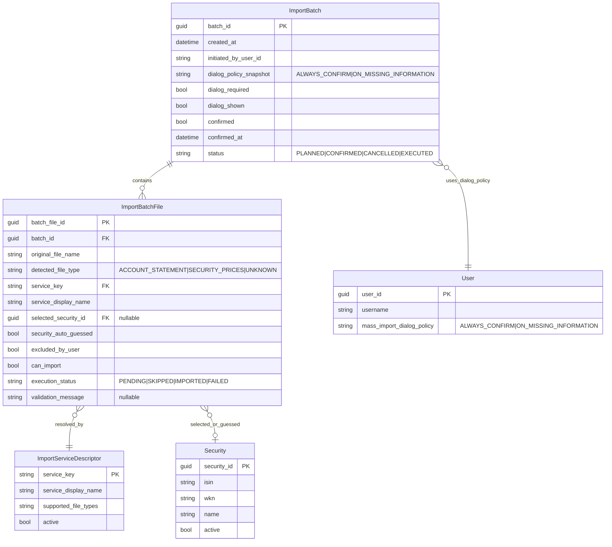

# Entity-Relationship-Modell: Startseiten-Massenimport (Kontoauszug + ING-Wertpapierkurse)

> **Status:** ✅ Implementiert  
> **Version:** 1.1  
> **Datum:** 2026-07-03  
> **Grundlagen:** [`../../issue.md`](../../issue.md) · [`../requirements/massenimport-ing-wertpapierkurse-requirements.md`](../requirements/massenimport-ing-wertpapierkurse-requirements.md) · [`./architecture-blueprint-massenimport-ing-wertpapierkurse.md`](./architecture-blueprint-massenimport-ing-wertpapierkurse.md)

## 1) Ziel und Modellzuschnitt

Dieses ERM beschreibt den **Datenzuschnitt für den Mehrdatei-Import auf der Startseite** mit Fokus auf:

- Prozesskontext für einen Lauf mit mehreren Dateien (`ImportBatch`, `ImportBatchFile`)
- Zuordnung *Datei → erkannter Typ → Service (inkl. Anzeigename) → optional Security*
- Einstellungslogik für das Dialogverhalten (`Immer bestätigen`, `bei fehlenden Informationen`)
- klare Trennung zwischen **persistierten Domänendaten** und **prozessualen DTO-/Runtime-Modellen**

---

## 2) Persistenzabgrenzung (wichtig)

### Persistiert (Domänen-/Konfigurationsdaten)

- `Security` (Wertpapierstammdaten, Lookup für Kursdateien)
- `User.MassImportDialogPolicy` (benutzerbezogene Einstellung für Dialog-Skip-Logik)

### Prozessual / DTO / Runtime (pro Importlauf, i. d. R. nicht dauerhaft)

- `ImportBatch` (Laufkontext eines Uploads mit mehreren Dateien)
- `ImportBatchFile` (Dateizeile im Erkennungsdialog inkl. Erkennungsergebnis, Ausschluss, manuellem Override)
- `FileRecognitionResult` (Factory-Ergebnis je Datei)
- `SecurityCandidate` (Dateiname-basierte Vorbelegung)

> Hinweis: Das Architektur-Blueprint beschreibt den Flow als Orchestrierungsprozess. Eine dauerhafte Speicherung von `ImportBatch*` ist dort nicht als Muss vorgegeben und wird daher hier als **Runtime-Modell** geführt.

---

## 3) Mermaid ER-Diagramm

---

## 4) Tabellarische Übersicht (Entitäten, Attribute, Schlüssel, Constraints, Kardinalitäten)

| Entität | Persistenzstatus | Schlüssel | Wichtige Attribute | Constraints / Regeln | Beziehungen / Kardinalitäten |
|---|---|---|---|---|---|
| `ImportBatch` | Runtime/DTO | `batch_id` (PK) | `dialog_policy_snapshot`, `dialog_required`, `confirmed`, `status` | Ein Batch repräsentiert genau einen Upload-Lauf; Status-Übergänge nur vorwärts (`PLANNED -> CONFIRMED/EXECUTED` etc.). | `1:n` zu `ImportBatchFile`; `n:1` zu `User` (Policy-Snapshot-Nutzung) |
| `ImportBatchFile` | Runtime/DTO | `batch_file_id` (PK), `batch_id` (FK) | `detected_file_type`, `service_key`, `service_display_name`, `selected_security_id`, `excluded_by_user`, `can_import`, `execution_status` | Für `detected_file_type=SECURITY_PRICES` gilt: genau eine `selected_security_id` vor Ausführung erforderlich (NFR-6). `UNKNOWN` ist standardmäßig `can_import=false` bis User-Entscheidung. | Gehört zu genau einem `ImportBatch`; genau ein `ImportServiceDescriptor`; optional genau eine `Security` |
| `ImportServiceDescriptor` | Persistiert (Konfiguration) | `service_key` (PK) | `service_display_name`, `supported_file_types`, `active` | `service_display_name` muss gesetzt sein (FR-5). `service_key` eindeutig/stabil. | `1:n` von Service zu Batch-Dateien |
| `User` | Persistiert (pro Benutzer) | `user_id` (PK) | `mass_import_dialog_policy` | Zulässige Werte: `ALWAYS_CONFIRM`, `ON_MISSING_INFORMATION` (FR-9). | `1:n` von User zu Batches (über Snapshot-Verwendung) |
| `Security` | Persistiert (Domäne) | `security_id` (PK), `isin` (unique empfohlen) | `isin`, `wkn`, `name`, `active` | Nur aktive/valide Securities auswählbar. | `1:n` von Security zu Batch-Dateien (optional je Datei) |
| `FileRecognitionResult` | Prozessual (Factory-Output) | – | `fileType`, `serviceKey`, `serviceDisplayName`, `canImport` | Muss für jede hochgeladene Datei erzeugt werden (FR-2, FR-5). | Wird in `ImportBatchFile` materialisiert |
| `SecurityCandidate` | Prozessual (Guess-Output) | – | `securityId?`, `matchConfidence?`, `ruleId?` | Nur für Kursdateien; kann leer sein und Dialog erzwingen (FR-3, AC-3.2). | Optionaler Input für `ImportBatchFile.selected_security_id` |

---

## 5) Modellierungsentscheidungen (kurz begründet)

1. **`ImportBatch` + `ImportBatchFile` als Prozesskontext**  
   Direkte Abbildung des geforderten Mehrdatei-Imports mit Dateizeilenlogik (Ausschluss, manuelle Korrektur, Ausführungsstatus).

2. **Service als eigener Descriptor mit `service_display_name`**  
   Erfüllt Transparenzanforderung aus Dialog (FR-5) und hält die Anzeige vom technischen Service-Key getrennt.

3. **Optionale Security-Zuordnung je Datei**  
   Pflicht nur für Kursdateien; unterstützt sowohl automatische Vorbelegung (Guess) als auch manuelle Auswahl (FR-3, FR-7, NFR-6).

4. **User-Policy als persistierte Benutzerkonfiguration + Snapshot im Batch**  
   Verhindert Inkonsistenzen, wenn Einstellungen während eines laufenden Imports geändert werden; Batch bleibt reproduzierbar.

5. **Runtime-Modelle explizit getrennt von Persistenzmodellen**  
   Konsistent mit Architektur-Flow (Orchestrierung) und vermeidet unnötige dauerhafte Speicherung temporärer Upload-Metadaten.

---

## 6) Konsistenzabgleich mit Requirements und Architektur

| Referenz | Erwartung | Abdeckung im ERM |
|---|---|---|
| FR-1 / Blueprint §1 | Gemeinsamer Batch-Flow für gemischte Dateien | `ImportBatch` + `ImportBatchFile` |
| FR-2 | Klassifikation je Datei (`Kontoauszug`, `Wertpapierkurse`, `unbekannt`) | `ImportBatchFile.detected_file_type`, `FileRecognitionResult` |
| FR-3 | Dateiname-basierte Wertpapier-Vorbelegung | `SecurityCandidate` → `selected_security_id` |
| FR-5 | Anzeige Service inkl. Anzeigename | `service_key` + `service_display_name`, `ImportServiceDescriptor` |
| FR-6 | Einzelne Dateien ausschließbar | `excluded_by_user` |
| FR-7 / NFR-6 | Kursdatei braucht gültige Security vor Import | Regel auf `selected_security_id` bei `SECURITY_PRICES` |
| FR-8 | Import erst nach Bestätigung | `ImportBatch.confirmed`, `status` |
| FR-9 | Einstellungslogik Dialogverhalten | `User.mass_import_dialog_policy`, Snapshot in `ImportBatch` |
| Blueprint §9/§10 | Konsistente Artefaktverweise | Links in diesem Dokument gepflegt |

---

## 7) Offene Punkte / Annahmen

1. **Persistenzgrad von `ImportBatch*`**  
   Aktuell als Runtime modelliert. Falls Audit/Retry-Historie gefordert wird, sind `ImportBatch` und `ImportBatchFile` als persistente Tabellen zu führen.

2. **`ImportServiceDescriptor` Ablageort**  
   Annahme: zentral konfigurierbar/persistierbar. Alternativ könnte der Descriptor rein aus Code-Metadaten kommen (dann nicht DB-persistiert).

3. **Validierungsregel `can_import`**  
   Annahme: `can_import` ergibt sich aus Typ-/Service-Erkennung plus Pflichtfeldern. Exakte Regelmatrix wird im Feature-Plan konkretisiert.

4. **Mehrdeutige Security-Erkennung**  
   Bei mehreren Kandidaten wird kein Auto-Select erzwungen; Dialog bleibt erforderlich.

---

## 8) Verlinkte Artefakte (konsistent)

- Issue: [`../../issue.md`](../../issue.md)
- Requirements: [`../requirements/massenimport-ing-wertpapierkurse-requirements.md`](../requirements/massenimport-ing-wertpapierkurse-requirements.md)
- Architektur-Blueprint: [`./architecture-blueprint-massenimport-ing-wertpapierkurse.md`](./architecture-blueprint-massenimport-ing-wertpapierkurse.md)
- Architektur-Review (geplant): [`../improvements/review-architecture-massenimport-ing-wertpapierkurse.md`](../improvements/review-architecture-massenimport-ing-wertpapierkurse.md)
- Feature-Planung (geplant): [`../planning/planning-massenimport-ing-wertpapierkurse.md`](../planning/planning-massenimport-ing-wertpapierkurse.md)

---

## 9) Implementierungsabgleich (Stand 2026-07-03)

- `ImportBatch` / `ImportBatchFile` wurden wie geplant als Runtime-Modelle umgesetzt (keine persistenten Tabellen).
- Persistiert wurde die Dialog-Policy als Feld `MassImportDialogPolicy` im User-Modell:
  - Domain: `FinanceManager.Domain/Users/User.cs`
  - EF-Mapping: `FinanceManager.Infrastructure/AppDbContext.cs`
  - Migration: `20260703061917_202607030850_AddMassImportDialogPolicy`
- Die übrigen File-Erkennungsdaten (`FileType`, `ServiceDisplayName`, `SelectedSecurityId`, `ExecutionStatus`) bleiben pro Request/Response in `MassImportDtos`.

## 10) Versionshistorie

| Version | Datum | Änderung |
|---|---|---|
| 1.0 | 2026-07-03 | Initiales ERM für Startseiten-Massenimport inkl. Persistenzabgrenzung, Mermaid-ER-Diagramm, Constraints, Konsistenzabgleich |
| 1.1 | 2026-07-03 | Status auf implementiert aktualisiert; Persistenzmodell auf tatsächliche User-Policy-Migration angepasst |
