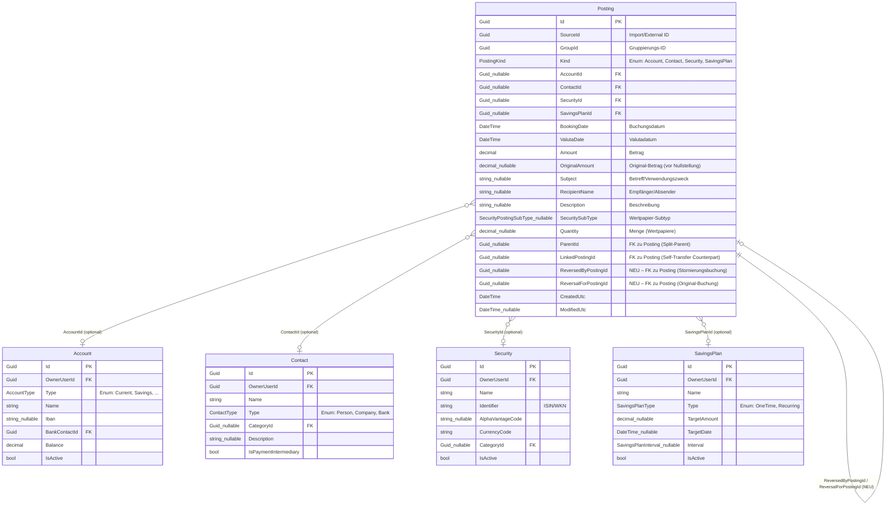

# Entity-Relationship-Modell: Posting-Stornierung (Reversal)

> **Feature:** FA-POST-001 – Posting-Stornierung (Reversal)  
> **Status:** 📋 Entwurf  
> **Version:** 1.0  
> **Datum:** 2025-01-27  
> **Querverweise:**
> - Anforderungsdokument: [`docs/requirements/FA-POST-001_Posting_Reversal.md`](../requirements/FA-POST-001_Posting_Reversal.md)
> - Architektur-Blueprint: [`docs/architecture/architecture-blueprint-posting-reversal.md`](./architecture-blueprint-posting-reversal.md)

---

## Inhaltsverzeichnis

1. [Überblick](#1-überblick)
2. [ERM-Diagramm](#2-erm-diagramm)
3. [Tabellarische Übersicht der Entitäten](#3-tabellarische-übersicht-der-entitäten)
4. [Beziehungsübersicht](#4-beziehungsübersicht)
5. [Modellierungsentscheidungen](#5-modellierungsentscheidungen)
6. [Abgleich mit dem Architektur-Blueprint](#6-abgleich-mit-dem-architektur-blueprint)
7. [DB-Migrations-Hinweise](#7-db-migrations-hinweise)

---

## 1. Überblick

### 1.1 Ziel des ERM

Dieses Dokument modelliert die Erweiterung der **Posting-Entität** um Stornierungsfunktionalität (Reversal). Es zeigt:

- **Bestehende Struktur** – Die vollständige Posting-Entität mit allen aktuellen Feldern
- **NEU: Reversal-Felder** – Zwei neue FK-Felder für bidirektionale Stornierungsbeziehungen
- **Self-Referencing Relationship** – 1:1-Beziehung zwischen Original-Posting und Stornierungsbuchung
- **Externe Beziehungen** – Verknüpfungen zu Account, Contact, Security, SavingsPlan

### 1.2 Betroffene Entitäten

| Entität | Typ | Rolle |
|---------|-----|-------|
| `Posting` | Bestehend + **NEU** | Zentrale Buchungsentität; erhält 2 neue FK-Felder für Stornierung |
| `Account` | Bestehend (lesend) | Bankkonto; Posting kann darauf referenzieren (FK: AccountId) |
| `Contact` | Bestehend (lesend) | Kontakt/Gegenseite; Posting kann darauf referenzieren (FK: ContactId) |
| `Security` | Bestehend (lesend) | Wertpapier; Posting kann darauf referenzieren (FK: SecurityId) |
| `SavingsPlan` | Bestehend (lesend) | Sparplan; Posting kann darauf referenzieren (FK: SavingsPlanId) |

### 1.3 Neue Datenbankfelder (DB-Schema)

**Tabelle:** `Postings`

| Spalte | Typ | Nullable | Beschreibung |
|--------|-----|----------|--------------|
| `ReversedByPostingId` | GUID | ✓ Ja | **NEU** – FK zu Postings.Id; zeigt auf Stornierungsbuchung |
| `ReversalForPostingId` | GUID | ✓ Ja | **NEU** – FK zu Postings.Id; zeigt auf Original-Buchung |

---

## 2. ERM-Diagramm

> **Legende:**  
> - Normale Attribute = bestehend  
> - `[NEU]`-Attribute = im Rahmen dieses Features hinzugefügt  
> - **Fettdruck** = Primärschlüssel oder wichtiges Schlüsselfeld



---

## 3. Tabellarische Übersicht der Entitäten

### 3.1 Posting (Zentrale Entität)

| Attribut | Typ | PK/FK | Nullable | Beschreibung | Status |
|----------|-----|-------|----------|--------------|--------|
| `Id` | Guid | PK | Nein | Primärschlüssel | Bestehend |
| `SourceId` | Guid | - | Nein | Import-/Externe ID | Bestehend |
| `GroupId` | Guid | - | Nein | Gruppierungs-ID | Bestehend |
| `Kind` | PostingKind | - | Nein | Ziel-Domain (Account/Contact/Security/SavingsPlan) | Bestehend |
| `AccountId` | Guid? | FK | Ja | Referenz zu Account | Bestehend |
| `ContactId` | Guid? | FK | Ja | Referenz zu Contact | Bestehend |
| `SecurityId` | Guid? | FK | Ja | Referenz zu Security | Bestehend |
| `SavingsPlanId` | Guid? | FK | Ja | Referenz zu SavingsPlan | Bestehend |
| `BookingDate` | DateTime | - | Nein | Buchungsdatum | Bestehend |
| `ValutaDate` | DateTime | - | Nein | Valutadatum | Bestehend |
| `Amount` | decimal | - | Nein | Betrag | Bestehend |
| `OriginalAmount` | decimal? | - | Ja | Original-Betrag (vor Nullstellung) | Bestehend |
| `Subject` | string? | - | Ja | Betreff/Verwendungszweck | Bestehend |
| `RecipientName` | string? | - | Ja | Empfänger/Absender-Name | Bestehend |
| `Description` | string? | - | Ja | Freitext-Beschreibung | Bestehend |
| `SecuritySubType` | SecurityPostingSubType? | - | Ja | Wertpapier-Subtyp (Kauf/Verkauf/Dividende/...) | Bestehend |
| `Quantity` | decimal? | - | Ja | Menge (Wertpapiere) | Bestehend |
| `ParentId` | Guid? | FK | Ja | Split-Parent-Posting | Bestehend |
| `LinkedPostingId` | Guid? | FK | Ja | Self-Transfer Counterpart | Bestehend |
| **`ReversedByPostingId`** | **Guid?** | **FK** | **Ja** | **NEU – Zeigt auf Stornierungsbuchung** | **NEU** |
| **`ReversalForPostingId`** | **Guid?** | **FK** | **Ja** | **NEU – Zeigt auf Original-Buchung** | **NEU** |
| `CreatedUtc` | DateTime | - | Nein | Erstellungszeitpunkt | Bestehend |
| `ModifiedUtc` | DateTime? | - | Ja | Änderungszeitpunkt | Bestehend |

### 3.2 Account (Externe Entität, lesend)

| Attribut | Typ | PK/FK | Nullable | Beschreibung |
|----------|-----|-------|----------|--------------|
| `Id` | Guid | PK | Nein | Primärschlüssel |
| `OwnerUserId` | Guid | FK | Nein | Besitzer (User) |
| `Type` | AccountType | - | Nein | Kontotyp (Current, Savings, ...) |
| `Name` | string | - | Nein | Kontoname |
| `Iban` | string? | - | Ja | IBAN |
| `BankContactId` | Guid | FK | Nein | Bank-Kontakt |
| `Balance` | decimal | - | Nein | Aktueller Saldo |
| `IsActive` | bool | - | Nein | Aktiv/Archiviert |

### 3.3 Contact (Externe Entität, lesend)

| Attribut | Typ | PK/FK | Nullable | Beschreibung |
|----------|-----|-------|----------|--------------|
| `Id` | Guid | PK | Nein | Primärschlüssel |
| `OwnerUserId` | Guid | FK | Nein | Besitzer (User) |
| `Name` | string | - | Nein | Kontaktname |
| `Type` | ContactType | - | Nein | Typ (Person, Company, Bank) |
| `CategoryId` | Guid? | FK | Ja | Kategorie |
| `Description` | string? | - | Ja | Beschreibung |
| `IsPaymentIntermediary` | bool | - | Nein | Zahlungsintermediär-Flag |

### 3.4 Security (Externe Entität, lesend)

| Attribut | Typ | PK/FK | Nullable | Beschreibung |
|----------|-----|-------|----------|--------------|
| `Id` | Guid | PK | Nein | Primärschlüssel |
| `OwnerUserId` | Guid | FK | Nein | Besitzer (User) |
| `Name` | string | - | Nein | Wertpapiername |
| `Identifier` | string | - | Nein | ISIN/WKN |
| `AlphaVantageCode` | string? | - | Ja | AlphaVantage-Symbol |
| `CurrencyCode` | string | - | Nein | Währung (ISO-Code) |
| `CategoryId` | Guid? | FK | Ja | Kategorie |
| `IsActive` | bool | - | Nein | Aktiv/Archiviert |

### 3.5 SavingsPlan (Externe Entität, lesend)

| Attribut | Typ | PK/FK | Nullable | Beschreibung |
|----------|-----|-------|----------|--------------|
| `Id` | Guid | PK | Nein | Primärschlüssel |
| `OwnerUserId` | Guid | FK | Nein | Besitzer (User) |
| `Name` | string | - | Nein | Sparplan-Name |
| `Type` | SavingsPlanType | - | Nein | Typ (OneTime, Recurring) |
| `TargetAmount` | decimal? | - | Ja | Zielbetrag |
| `TargetDate` | DateTime? | - | Ja | Zieldatum |
| `Interval` | SavingsPlanInterval? | - | Ja | Intervall (monatlich, ...) |
| `IsActive` | bool | - | Nein | Aktiv/Archiviert |

---

## 4. Beziehungsübersicht

### 4.1 Externe Beziehungen (bestehend)

| Von | Zu | Kardinalität | FK-Feld | Beschreibung |
|-----|----|--------------|---------|--------------|
| Posting | Account | N:0..1 | `AccountId` | Optional: Posting kann einem Konto zugeordnet sein |
| Posting | Contact | N:0..1 | `ContactId` | Optional: Posting kann einem Kontakt zugeordnet sein |
| Posting | Security | N:0..1 | `SecurityId` | Optional: Posting kann einem Wertpapier zugeordnet sein |
| Posting | SavingsPlan | N:0..1 | `SavingsPlanId` | Optional: Posting kann einem Sparplan zugeordnet sein |

### 4.2 Self-Referencing Beziehungen (bestehend)

| Beziehung | Kardinalität | FK-Feld | Beschreibung |
|-----------|--------------|---------|--------------|
| Split-Buchungen | N:0..1 | `ParentId` | Child-Posting referenziert Parent-Posting |
| Self-Transfer | N:0..1 | `LinkedPostingId` | Gegen-Buchung bei Eigenüberweisung |

### 4.3 **NEU: Reversal Beziehung (bidirektional 1:1)**

| Beziehung | Kardinalität | FK-Felder | Beschreibung |
|-----------|--------------|-----------|--------------|
| **Stornierung** | **1:0..1 (bidirektional)** | **`ReversedByPostingId`** ↔ **`ReversalForPostingId`** | Ein Original-Posting kann genau eine Stornierung haben; eine Stornierungsbuchung storniert genau ein Original |

**Wichtige Eigenschaften:**

- **Bidirektionalität:** Beide Felder verweisen aufeinander
  - Original-Posting: `ReversedByPostingId` → Stornierungsbuchung
  - Stornierungsbuchung: `ReversalForPostingId` → Original-Posting
  
- **1:1-Beziehung:** 
  - Ein Original kann maximal 1x storniert werden
  - Eine Stornierung storniert exakt 1 Original
  
- **Nullable:** 
  - Normale Buchungen haben beide Felder auf `NULL`
  - Nur stornierte/storonierende Buchungen setzen diese Felder

- **ON DELETE RESTRICT:**
  - Verhindert Löschen wenn Referenzen bestehen
  - Sicherstellung der referentiellen Integrität

---

## 5. Modellierungsentscheidungen

### 5.1 **Entscheidung: Self-Referencing 1:1 statt Status-Flag**

#### ❌ Alternative 1: Status-Enum (verworfen)
```csharp
public PostingStatus Status { get; set; } // Normal, Reversed, Reversal
```

**Nachteile:**
- Keine referentielle Integrität zwischen Original und Stornierung
- Komplexe Abfragen: Manuelles Matching über GroupId oder Datumslogik
- Fehlende Nachvollziehbarkeit: Welche Buchung storniert welche?
- Hohe Fehleranfälligkeit bei manuellen Verknüpfungen

#### ✅ Gewählte Lösung: Bidirektionale FK-Felder

**Vorteile:**
- **Referentielle Integrität:** DB erzwingt gültige Verknüpfungen
- **Nachvollziehbarkeit:** Direkte Navigation zwischen Original und Stornierung
- **Query-Effizienz:** Einfache JOINs über FK-Felder
- **EF Core Navigation Properties:** `posting.ReversedByPosting`, `posting.ReversalForPosting`

**Begründung:** Die explizite Modellierung als Beziehung ist robuster und wartbarer als implizite Logik über Status-Flags.

---

### 5.2 **Entscheidung: Zwei FK-Felder statt einer Tabelle**

#### ❌ Alternative 2: Separate Reversal-Tabelle (verworfen)
```sql
CREATE TABLE PostingReversals (
    OriginalPostingId GUID,
    ReversalPostingId GUID
);
```

**Nachteile:**
- Zusätzliche Join-Tabelle für jede Abfrage
- Overhead für einfache 1:1-Beziehung
- Komplexere EF Core Konfiguration

#### ✅ Gewählte Lösung: Direkte FK-Felder in Posting-Tabelle

**Vorteile:**
- **Performance:** Keine zusätzlichen JOINs nötig
- **Einfachheit:** Alles in einer Tabelle
- **Standard-Pattern:** 1:1-Beziehungen via Self-FK sind etabliert

**Begründung:** Für eine 1:1-Beziehung ist die direkte FK-Lösung effizienter und einfacher.

---

### 5.3 **Entscheidung: ON DELETE RESTRICT**

#### ✅ Gewählte Lösung: `DeleteBehavior.Restrict`

**Begründung:**
- Verhindert versehentliches Löschen von Buchungen mit Stornierungsreferenzen
- Erzwingt explizite Auflösung: Erst Stornierung löschen, dann Original
- Schutz vor Dateninkonsistenzen

**Alternative (verworfen):**
- `DeleteBehavior.SetNull`: Würde Referenzen auflösen → Nachvollziehbarkeit verloren
- `DeleteBehavior.Cascade`: Würde beide Buchungen löschen → unerwünscht

---

### 5.4 **Entscheidung: Check Constraint für Exklusivität**

#### ✅ Gewählte Lösung: Check Constraint

```sql
CHECK (NOT (ReversedByPostingId IS NOT NULL AND ReversalForPostingId IS NOT NULL))
```

**Begründung:**
- Eine Buchung kann nicht gleichzeitig Original und Stornierung sein
- Verhindert logische Inkonsistenzen
- DB-seitige Validierung (zusätzlich zu Anwendungslogik)

**Wichtig:** Wird in EF Core Migration manuell hinzugefügt (nicht automatisch generiert).

---

### 5.5 **Entscheidung: Indexierung der FK-Felder**

#### ✅ Gewählte Lösung: Indexes auf beide FK-Felder

```csharp
builder.HasIndex(p => p.ReversedByPostingId);
builder.HasIndex(p => p.ReversalForPostingId);
```

**Begründung:**
- **Query-Performance:** Schnelle Lookups für stornierte/storonierende Buchungen
- **Typische Abfragen:**
  - "Ist diese Buchung storniert?" → Index auf `ReversedByPostingId`
  - "Welches Original storniert diese Buchung?" → Index auf `ReversalForPostingId`

---

## 6. Abgleich mit dem Architektur-Blueprint

### 6.1 Konsistenz-Prüfung

| Architektur-Blueprint (Sektion 6) | ERM-Umsetzung | Status |
|-----------------------------------|---------------|--------|
| Zwei neue Felder: `ReversedByPostingId`, `ReversalForPostingId` | Beide Felder modelliert | ✅ Konsistent |
| Typ: `Guid?` (nullable) | Korrekt umgesetzt | ✅ Konsistent |
| FK zu `Postings.Id` | Self-Referencing FK | ✅ Konsistent |
| Bidirektionale Navigation Properties | Im ERM als 1:1-Beziehung dargestellt | ✅ Konsistent |
| ON DELETE RESTRICT | In Beziehungsübersicht dokumentiert | ✅ Konsistent |
| Indexes auf beide Felder | In Modellierungsentscheidung 5.5 | ✅ Konsistent |
| Check Constraint (Exklusivität) | In Modellierungsentscheidung 5.4 | ✅ Konsistent |

### 6.2 Offene Punkte aus Blueprint

| Frage aus Blueprint (Sektion 9) | ERM-Antwort |
|----------------------------------|-------------|
| StatementImport Creation | Nicht Teil des ERM (Service-Layer-Verantwortung) |
| UI Component Architecture | Nicht Teil des ERM (UI-Layer-Verantwortung) |
| Aggregate Update Scope | Nicht Teil des ERM (Service-Layer-Verantwortung) |

**Begründung:** Das ERM fokussiert sich auf die Datenmodellierung. Service- und UI-Logik sind nicht im Schema abgebildet.

---

## 7. DB-Migrations-Hinweise

### 7.1 Migration erstellen

```bash
dotnet ef migrations add AddPostingReversalFields \
  -p FinanceManager.Infrastructure \
  -s FinanceManager.Web \
  --context AppDbContext \
  --output-dir Data/Migrations
```

### 7.2 Erwartete Migration (SQL)

```sql
-- Add new columns
ALTER TABLE Postings ADD COLUMN ReversedByPostingId TEXT NULL;
ALTER TABLE Postings ADD COLUMN ReversalForPostingId TEXT NULL;

-- Add foreign key constraints
ALTER TABLE Postings ADD CONSTRAINT FK_Postings_Postings_ReversedByPostingId
    FOREIGN KEY (ReversedByPostingId) 
    REFERENCES Postings (Id) 
    ON DELETE RESTRICT;

ALTER TABLE Postings ADD CONSTRAINT FK_Postings_Postings_ReversalForPostingId
    FOREIGN KEY (ReversalForPostingId) 
    REFERENCES Postings (Id) 
    ON DELETE RESTRICT;

-- Add indexes for performance
CREATE INDEX IX_Postings_ReversedByPostingId ON Postings (ReversedByPostingId);
CREATE INDEX IX_Postings_ReversalForPostingId ON Postings (ReversalForPostingId);

-- MANUELL HINZUFÜGEN: Check constraint (EF Core generiert dies nicht automatisch)
-- Hinweis: SQLite unterstützt keine ALTER TABLE für Check Constraints
-- → Muss über Tabellen-Neuerstelling erfolgen (komplexe Migration)
```

### 7.3 **Wichtig: Check Constraint für SQLite**

SQLite unterstützt `ALTER TABLE ADD CONSTRAINT CHECK` nicht direkt. Erforderliche Schritte:

1. Neue Tabelle mit Check Constraint erstellen
2. Daten kopieren
3. Alte Tabelle löschen
4. Neue Tabelle umbenennen

**Empfehlung:** Check Constraint erst in späterem Release hinzufügen, nach Stabilisierung der Feature-Funktionalität.

### 7.4 Rollback-Strategie

```sql
-- Rollback (falls erforderlich)
DROP INDEX IX_Postings_ReversalForPostingId;
DROP INDEX IX_Postings_ReversedByPostingId;

ALTER TABLE Postings DROP CONSTRAINT FK_Postings_Postings_ReversalForPostingId;
ALTER TABLE Postings DROP CONSTRAINT FK_Postings_Postings_ReversedByPostingId;

ALTER TABLE Postings DROP COLUMN ReversalForPostingId;
ALTER TABLE Postings DROP COLUMN ReversedByPostingId;
```

---

## Änderungshistorie

| Version | Datum | Autor | Änderung |
|---------|-------|-------|----------|
| 1.0 | 2025-01-27 | ERM Agent | Initiales ERM basierend auf Architecture Blueprint v1.0 |

---

**Nächste Schritte:**

1. ✅ ERM dokumentiert und validiert
2. ⏭️ EF Core Migration erstellen (siehe Sektion 7.1)
3. ⏭️ Posting-Entity erweitern (Domain Layer)
4. ⏭️ PostingConfiguration aktualisieren (Infrastructure Layer)
5. ⏭️ Unit Tests für Datenmodell schreiben
