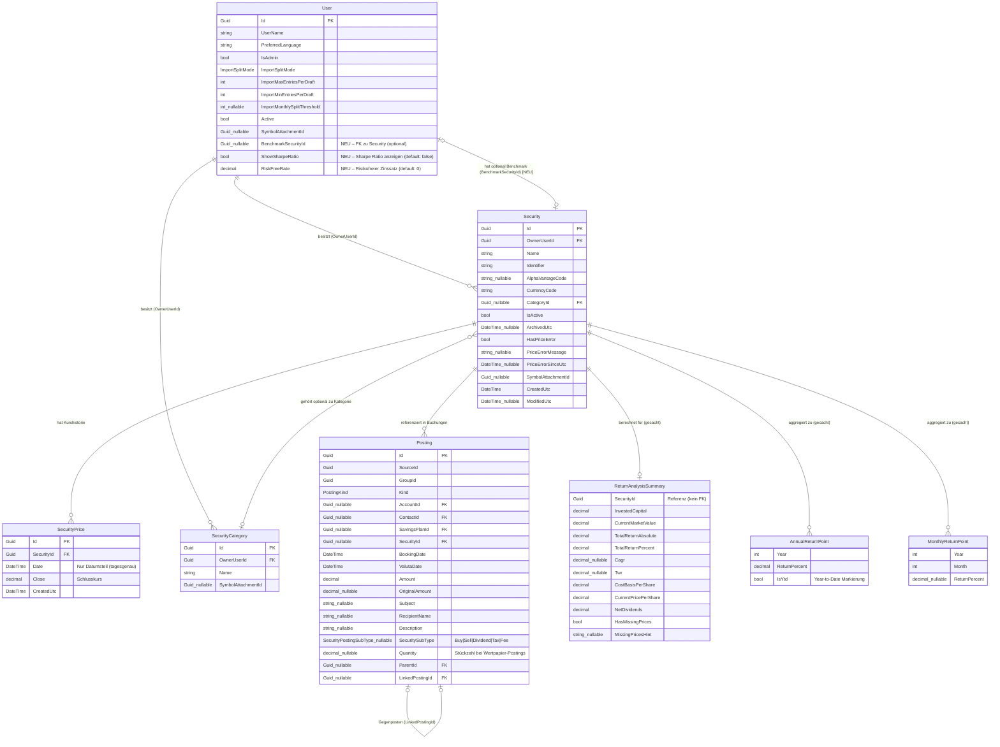

# Entity-Relationship-Modell: Renditeanalyse (FA-WERT-REN-001)

> **Feature:** FA-WERT-REN-001 – Renditeanalyse für Wertpapiere  
> **Status:** 📋 Entwurf  
> **Version:** 1.0  
> **Datum:** 2025-07-14  
> **Querverweise:**
> - Anforderungsdokument: [`docs/requirements/FA-WERT-REN-001_Renditeanalyse.md`](../requirements/FA-WERT-REN-001_Renditeanalyse.md)
> - Architektur-Blueprint: [`docs/architecture/architecture-blueprint-renditeanalyse.md`](./architecture-blueprint-renditeanalyse.md)

---

## Inhaltsverzeichnis

1. [Überblick](#1-überblick)
2. [ERM-Diagramm](#2-erm-diagramm)
3. [Tabellarische Übersicht der Entitäten](#3-tabellarische-übersicht-der-entitäten)
4. [Beziehungsübersicht](#4-beziehungsübersicht)
5. [Modellierungsentscheidungen](#5-modellierungsentscheidungen)
6. [Abgleich mit dem Architektur-Blueprint](#6-abgleich-mit-dem-architektur-blueprint)
7. [DB-Migrations-Hinweise](#7-db-migrations-hinweise)

---

## 1. Überblick

### 1.1 Ziel des ERM

Dieses Dokument modelliert alle persistierten Entitäten und deren Beziehungen, die für die **Renditeanalyse** relevant sind. Es unterscheidet explizit zwischen:

- **Bestehende Entitäten** – bereits im System vorhanden, werden nur gelesen oder minimal erweitert.
- **Neu / NEU** – im Rahmen von FA-WERT-REN-001 hinzuzufügende Felder oder Strukturen.
- **Nicht-persistierte DTOs** – rein berechnete Daten im Arbeitsspeicher (In-Memory Cache), kein DB-Schema.

### 1.2 Betroffene Entitäten

| Entität | Typ | Rolle |
|---------|-----|-------|
| `User` | Bestehend + **NEU** (Partial Class) | Speichert Renditeanalyse-Einstellungen pro Benutzer |
| `Security` | Bestehend | Wertpapier; Quelle für Name, Währung, Kategorie |
| `SecurityPrice` | Bestehend | Tägliche Schlusskurse; Basis für TWR, Volatilität, Chart |
| `SecurityCategory` | Bestehend | Kategorisierung von Wertpapieren (lesend) |
| `Posting` | Bestehend | Transaktionen (Kauf, Verkauf, Dividende, Steuer, Gebühr); Basis für IRR, FIFO, Cashflows |
| `ReturnAnalysisSummary` | **NEU (DTO, nicht persistiert)** | Gecachtes Ergebnis der Kennzahlenberechnung |
| `AnnualReturnPoint` | **NEU (DTO, nicht persistiert)** | Jahresrendite-Datenpunkt für Balkendiagramm |
| `MonthlyReturnPoint` | **NEU (DTO, nicht persistiert)** | Monatsrendite-Datenpunkt für Heatmap |

### 1.3 Neue Datenbankfelder (DB-Schema)

Einzige Schemaänderung: **3 neue Spalten** in der Tabelle `AspNetUsers` (User-Erweiterung via Partial Class).

---

## 2. ERM-Diagramm

> **Legende:**  
> Normale Attribute = bestehend  
> `[NEU]`-Attribute = im Rahmen dieses Features hinzugefügt  
> Gestrichelte Linien = konzeptuelle Beziehungen (keine FK im DB-Schema)



---

## 3. Tabellarische Übersicht der Entitäten

### 3.1 `User` (Tabelle: `AspNetUsers`)

| Attribut | Typ | Schlüssel / Pflicht | Beschreibung |
|----------|-----|---------------------|--------------|
| `Id` | `Guid` | PK, Pflicht | Primärschlüssel (ASP.NET Identity) |
| `UserName` | `string` | Pflicht | Benutzername |
| `PreferredLanguage` | `string?` | Optional | Bevorzugte UI-Sprache (z. B. `"de"`, `"en"`) |
| `IsAdmin` | `bool` | Pflicht, Default: `false` | Administratorrechte |
| `ImportSplitMode` | `ImportSplitMode` | Pflicht | Modus für Kontoauszugs-Import-Split |
| `ImportMaxEntriesPerDraft` | `int` | Pflicht, Default: `250` | Max. Einträge pro Importentwurf |
| `ImportMinEntriesPerDraft` | `int` | Pflicht, Default: `1` | Min. Einträge pro Importentwurf |
| `ImportMonthlySplitThreshold` | `int?` | Optional, Default: `250` | Schwellenwert für monatlichen Split |
| `Active` | `bool` | Pflicht, Default: `true` | Benutzerkonto aktiv / deaktiviert |
| `SymbolAttachmentId` | `Guid?` | Optional | Referenz auf ein Symbol-Attachment |
| `LastLoginUtc` | `DateTime` | Pflicht | Letzter erfolgreicher Login (UTC) |
| **`BenchmarkSecurityId`** | **`Guid?`** | **Optional, FK → Security** | **[NEU] Benchmark-Wertpapier für Vergleichsanalyse** |
| **`ShowSharpeRatio`** | **`bool`** | **Pflicht, Default: `false`** | **[NEU] Sharpe Ratio in UI anzeigen (opt-in)** |
| **`RiskFreeRate`** | **`decimal`** | **Pflicht, Default: `0`, ≥ 0** | **[NEU] Risikofreier Zinssatz für Sharpe Ratio (z. B. `0.04` = 4 %)** |

> **Neue Felder** werden in `User.ReturnAnalysis.cs` als Partial Class implementiert.  
> Validierung: `RiskFreeRate` muss `>= 0` sein (geprüft in `SetReturnAnalysisSettings()`).

---

### 3.2 `Security` (Tabelle: `Securities`)

| Attribut | Typ | Schlüssel / Pflicht | Beschreibung |
|----------|-----|---------------------|--------------|
| `Id` | `Guid` | PK, Pflicht | Primärschlüssel |
| `OwnerUserId` | `Guid` | FK → User, Pflicht | Besitzer des Wertpapiers |
| `Name` | `string` | Pflicht | Anzeigename (z. B. „Apple Inc.") |
| `Identifier` | `string` | Pflicht | WKN oder ISIN |
| `AlphaVantageCode` | `string?` | Optional | Symbol für AlphaVantage-Kursabruf |
| `CurrencyCode` | `string` | Pflicht | ISO-Währungscode (z. B. `"EUR"`, `"USD"`) |
| `CategoryId` | `Guid?` | Optional, FK → SecurityCategory | Kategorie des Wertpapiers |
| `IsActive` | `bool` | Pflicht, Default: `true` | Wertpapier aktiv / archiviert |
| `ArchivedUtc` | `DateTime?` | Optional | Archivierungszeitpunkt (UTC) |
| `HasPriceError` | `bool` | Pflicht, Default: `false` | Fehlerindikator für Kursabruf |
| `PriceErrorMessage` | `string?` | Optional | Beschreibung des Kurfehlers |
| `PriceErrorSinceUtc` | `DateTime?` | Optional | Beginn des Kursfehler-Zustands (UTC) |
| `SymbolAttachmentId` | `Guid?` | Optional | Referenz auf Symbol-Grafik |
| `CreatedUtc` | `DateTime` | Pflicht | Erstellungszeitpunkt (UTC) |
| `ModifiedUtc` | `DateTime?` | Optional | Letzte Änderung (UTC) |
| `Description` | `string?` | Optional | Optionale Beschreibung |

> **Renditeanalyse-Nutzung:** Wird zur Identifikation des Wertpapiers, zur Währungsbestimmung und als Quelle für Name und Kategorie verwendet. **Kein neues Feld in dieser Entität.**  
> `Security` wird zusätzlich als **Benchmark-Wertpapier** referenziert (`User.BenchmarkSecurityId`).

---

### 3.3 `SecurityPrice` (Tabelle: `SecurityPrices`)

| Attribut | Typ | Schlüssel / Pflicht | Beschreibung |
|----------|-----|---------------------|--------------|
| `Id` | `Guid` | PK, Pflicht | Primärschlüssel |
| `SecurityId` | `Guid` | FK → Security, Pflicht | Zugehöriges Wertpapier |
| `Date` | `DateTime` | Pflicht (Datumsteil) | Kursdatum (Zeit wird ignoriert, nur Datum) |
| `Close` | `decimal` | Pflicht | Tagesschlusskurs |
| `CreatedUtc` | `DateTime` | Pflicht | Erstellungszeitpunkt des Kurseintrags (UTC) |

> **Renditeanalyse-Nutzung:** Kernbasis für TWR, Volatilität, Max. Drawdown, Performance-Chart, Benchmark-Vergleich und Sparkline.  
> **Empfohlener neuer Index:** `(SecurityId, Date)` – verbessert alle Kurshistorie-Queries erheblich (→ Abschnitt 7).

---

### 3.4 `SecurityCategory` (Tabelle: `SecurityCategories`)

| Attribut | Typ | Schlüssel / Pflicht | Beschreibung |
|----------|-----|---------------------|--------------|
| `Id` | `Guid` | PK, Pflicht | Primärschlüssel |
| `OwnerUserId` | `Guid` | FK → User, Pflicht | Besitzer der Kategorie |
| `Name` | `string` | Pflicht | Kategoriename |
| `SymbolAttachmentId` | `Guid?` | Optional | Symbol-Grafik der Kategorie |

> **Renditeanalyse-Nutzung:** Wird nur lesend verwendet (z. B. Filterung oder Anzeige der Wertpapierkategorie auf der Detailseite). **Keine Schemaänderung.**

---

### 3.5 `Posting` (Tabelle: `Postings`)

| Attribut | Typ | Schlüssel / Pflicht | Beschreibung |
|----------|-----|---------------------|--------------|
| `Id` | `Guid` | PK, Pflicht | Primärschlüssel |
| `SourceId` | `Guid` | Pflicht | Externe Quell-ID (Import-ID) |
| `GroupId` | `Guid` | Pflicht | Gruppen-ID für zusammengehörige Buchungen |
| `Kind` | `PostingKind` | Pflicht | Buchungsart (Account, Security, SavingsPlan …) |
| `AccountId` | `Guid?` | Optional, FK → Account | Referenziertes Konto |
| `ContactId` | `Guid?` | Optional, FK → Contact | Referenzierter Kontakt |
| `SavingsPlanId` | `Guid?` | Optional, FK → SavingsPlan | Referenzierter Sparplan |
| `SecurityId` | `Guid?` | Optional, FK → Security | **Wertpapier-Buchung (zentral für Renditeanalyse)** |
| `BookingDate` | `DateTime` | Pflicht | Buchungsdatum |
| `ValutaDate` | `DateTime` | Pflicht | Wertstellungsdatum |
| `Amount` | `decimal` | Pflicht | Buchungsbetrag (negativ = Aufwand, positiv = Ertrag) |
| `OriginalAmount` | `decimal?` | Optional | Ursprungsbetrag vor Nullstellung |
| `Subject` | `string?` | Optional | Buchungsbetreff |
| `RecipientName` | `string?` | Optional | Empfängername |
| `Description` | `string?` | Optional | Freitextbeschreibung |
| `SecuritySubType` | `SecurityPostingSubType?` | Optional | **Buchungsuntertyp:** `Buy`, `Sell`, `Dividend`, `Tax`, `Fee` |
| `Quantity` | `decimal?` | Optional | **Stückzahl bei Wertpapier-Buchungen (für FIFO)** |
| `ParentId` | `Guid?` | Optional, FK → Posting | Übergeordnete Buchung (Splittbuchung) |
| `LinkedPostingId` | `Guid?` | Optional, FK → Posting | Gegenposten (Umbuchung) |

> **Renditeanalyse-Nutzung:**
> - `SecuritySubType = Buy / Sell` → FIFO-Kostenbasismethode, Invested Capital, Realized Gains
> - `SecuritySubType = Dividend` → Dividendenrendite, Nettorendite, Cashflow-Timeline
> - `SecuritySubType = Tax` → Steuerquote, Nettorendite
> - `SecuritySubType = Fee` → Gebührenauswertung
> - `Amount + Quantity` → IRR (Cashflows), CAGR
>
> **Empfohlener neuer Index:** `(SecurityId, BookingDate)` → optimiert alle Security-Posting-Queries (→ Abschnitt 7).

---

### 3.6 `ReturnAnalysisSummary` *(DTO, nicht persistiert)* — **[NEU]**

| Attribut | Typ | Beschreibung |
|----------|-----|--------------|
| `SecurityId` | `Guid` | Referenz auf das berechnete Wertpapier |
| `InvestedCapital` | `decimal` | Investiertes Kapital (Summe Kaufbeträge – Verkaufserlöse) |
| `CurrentMarketValue` | `decimal` | Aktueller Marktwert (Bestand × aktueller Kurs) |
| `TotalReturnAbsolute` | `decimal` | Absoluter Gesamtertrag (Kursgewinn + Dividenden – Steuern) |
| `TotalReturnPercent` | `decimal` | Prozentualer Gesamtreturn |
| `Cagr` | `decimal?` | Ø jährliche Wachstumsrate (null bei < 1 Jahrestag) |
| `Twr` | `decimal?` | Zeitgewichtete Rendite nach Modified Dietz (null bei fehlenden Kursen) |
| `CostBasisPerShare` | `decimal` | FIFO-Einstandskurs je Aktie |
| `CurrentPricePerShare` | `decimal` | Aktueller Schlusskurs je Aktie |
| `NetDividends` | `decimal` | Dividenden netto (nach Steuern) |
| `HasMissingPrices` | `bool` | Hinweis auf Kurslücken |
| `MissingPricesHint` | `string?` | Hinweistext bei fehlenden Kursen |
| `SparklineData` | `IReadOnlyList<SparklinePoint>` | Datenpunkte für Mini-Chart (FR-1.1) |

> Cache-Key: `"ra:summary:{securityId}:{userId}"`, TTL: 1 Stunde.

---

### 3.7 `AnnualReturnPoint` *(DTO, nicht persistiert)* — **[NEU]**

| Attribut | Typ | Beschreibung |
|----------|-----|--------------|
| `Year` | `int` | Kalenderjahr |
| `ReturnPercent` | `decimal` | Rendite in % für das Jahr |
| `IsYtd` | `bool` | `true` wenn aktuelles Jahr (Year-to-Date) |

> Aggregiert aus `SecurityPrice` und `Posting` für den Tab „Zeitliche Entwicklung" (FR-2.2).

---

### 3.8 `MonthlyReturnPoint` *(DTO, nicht persistiert)* — **[NEU]**

| Attribut | Typ | Beschreibung |
|----------|-----|--------------|
| `Year` | `int` | Kalenderjahr |
| `Month` | `int` | Kalendermonat (1–12) |
| `ReturnPercent` | `decimal?` | Monatsrendite in % (`null` bei fehlenden Kursdaten) |

> Aggregiert aus `SecurityPrice` für die Monats-Heatmap (FR-2.2).

---

## 4. Beziehungsübersicht

| # | Von | Zu | Kardinalität | Beziehungstyp | Beschreibung |
|---|-----|----|--------------|---------------|--------------|
| R-1 | `User` | `Security` | 1 : N | besitzt | Ein Benutzer besitzt beliebig viele Wertpapiere (`Security.OwnerUserId`) |
| R-2 | `User` | `SecurityCategory` | 1 : N | besitzt | Ein Benutzer besitzt beliebig viele Kategorien (`SecurityCategory.OwnerUserId`) |
| **R-3** | **`User`** | **`Security`** | **0..1 : 0..1** | **Benchmark [NEU]** | **Ein Benutzer kann optional ein Benchmark-Wertpapier referenzieren (`User.BenchmarkSecurityId`)** |
| R-4 | `Security` | `SecurityPrice` | 1 : N | hat Kurshistorie | Ein Wertpapier hat beliebig viele tägliche Kurseinträge |
| R-5 | `Security` | `SecurityCategory` | N : 0..1 | kategorisiert in | Ein Wertpapier gehört optional zu einer Kategorie (`Security.CategoryId`) |
| R-6 | `Security` | `Posting` | 1 : N | referenziert in | Wertpapier-Buchungen referenzieren das Wertpapier (`Posting.SecurityId`) |
| R-7 | `Posting` | `Posting` | 0..1 : N | Eltern-Kind | Splittbuchungen referenzieren eine übergeordnete Buchung (`Posting.ParentId`) |
| R-8 | `Posting` | `Posting` | 0..1 : 0..1 | Gegenposten | Umbuchungen verweisen auf die Gegenbuchung (`Posting.LinkedPostingId`) |
| R-9 | `Security` | `ReturnAnalysisSummary` | 1 : 0..1 | berechnet für | Cache-Eintrag (kein FK, in-memory) |
| R-10 | `Security` | `AnnualReturnPoint` | 1 : N | aggregiert zu | Liste jährlicher Renditen (kein FK, in-memory) |
| R-11 | `Security` | `MonthlyReturnPoint` | 1 : N | aggregiert zu | Liste monatlicher Renditen (kein FK, in-memory) |

### 4.1 Besonderheit: Benchmark-Beziehung (R-3)

Die Beziehung `User.BenchmarkSecurityId → Security.Id` hat folgende Eigenschaften:

- **Optional:** `BenchmarkSecurityId` ist nullable; kein Benchmark = Tab ausgeblendet.
- **Kein Cascade Delete:** Wird das Benchmark-Wertpapier gelöscht / archiviert, wird `BenchmarkSecurityId` auf `null` gesetzt (Application-Layer-Logik, kein DB-Constraint).
- **Cross-Owner:** Der User kann prinzipiell jedes seiner eigenen Wertpapiere als Benchmark wählen. Ownership-Prüfung erfolgt beim Setzen.
- **Kein separater FK-Constraint** empfohlen (nullable + Self-Reference innerhalb User-Scope ausreichend).

---

## 5. Modellierungsentscheidungen

### 5.1 Keine neue Tabelle für Rendite-Ergebnisse

**Entscheidung:** Berechnete Renditekennzahlen werden **nicht persistiert**; sie werden bei Bedarf berechnet und im **In-Memory Cache** (`IMemoryCache`) für 1 Stunde gecacht.

**Begründung:**

| Aspekt | Erklärung |
|--------|-----------|
| **Aktualität** | Kennzahlen ändern sich täglich (neue Kurse) und bei jeder Transaktion. Eine DB-Tabelle müsste sofort invalidiert werden → unnötige Komplexität. |
| **Berechnung ist günstig** | Mit den empfohlenen Indizes dauert die Berechnung für ein typisches Wertpapier < 100 ms; kein Grund zur dauerhaften Persistenz. |
| **Kein Auditing-Bedarf** | Historische Rendite-Snapshots sind Out of Scope (Phase 1). |
| **Einfachheit** | In-Memory Cache (TTL 1h) + Invalidierung bei neuer Transaktion oder neuem Kurs ist das einfachste korrekte Muster für eine Blazor-Server-Single-Instance-App. |
| **Erweiterbarkeit** | Die Cache-Abstraktion (`IReturnAnalysisCache`) erlaubt späteren Wechsel zu `IDistributedCache` ohne Schemaänderung. |

### 5.2 User-Erweiterung als Partial Class statt neuer Tabelle

**Entscheidung:** Die drei neuen Benutzerfelder (`BenchmarkSecurityId`, `ShowSharpeRatio`, `RiskFreeRate`) werden in der bestehenden `AspNetUsers`-Tabelle als neue Spalten gespeichert – implementiert via `User.ReturnAnalysis.cs` (Partial Class).

**Begründung:**

| Aspekt | Erklärung |
|--------|-----------|
| **Einfachheit** | 3 Felder rechtfertigen keine eigene Tabelle (`UserReturnAnalysisSettings`). Eine 1:1-Satellitentabelle wäre Overengineering. |
| **Konsistenz** | Andere User-Einstellungen (Import, Sprache, Zeitzone) sind ebenfalls direkt auf `User` (Partial Classes). Gleiche Konvention für neue Felder. |
| **Keine Joins** | Einstellungen sind immer zusammen mit dem User geladen → kein zusätzlicher JOIN nötig. |
| **Partial Class** | Hält die `User.cs`-Datei überschaubar; neue Felder sind fachlich klar abgegrenzt in `User.ReturnAnalysis.cs`. |

### 5.3 FIFO ohne eigene Tabelle

**Entscheidung:** Die FIFO-Kostenbasis wird **nicht** als separate Tabelle (`FifoLot`) persistiert, sondern bei jeder Berechnung aus `Posting`-Daten rekonstruiert.

**Begründung:**

| Aspekt | Erklärung |
|--------|-----------|
| **Determinismus** | FIFO ist deterministisch: Gleiche Postings → gleiche Lots. Keine Notwendigkeit zur Persistenz. |
| **Einfachheit** | Keine Migration, keine Synchronisation zwischen Postings und Lots. |
| **Performance** | Typische Wertpapier-Portfolios haben < 500 Postings; FIFO-Berechnung < 10 ms. |
| **Erweiterbarkeit** | Methodenwechsel (z. B. LIFO, Durchschnittskostenmethode) wäre bei persistierten Lots aufwendiger. |

### 5.4 Keine Währungsumrechnung im Datenmodell

**Entscheidung:** Die Renditeanalyse arbeitet in der **nativen Währung** des Wertpapiers (`Security.CurrencyCode`). Kein neues Währungs-FK oder Konversionstabelle.

**Begründung:** Out of Scope für Phase 1 (laut Anforderungsdokument Abschnitt 6 und Architektur-Blueprint 1.3).

### 5.5 Empfohlene Indizes statt ERM-Änderung

Die empfohlenen DB-Indizes auf `SecurityPrices(SecurityId, Date)` und `Postings(SecurityId, BookingDate)` ändern das **logische Datenmodell nicht** – sie sind rein physische Optimierungen und werden daher im ERM nur als Hinweis, nicht als separate Entitäten dargestellt.

---

## 6. Abgleich mit dem Architektur-Blueprint

| Blueprint-Vorgabe | ERM-Umsetzung | Konsistenz |
|-------------------|---------------|------------|
| `User.ReturnAnalysis.cs` mit `BenchmarkSecurityId`, `ShowSharpeRatio`, `RiskFreeRate` | Modelliert in Abschnitt 3.1 als neue Felder auf `User` | ✅ Konsistent |
| Keine neuen Domain-Entitäten | Alle Berechnungsergebnisse als DTOs (nicht persistiert) | ✅ Konsistent |
| Cache-Entitäten: `ReturnAnalysisSummary`, `AnnualReturnPoint`, `MonthlyReturnPoint` als DTOs | Modelliert in Abschnitten 3.6–3.8 als nicht-persistierte DTOs | ✅ Konsistent |
| Index auf `SecurityPrices(SecurityId, Date)` | Als Migrations-Hinweis in Abschnitt 7 dokumentiert | ✅ Konsistent |
| Index auf `Postings(SecurityId, BookingDate)` | Als Migrations-Hinweis in Abschnitt 7 dokumentiert | ✅ Konsistent |
| Ownership-Check (`ownerUserId`) bei allen Queries | User-FK auf Security, Posting, Category sicherstellt Datenisolation | ✅ Konsistent |
| `SecurityPostingSubType`: `Buy`, `Sell`, `Dividend`, `Tax`, `Fee` | Bestehend auf `Posting.SecuritySubType`, vollständig für Renditeanalyse nutzbar | ✅ Konsistent |
| Benchmark ist optional (Tab ausgeblendet wenn kein Benchmark) | `User.BenchmarkSecurityId` ist nullable | ✅ Konsistent |
| Sharpe Ratio opt-in, RiskFreeRate ≥ 0 | `ShowSharpeRatio` (bool, default false), `RiskFreeRate` (decimal, default 0, Validierung in Domain) | ✅ Konsistent |
| `IReturnAnalysisCache` mit TTL 1h und Invalidierung | Cache-Keys dokumentiert in Abschnitt 3.6, kein DB-Schema | ✅ Konsistent |

### 6.1 Offene Punkte / Abweichungen

| Punkt | Status | Anmerkung |
|-------|--------|-----------|
| `Posting.OwnerUserId` fehlt als direktes Feld | 🔍 Zu prüfen | Ownership wird implizit über `Account.OwnerUserId` oder `Security.OwnerUserId` geprüft. Architektur-Blueprint verweist auf bestehenden Ownership-Check-Mechanismus. |
| Benchmark-Wertpapier muss dem User gehören | ✅ Klar | Validation in `SetReturnAnalysisSettings()` – Ownership-Check im Application-Layer, nicht DB-Constraint. |
| Forward-Fill bei fehlenden Kursen | ✅ Klar | Reine Berechnungslogik in `ReturnAnalysisService`, kein Schema-Impact. |
| Dividend-Ex-Datum (FR: Dividenden am Ex-Tag) | ✅ Klar | Annahme A-3: `Posting.BookingDate` = Ex-Datum. Kein neues Feld. |

---

## 7. DB-Migrations-Hinweise

### Migration 1: User-Erweiterung für Renditeanalyse-Einstellungen

**Name:** `AddReturnAnalysisSettingsToUser`  
**Tabelle:** `AspNetUsers`  
**Typ:** Neue Spalten (backward-compatible, alle nullable oder mit Default)

```sql
-- EF Core Migration (Pseudo-SQL)
ALTER TABLE AspNetUsers ADD COLUMN BenchmarkSecurityId TEXT NULL;          -- Guid, nullable FK zu Securities.Id
ALTER TABLE AspNetUsers ADD COLUMN ShowSharpeRatio     INTEGER NOT NULL DEFAULT 0;  -- bool, SQLite: 0=false
ALTER TABLE AspNetUsers ADD COLUMN RiskFreeRate        TEXT    NOT NULL DEFAULT '0'; -- decimal, SQLite: TEXT
```

**EF Core Migration-Code (C#-Schablone):**

```csharp
protected override void Up(MigrationBuilder migrationBuilder)
{
    migrationBuilder.AddColumn<Guid?>(
        name: "BenchmarkSecurityId",
        table: "AspNetUsers",
        type: "TEXT",
        nullable: true);

    migrationBuilder.AddColumn<bool>(
        name: "ShowSharpeRatio",
        table: "AspNetUsers",
        type: "INTEGER",
        nullable: false,
        defaultValue: false);

    migrationBuilder.AddColumn<decimal>(
        name: "RiskFreeRate",
        table: "AspNetUsers",
        type: "TEXT",
        nullable: false,
        defaultValue: 0m);
}

protected override void Down(MigrationBuilder migrationBuilder)
{
    migrationBuilder.DropColumn(name: "BenchmarkSecurityId", table: "AspNetUsers");
    migrationBuilder.DropColumn(name: "ShowSharpeRatio",     table: "AspNetUsers");
    migrationBuilder.DropColumn(name: "RiskFreeRate",        table: "AspNetUsers");
}
```

> ⚠️ **Kein FK-Constraint** für `BenchmarkSecurityId` in der Migration – nullable Referenz, Ownership-Prüfung im Application-Layer. Verhindert Cascade-Delete-Probleme.

---

### Migration 2: Performance-Indizes (empfohlen)

**Name:** `AddReturnAnalysisPerformanceIndexes`  
**Typ:** Neue Indizes, kein Schema-Breaking-Change

```csharp
protected override void Up(MigrationBuilder migrationBuilder)
{
    // Index 1: SecurityPrice-Kurshistorie-Abfragen (TWR, Chart, Volatilität)
    migrationBuilder.CreateIndex(
        name: "IX_SecurityPrices_SecurityId_Date",
        table: "SecurityPrices",
        columns: new[] { "SecurityId", "Date" });

    // Index 2: Posting-Wertpapier-Abfragen (FIFO, IRR, Cashflow-Timeline)
    migrationBuilder.CreateIndex(
        name: "IX_Postings_SecurityId_BookingDate",
        table: "Postings",
        columns: new[] { "SecurityId", "BookingDate" });
}

protected override void Down(MigrationBuilder migrationBuilder)
{
    migrationBuilder.DropIndex(name: "IX_SecurityPrices_SecurityId_Date", table: "SecurityPrices");
    migrationBuilder.DropIndex(name: "IX_Postings_SecurityId_BookingDate", table: "Postings");
}
```

> **Empfehlung:** Indizes in einer separaten Migration (`AddReturnAnalysisPerformanceIndexes`) anlegen, damit sie unabhängig von der Schema-Migration ausgeführt und bei Bedarf zurückgerollt werden können.  
> Zu prüfen: Falls diese Indizes bereits existieren (z. B. durch frühere Migrations), darf die Migration nicht erneut ausgeführt werden.

---

### Übersicht: Alle Migrations-Änderungen

| Migration | Tabelle | Änderung | Breaking? |
|-----------|---------|----------|-----------|
| `AddReturnAnalysisSettingsToUser` | `AspNetUsers` | +`BenchmarkSecurityId` (nullable) | ❌ Nein |
| `AddReturnAnalysisSettingsToUser` | `AspNetUsers` | +`ShowSharpeRatio` (bool, default false) | ❌ Nein |
| `AddReturnAnalysisSettingsToUser` | `AspNetUsers` | +`RiskFreeRate` (decimal, default 0) | ❌ Nein |
| `AddReturnAnalysisPerformanceIndexes` | `SecurityPrices` | +Index `(SecurityId, Date)` | ❌ Nein |
| `AddReturnAnalysisPerformanceIndexes` | `Postings` | +Index `(SecurityId, BookingDate)` | ❌ Nein |

**Keine Entfernung** bestehender Spalten oder Tabellen. Alle Änderungen sind rückwärtskompatibel.

---

*Erstellt durch den ERM-Agenten auf Basis von Anforderungsdokument FA-WERT-REN-001 und Architektur-Blueprint Renditeanalyse.*  
*Zuletzt aktualisiert: 2025-07-14*
