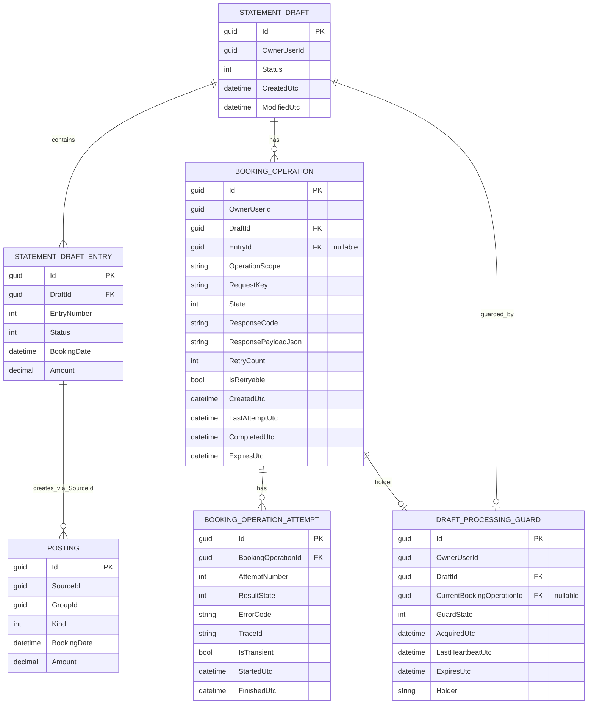

# Entity-Relationship Model (ERM) – Transaction-Safe Statement Booking

> **Feature:** Transaktionssichere Buchung von StatementDrafts mit Doppelbuchungsschutz  
> **Status:** ✅ Implementation-ready  
> **Version:** 0.2  
> **Datum:** 2026-06-06  
> **Basis:**  
> - `Docs/requirements/statement-booking-transaction-safety-requirements.md`  
> - `Docs/architecture/architecture-blueprint-statement-booking-transaction-safety.md`

---

## 1) ER-Diagramm (Mermaid)

---

## 2) Entitäten, Schlüssel, Constraints, Indizes

| Entität | Status | Schlüssel/FKs | Unique/Check Constraints | Relevante Indizes |
|---|---|---|---|---|
| `StatementDraft` | Bestehend | PK `Id` | fachlich: Status nur `Draft/Committed/Expired` | `IX_StatementDraft_OwnerUserId` (bestehend) |
| `StatementDraftEntry` | Bestehend | PK `Id`; FK `DraftId -> StatementDraft.Id` | bestehende Entry-Invarianten | `IX_StatementDraftEntry_DraftId` (bestehend) |
| `Posting` | Bestehend | PK `Id`; fachliche Referenz `SourceId -> StatementDraftEntry.Id` | keine harte FK erzwungen, da bestehende Posting-Logik | `IX_Posting_SourceId` (**verbindlich**) |
| `BookingOperation` | **Neu** | PK `Id`; FK `DraftId -> StatementDraft.Id`; optional FK `EntryId -> StatementDraftEntry.Id` | `UX_BookingOperation_Owner_Draft_Scope_Entry_RequestKey`; `CK_BookingOperation_ScopeEntryConsistency` | `IX_BookingOperation_State_ExpiresUtc`; `IX_BookingOperation_DraftId` |
| `BookingOperationAttempt` | **Neu** | PK `Id`; FK `BookingOperationId -> BookingOperation.Id` | `UX_BookingOperationAttempt_Operation_AttemptNumber` | `IX_BookingOperationAttempt_StartedUtc` |
| `DraftProcessingGuard` | **Neu** | PK `Id`; FK `DraftId -> StatementDraft.Id`; optional FK `CurrentBookingOperationId -> BookingOperation.Id` | `UX_DraftProcessingGuard_Owner_Draft` | `IX_DraftProcessingGuard_ExpiresUtc`; `IX_DraftProcessingGuard_CurrentBookingOperationId` |

### 2.1 Zusätzliche harte Duplikatschutz-Constraints
- **Für Idempotenz pro Request:**  
  `UX_BookingOperation_Owner_Draft_Scope_Entry_RequestKey`
- **Für maximal einen erfolgreichen Abschluss pro Scope:**  
  gefilterter Unique Index auf `BookingOperation(OwnerUserId, DraftId, OperationScope, EntryId)` mit Filter `State = Succeeded`.

---

## 3) Zustandsmodelle (Idempotenz & Locking)

### 3.1 `BookingOperation.State`
| State | Bedeutung | Übergänge |
|---|---|---|
| `InProgress` | Request angenommen, Verarbeitung läuft | `Succeeded`, `FailedTransient`, `FailedPermanent` |
| `Succeeded` | Fachliche Buchung commitet | terminal |
| `FailedTransient` | Rollback erfolgt, Retry erlaubt | `InProgress` (Retry mit gleichem RequestKey) |
| `FailedPermanent` | Rollback erfolgt, kein Auto-Retry | terminal |

### 3.2 `DraftProcessingGuard.GuardState`
| State | Bedeutung | Übergänge |
|---|---|---|
| `Active` | Exklusiver Draft-Lock ist gehalten | `Released`, `Expired` |
| `Released` | Verarbeitung beendet, Guard freigegeben | terminal/cleanup |
| `Expired` | Lease abgelaufen, Übernahme erlaubt | `Active` (takeover) |

---

## 4) Beziehungen zu bestehenden StatementDraft/Entry/Posting-Daten

1. `StatementDraft (1) -> (n) StatementDraftEntry` bleibt unverändert.
2. `StatementDraftEntry (1) -> (0..n) Posting` bleibt fachlich über `Posting.SourceId` gekoppelt.
3. `StatementDraft (1) -> (0..n) BookingOperation` ergänzt die dauerhafte Nachverfolgbarkeit aller Buchungsversuche.
4. `StatementDraft (1) -> (0..1 aktive) DraftProcessingGuard` erzwingt Single-Flight pro Draft.
5. `BookingOperation (1) -> (0..n) BookingOperationAttempt` bildet Retry-/Fehlerhistorie ab.

---

## 5) Regeln zur Verhinderung von Duplikatbuchungen

1. **Lock vor Fachlogik:** Ohne erfolgreichen Guard-Acquire keine Posting-Erzeugung.
2. **Idempotency-Key erzwingt Eindeutigkeit:** Bereits vorhandene `(OwnerUserId, DraftId, Scope, EntryId, RequestKey)`-Kombination wird nie als neue Fachoperation verarbeitet.
3. **Replay statt Neubuchung:** Bei `State = Succeeded` wird gespeichertes Ergebnis zurückgegeben; es werden keine zusätzlichen `Posting` geschrieben.
4. **Konflikt bei laufender Verarbeitung:** `InProgress` + aktive Guard führt deterministisch zu `409 BOOKING_IN_PROGRESS`.
5. **Retry nur kontrolliert:** Nur `FailedTransient` darf mit identischem RequestKey erneut in `InProgress` überführt werden.
6. **Maximal ein Erfolg pro Scope:** gefilterter Unique Index auf `Succeeded` verhindert zweiten erfolgreichen Abschluss für denselben Draft/Entry-Scope.

---

## 6) Konsistenz- und Invariantenhinweise

- Alle Mutationen an `StatementDraft`, `StatementDraftEntry`, `Posting`, `BookingOperation`, `DraftProcessingGuard` laufen in **einer** DB-Transaktion (Serializable) pro Buchungsoperation.
- `StatementDraft.Status` darf im Buchungspfad nur `Draft -> Committed` wechseln; bei Fehler bleibt `Draft`.
- Bei Rollback dürfen keine neuen `Posting` bestehen bleiben (keine Teilpersistenz).
- Pro `(OwnerUserId, DraftId)` existiert höchstens eine aktive Guard-Zeile.
- `EntryId` ist nur bei `OperationScope = Entry` gesetzt; bei `OperationScope = Draft` ist `EntryId = NULL`.
- Jeder erfolgreiche Replay liefert dasselbe Ergebnisobjekt (`ResponseCode`/`ResponsePayloadJson`) wie der Erstaufruf.

---

## 7) Traceability zu FR/NFR

| Requirement | ERM-Elemente |
|---|---|
| FR-1 / NFR-1 (atomare Transaktion, Rollback ohne Teilpersistenz) | `BookingOperation.State`, `CompletedUtc`, Transaktionsinvariante über alle beteiligten Entitäten |
| FR-1.1 (Statusübergang nur Draft->Committed) | `StatementDraft.Status` + Invariante in Abschnitt 6 |
| FR-2 / FR-2.1 / NFR-3 (Idempotenz, keine Doppelbuchung) | `UX_BookingOperation_Owner_Draft_Scope_Entry_RequestKey`, Replay-Daten in `BookingOperation` |
| FR-3 / NFR-2 (Parallelitätsschutz) | `DraftProcessingGuard`, `UX_DraftProcessingGuard_Owner_Draft`, Lease-Felder (`ExpiresUtc`) |
| FR-4 / NFR-6 (Retry-Sicherheit) | `BookingOperation.State`, `IsRetryable`, `BookingOperationAttempt.IsTransient` |
| FR-5 / NFR-4 (deterministischer Fehlervertrag) | `ResponseCode`, `ResponsePayloadJson`, `TraceId` in Attempts |
| NFR-5 (Latenz unter Schutzmechanismen) | gezielte Indizes (`IX_DraftProcessingGuard_ExpiresUtc`, `IX_BookingOperation_State_ExpiresUtc`, `IX_Posting_SourceId`) |

---

## 8) Abgleich mit Architektur-Blueprint

- Blueprint fordert SQLite-first Guard/Lease-Ansatz: **abgedeckt** durch `DraftProcessingGuard` inkl. Lease-Feldern.
- Blueprint fordert durable Idempotenz mit Replay: **abgedeckt** durch `BookingOperation` + Unique Constraint + Response Snapshot.
- Blueprint fordert deterministische Zustände bei Retry/Konflikt: **abgedeckt** durch State-Modelle in Abschnitt 3.
- Blueprint fordert klare DB-Constraints und Indizes: **abgedeckt** in Abschnitt 2.

**Ergebnis:** Das ERM ist konsistent mit den aktuellen Anforderungen und dem Architektur-Blueprint und ist implementierungsreif.

---

## 9) Versionshistorie

| Version | Datum | Änderungen |
|---|---|---|
| 0.1 | 2026-06-06 | Initiale ERM-Fassung |
| 0.2 | 2026-06-06 | Implementation-ready: Zustandsmodelle, harte Duplikatschutz-Constraints, Locking-/Idempotenz-Tabellen, Invarianten und FR/NFR-Traceability ergänzt |
