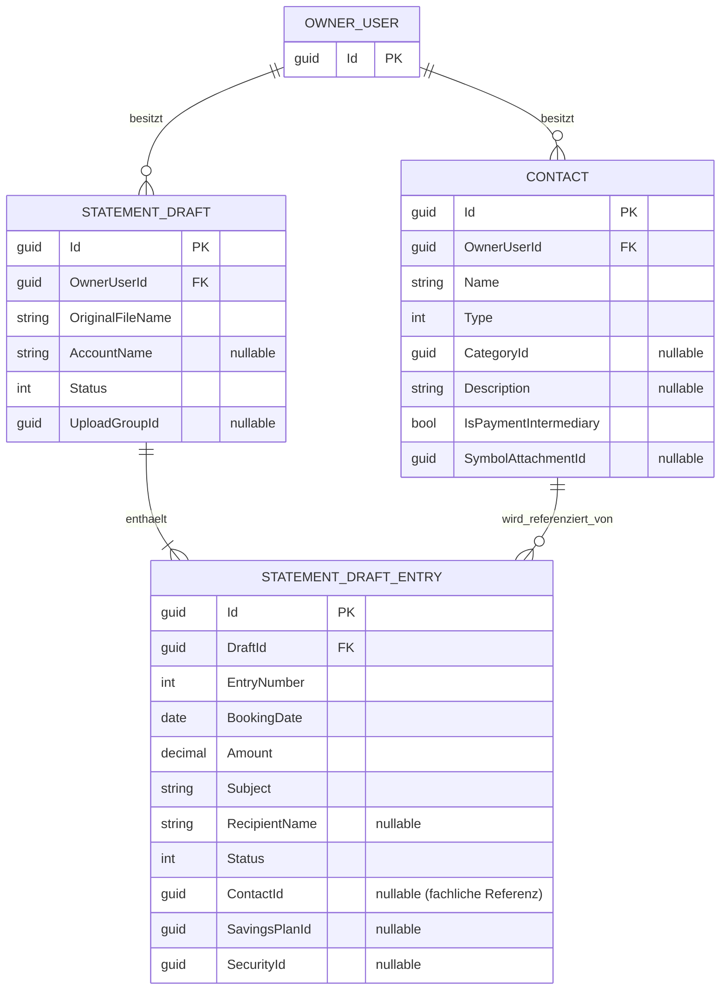

# Entity-Relationship-Modell (ERM) – Automatische Kontaktzuordnung nach Kontaktanlage aus Kontoauszugseintrag

> **Feature:** Statement Contact Auto Assignment  
> **Status:** ✅ Implementation-ready (fachlich)  
> **Version:** 0.1  
> **Datum:** 2026-07-01  
> **Sprache:** Deutsch  
> **Verlinkungen:**  
> - Requirements: [`../requirements/statement-contact-auto-assignment-requirements.md`](../requirements/statement-contact-auto-assignment-requirements.md)  
> - Architektur-Blueprint: [`./architecture-blueprint-statement-contact-auto-assignment.md`](./architecture-blueprint-statement-contact-auto-assignment.md)  
> - Architecture Review: [`../improvements/review-architecture-statement-contact-auto-assignment.md`](../improvements/review-architecture-statement-contact-auto-assignment.md)  
> - Planung: [`../planning/planning-statement-contact-auto-assignment.md`](../planning/planning-statement-contact-auto-assignment.md)

---

## 1) Mermaid-ERM-Diagramm

---

## 2) Tabellarische Übersicht (Entitäten, Attribute, Schlüssel, Beziehungen/Kardinalitäten)

| Entität | Wichtige Attribute (Auszug) | Schlüssel | Beziehungen / Kardinalität |
|---|---|---|---|
| `OwnerUser` (logisch) | `Id` | PK `Id` | 1:n zu `Contact`, 1:n zu `StatementDraft` |
| `Contact` | `OwnerUserId`, `Name`, `Type`, `CategoryId?`, `Description?`, `IsPaymentIntermediary`, `SymbolAttachmentId?` | PK `Id`, fachl. FK `OwnerUserId -> OwnerUser.Id` | 1:n von `OwnerUser`; 1:n zu `StatementDraftEntry` (über `Entry.ContactId`, optional auf Entry-Seite) |
| `StatementDraft` | `OwnerUserId`, `OriginalFileName`, `Status`, `UploadGroupId?` | PK `Id`, fachl. FK `OwnerUserId -> OwnerUser.Id` | 1:n von `OwnerUser`; 1:n zu `StatementDraftEntry` über `DraftId` (harte FK, Cascade Delete) |
| `StatementDraftEntry` | `DraftId`, `EntryNumber`, `BookingDate`, `Amount`, `Subject`, `Status`, `ContactId?` | PK `Id`, FK `DraftId -> StatementDraft.Id` | n:1 zu `StatementDraft`; 0..1:1 zu `Contact` via `ContactId?` (logische/fachliche Referenz) |

### Relevante Persistenzhinweise für das Feature

- `StatementDraftEntry.ContactId` ist bereits vorhanden und nullable.
- Mandantenschutz wird über `OwnerUserId` auf `Contact` und `StatementDraft` erzwungen; `StatementDraftEntry` wird über `DraftId -> StatementDraft.OwnerUserId` abgesichert.
- Zuordnung erfolgt serverseitig über `ParentAssignmentService` (Handler `statement-drafts/entries:contacts`).

---

## 3) Begründungen für Modellierungsentscheidungen

1. **Keine neue Feature-Entität erforderlich:**  
   Die Auto-Zuordnung ist eine Zustandsänderung auf bestehendem `StatementDraftEntry.ContactId`; daher reicht das bestehende Domänenmodell.

2. **Mandantenfähigkeit über bestehende Owner-Ketten:**  
   `StatementDraftEntry` enthält kein `OwnerUserId`; Ownership wird korrekt über `StatementDraft` aufgelöst. Das passt zu NFR-1 (keine Cross-User-Zuordnung).

3. **Optionale Kontaktreferenz bleibt fachlich korrekt:**  
   `ContactId` ist nullable, damit FR-3 (manuell ändern/entfernen) ohne Modellbruch möglich bleibt.

4. **Service-/Workflow-zentrierte Konsistenz statt Datenmodell-Ausbau:**  
   Das Problem liegt im fehlenden/inkonsistenten Aufrufpfad nach Kontaktanlage, nicht in fehlenden Tabellen oder Spalten.

---

## 4) Expliziter Abgleich mit dem Architektur-Blueprint

| Blueprint-Aussage | ERM-Abdeckung | Bewertung |
|---|---|---|
| Zuordnung auf auslösenden `StatementDraftEntry` | Direkte Referenz `StatementDraftEntry.ContactId` + Parent-Kontext (`ParentId = EntryId`) | ✅ Konsistent |
| Ownership-/Mandantenschutz | `Contact.OwnerUserId` und `StatementDraft.OwnerUserId`; Entry-Ownership über `DraftId` | ✅ Konsistent |
| Wiederverwendung `IParentAssignmentService` | ERM benötigt keine neue Entität, nur Nutzung bestehender Relationen | ✅ Konsistent |
| Fehlerrobustheit/Determinismus | Kein ERM-Widerspruch; wird im Service-/API-Fehlervertrag umgesetzt | ✅ Konsistent |
| Unmittelbare UI-Sichtbarkeit | Keine zusätzliche Persistenzstruktur notwendig | ✅ Konsistent |

**Ergebnis:** Das ERM ist vollständig konsistent mit dem Architektur-Blueprint und den Requirements.

---

## 5) DB-Schema-Change erforderlich?

**Kurzantwort:** Für das Feature in der geforderten Ausprägung ist **kein zwingender DB-Schema-Change** notwendig.  

Begründung:
- `StatementDraftEntry.ContactId` existiert bereits.
- `Contact`, `StatementDraft`, `StatementDraftEntry` und deren relevante Relationen sind bereits vorhanden.
- Die Lücke ist primär **Service-/Workflow-Konsistenz** (Kontaktanlage → `TryAssignAsync` → Persistenz → UI-Reload).

**Optionales Hardening (nicht zwingend für FR-Erfüllung):**
- explizite DB-FK `StatementDraftEntry.ContactId -> Contact.Id` (falls aktuell nicht hart erzwungen),
- optionaler Index auf `StatementDraftEntry.ContactId` für Reporting-/Lookup-Pfade.

---

## 6) Traceability zu Requirements

| Requirement | ERM-/Datenmodell-Bezug |
|---|---|
| FR-1 / FR-1.2 | `StatementDraftEntry.ContactId` als persistierte Zuordnung, danach UI-Reload |
| FR-1.1 | Kontexttreue über `ParentId=EntryId` und bestehende Entry→Draft-Beziehung |
| FR-2 | Kein neues ERM-Element notwendig; deterministischer Fehlerpfad im Service/API |
| FR-3 | Nullable `ContactId` unterstützt manuelles Ändern/Entfernen |
| NFR-1 | Ownership-Kette (`Contact.OwnerUserId`, `StatementDraft.OwnerUserId`) verhindert Cross-User-Mapping |
| NFR-3 | Idempotenz/Kontexttreue ist workflowseitig, nicht schema-getrieben |
| NFR-4 | Logging/Telemetry ist operativ, nicht als neue Entität erforderlich |

---

## 7) Versionshistorie

| Version | Datum | Änderung |
|---|---|---|
| 0.1 | 2026-07-01 | Initiales ERM für Feature „automatische Kontaktzuordnung nach Kontaktanlage aus Kontoauszugseintrag“ erstellt |
