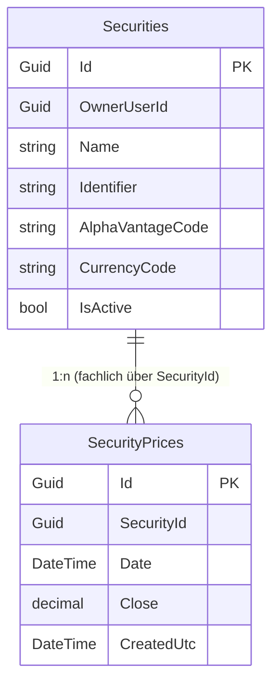

# Entity-Relationship-Modell: Wertpapierkurse-Import (ING CSV)

> **Feature:** Wertpapierkurse-Import (ING)  
> **Status:** 📋 Geplant  
> **Version:** 1.0  
> **Datum:** 2026-07-02  
> **Querverweise:**  
> - Anforderungen: [`../requirements/wertpapierkurse-ing-requirements.md`](../requirements/wertpapierkurse-ing-requirements.md)  
> - Architektur-Blueprint: [`./architecture-blueprint-wertpapierkurse-ing.md`](./architecture-blueprint-wertpapierkurse-ing.md)  
> - Review: [`../improvements/review-architecture-wertpapierkurse-ing.md`](../improvements/review-architecture-wertpapierkurse-ing.md)

## 1. Überblick

Für das Feature sind primär bestehende Entitäten relevant. Der Import ist ein Prozess auf bestehenden Tabellen (`Securities`, `SecurityPrices`) mit Upsert-Verhalten pro Tag.

## 2. ERM-Diagramm

## 3. Entitäten, Attribute, Schlüssel, Constraints

| Entität | Persistiert | Relevante Felder | Schlüssel / Constraints |
|---|---|---|---|
| `Securities` | Ja | `Id`, `OwnerUserId`, `Name`, `Identifier`, `CurrencyCode`, `IsActive` | PK `Id`; Unique (`OwnerUserId`,`Name`), Index (`OwnerUserId`,`Identifier`) |
| `SecurityPrices` | Ja | `Id`, `SecurityId`, `Date`, `Close`, `CreatedUtc` | PK `Id`; Unique (`SecurityId`,`Date`); `Close` Precision `(18,4)` |
| `SecurityPriceImportItem` | Nein (DTO) | `Date`, `Close`, `SourceLine` | Laufzeit-Contract für Upsert |
| `SecurityPriceImportResult` | Nein (DTO) | `Inserted`, `Updated`, `Unchanged`, `Skipped`, `Errors[]` | API-Response-Contract |

## 4. Beziehungen und Kardinalitäten

| Von | Nach | Kardinalität | Typ | Umsetzung |
|---|---|---|---|---|
| `Security` | `SecurityPrice` | 1:n | Persistiert/fachlich | Eindeutigkeit über (`SecurityId`,`Date`) |
| `ImportService` | `SecurityPrice` | 1:n (prozessual) | Nicht-persistiert | Batch-Upsert je Datei |

## 5. Modellierungsentscheidungen

1. **Kein neues Persistenzmodell erforderlich**  
   Die Anforderung ist durch bestehende Tabellen erfüllbar; Import-Tracking bleibt zunächst im Ergebnisobjekt/Log.

2. **Taggenaue Normalisierung**  
   CSV-Zeitstempel wird auf `Date` reduziert, da fachlich Tageskurse gepflegt werden.

3. **Upsert auf Service-Ebene**  
   Import entscheidet pro Tagesdatensatz:
   - Insert bei fehlendem `(SecurityId,Date)`
   - Update bei abweichendem `Close`
   - Unchanged bei identischem `Close`

## 6. Konsistenzabgleich mit Architektur-Blueprint

- Factory + provider-spezifischer Service benötigt keine Schemaänderung. ✅
- Owner-Scope über `Security.OwnerUserId` ist direkt nutzbar. ✅
- Unique-Index (`SecurityId`,`Date`) stützt Idempotenzanforderung für Re-Importe. ✅

## 7. Offene Punkte / Annahmen

- Es wird kein separates Import-Audit-Entity eingeführt (kann später ergänzt werden).
- Bei doppelten Zeilen gleichen Datums in derselben Datei gilt: letzter valider Eintrag gewinnt (Annahme für deterministisches Verhalten).

## 8. Versionshistorie

| Version | Datum | Autor | Änderung |
|---|---|---|---|
| 1.0 | 2026-07-02 | planning-entity-relationship-modeler | Initiales ERM für ING-Wertpapierkursimport erstellt |
