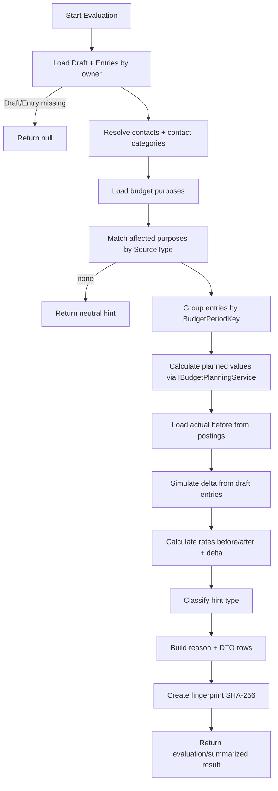

# Budget Impact Evaluation Flow

Dieses Dokument beschreibt die Ablauflogik von `BudgetImpactEvaluationService` für
- Echtzeit-Hinweise je Entry (`EvaluateEntryImpactAsync`)
- Abschluss-Summary vor Buchung (`EvaluateDraftImpactAsync`)

## Mermaid-Ablauf

## Klassifizierung

`BudgetImpactHintType`:
- `Exceeded`
- `AlmostExhausted` (Schwellwert aktuell 90 %)
- `StronglyChanged` (Delta aktuell 20 %)
- `Neutral`

## Quellen und Berechnungsbasis

- Sollwerte: `IBudgetPlanningService.CalculatePlannedValuesAsync(...)`
- Istwerte: `Postings` je Periode und SourceType
- Zuordnung:
  - `Contact`
  - `SavingsPlan`
  - `ContactGroup` (über Kontaktkategorie)

## Besondere Fälle

- Keine zuordenbaren Budgetzwecke ⇒ neutraler Hinweistext.
- Leere Buchungsmenge (z. B. bereits gebucht/announced) ⇒ Summary mit `Neutral` und ohne Items.
- Fingerprint ermöglicht UI-seitige Vergleichbarkeit zwischen zwei Evaluierungen.

## Referenzen

- `FinanceManager.Infrastructure/Statements/BudgetImpactEvaluationService.cs`
- `FinanceManager.Application/Statements/IBudgetImpactEvaluationService.cs`
- `FinanceManager.Shared/Dtos/Statements/BudgetImpactDtos.cs`
