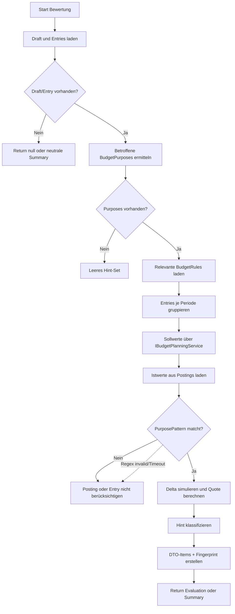

# Budget Impact Evaluation und PurposePattern-Filter

## Titel & Kontext

Dieser Ablauf beschreibt die technische Budgetwirkungs-Berechnung im Kontoauszug-/Buchungspfad und den Bezug zum PurposePattern-Filtering. Betroffen sind `BudgetImpactEvaluationService` (Hinweise/Summary vor Buchung), `BudgetReportService` (Budgetbericht-Filterung) sowie die Regex-Validierung beim Speichern von Budget-Regeln. Dokumentiert ist nur aktuell implementiertes Verhalten.

## Diagramm

## Schrittbeschreibung

1. **Draft-/Entry-Selektion**
   - Referenz: `FinanceManager.Infrastructure/Statements/BudgetImpactEvaluationService.cs` (`EvaluateEntryImpactAsync`, `EvaluateDraftImpactAsync`)
   - Eingabe: `draftId`, optional `entryId`, `ownerUserId`.
   - Ausgabe: `BudgetImpactEvaluationDto?` oder `BookingImpactSummaryDto?`.
   - Seiteneffekte: keine (nur Reads).

2. **Betroffene Zwecke und Regeln auflösen**
   - Referenz: `.../BudgetImpactEvaluationService.cs` (`EvaluateEntriesAsync`)
   - Eingabe: Draft-Entries + Kontakte/Kategorien + BudgetPurposes + BudgetRules.
   - Ausgabe: `affectedPurposes`, `relevantRules`.
   - Seiteneffekte: keine.

3. **PurposePattern-Matching (Kontoauszug/Buchungspfad)**
   - Referenz: `.../BudgetImpactEvaluationService.cs` (`MatchesPurposePattern`)
   - Eingabe: `subject`, `bookingDescription`, `applicableRules`.
   - Ausgabe: `bool` je Entry/Posting-Match.
   - Implementierte Regeln:
     - **Kein Filter**: `applicableRules.Count == 0` ⇒ `true`.
     - **Kein Filter**: Regel mit leer/whitespace `PurposePattern` ⇒ `true`.
     - `input` = `subject + " " + bookingDescription` (nur nicht-leere Teile).
     - **Contains** (`PurposePatternIsRegex == false`): `IndexOf(..., OrdinalIgnoreCase) >= 0`.
     - **Regex** (`PurposePatternIsRegex == true`): `Regex.IsMatch(input, pattern, IgnoreCase | CultureInvariant, 200ms Timeout)`.
     - `ArgumentException` oder `RegexMatchTimeoutException` ⇒ Regel wird übersprungen (`continue`), kein Treffer aus dieser Regel.

4. **Ist/Soll/Delta und Klassifizierung**
   - Referenz: `.../BudgetImpactEvaluationService.cs` (`GetActualBeforeAsync`, `SumEntryDeltaForPurpose`, `ClassifyHint`)
   - Eingabe: periodisierte Entries, geplante Werte, gefilterte Postings.
   - Ausgabe: `BudgetImpactHintDto`-Liste, sortiert und mit Fingerprint.
   - Seiteneffekte: Debug-Logging.

5. **Wirkung im Budgetbericht**
   - Referenz: `FinanceManager.Infrastructure/Budget/BudgetReportService.cs` (`MatchesPurposePattern`)
   - Eingabe: Posting-`Description` + `BudgetRuleDto`.
   - Ausgabe: Inclusion/Exclusion eines Postings in KPI/Bericht.
   - Implementierte Regeln:
     - Leer/whitespace `PurposePattern` ⇒ kein Filter (`true`).
     - Contains: `IndexOf(..., OrdinalIgnoreCase)`.
     - Regex: `IgnoreCase | CultureInvariant` + 200ms Timeout.
     - Bei `ArgumentException`/`RegexMatchTimeoutException` ⇒ `false` (Posting wird nicht berücksichtigt).

6. **Validierungsbezug beim Speichern**
   - Referenz: `FinanceManager.Domain/Budget/BudgetRule.cs` (`SetPurposePattern`), `FinanceManager.Web/Controllers/BudgetRulesController.cs`
   - Eingabe: `pattern`, `isRegex` beim Create/Update.
   - Ausgabe: gültiges Pattern im Entity-State oder Validierungsfehler.
   - Implementiertes Verhalten:
     - Bei Regex wird **syntaktische Compile-Validität** mit `new Regex(trimmed)` geprüft.
     - Bei ungültigem Regex: `ArgumentException("Invalid regular expression", "pattern", ex)`.
     - Controller mapped dies auf `ValidationProblem`/HTTP 400 mit `Budget_PurposePattern_InvalidRegex`.

## Fehlerbehandlung

- Draft/Entry nicht gefunden ⇒ `null` bzw. neutrale/leere Rückgabe.
- Keine buchbaren Entries (`AlreadyBooked`/`Announced`) ⇒ neutrale Summary ohne Items.
- Regex-Fehler im Matching:
  - BudgetImpact: Regel wird ignoriert (`continue`), Ablauf läuft weiter.
  - BudgetReport: Match `false`, Posting wird nicht gezählt.
- Ungültiger Regex beim Speichern ⇒ `ValidationProblem` (HTTP 400), kein Persist.

## Abhängigkeiten

- `IBudgetPlanningService` (Sollwerte)
- `AppDbContext` (`StatementDrafts`, `StatementDraftEntries`, `Postings`, `BudgetRules`, `BudgetPurposes`, `Contacts`)
- `System.Text.RegularExpressions` (`Regex`, Timeout, Optionen)
- `BudgetRulesController` + Domain-Entity `BudgetRule` (Persistenz-Validierung)
