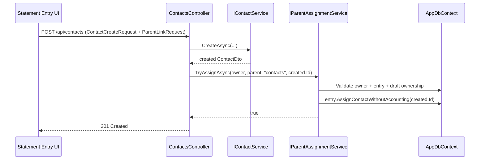
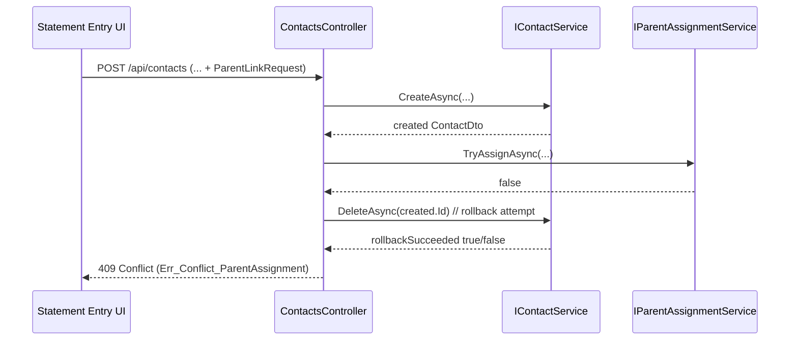

# Flow: Contact Create with Statement Entry Auto-Assignment

## Scope

This flow documents inline contact creation from a statement draft entry context (`parentKind=statement-drafts/entries`) including assignment, rollback, and conflict contract.

## Related planning and test artifacts

- Requirements: [`../requirements/statement-contact-auto-assignment-requirements.md`](../requirements/statement-contact-auto-assignment-requirements.md)
- Planning: [`../planning/planning-statement-contact-auto-assignment.md`](../planning/planning-statement-contact-auto-assignment.md)
- Architecture: [`../architecture/architecture-blueprint-statement-contact-auto-assignment.md`](../architecture/architecture-blueprint-statement-contact-auto-assignment.md)
- Architecture review: [`../improvements/review-architecture-statement-contact-auto-assignment.md`](../improvements/review-architecture-statement-contact-auto-assignment.md)
- Tests:
  - [`../tests/phase2-contact-parent-assignment-test-plan.md`](../tests/phase2-contact-parent-assignment-test-plan.md)
  - [`../tests/phase2-contact-parent-assignment-coverage-gaps.md`](../tests/phase2-contact-parent-assignment-coverage-gaps.md)

## Success path

## Failure and rollback path (409 Conflict)

### Conflict contract

- HTTP: `409 Conflict`
- Error code: `Err_Conflict_ParentAssignment`
- Message source:
  - localized: `API_Contacts_Err_Conflict_ParentAssignment`
  - fallback: `"Contact creation could not be completed because assignment to the requested entry failed."`

## Idempotency

- Endpoint-level: `POST /api/contacts` is not idempotent (retries create additional contacts).
- Assignment-level: if the same contact is already assigned to the same statement entry, `ParentAssignmentService` treats it as idempotent no-op and returns `true` without rewriting the entry.

## Ownership and security checks

`ParentAssignmentService` enforces:
1. Created contact belongs to current owner.
2. Target statement draft entry exists.
3. Target draft behind the entry belongs to current owner.

If any check fails, assignment returns `false`, rollback is attempted, and API returns `409`.
