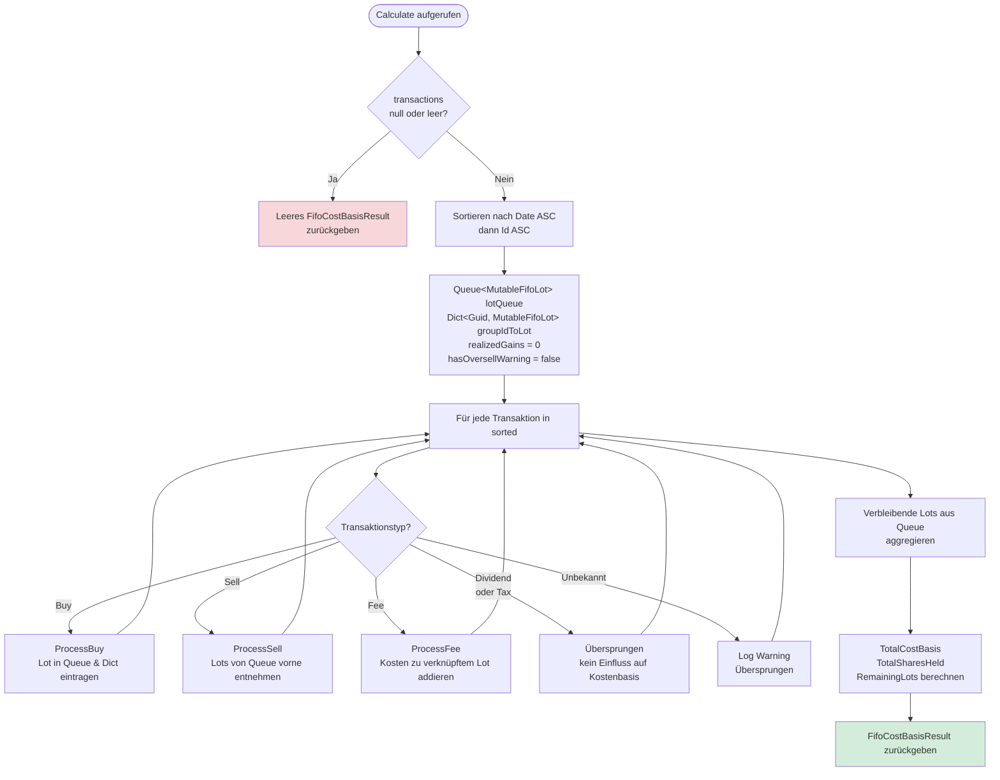
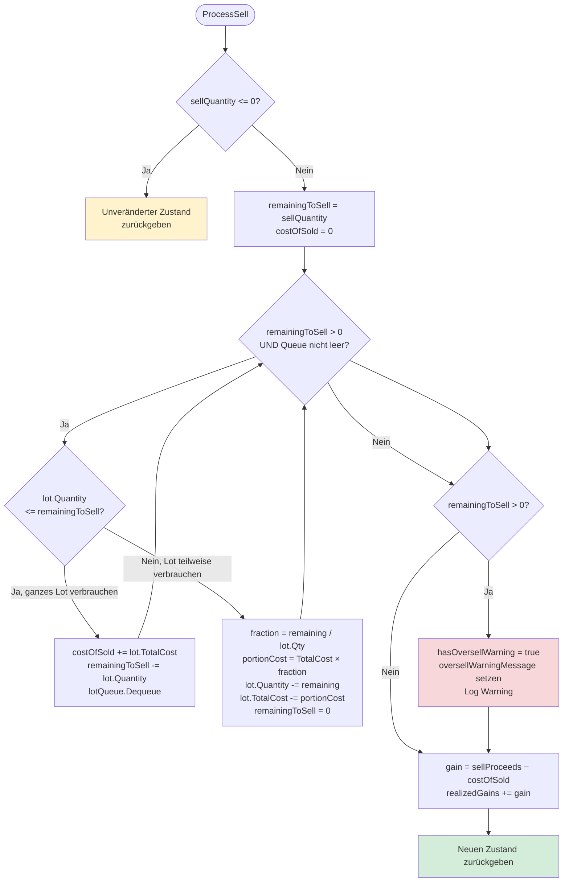

# FIFO-Kostenbasisberechnung

**Modul:** `FinanceManager.Application.Securities.ReturnAnalysis`
**Quellcode:** `FinanceManager.Application/Securities/ReturnAnalysis/FifoCostBasisCalculator.cs`
**Interface:** `FinanceManager.Application/Securities/ReturnAnalysis/IFifoCostBasisCalculator.cs`
**Anforderung:** FR-6

Der `FifoCostBasisCalculator` berechnet die Kostenbasis aller gehaltenen Wertpapier-Lots nach dem First-In-First-Out-Verfahren sowie die realisierten Gewinne aus Verkäufen. Er ist zustandslos und thread-sicher. Käufe werden als Lots verwaltet, Verkäufe entnehmen die ältesten Lots zuerst, Kaufgebühren werden über die `GroupId` mit dem zugehörigen Lot verknüpft.

---

## 1. Hauptablauf: `Calculate(transactions)`



---

## 2. Detail-Flowchart: `ProcessBuy`

```mermaid
flowchart TD
    A([ProcessBuy]) --> B{Quantity <= 0?}
    B -- Ja --> Z1[Log Debug\nLot wird nicht erstellt]
    B -- Nein --> C[totalCost = |tx.Amount|]
    C --> D[MutableFifoLot erstellen\nPurchaseDate, Quantity, TotalCost]
    D --> E[lotQueue.Enqueue]
    E --> F[groupIdToLot\[tx.GroupId\] = lot]
    F --> G[Log Debug: Qty, Cost, GroupId]

    style Z1 fill:#fff3cd
    style G fill:#d4edda
```

---

## 3. Detail-Flowchart: `ProcessSell`



---

## 4. Detail-Flowchart: `ProcessFee`

```mermaid
flowchart TD
    A([ProcessFee]) --> B[feeAmount = |tx.Amount|]
    B --> C{groupIdToLot\nenthält tx.GroupId?}
    C -- Ja --> D[associatedLot.TotalCost += feeAmount\nGebühr erhöht Kostenbasis des Lots]
    C -- Nein --> E[Standalone-Gebühr\nLog Debug: nicht einem Lot zugeordnet]

    style D fill:#d4edda
    style E fill:#fff3cd
```

---

## 5. Lot-Verwaltung (`MutableFifoLot`)

Die interne Klasse `MutableFifoLot` ist das veränderliche Lot während der FIFO-Verarbeitung. Sie wird nie nach außen weitergegeben – das Ergebnis enthält nur unveränderliche `FifoLot`-Records.

| Eigenschaft | Typ | Beschreibung |
|---|---|---|
| `PurchaseDate` | `DateTime` | Kaufdatum des Lots (unveränderlich) |
| `Quantity` | `decimal` (mutable) | Verbleibende Stückzahl im Lot |
| `TotalCost` | `decimal` (mutable) | Gesamte Kostenbasis des verbleibenden Anteils |

**Lot-Lebenszyklus:**

1. **Erzeugt** durch `ProcessBuy` → `lotQueue.Enqueue`
2. **Ergänzt** durch `ProcessFee` (GroupId-Match) → `TotalCost` wächst
3. **Verbraucht** durch `ProcessSell` → entweder vollständig (`Dequeue`) oder anteilig (Mengen-/Kostenreduktion)
4. **Verbleibt** nach Verarbeitung aller Transaktionen als `RemainingLots` im Ergebnis

---

## 6. Fee-Verknüpfung via `GroupId`

Kauftransaktionen und dazugehörige Gebühren teilen dieselbe `GroupId`. Der `FifoCostBasisCalculator` nutzt `Dictionary<Guid, MutableFifoLot> groupIdToLot`, um Gebühren dem richtigen Lot zuzuordnen:

```
Buchung Buy  → GroupId = "abc-123" → Lot L1 wird erstellt; groupIdToLot["abc-123"] = L1
Buchung Fee  → GroupId = "abc-123" → groupIdToLot["abc-123"] gefunden → L1.TotalCost += fee
```

**Standalone-Gebühren** (GroupId ohne passenden Buy-Eintrag) werden geloggt, aber nicht auf Lots verteilt und damit nicht in die FIFO-Kostenbasis einbezogen.

---

## 7. Oversell-Handling (`HasOversellWarning`)

Wird mehr verkauft als in den vorhandenen Lots verfügbar ist (z.B. bei fehlenden historischen Kaufbuchungen), setzt `ProcessSell` das Flag `hasOversellWarning = true` und befüllt `OversellWarningMessage` mit einer beschreibenden Fehlermeldung.

Das Ergebnis-DTO `FifoCostBasisResult` enthält beide Felder. Der `ReturnAnalysisService` leitet die Warnung an das `ReturnSummaryDto.MissingPricesHint`-Feld weiter und setzt `HasMissingPrices = true`.

**Beispiel-Warnmeldung:**

> Sell transaction {Id} on {Date}: attempted to sell 50 shares but only 30 were available in lots. Result may be incomplete due to missing historical data.

---

## 8. Transaktionstypen und ihre Verarbeitung

| Transaktionstyp | FIFO-Einfluss | Kostenbasis | Realisierter Gewinn |
|---|---|---|---|
| **Buy** | Neues Lot in Queue eintragen; in `groupIdToLot` registrieren | + `|Amount|` | – |
| **Sell** | Älteste Lots entnehmen (FIFO); anteilig oder vollständig | − entsprechend | + `Proceeds − CostOfSold` |
| **Fee** (verknüpft) | `TotalCost` des assoziierten Lots erhöhen (via GroupId) | + `|Amount|` | – |
| **Fee** (standalone) | Keine Lot-Zuweisung; nur geloggt | Keine Änderung | – |
| **Dividend** | Ignoriert | Keine Änderung | – |
| **Tax** | Ignoriert | Keine Änderung | – |
| **Unbekannt** | Log Debug; übersprungen | Keine Änderung | – |

---

## 9. Ergebnis-DTO `FifoCostBasisResult`

| Feld | Beschreibung |
|---|---|
| `TotalCostBasis` | Summe der `TotalCost` aller verbleibenden Lots |
| `RealizedGains` | Kumulierter realisierter Gewinn aller Verkäufe |
| `RemainingLots` | Unveränderliche `FifoLot`-Liste (PurchaseDate, Quantity, CostPerUnit) |
| `TotalSharesHeld` | Summe aller verbleibenden Stückzahlen |
| `HasOversellWarning` | `true` wenn ein Oversell erkannt wurde |
| `OversellWarningMessage` | Beschreibender Warntext oder `null` |

---

## Abhängigkeiten

| Komponente | Typ | Beschreibung |
|---|---|---|
| `ILogger<FifoCostBasisCalculator>` | Framework | Diagnostik-Logging für Debug-/Warn-Meldungen |

Keine Datenbankzugriffe. Kein interner Zustand. Alle Eingabedaten werden als `IReadOnlyList<SecurityTransaction>` übergeben.

**Verwandte Flows:**
- [return-analysis-service.md](return-analysis-service.md) – Ruft `FifoCostBasisCalculator.Calculate` in `ComputeReturnSummaryAsync` und `ComputeDetailedMetricsAsync` auf
