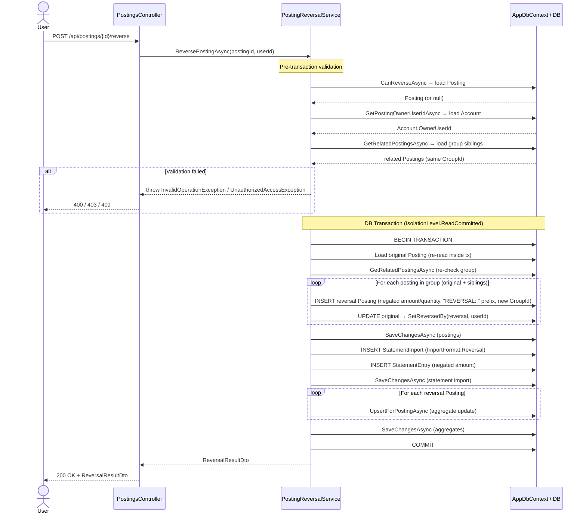
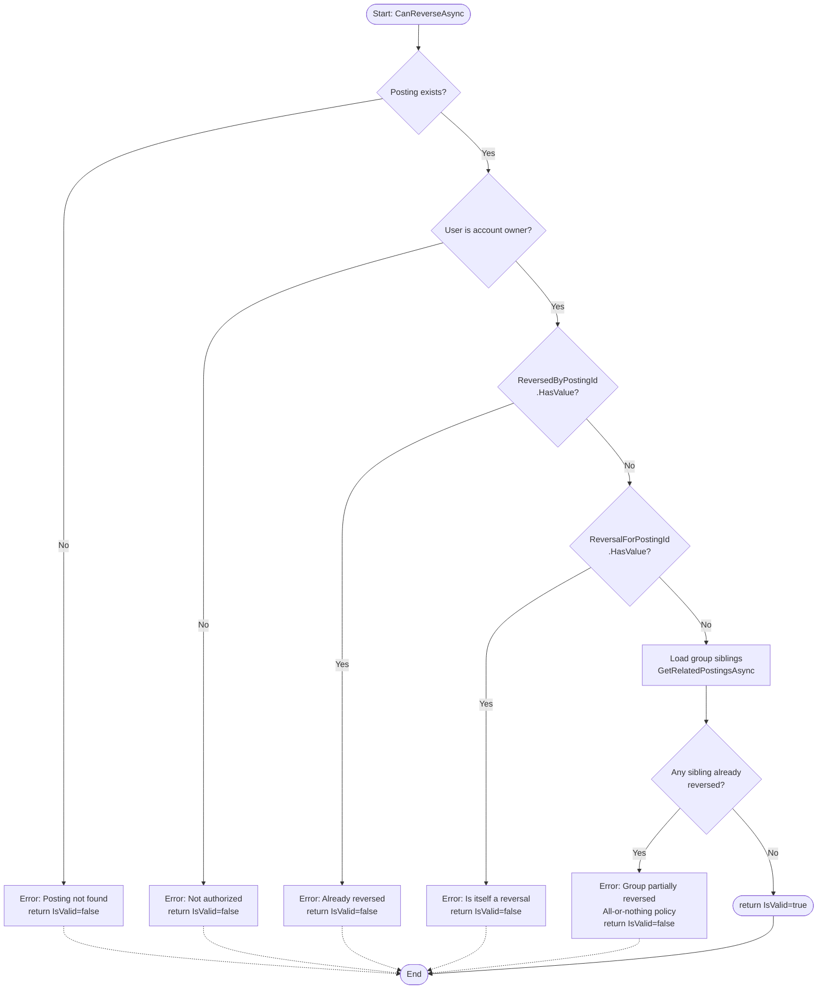
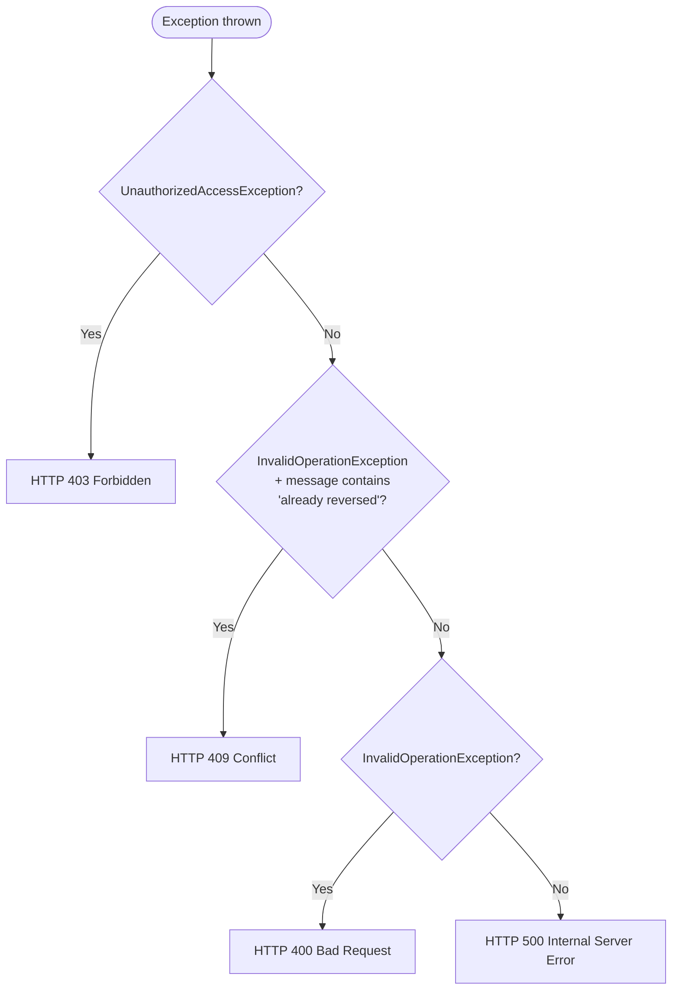

# Posting Reversal Flow

Reverses an existing posting by creating a counter-posting with negated amount and quantity, covering all group members atomically. The original posting is marked as reversed; a `StatementImport` with format `Reversal` is created for reconciliation purposes.

## API Endpoints

| Method | Route | Description |
|--------|-------|-------------|
| `GET`  | `/api/postings/{id}/validate-reversal` | Dry-run validation – returns `ReversalValidationDto` without side effects |
| `POST` | `/api/postings/{id}/reverse`           | Executes the reversal and returns `ReversalResultDto` |

---

## Main Flow



---

## Validation Flow (CanReverseAsync)

The pre-transaction validation runs **before** the database transaction is opened. It is also exposed independently via `GET /api/postings/{id}/validate-reversal` for dry-run checks.



### Validation Checks (in order)

| # | Check | Field / Query | Error Message |
|---|-------|---------------|---------------|
| 1 | Posting exists | `Postings.FirstOrDefaultAsync(id)` | `"Posting {id} not found"` |
| 2 | User is account owner | `Account.OwnerUserId == userId` | `"User {userId} is not authorized …"` |
| 3 | Not already reversed | `ReversedByPostingId.HasValue == false` | `"Posting {id} has already been reversed by posting {x}"` |
| 4 | Not a reversal itself | `ReversalForPostingId.HasValue == false` | `"Posting {id} is itself a reversal …"` |
| 5 | Group not partially reversed | All siblings: `ReversedByPostingId == null` | `"… group is partially reversed. All-or-nothing policy enforced."` |

---

## Reversal Posting Creation

Method: `PostingReversalService.CreateReversalPosting(original, newGroupId)`

| Field | Value |
|-------|-------|
| `Amount` | `-original.Amount` |
| `Quantity` | `-original.Quantity` (if present) |
| `Subject` | `"REVERSAL: {original.Subject}"` (or `"REVERSAL"`) |
| `BookingDate` / `ValutaDate` | Copied from original |
| `AccountId`, `ContactId`, `Kind`, … | Copied from original |
| `GroupId` | **New** `Guid.NewGuid()` shared by all reversal siblings |
| `ReversalForPostingId` | Set to `original.Id` via `reversal.SetReversalFor(original)` |
| `SourceId` | New `Guid.NewGuid()` |

After creation the **original** posting is updated:

```
original.SetReversedBy(reversal, userId)
→ sets original.ReversedByPostingId = reversal.Id
```

---

## StatementImport for Reconciliation

Method: `PostingReversalService.CreateReversalStatementImportAsync(original, ct)`

A `StatementImport` with `ImportFormat.Reversal` is created to make the reversal visible in bank statement reconciliation:

| Entity | Key Fields |
|--------|-----------|
| `StatementImport` | `AccountId = original.AccountId`, `Format = ImportFormat.Reversal`, `OriginalFileName = "REVERSAL_{original.Id}"` |
| `StatementEntry` | `Amount = -original.Amount`, `Subject = "REVERSAL: …"`, `RawHash = Guid.NewGuid()` (unique), `CurrencyCode = "EUR"` |

> **Note:** `CreateReversalStatementImportAsync` throws `InvalidOperationException` if `original.AccountId` is `null`.

---

## Aggregate Update

After the reversal postings are persisted, `IPostingAggregateService.UpsertForPostingAsync` is called **for each reversal posting only**. The original postings' aggregates are **not** recalculated — the negated amounts in the reversal postings net out the effect at the aggregate level.

Reference: `FinanceManager.Application/Aggregates/IPostingAggregateService.cs`

---

## Database Operations Summary

| Step | Operation | Entity |
|------|-----------|--------|
| 1 | `SELECT` | `Postings` (validation + re-read in tx) |
| 2 | `SELECT` | `Accounts` (ownership check) |
| 3 | `SELECT` | `Postings` (group siblings by `GroupId`) |
| 4 | `INSERT` × N | `Postings` (reversal postings) |
| 5 | `UPDATE` × N | `Postings` (mark originals as reversed) |
| 6 | `INSERT` | `StatementImports` |
| 7 | `INSERT` | `StatementEntries` |
| 8 | `UPSERT` × N | Posting aggregates |

Transaction isolation: **`IsolationLevel.ReadCommitted`**

---

## Error Handling

| Scenario | Exception | HTTP Status | Catch Block |
|----------|-----------|-------------|-------------|
| Posting not found | `InvalidOperationException` | `400 Bad Request` | Generic `InvalidOperationException` catch |
| User not authorized | `InvalidOperationException`* | `400 Bad Request` | Generic catch (**Known Bug**, see below) |
| Already reversed | `InvalidOperationException` | `409 Conflict` | `ex.Message.Contains("already been reversed")` |
| Is itself a reversal | `InvalidOperationException` | `400 Bad Request` | Generic `InvalidOperationException` catch |
| Group partially reversed | `InvalidOperationException` | `409 Conflict` | `ex.Message.Contains("already reversed")` |
| Posting has no AccountId | `InvalidOperationException` | `500 Internal Server Error` | Unhandled (propagates as 500) |
| Transaction failure | `Exception` | `500 Internal Server Error` | Logged + rollback + rethrow |

Error flow:



---

## Known Limitations

| ID | Description |
|----|-------------|
| **BUG-AUTH** | Authorization errors are currently signalled via `InvalidOperationException` (not `UnauthorizedAccessException`) in `PostingReversalService`. The controller has a catch block for `UnauthorizedAccessException → 403`, but the service never throws it. Result: authorization failures are returned as **400** instead of **403**. |
| **CURRENCY** | `StatementEntry.CurrencyCode` is hardcoded to `"EUR"`. Multi-currency postings are not supported. |
| **NO-ACCOUNT** | Postings without `AccountId` cannot be reversed (throws before transaction). |

---

## Technical Notes

- **All-or-Nothing Policy:** If a posting belongs to a group (shared `GroupId`), all members of the group are reversed together. Partial reversal of a group is rejected both in pre-validation and as a re-check inside the transaction.
- **New GroupId for Reversals:** All reversal postings receive a **new shared `GroupId`** so they form their own coherent group.
- **Double SaveChanges:** The service calls `SaveChangesAsync` three times within one transaction: (1) after inserting postings, (2) after creating the `StatementImport`/`StatementEntry`, (3) after updating aggregates. This is intentional to obtain entity IDs before subsequent steps.
- **Isolation Level:** `ReadCommitted` prevents dirty reads. Combined with the pre-validation re-check inside the transaction this reduces (but does not eliminate) the risk of a race condition for concurrent reversal attempts on the same posting.

---

## Dependencies

| Component | Role |
|-----------|------|
| `AppDbContext` | EF Core database context; `Postings`, `Accounts`, `StatementImports`, `StatementEntries` |
| `IPostingAggregateService` | Updates period-bucket aggregates after reversal |
| `ICurrentUserService` (`_current`) | Provides authenticated `UserId` in the controller |
| `ImportFormat.Reversal` | Domain enum value for the reconciliation statement import |
| `Posting.SetReversedBy(reversal, userId)` | Domain method marking original as reversed |
| `Posting.SetReversalFor(original)` | Domain method linking reversal back to original |
| `Posting.SetGroup(groupId)` | Domain method assigning group membership |

---

## References

- `FinanceManager.Application/Postings/IPostingReversalService.cs`
- `FinanceManager.Infrastructure/Postings/PostingReversalService.cs`
- `FinanceManager.Web/Controllers/PostingsController.cs` (methods `ReversePosting`, `ValidateReversal`)
- `FinanceManager.Domain/Postings/Posting.cs`
- `FinanceManager.Domain/Statements/StatementImport.cs`, `StatementEntry.cs`
- Related flow: [posting-aggregates.md](posting-aggregates.md)
