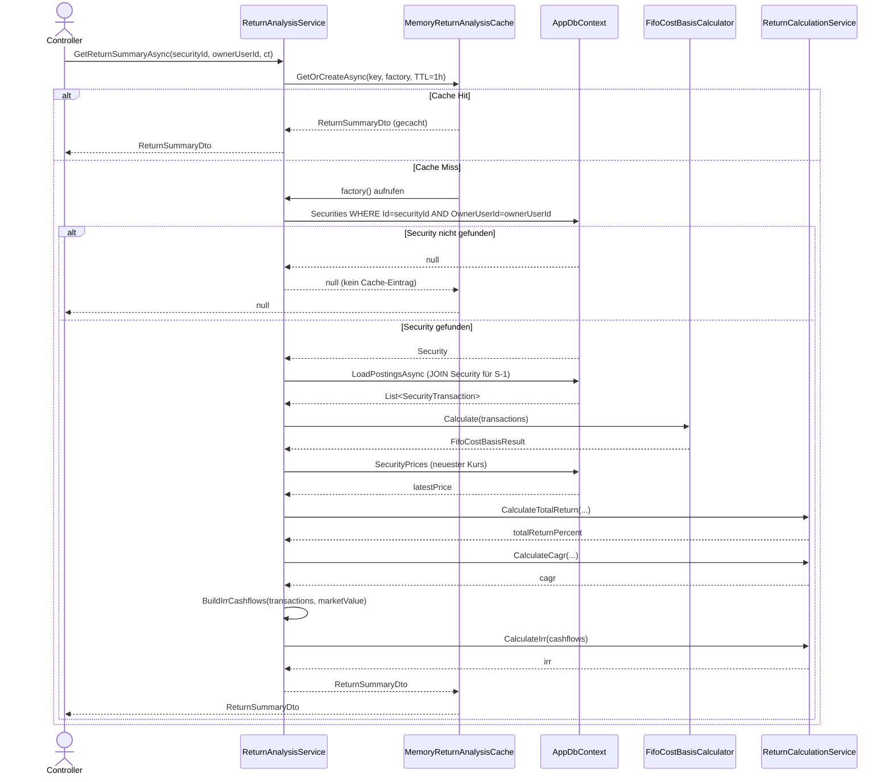
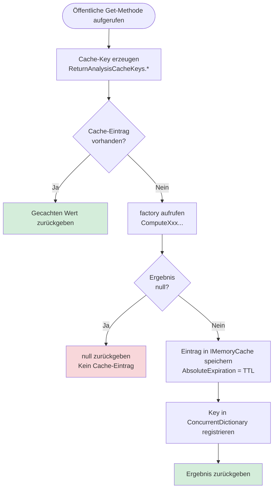

# ReturnAnalysisService – Orchestrierungsfluss

**Modul:** `FinanceManager.Infrastructure.Securities.ReturnAnalysis`
**Quellcode:** `FinanceManager.Infrastructure/Securities/ReturnAnalysis/ReturnAnalysisService.cs`
**Interface:** `FinanceManager.Application/Securities/ReturnAnalysis/IReturnAnalysisService.cs`
**Cache:** `FinanceManager.Infrastructure/Securities/ReturnAnalysis/MemoryReturnAnalysisCache.cs`

Der `ReturnAnalysisService` ist die zentrale Orchestrierungsschicht für sämtliche Renditeanalysen zu einem einzelnen Wertpapier. Er koordiniert den Datenzugriff auf die Datenbank, delegiert reine Berechnungen an den `IReturnCalculationService`, nutzt den `IFifoCostBasisCalculator` für die Kostenbasis und cacht alle Ergebnisse für 1 Stunde (TTL). Sämtliche Methoden sind benutzerspezifisch und erzwingen Eigentumsrechte über einen JOIN auf die `Security`-Entität.

---

## 1. Sequenzdiagramm: `GetReturnSummaryAsync`

Repräsentativ für alle `Get*Async`-Methoden, die das Cache-First-Muster verwenden.



---

## 2. Flowchart: Caching-Strategie (`GetOrCreate`)



### Cache-Invalidierung

```mermaid
flowchart TD
    A([InvalidateCacheAsync aufgerufen]) --> B[SecurityUserToken erzeugen\n{securityId}:{userId}]
    B --> C[MemoryReturnAnalysisCache.InvalidateAsync]
    C --> D[Alle Keys mit Token-Substring suchen\nStringComparison.OrdinalIgnoreCase]
    D --> E[IMemoryCache.Remove für jeden Treffer]
    E --> F[Key aus ConcurrentDictionary entfernen]
```

---

## 3. Öffentliche Methoden (Interface `IReturnAnalysisService`)

| Methode | Rückgabe | Anforderung | Beschreibung |
|---|---|---|---|
| `GetReturnSummaryAsync` | `ReturnSummaryDto?` | FR-1 | Kompakte Renditekennzahlen für das Widget auf der Wertpapier-Detailseite (TotalReturn, CAGR, IRR, Kostenbasis) |
| `GetSparklineDataAsync` | `SparklineDataDto?` | FR-1.1 | Mini-Chart-Datenpunkte (MarketValue + InvestedCapital je Tag); null wenn < 30 Preisdaten |
| `GetDetailedMetricsAsync` | `DetailedReturnMetricsDto?` | FR-2.1 | Erweiterte Kennzahlen: TWR, Volatilität, MaxDrawdown, Sharpe Ratio, IRR, DividendYield, TaxRate |
| `GetPeriodicReturnsAsync` | `PeriodicReturnsDto?` | FR-2.2, FR-2.5 | Jährliche und monatliche Renditen sowie Dividendenübersicht pro Jahr |
| `GetCashflowTimelineAsync` | `CashflowTimelineDto?` | FR-2.3, FR-2.6 | Chronologische Cashflow-Liste mit Jahres-Summen (Käufe, Verkäufe, Dividenden, Steuern, Gebühren) |
| `GetPerformanceChartDataAsync` | `PerformanceChartDataDto?` | FR-2.4 | Tagesgenaue Chart-Daten (PortfolioValue vs. InvestedCapital) für gewählten Zeitbereich |
| `GetBenchmarkComparisonAsync` | `BenchmarkComparisonDto?` | FR-7 | Normierter Vergleich (Basis 100) mit einem konfigurierten Benchmark-Wertpapier; null ohne Benchmark |
| `GetUserSettingsAsync` | `ReturnAnalysisSettingsDto?` | – | Liest Benutzer-Einstellungen: BenchmarkSecurityId, ShowSharpeRatio, RiskFreeRate |
| `UpdateUserSettingsAsync` | `Task` | S-3 | Speichert Benutzer-Einstellungen; validiert Eigentümerschaft des Benchmark-Wertpapiers |
| `InvalidateCacheAsync` | `Task` | – | Invalidiert alle Cache-Einträge zum Wertpapier/Benutzer-Paar (bei neuen Buchungen oder Kursdaten) |

---

## 4. Private Hilfsmethoden

### Datenlademethoden

| Methode | Datei / Zeile | Beschreibung |
|---|---|---|
| `LoadPostingsAsync` | `ReturnAnalysisService.cs` ~Z. 585 | Lädt alle Buchungen eines Wertpapiers. **Sicherheitsprüfung S-1:** Buchungen haben keine `OwnerUserId` – Eigentümerschaft wird über `JOIN` mit `Securities.OwnerUserId` erzwungen. Gibt `List<SecurityTransaction>` zurück (Id, Date, Type, Amount, Quantity, GroupId). |
| `LoadPriceHistoryAsync` | `ReturnAnalysisService.cs` ~Z. 615 | Lädt Kurshistorie im angegebenen Zeitraum per JOIN auf `Securities.OwnerUserId` (S-1). Gibt `List<(DateTime, decimal)>` zurück. |

### Berechnungs-Hilfsmethoden

| Methode | Beschreibung |
|---|---|
| `ForwardFill` | Füllt Kurshistorie per Forward-Fill auf (Wochenenden, Feiertage). Iteriert tageweise von `from` bis `to` und trägt den letzten bekannten Kurs ein. |
| `BuildIrrCashflows` | Wandelt `SecurityTransaction`-Liste in `CashflowPoint`-Liste um. Käufe → negativer Cashflow (Abfluss), Verkäufe/Dividenden → positiv. Hängt aktuellen Marktwert als terminalen Zufluss an. |
| `BuildTwrPeriods` | Erstellt `TwrPeriodInput`-Perioden zwischen aufeinanderfolgenden Kauf-/Verkauf-Ereignissen. Verwendet `ComputeSharesHeldOnDate` für Periodenanfang und Periodenende. ⚠️ **BUG-1** (siehe unten) |
| `BuildSparklinePoints` | Berechnet je Kurs-Datenpunkt: `sharesHeld × close` (MarketValue) und `ComputeInvestedCapitalOnDate`. |
| `BuildPortfolioValueSeries` | Erzeugt `List<decimal>` mit täglichen Portfoliowerten für Volatilitäts- und MaxDrawdown-Berechnung. |
| `ComputeSharesHeldOnDate` | Summiert kumulierte Käufe minus Verkäufe bis einschließlich `date`. Gibt `Math.Max(0, shares)` zurück. |
| `ComputeInvestedCapitalOnDate` | Schätzt das investierte Kapital zum Stichtag (Näherung; kein FIFO-Lot-Tracking). Käufe addieren, Verkäufe subtrahieren. |
| `GetPortfolioValueOnDate` | Findet den nächsten Kurs ≤ `date` in der Forward-Fill-Serie und multipliziert mit gehaltenen Anteilen. |
| `BuildAnnualDividends` | Fasst Brutto-/Netto-Dividenden und kumulative Netto-Dividende pro Jahr zusammen. |
| `GetFromDateForTimeRange` | Konvertiert `ChartTimeRange`-Enum (1M/3M/6M/1Y/3Y/All) in ein absolutes Startdatum. |

---

## 5. Cache-Schlüsselformat

| Schlüssel-Typ | Format |
|---|---|
| Summary | `ra:summary:{securityId}:{userId}` |
| Sparkline | `ra:sparkline:{securityId}:{userId}` |
| Metrics | `ra:metrics:{securityId}:{userId}` |
| Periodic | `ra:periodic:{securityId}:{userId}` |
| Cashflow | `ra:cashflow:{securityId}:{userId}` |
| Chart | `ra:chart:{securityId}:{userId}:{timeRange}` |
| Benchmark | `ra:benchmark:{securityId}:{userId}` |
| Invalidierungs-Token | `{securityId}:{userId}` (Substring-Suche) |

---

## 6. Sicherheitshinweise

### S-1 – Ownership-Enforcement via JOIN
Buchungen (`Postings`) besitzen keine eigene `OwnerUserId`. Datenzugriffe werden **ausschließlich** über einen `JOIN` mit der `Securities`-Tabelle abgesichert:

```csharp
// LoadPostingsAsync – ReturnAnalysisService.cs
_db.Postings
    .Join(_db.Securities, p => p.SecurityId, s => (Guid?)s.Id, ...)
    .Where(x => x.p.SecurityId == securityId && x.s.OwnerUserId == ownerUserId ...)
```

Gleiches gilt für `LoadPriceHistoryAsync`. Ohne diesen JOIN wäre ein direkter Zugriff auf fremde Buchungen möglich.

### S-3 – Benchmark-Eigentümerschaft
`UpdateUserSettingsAsync` und `ComputeBenchmarkComparisonAsync` prüfen, ob das angegebene Benchmark-Wertpapier ebenfalls dem authentifizierten Benutzer gehört. Bei Verletzung wird eine `ArgumentException` geworfen bzw. `null` zurückgegeben.

---

## 7. ⚠️ Bekannter Bug: BUG-1 – `BuildTwrPeriods` verwendet falsches `sharesAtEnd`

**Fundstelle:** `ReturnAnalysisService.cs`, Methode `BuildTwrPeriods`, ca. Zeile 744

**Ursache:** `sharesAtEnd` wird mit `ComputeSharesHeldOnDate(transactions, start)` berechnet statt mit `end`. Damit entspricht der `EndValue` fälschlicherweise dem Portfoliowert zum Periodenbeginn multipliziert mit dem Schlusskurs am Periodenende – anstelle der tatsächlichen Shares am Periodenende (vor dem Cashflow-Ereignis).

```csharp
// Aktueller Code (fehlerhaft):
decimal sharesAtStart = ComputeSharesHeldOnDate(transactions, start);
decimal sharesAtEnd = ComputeSharesHeldOnDate(transactions, start); // ← sollte 'end' sein

// Korrekte Berechnung:
decimal sharesAtEnd = ComputeSharesHeldOnDate(transactions, end);
```

**Auswirkung:** Die TWR-Berechnung kann bei Wertpapieren mit mehreren Transaktionen systematisch fehlerhafte Ergebnisse liefern.

**Status:** Regressionstest vorhanden. Fix ausstehend.

---

## Abhängigkeiten

| Komponente | Typ | Beschreibung |
|---|---|---|
| `AppDbContext` | Infrastructure | EF Core Datenbankkontext |
| `IReturnCalculationService` | Application | Stateless Berechnungsservice (→ [return-calculation.md](return-calculation.md)) |
| `IFifoCostBasisCalculator` | Application | FIFO-Kostenbasis (→ [fifo-cost-basis.md](fifo-cost-basis.md)) |
| `IReturnAnalysisCache` | Application/Infrastructure | Cache-Abstraktion, implementiert durch `MemoryReturnAnalysisCache` |
| `ILogger<ReturnAnalysisService>` | Framework | Diagnostik-Logging |
