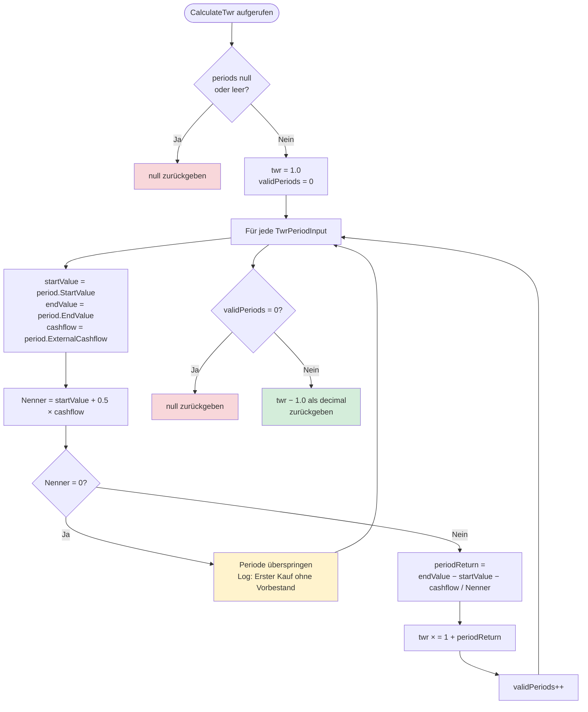

# ReturnCalculationService – Berechnungsflüsse

**Modul:** `FinanceManager.Application.Securities.ReturnAnalysis`
**Quellcode:** `FinanceManager.Application/Securities/ReturnAnalysis/ReturnCalculationService.cs`
**Interface:** `FinanceManager.Application/Securities/ReturnAnalysis/IReturnCalculationService.cs`

Der `ReturnCalculationService` implementiert ausschließlich reine Finanzmathematik – ohne Datenbankzugriff, ohne Zustand, vollständig thread-sicher. Er wird vom `ReturnAnalysisService` (→ [return-analysis-service.md](return-analysis-service.md)) aufgerufen und kann parallel in beliebigen Kontexten eingesetzt werden.

---

## 1. Übersicht aller Berechnungsmethoden

| Methode | Eingaben | Formel | Besonderheiten / Guards |
|---|---|---|---|
| `CalculateTotalReturn` | `investedCapital`, `currentMarketValue`, `netDividends` | `(MarketValue + NetDividends − InvestedCapital) / InvestedCapital` | `null` wenn `investedCapital = 0` |
| `CalculateTwr` | `IReadOnlyList<TwrPeriodInput>` | Produkt aller `(1 + periodReturn)` − 1; Modified Dietz je Periode | Periode wird übersprungen wenn Nenner = 0; `null` wenn keine validen Perioden |
| `CalculateIrr` | `IReadOnlyList<CashflowPoint>`, `maxIterations=100` | NPV = Σ CF_i / (1 + r)^t_i = 0; Actual/365 | Newton-Raphson ab 10%; Bisection-Fallback [-0,99; 10,0]; `null` bei kein Vorzeichenwechsel oder Nicht-Konvergenz |
| `CalculateCagr` | `startValue`, `endValue`, `years` | `(endValue / startValue)^(1/years) − 1` | `null` wenn `years ≤ 0` oder `startValue ≤ 0`; NaN/Infinity → `null` |
| `CalculateVolatility` | `IReadOnlyList<decimal>` (Tagespreise) | `StdDev(logReturns) × √252` | Bessel-Korrektur (n−1); überspringt nicht-positive Preise; `null` wenn < 2 valide Log-Renditen |
| `CalculateMaxDrawdown` | `IReadOnlyList<decimal>` (Portfoliowerte) | `min((Value − Peak) / Peak)` | Ergebnis ≤ 0; `null` wenn < 2 Datenpunkte |
| `CalculateSharpeRatio` | `annualisedReturn`, `riskFreeRate`, `volatility` | `(Return − RiskFreeRate) / Volatility` | `null` wenn `volatility = 0` |
| `CalculateDividendYield` | `totalDividends`, `investedCapital` | `TotalDividends / InvestedCapital` | `null` wenn `investedCapital = 0` |
| `CalculateTaxRate` | `totalTaxes`, `grossReturn` | `TotalTaxes / |GrossReturn|` | `null` wenn `grossReturn = 0` |

---

## 2. TWR-Berechnung (Modified Dietz)



**Formel je Periode (Modified Dietz, GIPS-konform):**

```
periodReturn = (EndValue − StartValue − ExternalCashflow) / (StartValue + 0.5 × ExternalCashflow)
```

**Gesamter TWR:**

```
TWR = ∏(1 + periodReturn_i) − 1
```

---

## 3. IRR-Berechnung (Newton-Raphson mit Bisection-Fallback)

```mermaid
flowchart TD
    A([CalculateIrr aufgerufen]) --> B{< 2 Cashflows?}
    B -- Ja --> Z1[null zurückgeben]
    B -- Nein --> C{Vorzeichenwechsel\nvorhanden?}
    C -- Nein --> Z2[null zurückgeben\nKein Vorzeichenwechsel]
    C -- Ja --> D[t0 = erstes Datum\nZeiten in Actual/365]

    D --> E[Newton-Raphson starten\nStartwert rate = 0.10]
    E --> F[Für iter = 0 bis maxIterations]
    F --> G[npv = Σ CF_i / 1+rate^t_i\nderivative = −Σ CF_i×t_i / 1+rate^t_i+1]

    G --> H{npv, derivative\nNaN oder derivative=0?}
    H -- Ja --> K[Bisection-Fallback]
    H -- Nein --> I[newRate = rate − npv / derivative]
    I --> J{|newRate − rate|\n< Toleranz 1e-7?}
    J -- Ja --> Z3[newRate zurückgeben\n✓ Konvergenz N-R]
    J -- Nein --> J2{rate außerhalb\n−0.99 bis 100.0?}
    J2 -- Ja --> K
    J2 -- Nein --> F

    K[Bisection: lo=−0.99\nhi=10.0] --> L{npvLo × npvHi > 0?}
    L -- Ja --> Z4[null zurückgeben\nKein Vorzeichenwechsel im Intervall]
    L -- Nein --> M[mid = lo + hi / 2]
    M --> N{|npvMid| < Toleranz\noder Intervall < Toleranz?}
    N -- Ja --> Z5[mid zurückgeben\n✓ Konvergenz Bisection]
    N -- Nein --> O{npvLo × npvMid < 0?}
    O -- Ja --> P[hi = mid]
    O -- Nein --> Q[lo = mid]
    P --> M
    Q --> M
    M --> R{maxIterations\nerreicht?}
    R -- Ja --> Z6[null zurückgeben\nNicht konvergiert]

    style Z1 fill:#f8d7da
    style Z2 fill:#f8d7da
    style Z4 fill:#f8d7da
    style Z6 fill:#f8d7da
    style Z3 fill:#d4edda
    style Z5 fill:#d4edda
```

**NPV-Funktion (XIRR, Actual/365):**

```
NPV(r) = Σ CF_i / (1 + r)^(t_i)    wobei t_i = (Date_i − Date_0) / 365
```

**NPV-Ableitung:**

```
NPV'(r) = −Σ CF_i × t_i / (1 + r)^(t_i + 1)
```

**Cashflow-Konvention:**
- Käufe: negativ (Abfluss)
- Verkäufe, Dividenden: positiv (Zufluss)
- Aktueller Marktwert: terminaler Zufluss

---

## 4. Weitere Berechnungen (Kurzübersicht)

### CAGR (Compound Annual Growth Rate)

```
CAGR = (EndValue / StartValue)^(1 / years) − 1
```

**Guards:** `years > 0`, `startValue > 0`; NaN/Infinity → `null`. Aufgerufen in `ReturnAnalysisService` nur wenn Haltedauer ≥ 1 Jahr.

---

### Volatilität (annualisiert)

```
σ_jährlich = StdDev(log(P_t / P_{t-1})) × √252
```

- Log-Renditen werden mit Bessel-Korrektur (n−1) varianzbereinigt
- Nicht-positive Preise werden übersprungen
- Konstante `TradingDaysPerYear = 252.0`

---

### MaxDrawdown

```
MaxDrawdown = min_t ((Value_t − Peak_t) / Peak_t)
```

- `Peak_t` = historisches Maximum bis Zeitpunkt t
- Ergebnis ist stets ≤ 0 (z.B. −0,25 = −25 % Drawdown)

---

### Sharpe Ratio

```
Sharpe = (AnnualisedReturn − RiskFreeRate) / Volatility
```

- Nur berechnet wenn `ShowSharpeRatio = true` in den Benutzereinstellungen
- `null` wenn `Volatility = 0`

---

### Dividendenrendite

```
DividendYield = TotalDividends / InvestedCapital
```

- Bezogen auf ein Kalenderjahr (aktuelle Implementierung)
- `null` wenn `InvestedCapital = 0`

---

### Steuerquote

```
TaxRate = TotalTaxes / |GrossReturn|
```

- `GrossReturn = MarketValue + GrossDividends − InvestedCapital`
- `null` wenn `GrossReturn = 0`

---

## Abhängigkeiten

| Komponente | Typ | Beschreibung |
|---|---|---|
| `ILogger<ReturnCalculationService>` | Framework | Diagnostik-Logging für Debug-/Warn-Meldungen bei ungültigen Eingaben |

Keine Datenbankzugriffe. Kein interner Zustand. Alle Eingaben werden als `IReadOnlyList<T>` oder `decimal`-Parameter übergeben.
