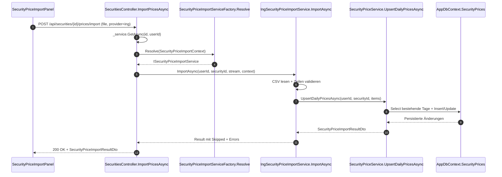
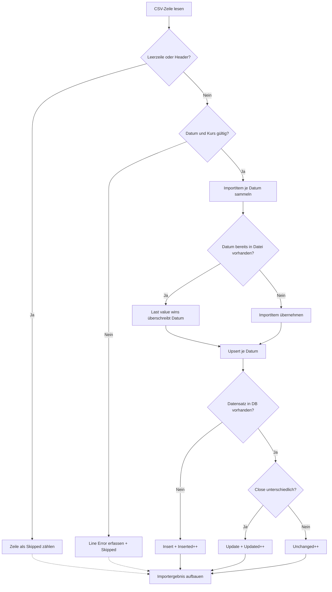

# Wertpapierkurse ING-CSV-Import inkl. Upsert/API/UI

## Titel & Kontext

Dieser Ablauf dokumentiert den implementierten End-to-End-Import von ING-Kursdateien über UI und API bis zur Upsert-Persistenz. Der Flow startet auf der Kursseite eines Wertpapiers (`SecurityPricesListViewModel` + `SecurityPriceImportPanel`) und endet im `SecurityPriceService.UpsertDailyPricesAsync(...)` mit den Zählern `Inserted`, `Updated`, `Unchanged`, `Skipped` und `Errors`. Ziel ist ein mandantengetrennter, wiederholbarer CSV-Import mit transparenter Fehlerdiagnose pro Zeile.

## Diagramm A – End-to-End-Sequenz (UI → API → Importservice → Upsert)

## Diagramm B – Upsert- und Parser-Entscheidungen

## Schrittbeschreibung

1. **UI-Aktion öffnet Import-Overlay**
   - Referenz: `FinanceManager.Web/ViewModels/Securities/Prices/SecurityPricesListViewModel.cs` (`GetRibbonRegisterDefinition`, `RequestOpenImport`)
   - Eingaben: `Id` des geladenen Wertpapiers.
   - Ausgaben: `UiOverlaySpec` mit `SecurityPriceImportPanel` und `SecurityId`.
   - Seiteneffekte: UI-Event `OpenOverlay`.

2. **Dateiauswahl und Upload-Aufruf**
   - Referenz: `FinanceManager.Web/Components/Shared/SecurityPriceImportPanel.razor` (`OnFileSelected`, `ImportAsync`)
   - Eingaben: `IBrowserFile`, `SecurityId`, fixer Provider `ing`.
   - Ausgaben: API-Aufruf `Api.Securities_ImportPricesAsync(...)`.
   - Seiteneffekte: `_busy`/`_result`/`_error` State-Änderungen im Panel.

3. **Multipart-Aufbau im API-Client**
   - Referenz: `FinanceManager.Shared/ApiClient.Securities.cs` (`Securities_ImportPricesAsync`)
   - Eingaben: Stream, Dateiname, `provider`, optional `contentType`.
   - Ausgaben: `POST /api/securities/{id}/prices/import` mit `file` + `provider`.
   - Seiteneffekte: `LastError` wird bei Nicht-Erfolg gesetzt (`EnsureSuccessOrSetErrorAsync`).

4. **Controller-Validierung und Provider-Auflösung**
   - Referenz: `FinanceManager.Web/Controllers/SecuritiesController.cs` (`ImportPricesAsync`)
   - Eingaben: `id`, `file`, `provider`, `Current.UserId`.
   - Ausgaben: `404` bei fehlendem/foreign Security-Owner, sonst Aufruf Importservice.
   - Seiteneffekte: strukturierte Logs; `SecurityPriceImportContext` Erstellung.

5. **Factory selektiert Importservice**
   - Referenz: `FinanceManager.Infrastructure/Securities/SecurityPriceImportServiceFactory.cs` (`Resolve`)
   - Eingaben: `SecurityPriceImportContext`.
   - Ausgaben: passender `ISecurityPriceImportService` (aktuell `IngSecurityPriceImportService`).
   - Seiteneffekte: `InvalidOperationException`, wenn kein Service `CanHandle(...)` erfüllt.

6. **ING-Parser validiert und normalisiert CSV**
   - Referenz: `FinanceManager.Infrastructure/Securities/IngSecurityPriceImportService.cs` (`CanHandle`, `ImportAsync`)
   - Eingaben: CSV-Stream, deutsches Format `dd.MM.yyyy HH:mm:ss` + Dezimal-Komma.
   - Ausgaben: `SecurityPriceImportItem` je Datum, plus `Skipped`/`Errors`.
   - Seiteneffekte: Ungültige Zeilen werden nicht persistiert; gleiche Tage in Datei werden überschrieben (`parsedByDate[date]`).

7. **Upsert-Entscheidung pro Tag**
   - Referenz: `FinanceManager.Infrastructure/Securities/SecurityPriceService.cs` (`UpsertDailyPricesAsync`)
   - Eingaben: `ownerUserId`, `securityId`, deduplizierte Items.
   - Ausgaben: Zähler für `Inserted`, `Updated`, `Unchanged`.
   - Seiteneffekte: DB-Insert/Update auf `SecurityPrices`; `SaveChangesAsync` nur bei echten Änderungen.

8. **Response-Mapping und UI-Anzeige**
   - Referenz: `FinanceManager.Web/Controllers/SecuritiesController.cs` (`ImportPricesAsync`), `FinanceManager.Web/Components/Shared/SecurityPriceImportPanel.razor`
   - Eingaben: aggregiertes `SecurityPriceImportResultDto`.
   - Ausgaben: `200 OK` bei mindestens einem validen Upsert-Kandidaten; andernfalls `400 Err_Invalid_Import`.
   - Seiteneffekte: UI zeigt Zähler und pro Zeile Fehlerliste.

## Fehlerbehandlung

- **Datei fehlt oder leer**  
  - Pfad: `SecuritiesController.ImportPricesAsync`  
  - Verhalten: `400 BadRequest` mit `Err_Invalid_File`.

- **Wertpapier nicht gefunden oder nicht owner-scoped**  
  - Pfad: `SecuritiesController.ImportPricesAsync` (`_service.GetAsync`)  
  - Verhalten: `404 NotFound`.

- **Provider nicht auflösbar**  
  - Pfad: `SecurityPriceImportServiceFactory.Resolve` wirft `InvalidOperationException`  
  - Verhalten: Controller mapped auf `400 BadRequest` (`ApiErrorFactory.FromArgumentException`).

- **CSV ohne valide Kurszeilen**  
  - Pfad: `IngSecurityPriceImportService.ImportAsync` liefert `Inserted=Updated=Unchanged=0`  
  - Verhalten: Controller liefert `400 BadRequest` mit `Err_Invalid_Import`.

- **Zeilenfehler (Datum/Kurs/Spalten/negativ)**  
  - Pfad: `IngSecurityPriceImportService.ImportAsync`  
  - Verhalten: Zeile wird als `Skipped` gezählt, Fehler in `Errors` gesammelt; valide Zeilen laufen weiter.

- **Unerwartete Laufzeitfehler**  
  - Pfad: globaler `catch (Exception)` im Controller  
  - Verhalten: `500 InternalServerError` mit `ApiErrorFactory.Unexpected`, Fehler wird geloggt.

## Abhängigkeiten

- Web/UI:
  - `FinanceManager.Web/ViewModels/Securities/Prices/SecurityPricesListViewModel.cs`
  - `FinanceManager.Web/Components/Shared/SecurityPriceImportPanel.razor`
- API:
  - `FinanceManager.Web/Controllers/SecuritiesController.cs`
  - `FinanceManager.Shared/ApiClient.Securities.cs`
- Application Contracts:
  - `FinanceManager.Application/Securities/ISecurityPriceImportService.cs`
  - `FinanceManager.Application/Securities/ISecurityPriceImportServiceFactory.cs`
  - `FinanceManager.Application/Securities/ISecurityPriceService.cs`
- Infrastructure:
  - `FinanceManager.Infrastructure/Securities/SecurityPriceImportServiceFactory.cs`
  - `FinanceManager.Infrastructure/Securities/IngSecurityPriceImportService.cs`
  - `FinanceManager.Infrastructure/Securities/SecurityPriceService.cs`
  - `FinanceManager.Infrastructure/ServiceCollectionExtensions.cs`
- DTOs:
  - `FinanceManager.Shared/Dtos/Securities/SecurityPriceImportDtos.cs`
- Tests:
  - `FinanceManager.Tests/Infrastructure/Securities/IngSecurityPriceImportServiceTests.cs`
  - `FinanceManager.Tests/Infrastructure/Securities/SecurityPriceServiceUpsertTests.cs`
  - `FinanceManager.Tests/Infrastructure/Securities/SecurityPriceImportServiceFactoryTests.cs`
  - `FinanceManager.Tests/ViewModels/SecurityPricesViewModelTests.cs`
  - `FinanceManager.Tests/Components/SecurityPriceImportPanelTests.cs`

## Querverweise

- API-Dokumentation: [`../api/SecuritiesController.md`](../api/SecuritiesController.md#post-apisecuritiesidpricesimport)
- Architektur-Blueprint: [`../architecture/architecture-blueprint-wertpapierkurse-ing.md`](../architecture/architecture-blueprint-wertpapierkurse-ing.md)
- Anforderungen: [`../requirements/wertpapierkurse-ing-requirements.md`](../requirements/wertpapierkurse-ing-requirements.md)
- Planung: [`../planning/planning-wertpapierkurse-ing.md`](../planning/planning-wertpapierkurse-ing.md)
- Testplan: [`../tests/wertpapierkurse-ing-testplan.md`](../tests/wertpapierkurse-ing-testplan.md)
