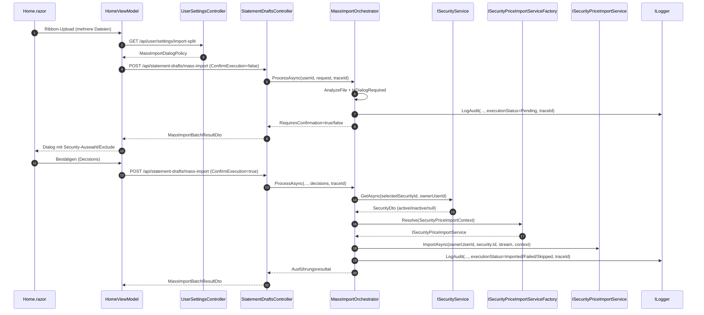
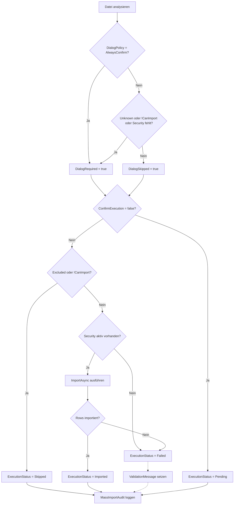

# Massenimport ING Wertpapierkurse (Startseite, Analyse + Bestätigung)

## Titel & Kontext

Dieser Ablauf dokumentiert den implementierten Zwei-Phasen-Import für ING-Wertpapierkurse über die Startseite. Phase 1 analysiert alle hochgeladenen Dateien (`ConfirmExecution=false`) und liefert pro Datei Entscheidungen/Validierungen zurück; Phase 2 führt den Import nach Nutzerbestätigung (`ConfirmExecution=true`) aus. Der Flow verbindet Home-UI, User-Settings (Dialogpolicy), API-Orchestrierung, Re-Validierung des gewählten Wertpapiers und Audit-Logging.

## Diagramm A – Zwei-Phasen-Sequenz (Analyse + Ausführung)

## Diagramm B – Skip-Matrix und Policy-Entscheidung

## Schrittbeschreibung

1. **Upload-Start auf der Home-Seite**
   - Referenz: `FinanceManager.Web/Components/Pages/Home.razor`, `FinanceManager.Web/ViewModels/Home/HomeViewModel.cs` (`GetRibbonRegisterDefinition`, `ProcessMassImportSelectionAsync`)
   - Eingaben: `IBrowserFile[]` vom Ribbon-Upload.
   - Ausgaben: `MassImportFileUploadDto[]` mit `FileId`, `FileName`, `ContentType`, `Content`.
   - Seiteneffekte: Fortschrittszustand (`UploadInProgress`, `UploadDone`, `CurrentFileName`), ggf. Pending-Dialogstatus.

2. **Dialogpolicy laden (Setup-Einfluss)**
   - Referenz: `FinanceManager.Web/ViewModels/Home/HomeViewModel.cs` (`_api.UserSettings_GetImportSplitAsync`), `FinanceManager.Web/Components/Pages/Setup/SetupStatementTab.razor`, `FinanceManager.Web/Controllers/UserSettingsController.cs` (`GetImportSplitAsync`, `UpdateImportSplitAsync`)
   - Eingaben: aktueller Benutzerkontext.
   - Ausgaben: `MassImportDialogPolicy` (`AlwaysConfirm` oder `OnMissingInformation`) in `ImportSplitSettingsDto`.
   - Seiteneffekte: Setup-Änderungen beeinflussen direkt, ob die Home-Seite immer bestätigt oder nur bei fehlenden Informationen.

3. **Phase 1 – Analyse ohne Ausführung**
   - Referenz: `FinanceManager.Web/Controllers/StatementDraftsController.cs` (`ProcessMassImportAsync`), `FinanceManager.Infrastructure/Statements/MassImportOrchestrator.cs` (`ProcessAsync`, `AnalyzeFile`, `IsDialogRequired`)
   - Eingaben: Request mit `ConfirmExecution=false`, `DialogPolicy`, `Files`.
   - Ausgaben: `MassImportBatchResultDto` mit `DialogRequired`, `DialogSkipped`, `RequiresConfirmation`, Datei-Metadaten (`CanImport`, `ValidationMessage`, `SelectedSecurityId`, `DecisionSource=AutoDetected`).
   - Seiteneffekte: Audit-Logeintrag pro Datei im Pending-Zustand.

4. **Nutzerentscheidung auf der Home-Seite**
   - Referenz: `FinanceManager.Web/Components/Pages/Home.razor`, `FinanceManager.Web/ViewModels/Home/HomeViewModel.cs` (`SetPendingFileSecurity`, `SetPendingFileExcluded`, `ConfirmMassImportAsync`)
   - Eingaben: manuelle Security-Zuordnung und Exclude-Flags.
   - Ausgaben: `MassImportFileDecisionDto[]` mit `FileId`, `Excluded`, `SelectedSecurityId`.
   - Seiteneffekte: `DecisionSource` wird auf `UserConfirmed` gesetzt.

5. **Phase 2 – Ausführung nach Bestätigung**
   - Referenz: `FinanceManager.Infrastructure/Statements/MassImportOrchestrator.cs` (`ProcessAsync`, `ImportSecurityPricesAsync`)
   - Eingaben: Request mit `ConfirmExecution=true` und `Decisions`.
   - Ausgaben: pro Datei `ExecutionStatus` (`Imported`, `Skipped`, `Failed`) sowie ggf. `PriceImportResult`.
   - Seiteneffekte: Datei wird übersprungen, wenn `Excluded=true` oder `CanImport=false`.

6. **Re-Validierung vor Persistenz**
   - Referenz: `FinanceManager.Infrastructure/Statements/MassImportOrchestrator.cs` (`ImportSecurityPricesAsync`)
   - Eingaben: `SelectedSecurityId` aus Nutzerentscheidung.
   - Ausgaben: nur bei gültigem Treffer in `_securityService.GetAsync(...)` und `security.IsActive==true` wird `ImportAsync(...)` ausgeführt.
   - Seiteneffekte: bei `null`/inaktivem Wertpapier `ExecutionStatus=Failed` und `ValidationMessage="Assigned security is not available or inactive."`.

7. **Audit-Logging**
   - Referenz: `FinanceManager.Infrastructure/Statements/MassImportOrchestrator.cs` (`LogAudit`), `FinanceManager.Web/Controllers/StatementDraftsController.cs` (`HttpContext.TraceIdentifier`)
   - Eingaben: `batchId`, `traceId`, Datei-Resultat.
   - Ausgaben: strukturierter Logeintrag im Format  
     `MassImportAudit batchId={BatchId} fileId={FileId} fileName={FileName} fileType={FileType} serviceDisplayName={ServiceDisplayName} excluded={Excluded} selectedSecurityId={SelectedSecurityId} decisionSource={DecisionSource} executionStatus={ExecutionStatus} traceId={TraceId}`
   - Seiteneffekte: Nachvollziehbarkeit über Analyse- und Ausführungsphase hinweg.

## Skip-Policy-Regeln (AlwaysConfirm vs OnMissingInformation)

- **AlwaysConfirm**
  - `IsDialogRequired(...)` gibt immer `true` zurück.
  - Bei `ConfirmExecution=false` endet die Anfrage immer in `RequiresConfirmation=true`, auch bei vollständig erkannten Dateien.

- **OnMissingInformation**
  - `IsDialogRequired(...)` gibt nur dann `true` zurück, wenn mindestens eine Datei:
    - `FileType == Unknown` ist, oder
    - `CanImport == false` hat, oder
    - `FileType == SecurityPrices` und `SelectedSecurityId` fehlt.
  - Sind alle Dateien vollständig, wird ohne zusätzlichen Dialog ausgeführt (`DialogSkipped=true`).

## Fehlerbehandlung

- **Ungültiger Batch-Request (keine Dateien)**
  - Pfad: `StatementDraftsController.ProcessMassImportAsync`
  - Verhalten: `400 BadRequest` (`Err_Invalid_File`).

- **Orchestrator nicht registriert**
  - Pfad: `StatementDraftsController.ProcessMassImportAsync`
  - Verhalten: `500 InternalServerError` (`ApiErrorFactory.Unexpected`).

- **Datei nicht importierbar oder explizit ausgeschlossen**
  - Pfad: `MassImportOrchestrator.ProcessAsync`
  - Verhalten: `ExecutionStatus=Skipped` (kein Persistenzversuch).

- **Security fehlt/inaktiv trotz Nutzerauswahl**
  - Pfad: `MassImportOrchestrator.ImportSecurityPricesAsync` via `_securityService.GetAsync`
  - Verhalten: `ExecutionStatus=Failed`, verständliche `ValidationMessage`, kein Aufruf von `ImportAsync`.

- **ING-Import ohne verwertbare Zeilen**
  - Pfad: `MassImportOrchestrator.ImportSecurityPricesAsync`
  - Verhalten: `ExecutionStatus=Failed` mit `ValidationMessage="No valid security price rows found."`.

- **Laufzeitfehler während Dateiausführung**
  - Pfad: `MassImportOrchestrator.ProcessAsync` (`catch (Exception)`)
  - Verhalten: `ExecutionStatus=Failed`, Fehler wird geloggt.

## Abhängigkeiten

- UI / ViewModels:
  - `FinanceManager.Web/Components/Pages/Home.razor`
  - `FinanceManager.Web/ViewModels/Home/HomeViewModel.cs`
  - `FinanceManager.Web/Components/Pages/Setup/SetupStatementTab.razor`
- API:
  - `FinanceManager.Web/Controllers/StatementDraftsController.cs`
  - `FinanceManager.Web/Controllers/UserSettingsController.cs`
- Orchestrierung / Services:
  - `FinanceManager.Infrastructure/Statements/MassImportOrchestrator.cs`
  - `FinanceManager.Application/Securities/ISecurityService.cs`
  - `FinanceManager.Application/Securities/ISecurityPriceImportServiceFactory.cs`
- DTOs:
  - `FinanceManager.Shared/Dtos/Statements/MassImportDtos.cs`
  - `FinanceManager.Shared/Dtos/Securities/SecurityPriceImportDtos.cs`
- Tests:
  - `FinanceManager.Tests/Statements/MassImportOrchestratorTests.cs`
  - `FinanceManager.Tests/ViewModels/HomeViewModelTests.cs`
  - `FinanceManager.Tests.Integration/ApiClient/ApiClientStatementDraftsTests.cs`

## Relevante Testabdeckung

- `MassImportOrchestratorTests`: validiert Skip-Matrix, Policy-Verhalten, Re-Validierung (`GetAsync` + active check) und Exclude-Pfade.
- `HomeViewModelTests`: validiert Zwei-Phasen-UI-Fluss inkl. Laden der `MassImportDialogPolicy`, Pending-Dialog und Confirm-Request mit Decisions.
- `ApiClientStatementDraftsTests`: validiert API-Vertrag für Analyze- und Confirm-Call über `StatementDrafts_ProcessMassImportAsync`.

## Querverweise

- API-Dokumentation: [`../api/StatementDraftsController.md`](../api/StatementDraftsController.md)
- Verwandter Import-Flow: [`import-classification.md`](import-classification.md)
