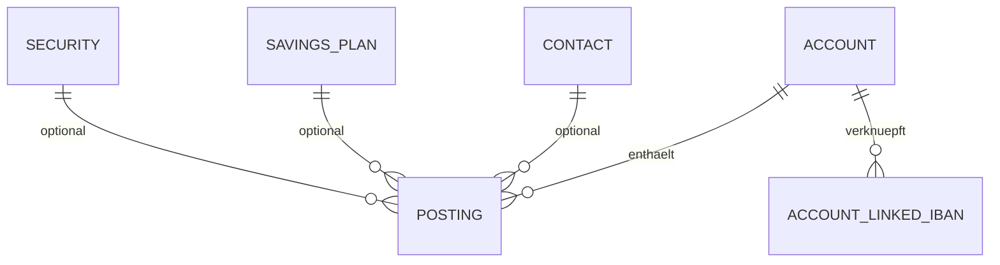

← [Zurück zur Übersicht](index.md)

# Konten und Buchungen — Datenmodell

## Entitäten

### `Account`

| Eigenschaft | Typ | Beschreibung |
|-------------|-----|--------------|
| `Id` | `Guid` | Konto-ID |
| `OwnerUserId` | `Guid` | Eigentümer |
| `Type` | `AccountType` | Kontotyp |
| `Name` | `string` | Kontobezeichnung |
| `Iban` | `string?` | Optionale IBAN |
| `CurrentBalance` | `decimal` | Aktueller Kontostand |
| `BankContactId` | `Guid` | Referenz auf Bankkontakt |
| `SecurityProcessingEnabled` | `bool` | Aktiviert Wertpapierverarbeitung |
| `IsCollectionAccount` | `bool` | Markiert ein Konto als Sammelkonto |

### `AccountLinkedIban`

| Eigenschaft | Typ | Beschreibung |
|-------------|-----|--------------|
| `Id` | `Guid` | Verknüpfungs-ID |
| `AccountId` | `Guid` | Zugehöriges Sammelkonto |
| `Iban` | `string` | Verknüpfte Unter-IBAN |

### `Posting`

| Eigenschaft | Typ | Beschreibung |
|-------------|-----|--------------|
| `Id` | `Guid` | Buchungs-ID |
| `Kind` | `PostingKind` | Art der Buchung |
| `AccountId` | `Guid?` | Zugeordnetes Konto |
| `ContactId` | `Guid?` | Zugeordneter Kontakt |
| `SavingsPlanId` | `Guid?` | Zugeordneter Sparplan |
| `SecurityId` | `Guid?` | Zugeordnetes Wertpapier |
| `BookingDate` | `DateTime` | Buchungsdatum |
| `ValutaDate` | `DateTime` | Valutadatum |
| `Amount` | `decimal` | Betrag |
| `ReversalForPostingId` | `Guid?` | Referenz auf Original bei Storno |

## Beziehungen

- Ein `Account` hat viele `Posting`-Einträge.
- Ein `Account` kann mehrere `AccountLinkedIban`-Einträge besitzen.
- Eine `Posting`-Zeile kann optional auf Kontakt, Sparplan oder Wertpapier verweisen.

## Diagramm

