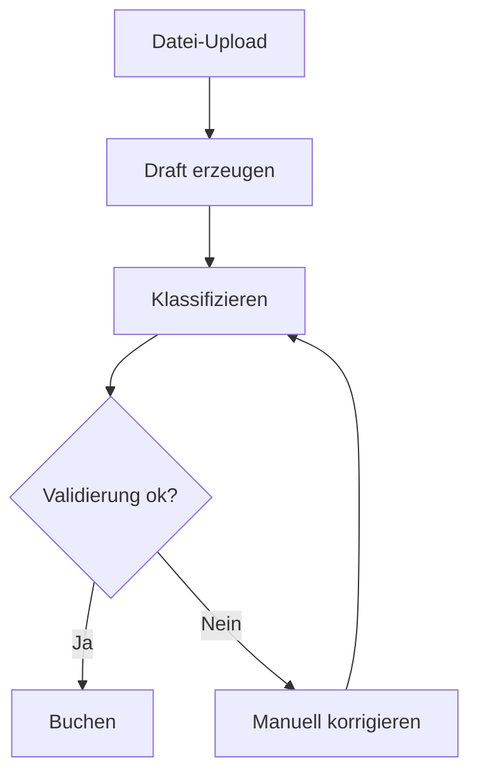

← [Zurück zur Übersicht](index.md)

# Kontoauszüge und Import — Technischer Ablauf

## Übersicht

Der Import besteht aus Upload, Draft-Erstellung, Klassifikation, Validierung und Buchung. Die Orchestrierung erfolgt über `StatementDraftsController` und `StatementDraftService`.

## Ablauf

### 1. Upload und Draft-Erstellung

Datei-Upload wird angenommen und in Entwürfe überführt.

Beteiligte Komponenten:
- `StatementDraftsController.Upload` / `StatementDraftsController.MassImport`
- `StatementDraftService.CreateEmptyDraftAsync`
- `StatementDraftService.AddEntryAsync`

### 2. Klassifikation und Zuordnung

Entwurfszeilen werden automatisiert oder manuell ergänzt.

Beteiligte Komponenten:
- `StatementDraftService.ClassifyAsync`
- `StatementDraftService.SetEntryContactAsync`
- `StatementDraftService.AssignSavingsPlanAsync`
- `StatementDraftService.SetEntrySecurityAsync`

### 3. Validierung und Buchung

Der Entwurf wird geprüft und in Buchungen geschrieben.

Beteiligte Komponenten:
- `StatementDraftService.ValidateAsync`
- `StatementDraftService.BookAsync`
- `StatementDraftService.CommitAsync`

## Diagramm

## Fehlerbehandlung

- Ungültige Datei- oder Zuordnungsdaten führen zu Validierungsfehlern.
- Nicht autorisierte Draft-Zugriffe werden abgewiesen.
- Laufende Hintergrundjobs (Klassifikation/Bulk-Booking) besitzen Status- und Cancel-Endpunkte.
