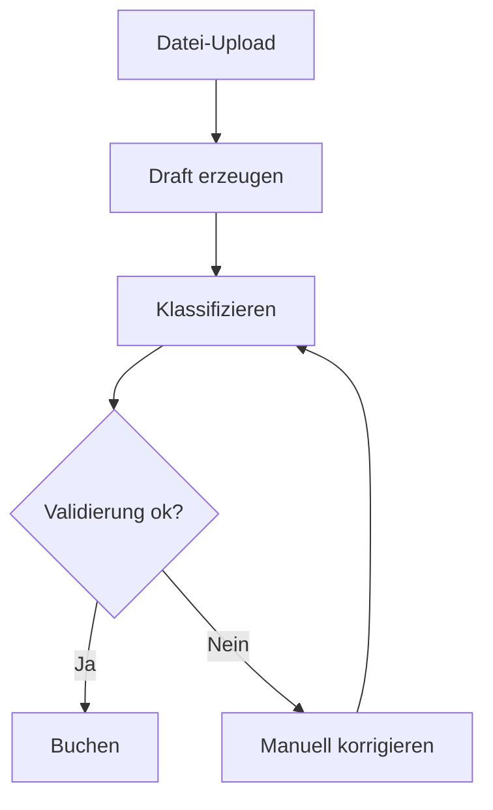

← [Zurück zur Übersicht](index.md)

# Kontoauszüge und Import — Technischer Ablauf

## Übersicht

Der Import besteht aus Upload, Draft-Erstellung, Klassifikation, Validierung und Buchung. Die Orchestrierung erfolgt über `StatementDraftsController` und `StatementDraftService`.

## Ablauf

### 1. Upload und Draft-Erstellung

Datei-Upload wird angenommen und in Entwürfe überführt.

Beteiligte Komponenten:
- `StatementDraftsController.Upload` / `StatementDraftsController.MassImport`
- `StatementDraftService.CreateEmptyDraftAsync`
- `StatementDraftService.AddEntryAsync`

#### Formaterkennung

`IStatementFileFactory` erkennt den Dateityp, anschließend versuchen die registrierten `IStatementFileParser` die Datei positionsbasiert über XML-Templates zu lesen. Für den ING-CSV-Export existieren in `ING_CSV_StatementFileParser._Templates` zwei Templates:

- Altes Layout (9 Spalten): `Buchung;Valuta;Auftraggeber/Empfänger;Buchungstext;Verwendungszweck;Saldo;Währung;Betrag;Währung`
- Neues Layout (10 Spalten, ab ca. September 2026): zusätzliche Spalte `Referenz` zwischen `Verwendungszweck` und `Saldo`; die Spalte wird verworfen (`variable=''`).

Die Templates werden sequenziell versucht; ein Formatfehler (z. B. `FormatException` beim `Betrag`) verwirft das Template und das nächste wird probiert. Gelingt kein Template, gilt die Datei im Massenimport als `Unknown` und erscheint im Review-Dialog mit lokalisierter Meldung `MassImport_Validation_UnknownFileType`.

### 2. Klassifikation und Zuordnung

Entwurfszeilen werden automatisiert oder manuell ergänzt.

Beteiligte Komponenten:
- `StatementDraftService.ClassifyAsync`
- `StatementDraftService.SetEntryContactAsync`
- `StatementDraftService.AssignSavingsPlanAsync`
- `StatementDraftService.SetEntrySecurityAsync`

### 3. Validierung und Buchung

Der Entwurf wird geprüft und in Buchungen geschrieben.

Beteiligte Komponenten:
- `StatementDraftService.ValidateAsync`
- `StatementDraftService.BookAsync`
- `StatementDraftService.CommitAsync`

## Diagramm

```mermaid
flowchart TD
    A[Datei-Upload] --> B[Draft erzeugen]
    B --> C[Klassifizieren]
    C --> D{Validierung ok?}
    D -- Ja --> E[Buchen]
    D -- Nein --> F[Manuell korrigieren]
    F --> C
```

## Fehlerbehandlung

- Ungültige Datei- oder Zuordnungsdaten führen zu Validierungsfehlern.
- Nicht autorisierte Draft-Zugriffe werden abgewiesen.
- Laufende Hintergrundjobs (Klassifikation/Bulk-Booking) besitzen Status- und Cancel-Endpunkte.
