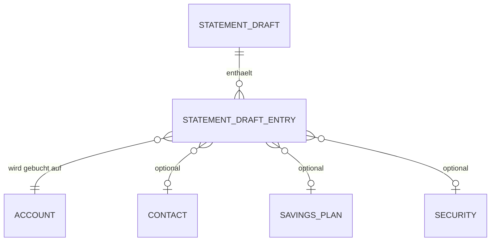

← [Zurück zur Übersicht](index.md)

# Kontoauszüge und Import — Datenmodell

## Entitäten

### `StatementDraft`

| Eigenschaft | Typ | Beschreibung |
|-------------|-----|--------------|
| `Id` | `Guid` | Draft-ID |
| `OwnerUserId` | `Guid` | Eigentümer |
| `OriginalFileName` | `string` | Ursprünglicher Dateiname |
| `DetectedAccountId` | `Guid?` | Erkannte Kontozuordnung |
| `Status` | `StatementDraftStatus` | Draft-Status |
| `UploadGroupId` | `Guid?` | Gruppierung bei Massenimport |

### `StatementDraftEntry`

| Eigenschaft | Typ | Beschreibung |
|-------------|-----|--------------|
| `DraftId` | `Guid` | Zugehöriger Draft |
| `EntryNumber` | `int` | Zeilennummer |
| `BookingDate` | `DateTime` | Buchungsdatum |
| `Amount` | `decimal` | Betrag |
| `Subject` | `string` | Verwendungszweck |
| `ContactId` | `Guid?` | Zugeordneter Kontakt |
| `SavingsPlanId` | `Guid?` | Zugeordneter Sparplan |
| `SecurityId` | `Guid?` | Zugeordnetes Wertpapier |
| `Status` | `StatementDraftEntryStatus` | Bearbeitungsstatus |

## Beziehungen

- Ein `StatementDraft` enthält viele `StatementDraftEntry`-Zeilen.
- Beim Buchen entstehen daraus `Posting`-Einträge.

## Diagramm

