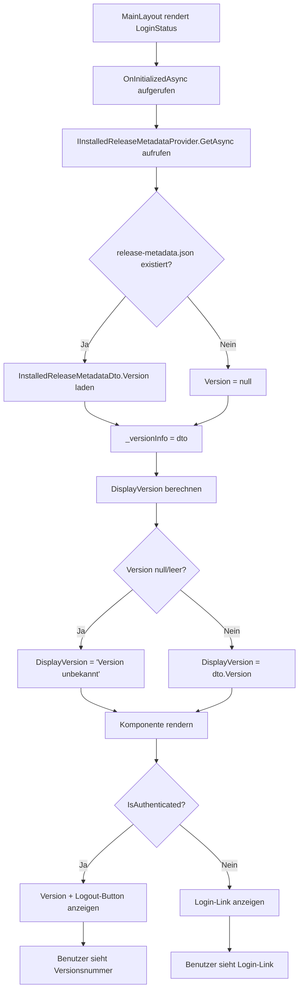

← [Zurück zur Übersicht](index.md)

# Programminformationen — Technischer Ablauf

## Übersicht

Die `LoginStatus.razor`-Komponente lädt die Versionsinformation über `IInstalledReleaseMetadataProvider.GetAsync()` und zeigt die Version im Menü-Fußbereich an. Der Ablauf erfolgt während der Initialisierung der Komponente; bei fehlender Version wird ein Fallback-Text angezeigt.

## Ablauf

### 1. Komponente wird gerendert

Die `LoginStatus.razor`-Komponente wird vom `MainLayout.razor` geladen und in den Bereich `user-area` der Seitenleiste eingefügt.

Beteiligte Komponenten:
- `MainLayout.razor` — Enthält das Layout und ruft `LoginStatus` auf
- `LoginStatus.razor` — Rendert die Versionsinformation

### 2. Komponente wird initialisiert

Beim Initialisieren der Komponente wird `OnInitializedAsync()` aufgerufen, die asynchron die Versionsinformation lädt.

Beteiligte Methoden:
- `LoginStatus.OnInitializedAsync()` — Lädt die Metadaten asynchron
- `IInstalledReleaseMetadataProvider.GetAsync()` — Liest `release-metadata.json` und gibt `InstalledReleaseMetadataDto` zurück

### 3. Versionsinformation wird geladen

Der injizierte `ReleaseMetadata` (vom Typ `IInstalledReleaseMetadataProvider`) wird aufgerufen. Der Provider liest die Datei `release-metadata.json` und gibt ein DTO mit der Versionsinformation zurück. Das DTO wird im privaten Feld `_versionInfo` gepuffert.

Beteiligte Komponenten:
- `IInstalledReleaseMetadataProvider` — Service-Interface für den Abruf von Versionsinformationen (Singleton)
- `InstalledReleaseMetadataProvider` — Implementierung, liest die Datei
- `InstalledReleaseMetadataDto` — Datenmodell mit der Eigenschaft `Version` (String, nullable)

### 4. Anzeigetext wird berechnet

Die berechnete Eigenschaft `DisplayVersion` (Typ `string`) wird evaluiert:
- Wenn `_versionInfo?.Version` nicht leer ist: die reine Versionsnummer (z. B. `1.2.3`)
- Wenn `_versionInfo?.Version` leer oder `null` ist: der Fallback-Text `"Version unbekannt"`

Beteiligte Komponenten:
- `LoginStatus.DisplayVersion` — Berechnete Eigenschaft

### 5. Komponente wird gerendert

Die Komponente wird gerendert. Es werden zwei Fälle unterschieden:

**Fall A: Benutzer authentifiziert** (`CurrentUser.IsAuthenticated == true`)
- Im `
` wird der Anzeigetext `@DisplayVersion` und der Logout-Button angezeigt.
- Beteiligte Injektionen:
  - `ICurrentUserService.IsAuthenticated` — Prüft die Authentifizierung
  - Anzeigetext aus `DisplayVersion`

**Fall B: Benutzer nicht authentifiziert** (`CurrentUser.IsAuthenticated == false`)
- Im `
` wird nur der `<a href="/login">Login</a>`-Link angezeigt.
- Die Versionsinformation wird nicht angezeigt.

Beteiligte Komponenten:
- `LoginStatus.razor` — Rendert den Markup basierend auf der Authentifizierung

### 6. Logout (optional)

Falls der Benutzer auf den Logout-Button klickt, wird `LogoutAsync()` aufgerufen. Dies ist unverändert gegenüber der Vorgängerversion.

Beteiligte Methoden:
- `LoginStatus.LogoutAsync()` — Logout-Ablauf
- `IJSRuntime.InvokeAsync<bool>("fmAuthLogout")` — Ruft JS-Logout auf
- `NavigationManager.NavigateTo("/login", forceLoad: true)` — Navigiert zur Login-Seite

## Diagramm

## Fehlerbehandlung

- **Fehlende `release-metadata.json`:** Der Provider fängt das Fehlen der Datei ab und liefert ein DTO mit `Version = null`. Dies wird durch den Fallback-Text `"Version unbekannt"` angezeigt.
- **`release-metadata.json` ist leer oder ungültig:** Das `Version`-Feld ist `null` oder leer; der Fallback-Text wird angezeigt.
- **`IInstalledReleaseMetadataProvider.GetAsync()` wirft Exception:** Die Exception wird durch die Blazor-Fehlerbehandlung abgefangen; die Komponente kann fehlschlagen (abhängig von der Error Boundary). Dies sollte in der Praxis nicht vorkommen, da der Provider robust implementiert ist.
