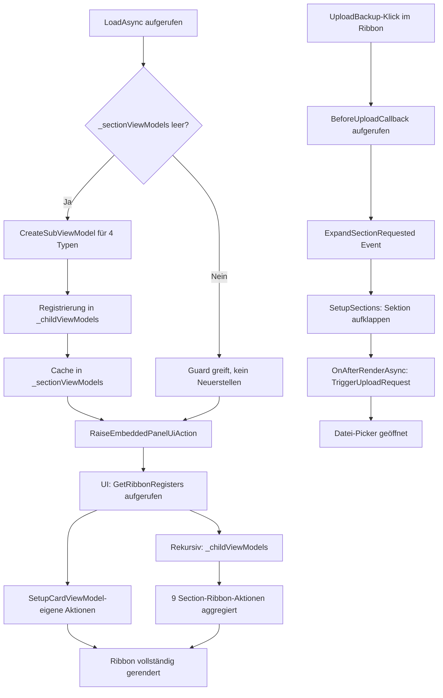

← [Zurück zur Übersicht](index.md)

# Systemverwaltung und Setup — Technischer Ablauf

## Übersicht

Die Setup-Karte aggregiert Ribbon-Aktionen aus vier Section-ViewModels über den `BaseViewModel`-Mechanismus. Beim ersten Aufruf von `LoadAsync` werden die ribbon-beitragenden Section-ViewModels via `CreateSubViewModel<T>()` als Kind-ViewModels registriert; nachfolgende Aufrufe von `GetRibbonRegisters()` schließen diese automatisch ein. Section-ViewModels ohne Ribbon-Beitrag werden erst auf Anfrage der Razor-Komponente instanziiert.

## Abläufe

### 1. Ribbon-Initialisierung beim Laden der Setup-Karte

1. `SetupCardViewModel.LoadAsync(Guid id)` wird aufgerufen (z. B. bei Navigation zur Setup-Seite).
2. Guard `_sectionViewModels.Count == 0` verhindert Doppel-Registrierung bei Re-Navigation.
3. Die vier ribbon-beitragenden Section-ViewModels werden erzeugt und im internen Cache `_sectionViewModels` gespeichert:
   - `CreateSubViewModel<SetupProfileViewModel>()` → Schlüssel `"profile"`
   - `CreateSubViewModel<SetupNotificationsViewModel>()` → Schlüssel `"notifications"`
   - `CreateSubViewModel<SetupBackupsViewModel>(configure: ...)` → Schlüssel `"backup"` (mit `BeforeUploadCallback`)
   - `CreateSubViewModel<SetupStatementsViewModel>()` → Schlüssel `"statements"`
4. `BaseViewModel.CreateSubViewModel<T>()` registriert jede Instanz in `_childViewModels` und verdrahtet `StateChanged`-, `AuthenticationRequired`- und `UiActionRequested`-Events.
5. `RaiseEmbeddedPanelUiAction()` wird aufgerufen — fordert das Rendering der `SetupSections`-Komponente in einem `SetupPanel` an.
6. Die UI rendert das Ribbon und ruft `GetRibbonRegisters(localizer)` auf `SetupCardViewModel` auf.
7. `BaseViewModel.GetRibbonRegisters()` ruft zunächst `GetRibbonRegisterDefinition()` des eigenen ViewModels auf → liefert `RebuildAggregates` (Large) und `ResetReportCache` (Small).
8. Anschließend iteriert `GetRibbonRegisters()` rekursiv über alle `_childViewModels` und aggregiert deren Ribbon-Definitionen:
   - `SetupProfileViewModel`: `Save`, `Reset`, `DetectTimezone`
   - `SetupNotificationsViewModel`: `SaveNotifications`, `ResetNotifications`
   - `SetupBackupsViewModel`: `CreateBackup`, `UploadBackup`
   - `SetupStatementsViewModel`: `SaveImportSplit`, `ResetImportSplit`
9. Alle Aktionen werden im Ribbon angezeigt — unabhängig davon, welche Sektion aufgeklappt ist.

Beteiligte Komponenten: `SetupCardViewModel`, `BaseViewModel`, `SetupProfileViewModel`, `SetupNotificationsViewModel`, `SetupBackupsViewModel`, `SetupStatementsViewModel`

---

### 2. Bereitstellung eines Section-ViewModels für SetupSections.razor

1. Benutzer klappt eine Sektion im Akkordeon auf.
2. `SetupSections.razor.BuildSectionSpec(key)` ruft `Provider.TryGetSectionComponentType(key, ...)` und `Provider.CreateSectionViewModel(key, Services)` auf.
3. `SetupCardViewModel.CreateSectionViewModel(key, services)` prüft `_sectionViewModels[key]`:
   - **Gecachte Typen** (`profile`, `notifications`, `backup`, `statements`): gibt die vorab erzeugte, bereits in `_childViewModels` registrierte Instanz zurück — keine neue Instanz.
   - **Nicht-gecachte Typen** (`attachments`, `security`, `returnanalysis`): erstellt eine neue Instanz via `ActivatorUtilities.CreateInstance(services, viewModelType)` und speichert sie ebenfalls im Cache (ohne `_childViewModels`-Registrierung, da kein Ribbon-Beitrag).
4. `SetupSections.razor` rendert die Sektion mit dem aufgelösten ViewModel als `DynamicComponent`.

Beteiligte Komponenten: `SetupSections.razor`, `SetupCardViewModel`, `BaseViewModel`

---

### 3. UploadBackup-Ribbon-Aktion bei zugeklappter Backup-Sektion

1. Benutzer klickt auf `UploadBackup` im Ribbon (Backup-Sektion ist zugeklappt).
2. `SetupBackupsViewModel.GetRibbonRegisterDefinition()` hat für `UploadBackup` den Callback `BeforeUploadCallback?.Invoke()` registriert.
3. `BeforeUploadCallback` wurde in `LoadAsync` gesetzt: `vm.BeforeUploadCallback = () => ExpandSectionRequested?.Invoke(this, "backup")`.
4. `SetupCardViewModel.ExpandSectionRequested` wird ausgelöst mit Schlüssel `"backup"`.
5. `SetupSections.razor.OnExpandSectionRequested` reagiert auf das Event:
   - Fügt `"backup"` zu `_expandedSections` hinzu.
   - Setzt `_pendingUploadRequestKey = "backup"`.
   - Ruft `InvokeAsync(StateHasChanged)` auf → Blazor rendert die Backup-Sektion.
6. Nach dem Rendern ruft `OnAfterRenderAsync` mit dem gecachten `SetupBackupsViewModel` `TriggerUploadRequest()` auf.
7. `TriggerUploadRequest()` feuert das `UploadRequested`-Event → `SetupBackupTab.razor` öffnet den Datei-Picker.

Beteiligte Komponenten: `SetupBackupsViewModel`, `SetupCardViewModel`, `SetupSections.razor`, `SetupBackupTab.razor`

## Diagramm

## Fehlerbehandlung

- Fehler in `LoadAsync` werden via `SetError(null, ex.Message)` gesetzt und im `Loading`-State abgeschlossen — die UI zeigt den Fehlerzustand.
- Fehler in Ribbon-Callback-Lambdas (z. B. `RebuildAggregates`, `CreateBackup`) werden per `ILogger` protokolliert und nicht nach oben propagiert, um einen UI-Absturz zu verhindern.
- Fehler in `RaiseEmbeddedPanelUiAction()` werden ebenfalls per `ILogger` protokolliert.
- Backup-Validierungsfehler werden als fachliche API-Fehler (`ApiErrorDto`) zurückgegeben und lösen keinen destruktiven Import aus.
- Restore-Bestätigungsfehler werden vor dem Import beziehungsweise vor dem Enqueue des Hintergrundtasks abgefangen.

---

### 4. Gehärteter Backup-Upload

1. Benutzer wählt in der Backup-Sektion eine Datei aus.
2. `SetupBackupsViewModel` sendet die Datei über den API-Client an `POST /api/setup/backups/upload`.
3. `BackupsController.UploadAsync` prüft, ob eine Datei vorhanden ist, und übergibt den Stream an `BackupService.UploadAsync`.
4. Die Backup-Infrastruktur validiert den Container:
   - Nur ZIP wird akzeptiert.
   - Es darf höchstens ein ZIP-Entry vorhanden sein.
   - Der Entry-Name muss `backup.ndjson` sein oder mit `backup-` beginnen.
   - Komprimierte und entpackte Größe sowie Kompressionsverhältnis müssen innerhalb der konfigurierten Grenzen liegen.
   - Die NDJSON-Metadaten müssen ein Backup vom Typ `Backup` in Version `3` beschreiben.
5. Erst nach bestandener Validierung wird die Datei gespeichert und als `BackupDto` zurückgegeben.
6. Bei Fehlern liefert der Controller `400 ApiErrorDto`; doppelte Dateinamen bleiben ebenfalls ein fachlicher Fehler.

Beteiligte Komponenten: `SetupBackupsViewModel`, `ApiClient.Backups_UploadAsync`, `BackupsController.UploadAsync`, `BackupService.UploadAsync`

---

### 5. Restore mit serverseitiger Dateinamen-Bestätigung

1. Benutzer wählt ein Backup zum Wiederherstellen aus.
2. `SetupBackupTab.razor` zeigt einen Dialog mit Dateiname, Datum und Größe an.
3. Der Benutzer muss den exakten Backup-Dateinamen eingeben. Der Restore-Button wird erst bei exakter Übereinstimmung aktiviert.
4. `SetupBackupsViewModel.StartApplyAsync` sendet `BackupRestoreRequestDto` mit `ConfirmationText` und `ExpectedFileName` an `POST /api/setup/backups/{id}/apply/start`.
5. `BackupsController.StartApplyAsync` lädt das Backup und vergleicht beide Werte serverseitig mit dem gespeicherten Dateinamen.
6. Bei falscher Bestätigung antwortet der Controller mit `400 ApiErrorDto` und legt keinen Hintergrundtask an.
7. Wenn bereits ein Restore läuft oder wartet, antwortet der Controller mit `409 ApiErrorDto`.
8. Nach erfolgreicher Prüfung wird ein `BackupRestore`-Hintergrundtask mit validiertem Payload erstellt.
9. `BackupRestoreTaskExecutor` ruft `BackupService.ApplyAsync` auf.
10. `BackupService.ApplyAsync` validiert die gespeicherte ZIP-Datei erneut und startet erst danach den destruktiven Import mit `replaceExisting: true`.

Beteiligte Komponenten: `SetupBackupTab.razor`, `SetupBackupsViewModel`, `ApiClient.Backups_StartApplyAsync`, `BackupsController.StartApplyAsync`, `BackupRestoreTaskExecutor`, `BackupService.ApplyAsync`

---

### 6. Synchroner Restore

1. Ein Client sendet `POST /api/setup/backups/{id}/apply` mit `BackupRestoreRequestDto`.
2. `BackupsController.ApplyAsync` übergibt die Bestätigung an `BackupService.ApplyAsync`.
3. Der Service prüft Backup-Besitz, Dateinamen-Bestätigung, Containerstruktur, Größenlimits, Kompressionsverhältnis und NDJSON-Schema.
4. Nur bei Erfolg wird der Import ausgeführt.
5. Das Ergebnis wird auf HTTP-Antworten abgebildet:
   - `204 No Content` bei Erfolg.
   - `404 Not Found` bei fehlendem Backup.
   - `400 ApiErrorDto` bei fehlender Bestätigung, ungültigem Backup oder Importfehler.

Beteiligte Komponenten: `ApiClient.Backups_ApplyAsync`, `BackupsController.ApplyAsync`, `BackupService.ApplyAsync`
