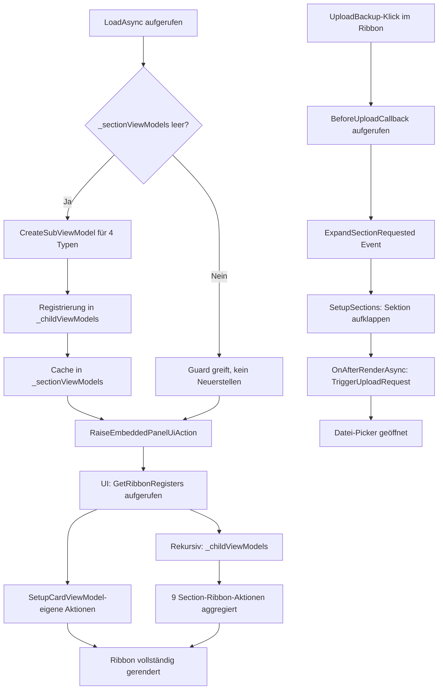

← [Zurück zur Übersicht](index.md)

# Systemverwaltung und Setup — Technischer Ablauf

## Übersicht

Die Setup-Karte aggregiert Ribbon-Aktionen aus vier Section-ViewModels über den `BaseViewModel`-Mechanismus. Beim ersten Aufruf von `LoadAsync` werden die ribbon-beitragenden Section-ViewModels via `CreateSubViewModel<T>()` als Kind-ViewModels registriert; nachfolgende Aufrufe von `GetRibbonRegisters()` schließen diese automatisch ein. Section-ViewModels ohne Ribbon-Beitrag werden erst auf Anfrage der Razor-Komponente instanziiert.

## Abläufe

### 1. JWT-Authentifizierung und SecurityStamp-Prüfung

1. Ein Request liefert ein Bearer-Token oder das Cookie `FinanceManager.Auth`.
2. Die JWT-Pruefung validiert Signatur, Issuer, Audience und Ablaufzeit.
3. `OnTokenValidated` liest Benutzer-ID und `security_stamp` aus dem Token.
4. Der aktuelle Benutzer wird aus der Datenbank geladen.
5. Der Request wird abgelehnt, wenn der Benutzer fehlt, inaktiv ist, der
   SecurityStamp abweicht oder der Admin-Rollenstand nicht mehr zum Token passt.
6. Nur ein Token mit aktuellem Benutzerzustand erreicht die Autorisierung.

Beteiligte Komponenten: `ProgramExtensions`, `UserManager<User>`,
`JwtRefreshService.SecurityStampClaimType`

---

### 2. DB-validierter JWT-Refresh

1. `JwtRefreshMiddleware` oder `JwtCookieAuthTokenProvider` erkennt ein Token
   nahe am Ablauf.
2. Der Refresh ruft `IJwtRefreshService.RefreshAsync` auf und erzeugt kein Token
   mehr direkt aus alten Claims.
3. `JwtRefreshService` liest Benutzer-ID und `security_stamp` aus dem Principal.
4. Der Benutzer wird aus der Datenbank geladen; inaktive oder geloeschte
   Benutzer werden abgelehnt.
5. Der aktuelle Identity-`SecurityStamp` muss dem Token-Claim entsprechen.
6. Die aktuelle Admin-Rolle wird aus Identity gelesen.
7. Bei Erfolg wird ein neues JWT mit aktueller Rolle, aktuellem SecurityStamp
   und 30 Minuten Laufzeit ausgegeben.
8. Bei Ablehnung wird kein neues Token gesetzt; Cookie-basierte Requests
   verlieren das Auth-Cookie.

Beteiligte Komponenten: `JwtRefreshMiddleware`, `JwtCookieAuthTokenProvider`,
`JwtRefreshService`, `JwtTokenService`

---

### 3. Token-Invalidierung bei Benutzeränderungen

1. Ein Administrator deaktiviert oder aktiviert einen Benutzer oder aendert die
   Admin-Rolle.
2. `UserAdminService` aktualisiert nach erfolgreicher Aenderung den
   SecurityStamp des Benutzers.
3. Bereits ausgegebene JWTs enthalten den alten SecurityStamp.
4. Der naechste Request oder Refresh mit einem alten Token wird abgelehnt.
5. Bei Passwortreset wird der SecurityStamp ebenfalls aktualisiert.

Beteiligte Komponenten: `UserAdminService`, `UserManager<User>`,
`ProgramExtensions`, `JwtRefreshService`

---

### 4. Ribbon-Initialisierung beim Laden der Setup-Karte

1. `SetupCardViewModel.LoadAsync(Guid id)` wird aufgerufen (z. B. bei Navigation zur Setup-Seite).
2. Guard `_sectionViewModels.Count == 0` verhindert Doppel-Registrierung bei Re-Navigation.
3. Die vier ribbon-beitragenden Section-ViewModels werden erzeugt und im internen Cache `_sectionViewModels` gespeichert:
   - `CreateSubViewModel<SetupProfileViewModel>()` → Schlüssel `"profile"`
   - `CreateSubViewModel<SetupNotificationsViewModel>()` → Schlüssel `"notifications"`
   - `CreateSubViewModel<SetupBackupsViewModel>(configure: ...)` → Schlüssel `"backup"` (mit `BeforeUploadCallback`)
   - `CreateSubViewModel<SetupStatementsViewModel>()` → Schlüssel `"statements"`
4. `BaseViewModel.CreateSubViewModel<T>()` registriert jede Instanz in `_childViewModels` und verdrahtet `StateChanged`-, `AuthenticationRequired`- und `UiActionRequested`-Events.
5. `RaiseEmbeddedPanelUiAction()` wird aufgerufen — fordert das Rendering der `SetupSections`-Komponente in einem `SetupPanel` an.
6. Die UI rendert das Ribbon und ruft `GetRibbonRegisters(localizer)` auf `SetupCardViewModel` auf.
7. `BaseViewModel.GetRibbonRegisters()` ruft zunächst `GetRibbonRegisterDefinition()` des eigenen ViewModels auf → liefert `RebuildAggregates` (Large) und `ResetReportCache` (Small).
8. Anschließend iteriert `GetRibbonRegisters()` rekursiv über alle `_childViewModels` und aggregiert deren Ribbon-Definitionen:
   - `SetupProfileViewModel`: `Save`, `Reset`, `DetectTimezone`
   - `SetupNotificationsViewModel`: `SaveNotifications`, `ResetNotifications`
   - `SetupBackupsViewModel`: `CreateBackup`, `UploadBackup`
   - `SetupStatementsViewModel`: `SaveImportSplit`, `ResetImportSplit`
9. Alle Aktionen werden im Ribbon angezeigt — unabhängig davon, welche Sektion aufgeklappt ist.

Beteiligte Komponenten: `SetupCardViewModel`, `BaseViewModel`, `SetupProfileViewModel`, `SetupNotificationsViewModel`, `SetupBackupsViewModel`, `SetupStatementsViewModel`

---

### 5. Bereitstellung eines Section-ViewModels für SetupSections.razor

1. Benutzer klappt eine Sektion im Akkordeon auf.
2. `SetupSections.razor.BuildSectionSpec(key)` ruft `Provider.TryGetSectionComponentType(key, ...)` und `Provider.CreateSectionViewModel(key, Services)` auf.
3. `SetupCardViewModel.CreateSectionViewModel(key, services)` prüft `_sectionViewModels[key]`:
   - **Gecachte Typen** (`profile`, `notifications`, `backup`, `statements`): gibt die vorab erzeugte, bereits in `_childViewModels` registrierte Instanz zurück — keine neue Instanz.
   - **Nicht-gecachte Typen** (`attachments`, `security`, `returnanalysis`): erstellt eine neue Instanz via `ActivatorUtilities.CreateInstance(services, viewModelType)` und speichert sie ebenfalls im Cache (ohne `_childViewModels`-Registrierung, da kein Ribbon-Beitrag).
4. `SetupSections.razor` rendert die Sektion mit dem aufgelösten ViewModel als `DynamicComponent`.

Beteiligte Komponenten: `SetupSections.razor`, `SetupCardViewModel`, `BaseViewModel`

---

### 6. UploadBackup-Ribbon-Aktion bei zugeklappter Backup-Sektion

1. Benutzer klickt auf `UploadBackup` im Ribbon (Backup-Sektion ist zugeklappt).
2. `SetupBackupsViewModel.GetRibbonRegisterDefinition()` hat für `UploadBackup` den Callback `BeforeUploadCallback?.Invoke()` registriert.
3. `BeforeUploadCallback` wurde in `LoadAsync` gesetzt: `vm.BeforeUploadCallback = () => ExpandSectionRequested?.Invoke(this, "backup")`.
4. `SetupCardViewModel.ExpandSectionRequested` wird ausgelöst mit Schlüssel `"backup"`.
5. `SetupSections.razor.OnExpandSectionRequested` reagiert auf das Event:
   - Fügt `"backup"` zu `_expandedSections` hinzu.
   - Setzt `_pendingUploadRequestKey = "backup"`.
   - Ruft `InvokeAsync(StateHasChanged)` auf → Blazor rendert die Backup-Sektion.
6. Nach dem Rendern ruft `OnAfterRenderAsync` mit dem gecachten `SetupBackupsViewModel` `TriggerUploadRequest()` auf.
7. `TriggerUploadRequest()` feuert das `UploadRequested`-Event → `SetupBackupTab.razor` öffnet den Datei-Picker.

Beteiligte Komponenten: `SetupBackupsViewModel`, `SetupCardViewModel`, `SetupSections.razor`, `SetupBackupTab.razor`

## Diagramm

```mermaid
flowchart TD
    A[LoadAsync aufgerufen] --> B{_sectionViewModels leer?}
    B -- Ja --> C[CreateSubViewModel für 4 Typen]
    C --> D[Registrierung in _childViewModels]
    D --> E[Cache in _sectionViewModels]
    B -- Nein --> F[Guard greift, kein Neuerstellen]
    E --> G[RaiseEmbeddedPanelUiAction]
    F --> G

    G --> H[UI: GetRibbonRegisters aufgerufen]
    H --> I[SetupCardViewModel-eigene Aktionen]
    H --> J[Rekursiv: _childViewModels]
    J --> K[9 Section-Ribbon-Aktionen aggregiert]
    I --> L[Ribbon vollständig gerendert]
    K --> L

    M[UploadBackup-Klick im Ribbon] --> N[BeforeUploadCallback aufgerufen]
    N --> O[ExpandSectionRequested Event]
    O --> P[SetupSections: Sektion aufklappen]
    P --> Q[OnAfterRenderAsync: TriggerUploadRequest]
    Q --> R[Datei-Picker geöffnet]
```

## Fehlerbehandlung

- Fehler in `LoadAsync` werden via `SetError(null, ex.Message)` gesetzt und im `Loading`-State abgeschlossen — die UI zeigt den Fehlerzustand.
- Fehler in Ribbon-Callback-Lambdas (z. B. `RebuildAggregates`, `CreateBackup`) werden per `ILogger` protokolliert und nicht nach oben propagiert, um einen UI-Absturz zu verhindern.
- Fehler in `RaiseEmbeddedPanelUiAction()` werden ebenfalls per `ILogger` protokolliert.
- Backup-Validierungsfehler werden als fachliche API-Fehler (`ApiErrorDto`) zurückgegeben und lösen keinen destruktiven Import aus.
- Restore-Bestätigungsfehler werden vor dem Import beziehungsweise vor dem Enqueue des Hintergrundtasks abgefangen.

---

### 7. Gehärteter Backup-Upload

1. Benutzer wählt in der Backup-Sektion eine Datei aus.
2. `SetupBackupsViewModel` sendet die Datei über den API-Client an `POST /api/setup/backups/upload`.
3. `BackupsController.UploadAsync` prüft, ob eine Datei vorhanden ist, und übergibt den Stream an `BackupService.UploadAsync`.
4. Die Backup-Infrastruktur validiert den Container:
   - Nur ZIP wird akzeptiert.
   - Es darf höchstens ein ZIP-Entry vorhanden sein.
   - Der Entry-Name muss `backup.ndjson` sein oder mit `backup-` beginnen.
   - Komprimierte und entpackte Größe sowie Kompressionsverhältnis müssen innerhalb der konfigurierten Grenzen liegen.
   - Die NDJSON-Metadaten müssen ein Backup vom Typ `Backup` in Version `3` beschreiben.
5. Erst nach bestandener Validierung wird die Datei gespeichert und als `BackupDto` zurückgegeben.
6. Bei Fehlern liefert der Controller `400 ApiErrorDto`; doppelte Dateinamen bleiben ebenfalls ein fachlicher Fehler.

Beteiligte Komponenten: `SetupBackupsViewModel`, `ApiClient.Backups_UploadAsync`, `BackupsController.UploadAsync`, `BackupService.UploadAsync`

---

### 8. security.txt — Öffentlicher Abruf

1. Client sendet `GET /security.txt`, `GET /.well-known/security.txt`, `GET /.well-known/security.md` oder `GET /.well-known/security.html` ohne Authentifizierung.
2. ASP.NET-Routing leitet die Anfrage an `SecurityTxtController` weiter. Static Files greifen für `/.well-known/`-Pfade nicht, da `StaticFileOptions` diese Pfade ausschließt.
3. Der Controller ruft `ISecurityTxtSettingsService.BuildContentAsync(format, ct)` auf.
4. `SecurityTxtSettingsService` lädt die `SecurityTxtSettings`-Singleton-Zeile aus `AppDbContext`. Existiert noch keine Zeile, wird sie automatisch mit `Contact = ""` angelegt.
5. Ist `Contact` leer, gibt `BuildContentAsync` `null` zurück. Der Controller antwortet mit **HTTP 503** und `{ "error": "security.txt is not configured yet." }`.
6. Ist `Contact` gesetzt, baut der Service den Ausgabetext auf:
   - `PlainText`: `Key: Value`-Zeilen gemäß RFC 9116.
   - `Markdown`: `## Direktive`-Abschnitte.
   - `Html`: `<section><h2>Direktive</h2>
Wert
</section>`-Blöcke, HTML-enkodiert.
   Die `Canonical`-Direktive wird aus dem gespeicherten Feld `SecurityTxtSettings.Canonical` gelesen; ist dieses leer, wird `<Api:BaseAddress>/.well-known/security.txt` aus `IConfiguration` als Fallback verwendet.
7. Controller gibt `ContentResult` mit passendem `Content-Type` und HTTP 200 zurück.

Beteiligte Komponenten: `SecurityTxtController`, `ISecurityTxtSettingsService`, `SecurityTxtSettingsService`, `AppDbContext`, `SecurityTxtSettings`

---

### 9. security.txt — Admin: Einstellungen speichern

1. Admin-UI ruft beim Laden über `ApiClient.GetSecurityTxtSettingsAsync()` → `GET /api/admin/security-txt` die aktuellen Werte ab.
2. `SecurityTxtController.GetSettingsAsync` prüft JWT-Bearer-Token und Rolle `Admin`. Dann delegiert er an `ISecurityTxtSettingsService.GetAsync(ct)`.
3. `SecurityTxtSettingsService` lädt die Singleton-Zeile und mappt sie auf `SecurityTxtSettingsDto`.
4. Der Admin bearbeitet Felder in `SetupSecurityTxtViewModel` (`Contact`, `Ablaufdatum`, `Canonical`, optionale Felder). Jede Änderung setzt `Dirty = true`.
5. Admin klickt „Speichern" in der Ribbon-Aktionsleiste. `SetupCardViewModel` ruft `SetupSecurityTxtViewModel.SaveAsync()` auf.
6. `SaveAsync` sendet `SecurityTxtSettingsUpdateRequest` via `ApiClient.UpdateSecurityTxtSettingsAsync()` → `PUT /api/admin/security-txt`.
7. `SecurityTxtController.UpdateSettingsAsync` validiert das Modell und delegiert an `ISecurityTxtSettingsService.UpdateAsync(request, ct)`.
   Die Request-Validierung in `SecurityTxtSettingsUpdateRequest.Validate(...)` erzwingt für `Canonical` bei gesetztem Wert eine absolute HTTPS-URL ohne Query/Fragment und ohne localhost-/Loopback-Host.
8. `SecurityTxtSettingsService` lädt die Singleton-Zeile, ruft `entity.Update(...)` auf und speichert mit `SaveChangesAsync`.
9. Controller antwortet mit **HTTP 204**. Das ViewModel setzt `SavedOk = true` und `Dirty = false`; die Razor-Komponente `SecurityTxtSettingsTab.razor` zeigt „Einstellungen gespeichert."

Beteiligte Komponenten: `SecurityTxtSettingsTab.razor`, `SetupSecurityTxtViewModel`, `SetupCardViewModel`, `ApiClient.SecurityTxt.cs`, `SecurityTxtController`, `ISecurityTxtSettingsService`, `SecurityTxtSettingsService`, `AppDbContext`, `SecurityTxtSettings`

---

### 8. Restore mit serverseitiger Dateinamen-Bestätigung

1. Benutzer wählt ein Backup zum Wiederherstellen aus.
2. `SetupBackupTab.razor` zeigt einen Dialog mit Dateiname, Datum und Größe an.
3. Der Benutzer muss den exakten Backup-Dateinamen eingeben. Der Restore-Button wird erst bei exakter Übereinstimmung aktiviert.
4. `SetupBackupsViewModel.StartApplyAsync` sendet `BackupRestoreRequestDto` mit `ConfirmationText` und `ExpectedFileName` an `POST /api/setup/backups/{id}/apply/start`.
5. `BackupsController.StartApplyAsync` lädt das Backup und vergleicht beide Werte serverseitig mit dem gespeicherten Dateinamen.
6. Bei falscher Bestätigung antwortet der Controller mit `400 ApiErrorDto` und legt keinen Hintergrundtask an.
7. Wenn bereits ein Restore läuft oder wartet, antwortet der Controller mit `409 ApiErrorDto`.
8. Nach erfolgreicher Prüfung wird ein `BackupRestore`-Hintergrundtask mit validiertem Payload erstellt.
9. `BackupRestoreTaskExecutor` ruft `BackupService.ApplyAsync` auf.
10. `BackupService.ApplyAsync` validiert die gespeicherte ZIP-Datei erneut und startet erst danach den destruktiven Import mit `replaceExisting: true`.

Beteiligte Komponenten: `SetupBackupTab.razor`, `SetupBackupsViewModel`, `ApiClient.Backups_StartApplyAsync`, `BackupsController.StartApplyAsync`, `BackupRestoreTaskExecutor`, `BackupService.ApplyAsync`

---

### 9. Synchroner Restore

1. Ein Client sendet `POST /api/setup/backups/{id}/apply` mit `BackupRestoreRequestDto`.
2. `BackupsController.ApplyAsync` übergibt die Bestätigung an `BackupService.ApplyAsync`.
3. Der Service prüft Backup-Besitz, Dateinamen-Bestätigung, Containerstruktur, Größenlimits, Kompressionsverhältnis und NDJSON-Schema.
4. Nur bei Erfolg wird der Import ausgeführt.
5. Das Ergebnis wird auf HTTP-Antworten abgebildet:
   - `204 No Content` bei Erfolg.
   - `404 Not Found` bei fehlendem Backup.
   - `400 ApiErrorDto` bei fehlender Bestätigung, ungültigem Backup oder Importfehler.

Beteiligte Komponenten: `ApiClient.Backups_ApplyAsync`, `BackupsController.ApplyAsync`, `BackupService.ApplyAsync`

---

### 10. Authentifiziertes Background-Task-Statuspolling

1. `BackgroundTaskStatusPanel` wird nach dem ersten Rendern initialisiert.
2. Vor dem Start der Polling-Schleife prüft die Komponente `ICurrentUserService.IsAuthenticated` und, falls nötig, den Browser-Authentifizierungsstatus über `fmAuthIsAuthenticated`.
3. Nur bei authentifiziertem Benutzerkontext erstellt das Panel eine `CancellationTokenSource`, lädt initial `GET /api/background-tasks/active` und startet die wiederkehrende Abfrage.
4. Der Endpunkt bleibt serverseitig durch JWT-Bearer-Authentifizierung geschützt und liefert nur laufende oder wartende Tasks des aktuellen Benutzers.
5. Sichtbarkeit wird weiterhin über `AllowedTypes` entschieden; die geladene Task-Liste enthält aber alle aktiven oder wartenden Tasks des Benutzers.
6. Bei `401 Unauthorized` deaktiviert das Panel das Polling für die aktuelle Komponenteninstanz, bricht die laufende Schleife ab, leert den lokalen Task-Zustand und rendert ohne Statuspanel weiter.
7. Cancel- und Remove-Aktionen prüfen denselben Authentifizierungs- und Stop-Zustand, bevor sie `DELETE /api/background-tasks/{id}` oder eine anschließende Statusabfrage auslösen.

Beteiligte Komponenten: `BackgroundTaskStatusPanel`, `ICurrentUserService`, `ApiClient.BackgroundTasks_GetActiveAsync`, `BackgroundTasksController.GetActiveAndQueued`, `IBackgroundTaskManager`.

---

### 11. Self-Update-Pruefung und Download

Die Self-Update-Logik wird aus dem externen Release-Artefakt
`msTools.Updater` eingebunden. Bis zur NuGet-Veroeffentlichung liegt der
gepruefte Release `v0.3.0` unter `external/msTools.Updater/v0.3.0/`; die dort
entpackte `msTools.Updater.dll` wird ueber `builder.UseAutoUpdate(...)` in
`ProgramExtensions` registriert. FinanceManager greift ausschliesslich ueber
die Adapterklasse `UpdateOrchestratorAdapter` darauf zu, sodass Controller,
`ApiClient` und ViewModel stabil bleiben.

`UseAutoUpdate(...)` seedet die Bibliothekseinstellungen (`AutoUpdateOptions`)
zunaechst ausschliesslich aus `appsettings*.json`. Direkt danach, aber noch vor
dem Start der Hintergrunddienste (`AutoUpdateCheckerService`,
`AutoUpdateSchedulerService`), wendet `ProgramExtensions.ApplyPersistedUpdateSettings`
die zuletzt ueber die Setup-UI gespeicherten Einstellungen (`IUpdateSettingsStore`)
auf `AutoUpdateOptions` an. Dadurch haben persistierte Einstellungen bei jedem
Programmstart Vorrang vor `appsettings*.json` — nicht erst, nachdem ein
Administrator sie nach dem Neustart erneut speichert. Existiert noch keine
gespeicherte Konfiguration (z. B. beim allerersten Start), bleiben die
`appsettings*.json`-Werte unveraendert wirksam.

1. Ein Administrator startet `POST /api/setup/update/check` oder der
   Hintergrunddienst `AutoUpdateCheckerService` laeuft bei aktivierter
   Updatepruefung einmal taeglich im konfigurierten Zeitfenster
   (`Updates:SourceCheckStartTime` bis `Updates:SourceCheckEndTime`).
2. `AutoUpdateOrchestrator.CheckForUpdateAsync` setzt den Status auf
   `Checking` und liest die installierte Version ueber
   `ReleaseMetadataInstalledVersionProvider` (`IInstalledVersionProvider`) aus
   `release-metadata.json`.
3. Je nach `Updates:SourceType` laedt `AutoUpdateGithubSource` das Manifest aus
   dem GitHub-Release-Kontext oder `AutoUpdateLocalFolderSource` aus dem unter
   `Updates:LocalFolderPath` konfigurierten Verzeichnis. Der Manifestname ist
   in beiden Quellen `update.json`. GitHub-Prereleases werden nur beruecksichtigt,
   wenn `Updates:IncludePrereleases` beziehungsweise die gespeicherte Einstellung
   `UpdateSettings.IncludePrereleases` aktiviert ist; der Wert wird auf
   `AutoUpdateOptions.AllowPrereleaseUpdates` und die GitHub-Source-Erzeugung
   mit `includePrereleases` uebertragen.
4. `AutoUpdatePackageValidator` prueft Version, PublishedAt, Release Notes,
   Repository/Herkunft, Assetnamen, SHA-256, positive Dateigroessen sowie
   Plattform-/Runtime-Konsistenz.
5. `AutoUpdatePlatformResolver` waehlt das Asset fuer die aktuelle Runtime, z. B.
   `win-x64` oder `linux-x64`.
6. Nur wenn die Manifest-Version neuer als die installierte Version ist und
   `Updates:EnableAutomaticDownload` aktiviert ist, wird das ZIP in
   `<DownloadPath>/pending` geladen.
7. Nach Download validiert `AutoUpdatePackageValidator` Dateigroesse, SHA-256
   und die ZIP-Eintraege. Bei Erfolg wird der Status `Ready` gespeichert
   (Zustand `ReadyToInstall`), sonst `Failed` mit Fehlermeldung.

Beteiligte Komponenten: `UpdateController`, `AutoUpdateCheckerService`,
`UpdateOrchestratorAdapter`, `AutoUpdateOrchestrator`, `AutoUpdateGithubSource`,
`AutoUpdateLocalFolderSource`, `AutoUpdatePackageValidator`,
`AutoUpdatePlatformResolver`, `FileSystemAutoUpdatePackageStore`.

---

### 12. Self-Update-Installation und Warteseite

1. Ein Administrator startet `POST /api/setup/update/install/start` mit
   `ConfirmDowntime = true` oder der Hintergrunddienst
   `AutoUpdateSchedulerService` erreicht eine geplante Uhrzeit
   (`Updates:ScheduledInstallTime`) bei Status `Ready`.
2. Der Orchestrator lehnt den Start ab, wenn kein vorbereitetes Paket vorliegt,
   ein Lock aktiv ist, keine Downtime-Bestaetigung vorliegt oder bereits
   `Installing` gemeldet wird.
3. `AutoUpdateInstaller.PrepareAsync` erzeugt eine Lock-Datei (ueber
   `IAutoUpdatePackageStore.TryCreateLockAsync`), validiert das
   heruntergeladene Paket erneut und loest ueber `AutoUpdateServiceResolver`
   das Service-/EXE-Ziel auf.
4. `AutoUpdateScriptGenerator` erzeugt ein Plattformskript in
   `<DownloadPath>/pending`: PowerShell fuer Windows oder Shell-Skript fuer
   Linux.
5. `DefaultAutoUpdateProcessRunner` startet das Skript als externen Prozess.
   Nur wenn `Updates:StopHostAfterScriptStart` aktiviert ist, beendet
   `DefaultAutoUpdateHostTerminator` anschliessend die Webanwendung
   kontrolliert; andernfalls laeuft der Host unveraendert weiter, so wie
   bisher. Die eigentliche Dateiersetzung findet in jedem Fall ausserhalb des
   laufenden ASP.NET-Core-Prozesses statt.
6. Die Setup-UI zeigt den Installationszustand, pollt alle zwei Sekunden
   `/health`, wartet zuerst auf einen beobachteten Ausfall und laedt erst nach
   einem anschliessenden erfolgreichen Health-Aufruf neu.
7. Nach Ablauf von `HealthTimeoutSeconds`, standardmaessig 120 Sekunden, zeigt
   das ViewModel einen Timeout-Fehler.

Beteiligte Komponenten: `UpdateController`, `AutoUpdateSchedulerService`,
`UpdateOrchestratorAdapter`, `AutoUpdateOrchestrator`, `AutoUpdateInstaller`,
`AutoUpdateServiceResolver`, `AutoUpdateScriptGenerator`,
`DefaultAutoUpdateProcessRunner`, `DefaultAutoUpdateHostTerminator`,
`HealthController`, `SetupUpdateViewModel`, `SetupUpdateTab.razor`.
