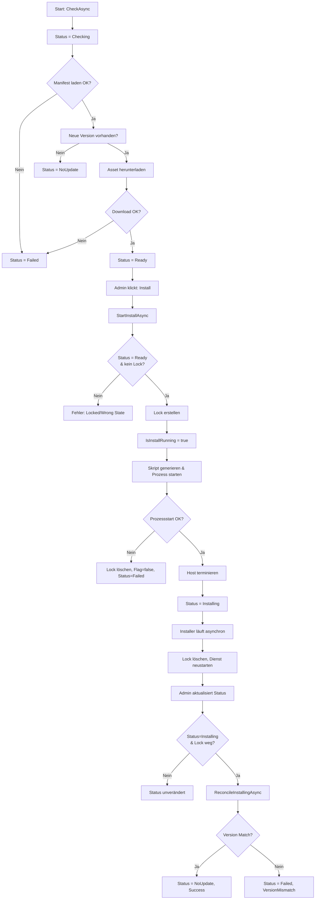

← [Zurück zur Übersicht](index.md)

# Automatische Updates — Technischer Ablauf

## Übersicht

Das Update-System prüft GitHub-Releases regelmäßig ab, lädt neue Versionen herunter und orchestriert die Installation durch einen eigenständigen Installer-Prozess. Nach Prozessbeendigung validiert das System, dass die neue Version tatsächlich geladen wurde. Lock-Dateien verhindern gleichzeitige Installationen; bei Fehlern werden Locks automatisch bereinigt.

## Ablauf

### 1. Automatische Prüfung (CheckAsync)

**Voraussetzung:** Update-Service ist aktiviert und Prüf-Intervall ist abgelaufen

**Beteiligte Komponenten:**
- `UpdateOrchestrator.CheckAsync()` — Einstiegspunkt der Prüfung
- `IUpdateSettingsStore` — lädt Konfiguration (Repository, Manifest-Asset, ...)
- `IInstalledReleaseMetadataProvider` — ermittelt aktuell installierte Version
- `IUpdateManifestClient.GetManifestAsync()` — lädt Manifest aus GitHub-Release-Asset
- `IUpdateValidator.IsNewerVersion()` — Versionvergleich
- `IUpdateFileStore.WriteStatusAsync()` — persistiert Status in `status.json`

**Ablauf:**
1. Status auf `Checking` setzen
2. Manifest-Asset aus GitHub laden (URL aus Konfiguration)
3. Manifest validieren (Format, Plattform-Asset vorhanden)
4. Installierte Version gegen verfügbare Version vergleichen
5. Wenn neuer: herunterladbare Asset-URL mit `IUpdatePlatformResolver` für aktuelle Plattform auswählen
6. Asset herunterladen und prüfen (Größe, optional Hash)
7. Status auf `Ready` setzen mit `AvailableVersion` und `DownloadedAssetName`
8. Bei Fehler: Status auf `Failed` mit `LastError`-Meldung

**Fehlerbehandlung:**
- Netzwerkfehler, Manifest ungültig, Asset nicht für Plattform vorhanden → `Failed`
- Bereits aktuelle Version → Status `NoUpdate` (kein Fehler)
- Unbekannte installierte Version (z. B. Entwicklungs-Build) → `NoUpdate` mit Info-Meldung

### 2. Installationsvorbereitung (StartInstallAsync)

**Voraussetzung:** Status ist `Ready`, Downtime ist vom Anwender bestätigt

**Beteiligte Komponenten:**
- `UpdateOrchestrator.StartInstallAsync()` — Einstiegspunkt
- `UpdateExecutor.StartAsync()` — Installer-Prozess starten
- `IUpdateFileStore.TryCreateLockAsync()` — Lock-Datei erstellen
- `IUpdateScriptGenerator` — Shell-Skript generieren
- `IUpdateProcessRunner` — Prozess starten
- `IUpdateHostTerminator` — Host-Prozess beenden

**Ablauf:**
1. Aktuellen Status prüfen: Muss `Ready` sein, darf kein Lock aktiv sein
2. `UpdateExecutor.StartAsync()` aufrufen
3. Im Executor:
   - Lock-Datei erstellen: `update.lock` mit ISO-8601-Zeitstempel und Prozess-ID (falls verfügbar)
   - Flag `IsInstallRunning = true` setzen (in-memory Indikator)
   - ZIP-Asset validieren (erneute Größen-/Hash-Prüfung)
   - Shell-Skript generieren (`.ps1` oder `.sh` basierend auf Plattform)
   - Skript schreibt Zielversion in Metadaten, führt `dotnet publish` / `unzip` durch, startet Dienst neu, löscht Lock-Datei
   - Status auf `Installing` setzen
   - Prozess starten (PowerShell oder Bash)
   - Host-Anwendung beenden
4. **Neu (Fehlerbehandlung):** Falls Ausnahme **nach** Prozessstart auftritt:
   - `IsInstallRunning = false` zurücksetzen
   - Lock-Datei löschen
   - Status auf `Failed` setzen mit Fehlermeldung
   - Erneut werfen (Client erhält Fehler)

**Lock-Dateiformat:**
```
2026-07-20T14:30:00Z
```
(Erste Zeile: ISO-8601-UTC-Zeitstempel)

### 3. Installation läuft (asynchron)

**Installer-Skript-Ablauf (auf dem Server ausgeführt):**

Linux (`.sh`):
```bash
#!/bin/bash
set -e
cd /opt/app
rm -f update.lock
unzip -q -o /tmp/app-2.5.0-linux-x64.zip
systemctl restart finance-app
# Versionsmetadaten aktualisieren
echo "2.5.0" > .version
```

Windows (`.ps1`):
```powershell
$ErrorActionPreference = "Stop"
Remove-Item -Path "C:\Program Files\App\update.lock" -ErrorAction SilentlyContinue
Expand-Archive -Path "C:\temp\app-2.5.0-win-x64.zip" -DestinationPath "C:\Program Files\App" -Force
Restart-Service -Name "FinanceManagerService"
```

### 4. Post-Update-Reconciliation (nach Neustart)

**Voraussetzung:** Client ruft `GetStatusAsync()` auf, Status in `status.json` ist noch `Installing`, aber Lock ist nicht mehr aktiv

**Beteiligte Komponenten:**
- `UpdateOrchestrator.GetStatusAsync()` → `WithRuntimeStateAsync()` → `ReconcileInstallingAsync()`
- `IInstalledReleaseMetadataProvider.GetAsync()` — ermittelt neu geladene Version aus Metadaten/Assembly
- `IUpdateFileStore` — liest und aktualisiert `status.json`

**Ablauf:**
1. Gespeicherten Status aus `status.json` lesen
2. Prüfen: `Status == Installing` UND Lock ist nicht aktiv?
3. Wenn ja: Reconciliation durchführen
   - Aktuell installierte Version auslesen (z. B. aus `.version`-Datei, `AssemblyVersion` oder `CLAUDE.md`)
   - Mit `AvailableVersion` aus gespeichertem Status vergleichen
   - Gleich → Status auf `NoUpdate` setzen (Erfolg), `DownloadedAssetName` löschen, `LastError` löschen
   - Ungleich → Status auf `Failed` setzen, `LastError = "Err_Update_VersionMismatch"`
4. Neuer Status wird persistiert

**Beispiel (Erfolg):**
```
Gespeichert: {Status: Installing, AvailableVersion: "2.5.0", InstalledVersion: "2.4.0"}
Ermittelt:   InstalledVersion jetzt = "2.5.0"
Resultat:    {Status: NoUpdate, AvailableVersion: null, InstalledVersion: "2.5.0", LastError: null}
```

**Beispiel (Fehler):**
```
Gespeichert: {Status: Installing, AvailableVersion: "2.5.0"}
Ermittelt:   InstalledVersion jetzt = "2.4.0" (Installer fehlgeschlagen, alte Version noch aktiv)
Resultat:    {Status: Failed, LastError: "Err_Update_VersionMismatch"}
```

### 5. Lock-Reset (Verweigerung und Staleness-Prüfung)

**Einstiegspunkt:** `UpdateOrchestrator.ResetLockAsync(reason: string?)`

**Verweigerungsbedingungen:**
- `_executor.IsInstallRunning == true` → `IOException` mit `Err_Update_InstallRunning`
- Kein Lock vorhanden → `IOException` mit `No update lock is active.`

**Staleness-Prüfung:**
1. Lock-Erstellungszeit auslesen:
   - `UpdateFileStore.GetLockCreatedAtAsync()` liest **Dateiinhalt** (ISO-8601-Zeitstempel), nicht `File.CreationTimeUtc` (auf Linux unzuverlässig)
   - Fallback: `File.GetLastWriteTimeUtc()` wenn Inhalt nicht parsbar
2. Schwellenwert berechnen: `max(HealthTimeoutSeconds, 60) Sekunden`
3. Alter prüfen: `DateTime.UtcNow - LockCreatedAt >= Schwellenwert`?
4. Zu jung → `IOException` mit `The update lock is not old enough to be considered stale.`
5. Alt genug → Lock-Datei löschen, Status aktualisieren mit Hinweis-Meldung

**Fehlerbehandlung:**
Alle Verweigerungen werfen `IOException`, die über die API als HTTP 409 (Conflict) oder HTTP 400 (Bad Request) beantwortet werden.

## Diagramm



## Fehlerbehandlung

| Szenario | Fehler-Code | HTTP | Handlung |
|----------|-------------|------|---------|
| Lock existiert bereits (Installation läuft) | `Err_Update_Locked` | 409 | Verweigerung, Anwender wird auf Wartestatus hingewiesen |
| Status ist nicht `Ready` | `Err_Update_NotReady` | 404 | Verweigerung, Anwender muss zuerst prüfen/herunterladen |
| Prozessstart schlägt fehl (nach Lock erstellt) | `Err_Update_InvalidState` | 400 | Lock + Flag automatisch bereinigt, Status → Failed |
| Skript-Generierung schlägt fehl | `Err_Update_InvalidState` | 400 | Lock + Flag bereinigt |
| Version nach Update nicht aktualisiert (Reconciliation) | `Err_Update_VersionMismatch` | (async in status.json) | Status → Failed, Admin wird benachrichtigt |
| Lock zu jung zum Reset | (IOException) | 409 | Lock muss mindestens `HealthTimeoutSeconds` alt sein |
| Kein Lock zum Reset | (IOException) | 409 | Keine Aktion erforderlich |

## Performance und Ressourcen

- **Lock-Datei:** Minimal (< 100 Bytes, nur Zeitstempel)
- **Status-JSON:** Klein (< 5 KB, nur Metadaten)
- **Prüf-Intervall:** Konfigurierbar 1–1440 Minuten (Default: 60 Min)
- **Download-Limit:** Konfigurierbar max. Asset-Größe (verhindert DoS)
- **Health-Timeout:** Konfigurierbar 10–600 Sekunden für Neustart-Wartezeit
