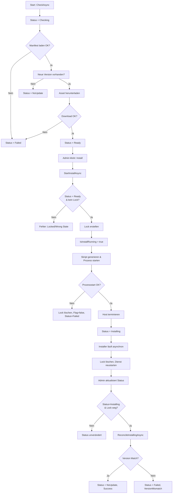

← [Zurück zur Übersicht](index.md)

# Automatische Updates — Technischer Ablauf

## Übersicht

Das Update-System prüft GitHub-Releases regelmäßig, lädt neue Versionen herunter und orchestriert die Installation über einen eigenständigen Installer-Prozess. Die Installation wird nicht vom Host-Prozess selbst durchgeführt, sondern über eine transient service unit, die mittels systemd-run gestartet wird. Dadurch kann der Host-Prozess sich selbst beenden, während das Installer-Skript unabhängig weiterläuft. Nach dem Neustart validiert das System, ob die neue Version erfolgreich geladen wurde. Lock-Dateien verhindern parallele Installationen; bei Fehlern werden Locks automatisch bereinigt. Die vendored Komponente `msTools.Updater v0.3.0` stellt die Runtime-Option `AutoUpdateOptions.AllowPrereleaseUpdates` und die GitHub-Source-Erzeugung mit `includePrereleases` bereit.

## Ablauf

### 1. Automatische Prüfung (CheckAsync)

**Voraussetzung:** Update-Service ist aktiviert, die tägliche Prüfung ist fällig und die lokale Uhrzeit liegt im konfigurierten Prüfzeitfenster.

**Beteiligte Komponenten:**
- `UpdateOrchestrator.CheckAsync()` — Einstiegspunkt der Prüfung
- `IUpdateSettingsStore` — lädt Konfiguration (Repository, Manifest-Asset, ...)
- `IInstalledReleaseMetadataProvider` — ermittelt aktuell installierte Version
- `IUpdateManifestClient.GetManifestAsync()` — lädt Manifest aus GitHub-Release-Asset
- `IUpdateValidator.IsNewerVersion()` — Versionvergleich
- `IUpdateFileStore.WriteStatusAsync()` — persistiert Status in `status.json`

**Ablauf:**
1. Status auf `Checking` setzen
2. Manifest-Asset aus GitHub laden (URL aus Konfiguration); Vorabversionen werden nur einbezogen, wenn `IncludePrereleases` gespeichert und auf `AutoUpdateOptions.AllowPrereleaseUpdates` angewendet ist
3. Manifest validieren (Format, Plattform-Asset vorhanden)
4. Installierte Version gegen verfügbare Version vergleichen
5. Wenn neuer: herunterladbare Asset-URL mit `IUpdatePlatformResolver` für aktuelle Plattform auswählen
6. Asset herunterladen und prüfen (Größe, optional Hash)
7. Status auf `Ready` setzen mit `AvailableVersion` und `DownloadedAssetName`
8. Bei Fehler: Status auf `Failed` mit `LastError`-Meldung

**Fehlerbehandlung:**
- Netzwerkfehler, Manifest ungültig, Asset nicht für Plattform vorhanden → `Failed`
- Bereits aktuelle Version → Status `NoUpdate` (kein Fehler)
- Unbekannte installierte Version (z. B. Entwicklungs-Build) → `NoUpdate` mit Info-Meldung
- GitHub `403 (rate limit exceeded)` → verständliche Rate-Limit-Meldung im Status und in der Check-Antwort; der Administrator soll später erneut prüfen

### 2. Installationsvorbereitung (StartInstallAsync)

**Voraussetzung:** Status ist `Ready`, Downtime ist vom Anwender bestätigt

**Beteiligte Komponenten:**
- `UpdateOrchestrator.StartInstallAsync()` — Einstiegspunkt
- `UpdateExecutor.StartAsync()` — Installer-Prozess starten
- `IUpdateFileStore.TryCreateLockAsync()` — Lock-Datei erstellen
- `IUpdateScriptGenerator` — Shell-Skript generieren
- `IUpdateProcessRunner` — Prozess starten
- `IUpdateHostTerminator` — Host-Prozess beenden

**Ablauf:**
1. Aktuellen Status prüfen: Muss `Ready` sein, darf kein Lock aktiv sein
2. `UpdateExecutor.StartAsync()` aufrufen
3. Im Executor:
   - Lock-Datei erstellen: `update.lock` mit ISO-8601-Zeitstempel und Prozess-ID (falls verfügbar)
   - Flag `IsInstallRunning = true` setzen (in-memory Indikator)
   - ZIP-Asset validieren (erneute Größen-/Hash-Prüfung)
   - Shell-Skript generieren (`.ps1` oder `.sh` basierend auf Plattform)
   - Skript schreibt Zielversion in Metadaten, führt `dotnet publish` / `unzip` durch, startet Dienst neu, löscht Lock-Datei
   - Status auf `Installing` setzen
   - Prozess starten (PowerShell oder Bash)
      Bash unter Linux: Der Installer-Prozess wird über systemd-run gestartet. Dabei wird eine transient service unit erzeugt, die das Skript ausführt. Der Host-Prozess bleibt nicht aktiv beteiligt.
4. **Neu (Fehlerbehandlung):** Falls Ausnahme **nach** Prozessstart auftritt:
   - `IsInstallRunning = false` zurücksetzen
   - Lock-Datei löschen
   - Status auf `Failed` setzen mit Fehlermeldung
   - Erneut werfen (Client erhält Fehler)

**Lock-Dateiformat:**
```
2026-07-20T14:30:00Z
```
(Erste Zeile: ISO-8601-UTC-Zeitstempel)

### 3. Installation läuft (asynchron)

Das Installer-Skript wird durch systemd-run als eigenständige transient service unit ausgeführt. Der Host-Prozess ist zu diesem Zeitpunkt bereits beendet.

Ablauf des Skripts:
- Lock-Datei wird entfernt.
- ZIP-Asset wird entpackt und die neue Version installiert.
- Der Dienst wird neu gestartet.
- Versionsmetadaten werden aktualisiert.

Die Ausgabe des Skripts erscheint ausschließlich im Journal der transienten Unit.

### 4. Post-Update-Reconciliation (nach Neustart)

**Voraussetzung:** Client ruft `GetStatusAsync()` auf, Status in `status.json` ist noch `Installing`, aber Lock ist nicht mehr aktiv

**Beteiligte Komponenten:**
- `UpdateOrchestrator.GetStatusAsync()` → `WithRuntimeStateAsync()` → `ReconcileInstallingAsync()`
- `IInstalledReleaseMetadataProvider.GetAsync()` — ermittelt neu geladene Version aus Metadaten/Assembly
- `IUpdateFileStore` — liest und aktualisiert `status.json`

**Ablauf:**
1. Gespeicherten Status aus `status.json` lesen
2. Prüfen: `Status == Installing` UND Lock ist nicht aktiv?
3. Wenn ja: Reconciliation durchführen
   - Aktuell installierte Version auslesen (z. B. aus `.version`-Datei, `AssemblyVersion` oder `CLAUDE.md`)
   - Mit `AvailableVersion` aus gespeichertem Status vergleichen
   - Gleich → Status auf `NoUpdate` setzen (Erfolg), `DownloadedAssetName` löschen, `LastError` löschen
   - Ungleich → Status auf `Failed` setzen, `LastError = "Err_Update_VersionMismatch"`
4. Neuer Status wird persistiert

**Beispiel (Erfolg):**
```
Gespeichert: {Status: Installing, AvailableVersion: "2.5.0", InstalledVersion: "2.4.0"}
Ermittelt:   InstalledVersion jetzt = "2.5.0"
Resultat:    {Status: NoUpdate, AvailableVersion: null, InstalledVersion: "2.5.0", LastError: null}
```

**Beispiel (Fehler):**
```
Gespeichert: {Status: Installing, AvailableVersion: "2.5.0"}
Ermittelt:   InstalledVersion jetzt = "2.4.0" (Installer fehlgeschlagen, alte Version noch aktiv)
Resultat:    {Status: Failed, LastError: "Err_Update_VersionMismatch"}
```


### 5. Lock-Reset (klassifizierte Verweigerung und Staleness-Prüfung)

**Einstiegspunkt:** `UpdateOrchestrator.ResetLockAsync(reason: string?)`

**Fehlervertrag:**
`UpdateOrchestratorAdapter.ResetLockAsync` wirft für kontrollierte Reset-Fehler eine `UpdateLockResetException`. Die Exception enthält `Kind`, `FailureSource`, optional `LockCreatedAt`, optional `LockPath` und die technische Ursache als Inner Exception. Der Controller mappt diese Typisierung auf lokalisierte API-Fehlercodes.

| Fehlerart | API-Code | HTTP | Typische Ursache |
|-----------|----------|------|------------------|
| `NoLock` | `Err_Update_Reset_NoLock` | 409 | Es ist kein aktiver Lock vorhanden |
| `LockNotStale` | `Err_Update_Reset_LockNotStale` | 409 | Der Lock ist jünger als die Staleness-Schwelle |
| `LockDeleteFailed` | `Err_Update_Reset_DeleteFailed` | 409 | `DeleteLockAsync` gibt `false` zurück oder die Lock-Datei kann wegen I/O-/Zugriffsfehlern nicht gelöscht werden |
| `ResetFailed` | `Err_Update_Reset_Failed` | 500 | Sonstiger technischer Fehler beim Lesen, Prüfen oder Aktualisieren des Reset-Zustands |

Klassifizierte Reset-Fehler werden nicht mehr auf `Err_Update_InstallRunning` gemappt. Dieser Code bleibt Situationen vorbehalten, in denen die Anwendung tatsächlich eine laufende Update-Installation belegen kann. Eine allgemeine `IOException` im Reset-Pfad wird nicht mehr pauschal als laufende Installation gemeldet.

**Staleness-Prüfung:**
1. Lock-Erstellungszeit auslesen:
   - `UpdateFileStore.GetLockCreatedAtAsync()` liest **Dateiinhalt** (ISO-8601-Zeitstempel), nicht `File.CreationTimeUtc` (auf Linux unzuverlässig)
   - Fallback: `File.GetLastWriteTimeUtc()` wenn Inhalt nicht parsbar
2. Schwellenwert berechnen: `max(HealthTimeoutSeconds, 60) Sekunden`
3. Alter prüfen: `DateTime.UtcNow - LockCreatedAt >= Schwellenwert`?
4. Kein Lock → `UpdateLockResetFailureKind.NoLock`
5. Zu jung → `UpdateLockResetFailureKind.LockNotStale`
6. Alt genug → Lock-Datei löschen; Erfolg gilt nur, wenn `DeleteLockAsync` `true` liefert
7. Nach erfolgreichem Löschen wird der Statussnapshot als entsperrt aktualisiert und die UI lädt den Status erneut

**Fehlerbehandlung:**
Der Controller protokolliert klassifizierte Reset-Fehler mit Fehlerart, Quelle, Lock-Zeitpunkt, Lock-Pfad, Benutzer und technischer Ursache. Anwender sehen weiterhin lokalisierte, verständliche Meldungen ohne interne Dateipfade.

### 6. Einstellungen normalisieren, Prüfzeitfenster ableiten, Vorabversionen anwenden und Service-Vorschläge laden

Anwender bearbeiten in der Setup-UI nur noch `Enabled`, `SourceCheckStartTime`, `SourceCheckEndTime`, `IncludePrereleases`, `ScheduledInstallTime` und `ServiceName`.

Beim Laden und Speichern normalisiert `UpdateSettingsStore` technische Werte:
- `RepositoryOwner` = `martin-stromberg`
- `RepositoryName` = `FinanceManager`
- `ManifestAssetName` = `update.json`
- `WorkingDirectory` = `updates`
- `HealthTimeoutSeconds` = `UpdateOptions.HealthTimeoutSeconds`, Fallback `120`, Clamp `10..600`
- `ExecutablePath` wird bei Speichervorgängen nicht aus Anwenderwerten übernommen
- fehlende `SourceCheckStartTime`/`SourceCheckEndTime` aus älteren Dateien werden als `20:00` bis `06:00` gelesen
- `IncludePrereleases` bleibt ein Anwenderwert; fehlende Legacy-Werte werden als `false` gelesen

`AutoUpdateOptionsMapper.ApplySettings()` spiegelt die gespeicherte Einstellung unmittelbar in die Updater-Library:
- `AutoUpdateOptions.SourceCheck.Interval` wird fest auf `1440` Minuten gesetzt
- `AutoUpdateOptions.SourceCheck.TimeRanges` wird aus Start- und Enduhrzeit für alle Wochentage erzeugt; Fenster über Mitternacht werden in Abend- und Morgenbereich gesplittet
- `AutoUpdateOptions.AllowPrereleaseUpdates` erhält den Wert aus `UpdateSettingsDto.IncludePrereleases`
- Bei GitHub-Quellen wird `AutoUpdateGithubSource.Create(owner, repository, manifestAsset, includePrereleases)` erneut aufgerufen, damit die nächste Prüfung dieselbe Prerelease-Entscheidung verwendet
- Local-Folder-Quellen bleiben unverändert; dort wird nur die Runtime-Option gesetzt

Das Autocomplete für `ServiceName` läuft über `IUpdateServiceCatalog`:
- Windows: `sc.exe query type= service state= all`, Dienstnamen aus `SERVICE_NAME:`-Zeilen
- Linux: `systemctl list-units --type=service --all --no-legend --no-pager`, Service-Namen aus der ersten Spalte
- Andere Plattformen, fehlende Tools, Prozessfehler oder Timeouts liefern eine leere Liste

Die Vorschläge werden gefiltert, dedupliziert, stabil sortiert und begrenzt zurückgegeben. Die UI behandelt Fehler als leere Vorschlagsliste, damit die Setup-Seite nicht blockiert.

## systemd-run Integration

Der Installer-Prozess wird nicht direkt gestartet, sondern über systemd-run als transient service unit. Dadurch läuft die Installation unabhängig vom Host-Prozess weiter.

Wesentliche Eigenschaften:
- Der Host-Prozess kann sich selbst beenden.
- Das Skript läuft weiter, da es von systemd verwaltet wird.
- Die Ausgabe des Skripts erscheint im Journal der Unit.
- Der Dienst kann nach Installation neu gestartet werden.
- Die Unit ist kurzlebig und wird nach Abschluss automatisch entfernt.


## Diagramm


```mermaid
flowchart TD
    A[Start: CheckAsync] --> B[Status = Checking]
    B --> C{Manifest laden OK?}
    C -->|Nein| D[Status = Failed]
    C -->|Ja| E[Neue Version vorhanden?]
    E -->|Nein| F[Status = NoUpdate]
    E -->|Ja| G[Asset herunterladen]
    G --> H{Download OK?}
    H -->|Nein| D
    H -->|Ja| I[Status = Ready]
    
    I --> J[Admin klickt: Install]
    J --> K[StartInstallAsync]
    K --> L{Status = Ready<br/>& kein Lock?}
    L -->|Nein| M[Fehler: Locked/Wrong State]
    L -->|Ja| N[Lock erstellen]
    N --> O[IsInstallRunning = true]
    O --> P[Skript generieren & Prozess starten]
    P --> Q{Prozessstart OK?}
    Q -->|Nein| R[Lock löschen, Flag=false, Status=Failed]
    Q -->|Ja| S[Host terminieren]
    S --> T[Status = Installing]
    
    T --> U[Installer läuft asynchron]
    U --> V[Lock löschen, Dienst neustarten]
    
    V --> W[Admin aktualisiert Status]
    W --> X{Status=Installing<br/>& Lock weg?}
    X -->|Nein| Y[Status unverändert]
    X -->|Ja| Z[ReconcileInstallingAsync]
    Z --> AA{Version Match?}
    AA -->|Ja| AB[Status = NoUpdate, Success]
    AA -->|Nein| AC[Status = Failed, VersionMismatch]
```

## Fehlerbehandlung

| Szenario | Fehler-Code | HTTP | Handlung |
|----------|-------------|------|---------|
| Lock existiert bereits (Installation läuft) | `Err_Update_Locked` | 409 | Verweigerung, Anwender wird auf Wartestatus hingewiesen |
| Status ist nicht `Ready` | `Err_Update_NotReady` | 404 | Verweigerung, Anwender muss zuerst prüfen/herunterladen |
| Prozessstart schlägt fehl (nach Lock erstellt) | `Err_Update_InvalidState` | 400 | Lock + Flag automatisch bereinigt, Status → Failed |
| Skript-Generierung schlägt fehl | `Err_Update_InvalidState` | 400 | Lock + Flag bereinigt |
| Version nach Update nicht aktualisiert (Reconciliation) | `Err_Update_VersionMismatch` | (async in status.json) | Status → Failed, Admin wird benachrichtigt |
| Kein Lock zum Reset | `Err_Update_Reset_NoLock` | 409 | Keine Aktion erforderlich; Status erneut prüfen |
| Lock zu jung zum Reset | `Err_Update_Reset_LockNotStale` | 409 | Lock muss mindestens `HealthTimeoutSeconds` alt sein |
| Lock-Datei kann nicht gelöscht werden | `Err_Update_Reset_DeleteFailed` | 409 | Dateizugriff und Berechtigungen prüfen |
| Sonstiger Reset-Fehler | `Err_Update_Reset_Failed` | 500 | Server-Logs mit Fehlerart, Quelle und technischer Ursache prüfen |

## Performance und Ressourcen

- **Lock-Datei:** Minimal (< 100 Bytes, nur Zeitstempel)
- **Status-JSON:** Klein (< 5 KB, nur Metadaten)
- **Prüfung:** Täglich (`1440` Minuten) innerhalb des konfigurierten Zeitfensters (Default: `20:00` bis `06:00`)
- **Download-Limit:** Konfigurierbar max. Asset-Größe (verhindert DoS)
- **Health-Timeout:** Konfigurierbar 10–600 Sekunden für Neustart-Wartezeit

