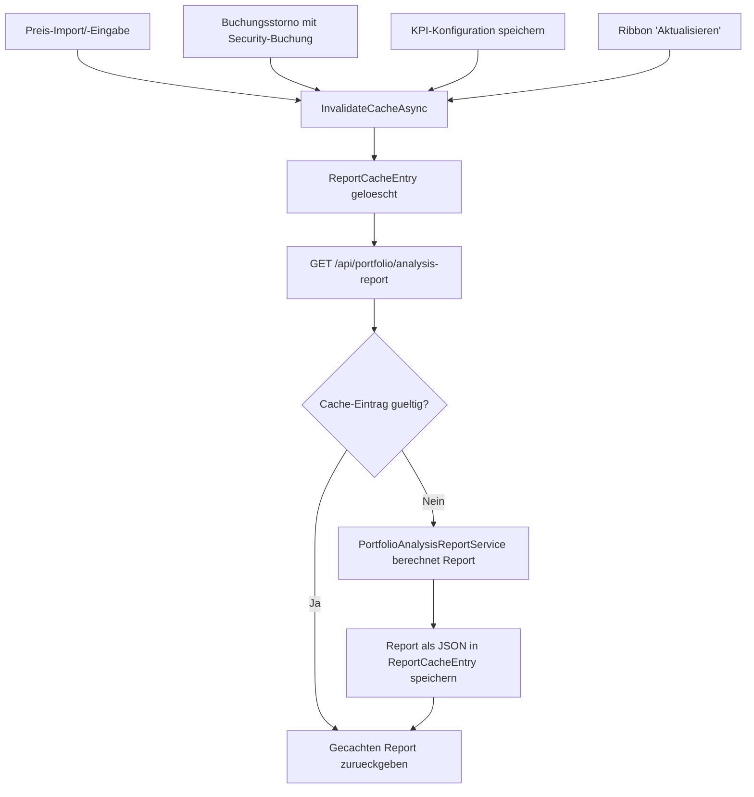

← [Zurück zur Übersicht](index.md)

# Wertpapiermanagement — Technischer Ablauf: Depot-Analysebericht

## Übersicht

Der Depot-Analysebericht aggregiert Kennzahlen über alle Wertpapiere eines
Benutzers hinweg (analog zur Einzelwertpapier-Rendite-Analyse in
`ReturnAnalysisService`, aber depotweit) und cacht das Ergebnis pro Benutzer
bis Monatsende. Beteiligt sind `PortfolioAnalysisReportService` (Berechnung),
`PortfolioAnalysisReportCacheService` (Cache), `IPortfolioKpiConfigurationRepository`
(Kachel-Konfiguration), `PortfolioAnalysisReportController` (API) und
`PortfolioAnalysisReportPageViewModel` / `PortfolioAnalysisReportPage.razor` (UI).

## Ablauf

### 1. Bericht laden (View-Mode)

`PortfolioAnalysisReportPage.razor` erstellt beim Initialisieren ein
`PortfolioAnalysisReportPageViewModel` und ruft `LoadReportAsync()` auf. Diese
Methode ruft zwei Endpunkte parallel-sequenziell ab:

- `GET /api/portfolio/analysis-report` (`PortfolioAnalysisReportController.GetAnalysisReportAsync`)
- `GET /api/portfolio/kpi-configuration` (`PortfolioAnalysisReportController.GetKpiConfigurationAsync`)

Beteiligte Komponenten:
- `PortfolioAnalysisReportPageViewModel.LoadReportAsync` — orchestriert den Ladevorgang, setzt `PortfolioReportData` und `CurrentConfiguration`
- `PortfolioAnalysisReportController.GetAnalysisReportAsync` — liefert den (ggf. gecachten) Bericht für `ICurrentUserService.UserId`
- `PortfolioAnalysisReportController.GetKpiConfigurationAsync` — liefert die gespeicherte Kachel-Konfiguration, oder eine Default-Konfiguration (`Structure`, `Performance`, `Cashflow` aktiv, `Risk` inaktiv), wenn noch keine existiert

### 2. Cache-Lookup und Berechnung

`PortfolioAnalysisReportCacheService.GetPortfolioReportAsync` sucht einen
`ReportCacheEntry` mit dem Schlüssel `portfolio-analysis-report-{OwnerUserId:N}`.

- Ist ein Eintrag vorhanden, `NeedsRefresh == false` und
  `CacheValidUntilUtc >= DateTime.UtcNow`, wird der gecachte, als JSON
  gespeicherte `PortfolioAnalysisReportDto` deserialisiert und zurückgegeben.
- Andernfalls berechnet `PortfolioAnalysisReportService.GetPortfolioAnalysisReportAsync`
  den Bericht neu:
  - `LoadPositionsAsync` lädt alle `Security`-Datensätze des Benutzers samt
    `Region`, `Sector`, `CategoryId`, dazu alle `Posting`-Datensätze mit
    gesetztem `SecuritySubType` und alle `SecurityPrice`-Datensätze; pro
    Wertpapier wird `IFifoCostBasisCalculator.Calculate` aufgerufen.
  - `BuildStructure` summiert Marktwert (`TotalSharesHeld * CurrentPrice`) und
    investiertes Kapital (`TotalCostBasis - StandaloneFeeTotal`) je Position,
    gruppiert nach Kategorie/Region/Sektor (fehlende Werte werden als
    "Ohne Kategorie" bzw. "Unbekannt" gruppiert) und bildet zwei Listen:
    `TopPositions` (Top 10) und `AllPositions` (vollständig, gedeckelt auf
    200 Einträge mit „und N weitere"-Hinweis). Zusätzlich wird pro Wertpapier
    der `InvestedCapitalBreakdown` (FIFO-Lots, ebenfalls gedeckelt auf 200
    Einträge) berechnet.
  - `BuildPerformance` berechnet je Kalenderjahr und je Kalendermonat eine
    Modified-Dietz-Periodenrendite (`ComputePeriodMetrics`) und verkettet die
    Jahreswerte über `IReturnCalculationService.CalculateTwr` zur
    Gesamtrendite seit Beginn.
  - `BuildCashflow` summiert Käufe/Verkäufe/Dividenden des laufenden Jahres
    sowie realisierte Gewinne (Differenz der FIFO-Ergebnisse mit/ohne
    Transaktionen vor Jahresbeginn). Die Liquiditätsquote ist in Phase 1
    konstant `0`.
  - `Risk` wird als `PortfolioRiskDto` mit ausschließlich `null`-Werten
    zurückgegeben (Platzhalter für Phase 2).
  - `CacheValidUntilUtc` wird auf das Monatsende (`EndOfMonthUtc`) gesetzt.
- Das Ergebnis wird als JSON in einem neuen oder bestehenden
  `ReportCacheEntry` gespeichert (`entry.Update` bzw. `new ReportCacheEntry(...)`).

Beteiligte Komponenten:
- `PortfolioAnalysisReportCacheService.GetPortfolioReportAsync`
- `PortfolioAnalysisReportService.GetPortfolioAnalysisReportAsync`, `LoadPositionsAsync`, `BuildStructure`, `BuildPerformance`, `BuildCashflow`
- `IFifoCostBasisCalculator.Calculate`, `IReturnCalculationService.CalculateTwr`
- `SecurityValuationHelper.SharesHeldOnDate`, `SecurityValuationHelper.LatestPriceOnOrBefore`

### 3. Kacheln rendern

`PortfolioAnalysisReportPage.razor` iteriert `CurrentConfiguration.TileOrder`,
gefiltert auf `ActiveTileIds`, und rendert je `PortfolioTileId` die passende
Kachel-Komponente: `PortfolioStructureCard`, `PortfolioPerformanceCard`,
`PortfolioCashflowCard` bzw. `PortfolioRiskCard`. Jede Kachel bettet ihren
Inhalt in die generische `PortfolioKpiCard` (Titel + Body) ein.

Für die visuelle Darstellung nutzen die Kacheln zwei generische
Diagramm-Komponenten aus `FinanceManager.Web/Components/Shared/`:
- `DonutChart` (Ringdiagramm mit Legende und Zentrumswert) — Asset Allocation
  in `PortfolioStructureCard`.
- `MiniBarChart` (kompaktes Balkendiagramm) — jährliche Renditen in
  `PortfolioPerformanceCard` sowie Netto-Einzahlungen/Dividenden/realisierte
  Gewinne in `PortfolioCashflowCard`.

Kennzahlen mit einer sinnvollen Herleitung (z. B. Gesamtmarktwert, investiertes
Kapital, unrealisierter Gewinn/Verlust, TWR, YTD-Rendite, Netto-Einzahlungen,
Dividenden) binden zusätzlich `KpiInfoButton` ein: Ein Info-Button öffnet ein
Overlay-Panel (`role="dialog"`) mit der Erklärung als Text, Formel oder
Tabelle. Die Erklärung zum Gesamtmarktwert nutzt das DTO-Feld `AllPositions`
und zeigt alle Positionen in einem scrollbaren Container (`.kpi-explanation-scroll`),
bei Überschreitung von 200 Einträgen mit „und N weitere"-Hinweis. Die Erklärung
zum investierten Kapital nutzt `InvestedCapitalBreakdown` und zeigt je Wertpapier
ein Akkordeon-Element (`
/
`) mit den zugehörigen FIFO-Lots,
ebenfalls gedeckelt auf 200 Einträge.

### 4. Konfiguration bearbeiten (Edit-Mode)

1. Klick auf den Ribbon-Button "Bearbeiten" ruft
   `PortfolioAnalysisReportPageViewModel.EnterEditModeAsync()` auf, das die
   aktuelle Konfiguration neu lädt und `IsEditMode = true` setzt.
2. Die Seite kopiert `TileOrder`/`ActiveTileIds` in lokale Bearbeitungslisten
   (`_editOrder`, `_editActive`) und zeigt je Kachel eine Checkbox
   (Sichtbarkeit) sowie Auf-/Ab-Buttons (Reihenfolge über `MoveTile`, das zwei
   benachbarte Listeneinträge vertauscht).
3. Klick auf "Speichern" (`SaveAsync`) baut aus den lokalen Listen ein
   `PortfolioKpiConfigurationRequest` (`ActiveTileIds` = markierte Kacheln in
   `_editOrder`-Reihenfolge, `TileOrder` = vollständige `_editOrder`-Liste) und
   ruft `PortfolioAnalysisReportPageViewModel.SaveConfigurationAsync` auf.
4. `SaveConfigurationAsync` sendet `POST /api/portfolio/kpi-configuration`.
   `PortfolioAnalysisReportController.SaveKpiConfigurationAsync` validiert
   (mindestens eine aktive Kachel; `TileOrder` enthält alle aktiven Kacheln
   ohne Duplikate), persistiert über
   `IPortfolioKpiConfigurationRepository.UpsertAsync` und ruft anschließend
   `IPortfolioAnalysisReportCacheService.InvalidateCacheAsync` auf.
5. Das ViewModel setzt `IsEditMode = false` und lädt den Bericht per
   `GET /api/portfolio/analysis-report` neu — durch die vorangegangene
   Invalidierung wird er dabei frisch berechnet.

Beteiligte Komponenten: `PortfolioAnalysisReportPage.razor`,
`PortfolioAnalysisReportPageViewModel.EnterEditModeAsync` /
`SaveConfigurationAsync` / `CancelEditMode`,
`PortfolioAnalysisReportController.SaveKpiConfigurationAsync`,
`IPortfolioKpiConfigurationRepository.UpsertAsync`,
`IPortfolioAnalysisReportCacheService.InvalidateCacheAsync`

### 5. Cache-Invalidierung durch andere Vorgänge

Zusätzlich zur expliziten Invalidierung beim Speichern der Konfiguration wird
der Cache an zwei Stellen automatisch verworfen:

- `SecurityPriceService.CreateAsync` und `SecurityPriceService.UpsertDailyPricesAsync`
  rufen nach dem Speichern neuer/geänderter Kurse
  `IPortfolioAnalysisReportCacheService.InvalidateCacheAsync` auf (nur wenn
  tatsächlich Einträge eingefügt oder aktualisiert wurden).
- `PostingReversalService.ReversePostingAsync` ruft nach erfolgreichem
  Commit der Stornobuchungen `InvalidateCacheAsync` auf, wenn mindestens eine
  der betroffenen Buchungen `Kind == PostingKind.Security` ist.

Der Ribbon-Button "Aktualisieren" auf der Berichtsseite
(`PortfolioAnalysisReportPageViewModel.RefreshReportAsync`) ruft
`POST /api/portfolio/cache/reset` auf und lädt danach neu — das erzwingt eine
Neuberechnung unabhängig vom Auslöser.

`IPortfolioAnalysisReportCacheService` wird beiden Services als optionale
Abhängigkeit injiziert (`= null` Default), damit bestehende Tests/Aufrufer
ohne Portfolio-Cache-Registrierung weiter funktionieren.

## Diagramm

## Fehlerbehandlung

- Schlägt `LoadReportAsync`, `EnterEditModeAsync`, `SaveConfigurationAsync`
  oder `RefreshReportAsync` fehl, fängt das ViewModel die Exception ab und
  setzt den Fehlerzustand über `SetError(ApiClient.LastErrorCode, ApiClient.LastError)`;
  die Seite bleibt im vorherigen Zustand.
- `SaveKpiConfigurationAsync` liefert `400 Bad Request` (`ValidationProblem`),
  wenn keine Kachel aktiv ist oder `TileOrder` nicht exakt die aktiven Kacheln
  ohne Duplikate enthält.
- Kann der gecachte JSON-Wert nicht deserialisiert werden (`null` nach
  `JsonSerializer.Deserialize`), wird der Bericht wie bei einem Cache-Miss neu
  berechnet.
