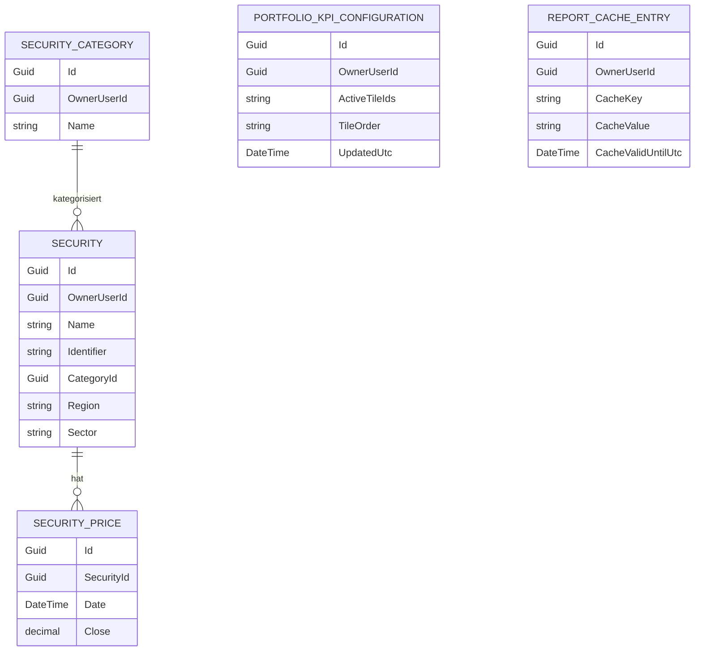

← [Zurück zur Übersicht](index.md)

# Wertpapiermanagement — Datenmodell

## Entitäten

### `Security`

| Eigenschaft | Typ | Beschreibung |
|-------------|-----|--------------|
| `Id` | `Guid` | Wertpapier-ID |
| `OwnerUserId` | `Guid` | Eigentümer |
| `Name` | `string` | Name |
| `Identifier` | `string` | Kennung (z. B. ISIN/WKN) |
| `AlphaVantageCode` | `string?` | Externer Kurscode |
| `CurrencyCode` | `string` | Währung |
| `CategoryId` | `Guid?` | Kategorie |
| `Region` | `string?` | Optionale Region (max. 255 Zeichen), Basis für die regionale Verteilung im Depot-Analysebericht |
| `Sector` | `string?` | Optionaler Sektor (max. 255 Zeichen), Basis für die Sektorverteilung im Depot-Analysebericht |
| `HasPriceError` | `bool` | Preisfehler-Flag |
| `SymbolAttachmentId` | `Guid?` | Symbol |

### `PortfolioKpiConfiguration`

| Eigenschaft | Typ | Beschreibung |
|-------------|-----|--------------|
| `Id` | `Guid` | Konfigurations-ID |
| `OwnerUserId` | `Guid` | Eigentümer (eindeutig, ein Datensatz pro Benutzer) |
| `ActiveTileIds` | `string` | JSON-serialisiertes Array sichtbarer `PortfolioTileId`-Werte |
| `TileOrder` | `string` | JSON-serialisiertes Array mit der Anzeigereihenfolge aller Kachel-IDs |
| `UpdatedUtc` | `DateTime` | Zeitpunkt der letzten Änderung |

`PortfolioTileId` ist ein Enum mit den Werten `Structure`, `Performance`,
`Cashflow`, `Risk`.

### `ReportCacheEntry` (erweitert)

| Eigenschaft | Typ | Beschreibung |
|-------------|-----|--------------|
| `CacheValidUntilUtc` | `DateTime?` | Zeitpunkt, bis zu dem der Cache-Eintrag gültig ist (z. B. Monatsende für den Depot-Analysebericht); `null` bedeutet keine zeitliche Begrenzung (bestehendes Verhalten anderer Berichte). Der Depot-Analysebericht wird unter dem Schlüssel `portfolio-analysis-report-{OwnerUserId:N}` abgelegt. |

### `SecurityPrice`

| Eigenschaft | Typ | Beschreibung |
|-------------|-----|--------------|
| `Id` | `Guid` | Kurs-ID |
| `SecurityId` | `Guid` | Wertpapierreferenz |
| `Date` | `DateTime` | Kursdatum |
| `Close` | `decimal` | Schlusskurs |
| `CreatedUtc` | `DateTime` | Erzeugungszeit |

### `SecurityCategory`

| Eigenschaft | Typ | Beschreibung |
|-------------|-----|--------------|
| `Id` | `Guid` | Kategorie-ID |
| `OwnerUserId` | `Guid` | Eigentümer |
| `Name` | `string` | Kategoriename |

## Beziehungen

- Ein `Security` hat viele `SecurityPrice`-Einträge.
- Eine `SecurityCategory` kann vielen Wertpapieren zugeordnet sein.
- Der Depot-Analysebericht aggregiert alle `Security`-, `Posting`- (mit
  `SecuritySubType`) und `SecurityPrice`-Datensätze eines Benutzers zu einem
  `PortfolioAnalysisReportDto`, das als JSON in einem `ReportCacheEntry`
  zwischengespeichert wird.
- Für die Liquiditätsquote leitet der Depot-Analysebericht Verrechnungskonten
  aus vorhandenen `Posting.GroupId`-Beziehungen ab: Security-Postings des
  Benutzers bestimmen relevante Gruppen, Bank-Postings derselben Gruppen
  liefern die `AccountId`, und die aktuellen Salden dieser Konten werden
  dedupliziert summiert.
- Eine `PortfolioKpiConfiguration` gehört genau einem Benutzer
  (`OwnerUserId` eindeutig) und bestimmt, welche Kacheln im
  Depot-Analysebericht angezeigt werden und in welcher Reihenfolge.

## Diagramm

Es bestehen keine Fremdschlüssel zwischen `Security`, `PortfolioKpiConfiguration`
und `ReportCacheEntry` — der Depot-Analysebericht verknüpft diese Daten
ausschließlich zur Laufzeit über den gemeinsamen `OwnerUserId`, nicht über
Datenbankbeziehungen.

