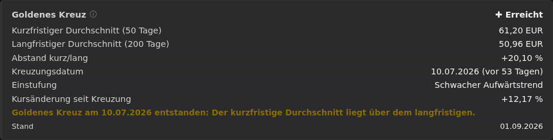
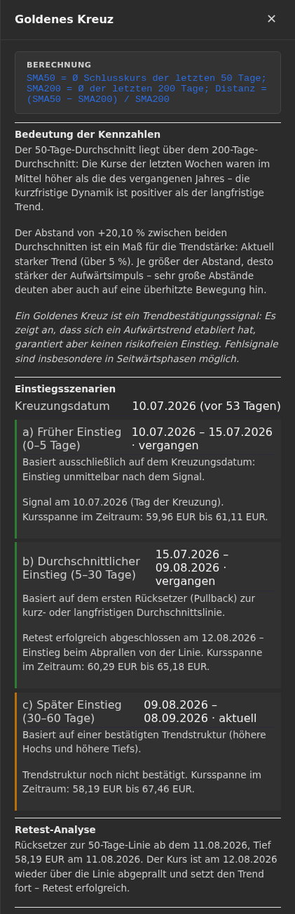

← [Zurück zur Übersicht](index.md)

# Wertpapiermanagement — Statistikfeld „Goldenes Kreuz"

## Zweck

Das Statistikfeld „Goldenes Kreuz" ergänzt die Kennzahlen auf der
Wertpapierkarte (`/card/securities/{id}`, direkt unterhalb der Box
„Gesamtrendite") um eine einfache Trendanalyse auf Basis zweier gleitender
Durchschnitte. Ein Goldenes Kreuz liegt vor, wenn der kurzfristige
Kursdurchschnitt (Standard: 50 Handelstage) den langfristigen Kursdurchschnitt
(Standard: 200 Handelstage) von unten nach oben durchbricht. Es gilt als
Bestätigung eines beginnenden oder etablierten Aufwärtstrends.

## Wann wird das Feld angezeigt?

Die Box erscheint **nur**, wenn für das Wertpapier eine Goldenes-Kreuz-Situation
vorliegt:

| Phase | Bedingung | Anzeige |
|-------|-----------|---------|
| **Erreicht** (`Crossed`) | SMA50 ≥ SMA200 | Box wird angezeigt |
| **Nähert sich** (`Approaching`) | SMA50 liegt unter SMA200, aber höchstens 3 % darunter | Box wird angezeigt |
| Weit entfernt (`Far`) | SMA50 liegt mehr als 3 % unter SMA200 | Box wird **nicht** angezeigt |
| Zu wenig Daten (`InsufficientData`) | Weniger als 200 Kurse vorhanden | Box wird **nicht** angezeigt |

Damit sieht der Anwender nichts vom Goldenen Kreuz, solange die Schwelle weder
erreicht noch in Reichweite ist – auch dann nicht, wenn ausreichend Kursdaten
vorliegen.

## Kennzahlen in der Box

| Zeile | Bedeutung |
|-------|-----------|
| **Phase** (rechts im Titel) | „✚ Erreicht" oder „↗ Nähert sich" |
| **Kurzfristiger Durchschnitt (50 Tage)** | Arithmetisches Mittel der letzten 50 Schlusskurse |
| **Langfristiger Durchschnitt (200 Tage)** | Arithmetisches Mittel der letzten 200 Schlusskurse |
| **Abstand kurz/lang** | `(SMA50 − SMA200) / SMA200` in Prozent; positiv nach der Kreuzung, negativ davor |
| **Kreuzungsdatum** | Tag, an dem SMA50 den SMA200 zuletzt von unten nach oben durchbrochen hat, mit „vor N Tagen". Liegt die Kreuzung vor Beginn der geladenen Kurshistorie, steht hier „vor Beginn der Kursdaten" |
| **Einstufung** | Trendstruktur seit der Kreuzung: Stabiler Aufwärtstrend, Schwacher Aufwärtstrend, Seitwärtsphase oder Noch nicht bewertbar |
| **Kursänderung seit Kreuzung** | Prozentuale Veränderung des Schlusskurses seit dem Kreuzungstag |
| **Hinweistext** | Kurzfassung der Situation (z. B. „Goldenes Kreuz am 10.07.2026 entstanden …") |
| **Stand** | Datum des zuletzt berücksichtigten Kurses |

Bei der Phase „Nähert sich" werden nur Durchschnitte, Abstand, Hinweis und
Stand gezeigt; Kreuzungsdatum, Einstufung und Kursänderung entfallen, da noch
keine Kreuzung stattgefunden hat.

## Info-Panel (ⓘ)

Wie bei den Kennzahlen der Box „Gesamtrendite" öffnet das Info-Symbol neben dem
Titel ein rechtsbündiges Seitenpanel mit den ausführlichen Erklärungen. Es wird
über „×" oder per Klick auf den abgedunkelten Hintergrund geschlossen.

Das Panel enthält folgende Abschnitte:

### Berechnung

Formelbox mit der Berechnungsvorschrift der beiden Durchschnitte und des
Abstands.

### Bedeutung der Kennzahlen

- Erklärung, was es bedeutet, wenn der 50-Tage-Durchschnitt über (bzw. knapp
  unter) dem 200-Tage-Durchschnitt liegt.
- Einordnung des Abstands als Maß für die Trendstärke: schwach (< 1 %),
  moderat (< 5 %), stark (≥ 5 %).
- Hinweis, dass ein Goldenes Kreuz ein Trendbestätigungssignal ist und keinen
  risikofreien Einstieg garantiert (Fehlsignale in Seitwärtsphasen).

### Einstiegsszenarien

Nur bei Phase „Erreicht" mit bekanntem Kreuzungsdatum. Ausgehend vom
Kreuzungstag werden drei Zeitfenster gebildet und jeweils mit Zeitraum, Status
(steht bevor / aktuell / vergangen), Kursspanne und ggf. Signaltag beschrieben:

| Szenario | Fenster | Signal |
|----------|---------|--------|
| **a) Früher Einstieg** | 0–5 Kalendertage nach der Kreuzung | Der Kreuzungstag selbst |
| **b) Durchschnittlicher Einstieg** | 5–30 Tage | Erfolgreich abgeschlossener Retest (Rücksetzer zur SMA50- oder SMA200-Linie und Abprallen nach oben) |
| **c) Später Einstieg** | 30–60 Tage | Bestätigte Trendstruktur (höhere Hochs und höhere Tiefs) |

Ein Fenster gilt als *bestätigt*, wenn das jeweilige Signal innerhalb des
Fensters eingetreten ist; die Signaltage werden angezeigt.

### Retest-Analyse

Beschreibt den ersten Rücksetzer nach der Kreuzung: zu welcher Linie (50- oder
200-Tage-Durchschnitt, Toleranz 1 %), ab welchem Tag, mit welchem Tief, und ob
der Retest noch läuft, erfolgreich war (Kurs prallt wieder über die Linie ab)
oder gescheitert ist (aktueller Kurs notiert unter der langfristigen Linie).
Ohne Rücksetzer wird dies entsprechend ausgewiesen.

### Trendstruktur seit der Kreuzung

Einstufung der Kursstruktur nach der Kreuzung anhand von Zwischenhochs und
-tiefs (Swing-Punkte mit drei Kursen Vorlauf/Nachlauf):

- **Stabiler Aufwärtstrend** – alle Zwischenhochs und -tiefs liegen über ihrem
  Vorgänger und der Kurs ist seit der Kreuzung gestiegen.
- **Schwacher Aufwärtstrend** – Kurs seit der Kreuzung um mehr als 1 %
  gestiegen, Abfolge höherer Hochs/Tiefs aber nicht sauber ausgeprägt.
- **Seitwärtsphase** – genügend Kurse vorhanden, aber kein nennenswerter
  Kursfortschritt seit der Kreuzung.
- **Noch nicht bewertbar** – weniger als 10 Kurse seit der Kreuzung.

### Kreuzung vor Beginn der Kursdaten

Für die Analyse werden maximal 600 Kurse (3 × langes Fenster) geladen. Lag der
SMA50 bereits am Anfang dieses Zeitraums über dem SMA200, kann kein
Kreuzungstag bestimmt werden. Die Box zeigt dann „Kreuzungsdatum: vor Beginn
der Kursdaten" und das Panel erklärt, warum Einstiegsszenarien, Retest und
Trendstruktur nicht ermittelt werden können. In den Demodaten ist dies beim
Wertpapier „USHSIV-MSCI WLD" der Fall, während „Inländische Post AG" ein
vollständig auswertbares Goldenes Kreuz enthält (siehe Screenshots).

## Hinweise auf der Startseite

Nach jedem Kursabruf durch den `SecurityPriceWorker` wird die Phase des
Wertpapiers neu bewertet. Wechselt ein Wertpapier auf „Nähert sich" oder
„Erreicht", erzeugt die Anwendung einmalig pro Zyklus eine ereignisgesteuerte
Benachrichtigung auf der Startseite („Goldenes Kreuz nähert sich: …" bzw.
„Goldenes Kreuz erreicht: …"). Ein Klick auf den Hinweis öffnet die
Wertpapierkarte. Fällt der SMA50 wieder mehr als 3 % unter den SMA200, wird der
Zyklus zurückgesetzt, so dass beim nächsten Annähern erneut benachrichtigt wird.

Die Hinweise lassen sich unter **Einrichtung → Benachrichtigungen** mit der
Option „Goldenes-Kreuz-Hinweise aktivieren" pro Benutzer abschalten
(standardmäßig aktiv). Das Statistikfeld auf der Wertpapierkarte ist davon
unabhängig und wird weiterhin angezeigt.

## Einschränkungen

- Die Analyse basiert ausschließlich auf Schlusskursen; Dividenden, Splits
  oder Intraday-Kurse werden nicht berücksichtigt.
- Ein Goldenes Kreuz ist ein nachlaufender Indikator und keine
  Anlageempfehlung.
- Einstiegsszenarien, Retest und Trendstruktur setzen ein innerhalb der
  geladenen Kurshistorie (max. 600 Kurse) erkennbares Kreuzungsdatum voraus.
