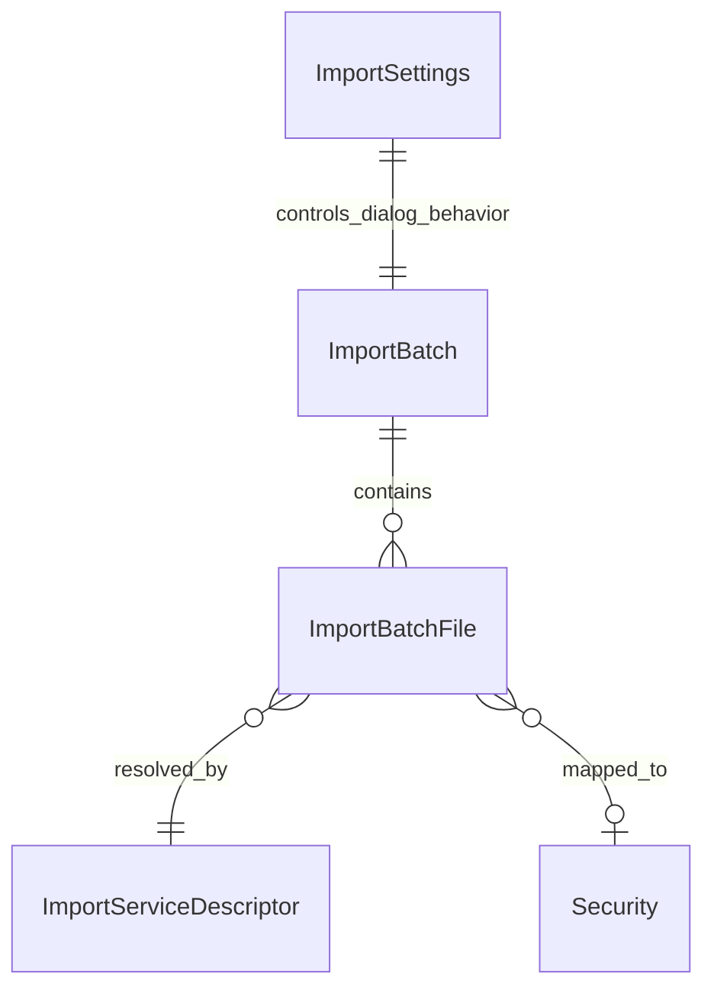

# Anforderungsanalyse: Massenimport ING Wertpapierkurse (Startseite)

> **Primärquelle:** [`../../issue.md`](../../issue.md)  
> **Status:** ✅ Implementiert  
> **Version:** 1.1  
> **Datum:** 2026-07-03  
> **Autor:** planning-requirements-analysis

## 1 Überblick und Projektkontext

Der bestehende Startseiten-Import für Kontoauszüge wird um den Massenimport von Wertpapierkurs-Dateien erweitert. Die Erkennung erfolgt zentral über eine ImportFactory, die pro Datei den Typ ermittelt (**Kontoauszug**, **Wertpapierkurse**, **unbekannt**) und den verarbeitenden Service (z. B. ING, Wüstenrot) zuordnet.  
Für erkannte Kursdateien wird zusätzlich über den Dateinamen versucht, das zugehörige Wertpapier vorab zu bestimmen.

**Geschäftsziele**
- Einheitlicher Import-Einstieg auf der Startseite für Kontoauszüge und Kursdateien.
- Kontrollierter Import über einen Bestätigungsdialog statt automatischem Kurseinlesen.
- Höhere Transparenz durch Anzeige von Dateityp, Service-Anzeigename und bearbeitbaren Importentscheidungen.

**Stakeholder**
- Endnutzer (Finanzdaten- und Portfolio-Pflege)
- Produktverantwortung
- Entwicklung / QA

**Abgrenzung**
- Fokus: Erkennung, Dialoglogik, Dateiauswahl, Wertpapierzuordnung, Einstellungen für Dialogüberspringen.
- Nicht Fokus: Neuer Parser für einzelne Bankformate außerhalb bestehender/angeschlossener Services.

## 2 Funktionale Anforderungen

| Kennung | Beschreibung | Kategorie | Priorität | Status |
|---------|--------------|-----------|-----------|--------|
| **FR-1** | **Startseiten-Massenimport erweitert:** Der Import auf der Startseite akzeptiert sowohl Kontoauszugsdateien als auch Kursdateien in einem gemeinsamen Upload-Flow; messbar durch erfolgreichen Upload beider Dateitypen in einem Importlauf. → [Feature-Plan](../planning/planning-massenimport-ing-wertpapierkurse.md) · [Architektur-Blueprint](../architecture/architecture-blueprint-massenimport-ing-wertpapierkurse.md) | Kern-Feature | MUST HAVE | 📋 Geplant |
| **FR-2** | **ImportFactory-Dateierkennung:** Pro Datei erfolgt die Typklassifikation über die ImportFactory in `Kontoauszug`, `Wertpapierkurse` oder `unbekannt`; messbar durch vollständige Typanzeige für **100 %** der ausgewählten Dateien im Dialog. → [Architektur-Blueprint](../architecture/architecture-blueprint-massenimport-ing-wertpapierkurse.md) | KI-Integration | MUST HAVE | 📋 Geplant |
| **FR-3** | **Dateinamenbasierte Wertpapiererkennung:** Bei Kursdateien wird aus dem Dateinamen automatisch ein Wertpapier-Kandidat bestimmt; messbar durch Vorbelegung des Wertpapiers bei erkennbaren Dateinamen in mindestens den definierten Testmustern. → [ERM](../architecture/entity-relationship-model-massenimport-ing-wertpapierkurse.md) · [Feature-Plan](../planning/planning-massenimport-ing-wertpapierkurse.md) | Datenverwaltung | MUST HAVE | 📋 Geplant |
| **FR-4** | **Verpflichtender Vorab-Dialog für Kursdateien:** Kursdateien werden nicht automatisch eingelesen, sondern vor Ausführung in einem Dialog bestätigt; messbar durch ausbleibende Importausführung ohne explizite Bestätigung. → [Architektur-Blueprint](../architecture/architecture-blueprint-massenimport-ing-wertpapierkurse.md) | UX / Accessibility | MUST HAVE | 📋 Geplant |
| **FR-5** | **Dialogtransparenz Dateityp + Service:** Der Dialog zeigt pro Datei den erkannten Dateityp und den verarbeitenden Service inklusive Anzeigename (z. B. ING, Wüstenrot); messbar durch sichtbare Werte je Dateizeile im Dialograster. → [Architektur-Blueprint](../architecture/architecture-blueprint-massenimport-ing-wertpapierkurse.md) · [Architektur-Review](../improvements/review-architecture-massenimport-ing-wertpapierkurse.md) | Reporting & Analyse | MUST HAVE | 📋 Geplant |
| **FR-6** | **Dateien gezielt ausschließen:** Anwender können einzelne Dateien im Dialog vom Import ausschließen; messbar durch Importausführung nur für markierte Dateien. → [Feature-Plan](../planning/planning-massenimport-ing-wertpapierkurse.md) | Kern-Feature | MUST HAVE | 📋 Geplant |
| **FR-7** | **Wertpapier auswählbar/änderbar:** Für Kursdateien ist das Wertpapier im Dialog auswählbar und änderbar; messbar durch erfolgreiche manuelle Korrektur vor Importstart. → [ERM](../architecture/entity-relationship-model-massenimport-ing-wertpapierkurse.md) · [Architektur-Blueprint](../architecture/architecture-blueprint-massenimport-ing-wertpapierkurse.md) | Kern-Feature | MUST HAVE | 📋 Geplant |
| **FR-8** | **Importstart über Dialogbestätigung:** Erst mit Bestätigung im Dialog wird der Import für die verbleibenden Dateien ausgeführt; messbar durch eindeutig ausgelöste Ausführung nach Klick auf „Bestätigen“. → [Architektur-Blueprint](../architecture/architecture-blueprint-massenimport-ing-wertpapierkurse.md) | Kern-Feature | MUST HAVE | 📋 Geplant |
| **FR-9** | **Einstellungslogik für Dialog-Skip:** Einstellungen `Immer bestätigen` und `bei fehlenden Informationen` steuern, ob der Dialog übersprungen wird, wenn alle Pflichtangaben automatisch erkannt wurden; messbar über reproduzierbare Verhaltensmatrix je Einstellung. → [Feature-Plan](../planning/planning-massenimport-ing-wertpapierkurse.md) · [Architektur-Blueprint](../architecture/architecture-blueprint-massenimport-ing-wertpapierkurse.md) | Kern-Feature | MUST HAVE | 📋 Geplant |

## 3 Nicht-funktionale Anforderungen

| Kennung | Beschreibung | Kategorie | Priorität | Status |
|---------|--------------|-----------|-----------|--------|
| **NFR-1** | **Usability im Dialog:** Der Vorab-Dialog zeigt alle Dateiinformationen in einer klaren Tabelle und ist in maximal **3 Interaktionen** bis zur Bestätigung bedienbar. → [Architektur-Blueprint](../architecture/architecture-blueprint-massenimport-ing-wertpapierkurse.md) | UX / Accessibility | HIGH | 📋 Geplant |
| **NFR-2** | **Performante Voranalyse:** Typ- und Dateinamen-Erkennung für einen typischen Batch (bis 50 Dateien) erfolgt in unter **2 Sekunden** vor Dialoganzeige. → [Feature-Plan](../planning/planning-massenimport-ing-wertpapierkurse.md) | Performance | HIGH | 📋 Geplant |
| **NFR-3** | **Fehlertoleranz und Teilverarbeitung:** Unbekannte oder unvollständige Dateien blockieren den Gesamtimport nicht, solange mindestens eine gültige Datei bestätigt wurde. → [Architektur-Review](../improvements/review-architecture-massenimport-ing-wertpapierkurse.md) | Zuverlässigkeit | MUST HAVE | 📋 Geplant |
| **NFR-4** | **Nachvollziehbarkeit:** Logs enthalten pro Datei mindestens Dateiname, erkannten Typ, Service-Anzeigename, Ausschlussstatus und Ausführungsstatus, ohne sensible Inhaltsdaten zu protokollieren. → [Architektur-Blueprint](../architecture/architecture-blueprint-massenimport-ing-wertpapierkurse.md) | Wartbarkeit | HIGH | 📋 Geplant |
| **NFR-5** | **Erweiterbarkeit weiterer Importservices:** Neue Services mit Anzeigename können ohne Änderung des Startseiten-Controllers in den Factory-Flow integriert werden. → [Architektur-Blueprint](../architecture/architecture-blueprint-massenimport-ing-wertpapierkurse.md) · [Architektur-Review](../improvements/review-architecture-massenimport-ing-wertpapierkurse.md) | Skalierbarkeit | MUST HAVE | 📋 Geplant |
| **NFR-6** | **Datenkonsistenz Wertpapierzuordnung:** Für jede importierte Kursdatei ist vor Ausführung genau ein gültiges Wertpapier gesetzt; bei fehlender Zuordnung greift die Einstellungsregel (`Immer bestätigen` bzw. `bei fehlenden Informationen`). → [ERM](../architecture/entity-relationship-model-massenimport-ing-wertpapierkurse.md) | Datenverwaltung | MUST HAVE | 📋 Geplant |

## 4 Akzeptanzkriterien

### User Story US-1 – Gemeinsamer Startseiten-Upload
**Als** Anwender **möchte ich** auf der Startseite Kontoauszüge und Kursdateien gemeinsam hochladen, **damit** ich meinen Import zentral starten kann.
- AC-1.1: Ein Upload-Batch mit mindestens einer Kontoauszugsdatei und einer Kursdatei wird angenommen.
- AC-1.2: Die ImportFactory klassifiziert jede Datei als `Kontoauszug`, `Wertpapierkurse` oder `unbekannt`.
- AC-1.3: Für jede Datei wird der verarbeitende Service mit Anzeigename angezeigt (z. B. ING, Wüstenrot).

### User Story US-2 – Kontrollierter Kursimport über Dialog
**Als** Anwender **möchte ich** vor dem Import die Dateiliste prüfen und anpassen, **damit** keine falschen Kursdaten eingelesen werden.
- AC-2.1: Kursdateien werden nie automatisch importiert, solange der Dialog nicht bestätigt wurde.
- AC-2.2: Ich kann einzelne Dateien vom Import ausschließen.
- AC-2.3: Für Kursdateien kann ich das vorbefüllte Wertpapier ändern.
- AC-2.4: Erst nach Klick auf „Bestätigen“ wird der Import der verbleibenden Dateien ausgeführt.

### User Story US-3 – Einstellbares Dialogverhalten
**Als** Anwender **möchte ich** das Dialogverhalten konfigurieren, **damit** der Import je nach Datenqualität schneller oder kontrollierter abläuft.
- AC-3.1: Einstellung `Immer bestätigen` zeigt den Dialog in jedem Lauf.
- AC-3.2: Einstellung `bei fehlenden Informationen` zeigt den Dialog nur, wenn Pflichtangaben (z. B. Wertpapierzuordnung) nicht vollständig erkannt sind.
- AC-3.3: Sind alle Pflichtangaben vorhanden und `bei fehlenden Informationen` aktiv, wird der Dialog übersprungen und der Import direkt ausgeführt.

## 5 Annahmen und Abhängigkeiten

| Typ | Beschreibung | Einfluss |
|---|---|---|
| Annahme | „Pflichtangaben“ umfassen mindestens Dateityp, Service und bei Kursdateien eine gültige Wertpapierzuordnung. | Steuert Dialog-Skip-Logik (FR-9/NFR-6) |
| Annahme | Dateinamenmuster zur Wertpapiererkennung werden zunächst regelbasiert (keine ML-Komponente) umgesetzt. | Umfang und Genauigkeit von FR-3 |
| Annahme | Service-Anzeigenamen (ING, Wüstenrot, …) werden zentral an den Importservices gepflegt. | Konsistente Dialoganzeige gemäß FR-5 |
| Abhängigkeit | Bestehende ImportFactory und Kontoauszug-Importpfade bleiben kompatibel erweiterbar. | Voraussetzung für FR-1/FR-2 |
| Abhängigkeit | Verfügbare Wertpapierstammdaten sind im Dialog abrufbar (Lookup/Autocomplete). | Voraussetzung für FR-7 |
| Abhängigkeit | UI-Komponenten für Dateiliste, Checkbox-Ausschluss und Select-Auswahl sind im Startseitenkontext integrierbar. | Umsetzung FR-4 bis FR-8 |

## 6 Scope und Out-of-Scope

### In-Scope ✅
- Erweiterung des Startseiten-Imports um Kursdateien.
- ImportFactory-Klassifikation `Kontoauszug` / `Wertpapierkurse` / `unbekannt`.
- Dateinamenbasierte Vorbelegung des Wertpapiers bei Kursdateien.
- Vorab-Dialog mit Dateityp, Service-Anzeigename, Datei-Ausschluss und Wertpapierauswahl.
- Einstellungslogik `Immer bestätigen` und `bei fehlenden Informationen`.

### Out-of-Scope ❌
- Vollautomatische, periodische Kursimporte ohne Benutzerauslösung.
- Neue Bankparser außerhalb des benötigten Flows für dieses Feature.
- Umbau bestehender Einzel-Importseiten für Wertpapierkurse außerhalb notwendiger Schnittstellenanpassungen.
- Historische Datenkorrekturen außerhalb der in einem bestätigten Importlauf enthaltenen Dateien.

## 7 Domänenmodell und Glossar

### Domänenmodell (vereinfacht)

### Schlüsselentitäten
- **ImportBatch:** Laufkontext für einen Startseiten-Import mit mehreren Dateien.
- **ImportBatchFile:** Einzeldatei mit Erkennungsergebnissen, Ausschlussstatus und Ausführungsstatus.
- **ImportServiceDescriptor:** Technischer Service + Anzeigename (z. B. ING, Wüstenrot).
- **ImportSettings:** Benutzerkonfiguration für Dialogverhalten.
- **Security:** Wertpapier, das bei Kursdateien vor Ausführung gesetzt sein muss.

### Glossar
- **ImportFactory:** Komponente zur Erkennung des Dateityps und Auswahl des verarbeitenden Services.
- **Kursdatei:** Datei mit Wertpapierkursdaten, die einer Security zugeordnet wird.
- **Pflichtangaben:** Minimaldaten für direkten Import ohne Dialog (gemäß Annahmen in Abschnitt 5).
- **Dialog-Skip:** Regelgesteuertes Überspringen des Dialogs bei vollständiger automatischer Erkennung.

## 8 Nutzungsfälle (Use Cases)

### UC-1: Gemischter Batch mit Bestätigungsdialog
- **Akteure:** Anwender, Startseiten-UI, ImportFactory, Kontoauszug-Service, Kursimport-Service
- **Vorbedingungen:** Anwender lädt mehrere Dateien (Kontoauszug + Kursdatei) hoch.
- **Hauptablauf:** Dateien hochladen → Factory erkennt Typ/Service → Dialog zeigt Dateityp + Service-Anzeigename → Anwender schließt einzelne Dateien aus und prüft Wertpapierzuordnung → Bestätigung startet Import.
- **Ergebnis:** Nur freigegebene Dateien werden importiert; ausgeschlossene Dateien bleiben unberührt.

### UC-2: Kursdatei mit unklarer Wertpapierzuordnung
- **Akteure:** Anwender, Startseiten-UI, ImportFactory
- **Vorbedingungen:** Dateiname reicht nicht für eindeutige Security-Erkennung.
- **Hauptablauf:** Datei wird als `Wertpapierkurse` erkannt → Dialog wird angezeigt → Anwender wählt/ändert Wertpapier manuell → Import wird bestätigt.
- **Ergebnis:** Kursdatei wird mit korrekter Security verarbeitet.

### UC-3: Dialogübersprung bei vollständigen Informationen
- **Akteure:** Anwender, Einstellungen, Startseiten-UI
- **Vorbedingungen:** Einstellung `bei fehlenden Informationen` aktiv; alle Pflichtangaben automatisch erkannt.
- **Hauptablauf:** Upload-Batch starten → System prüft Pflichtangaben → Dialog wird übersprungen → Import wird direkt ausgeführt.
- **Ergebnis:** Schnellimport ohne manuelle Zwischenschritte.

## 9 Umsetzungsnachweis (Stand 2026-07-03)

### Feature-Abdeckung FR
- **FR-1 bis FR-3:** umgesetzt in `FinanceManager.Infrastructure/Statements/MassImportOrchestrator.cs` (`AnalyzeFile`, Dateityp-Erkennung, Dateiname-basierte Security-Vorbelegung).
- **FR-4 bis FR-8:** umgesetzt im Zwei-Phasen-Flow über `POST /api/statement-drafts/mass-import` (`ConfirmExecution=false/true`) und Home-Dialog (`FinanceManager.Web/Components/Pages/Home.razor`).
- **FR-9:** umgesetzt über `MassImportDialogPolicy` in `ImportSplitSettingsDto`, `ImportSplitSettingsUpdateRequest`, `UserSettingsController` und `SetupStatementTab.razor`.

### NFR-Abdeckung
- **NFR-3 (Teilverarbeitung):** pro Datei `ExecutionStatus` mit `Skipped/Imported/Failed`; Batch bricht bei Einzelfehlern nicht vollständig ab.
- **NFR-4 (Nachvollziehbarkeit):** strukturierte Audit-Logs mit `MassImportAudit ... batchId/fileId/.../traceId`.
- **NFR-6 (Datenkonsistenz):** Re-Validierung der ausgewählten Security unmittelbar vor Persistierung (`_securityService.GetAsync` + `IsActive`-Prüfung).

### Testnachweise (Feature-Scope)
- Unit: `FinanceManager.Tests/Statements/MassImportOrchestratorTests.cs`
- Unit: `FinanceManager.Tests/ViewModels/HomeViewModelTests.cs`
- Integration: `FinanceManager.Tests.Integration/ApiClient/ApiClientStatementDraftsTests.cs`
- Integration: `FinanceManager.Tests.Integration/ApiClient/ApiClientUserSettingsTests.cs`

## 10 Approval & Versionierung

| Version | Datum | Autor | Änderung | Freigabestatus |
|---|---|---|---|---|
| 1.0 | 2026-07-03 | planning-requirements-analysis | Initiale vollständige Anforderungsanalyse für Startseiten-Massenimport von Kontoauszügen und ING-Wertpapierkursdateien erstellt. | 📋 Geplant |
| 1.1 | 2026-07-03 | documentation-orchestrator | Status auf Implementierung aktualisiert; Umsetzungsnachweise für FR/NFR und Tests ergänzt. | ✅ Dokumentiert |

**Approval-Status**
- Produktverantwortung: ✅ Berücksichtigt in Dokumentation
- Tech Lead: ✅ Berücksichtigt in Dokumentation
- QA: ✅ Berücksichtigt in Dokumentation
