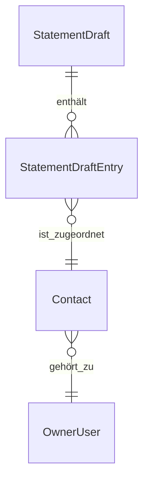

# Anforderungsanalyse: Automatische Kontaktzuordnung nach Kontakt-Neuanlage im Kontoauszug

> **Status:** 📋 Geplant  
> **Version:** 0.1  
> **Datum:** 2026-07-01  
> **Autor:** Requirements Analysis Agent

## 1 Überblick und Projektkontext

Beim Bearbeiten von Kontoauszugseinträgen kann aus dem Eintrag heraus ein neuer Kontakt angelegt werden. Die erwartete automatische Übernahme dieses neu erstellten Kontakts in den auslösenden Kontoauszugeintrag ist aktuell verloren gegangen. Ziel ist die fachlich korrekte Wiederherstellung dieser Funktion inkl. stabiler Persistenz und unmittelbarer Sichtbarkeit in der UI.

**Geschäftsziele**
- Reduktion manueller Nacharbeit beim Kontoauszug-Buchen.
- Vermeidung von Fehlzuordnungen und Medienbrüchen nach Kontakt-Neuanlage.
- Konsistenter End-to-End-Flow „Kontakt anlegen und direkt verwenden“.

**Stakeholder**
- Endnutzer im Kontoauszugsprozess
- Produktverantwortung für Buchungs- und Kontaktlogik
- Backend-/Frontend-Entwicklung
- QA/Testing

**Abgrenzung**
- Fokus: Automatische Zuordnung des neu angelegten Kontakts zum auslösenden `StatementDraftEntry`.
- Nicht Fokus: allgemeines Redesign der Kontaktverwaltung oder der Kontoauszugsbuchung.

## 2 Funktionale Anforderungen

| Kennung | Beschreibung | Kategorie | Priorität | Status |
|---------|--------------|-----------|-----------|--------|
| **FR-1** | **Automatische Kontaktübernahme nach Neuanlage:** Wird aus einem Kontoauszugeintrag ein neuer Kontakt erstellt und erfolgreich gespeichert, muss dessen `ContactId` unmittelbar dem auslösenden Eintrag zugewiesen und persistiert werden; messbar durch **100 %** erfolgreiche Übernahme in den definierten E2E-Szenarien. → [Architektur-Blueprint](../architecture/architecture-blueprint-statement-contact-auto-assignment.md) · [ERM](../architecture/entity-relationship-model-statement-contact-auto-assignment.md) · [Architecture Review](../improvements/review-architecture-statement-contact-auto-assignment.md) · [Planung](../planning/planning-statement-contact-auto-assignment.md) | Kern-Feature | MUST HAVE | 📋 Geplant |
| **FR-1.1** | **Kontexttreue Zuordnung:** Die automatische Zuordnung erfolgt exakt auf den Eintrag, der die Kontaktanlage ausgelöst hat (nicht auf andere offene Einträge); messbar durch **0** Fehlzuordnungen in Mehrfenster-/Mehrentwurfs-Tests. | Datenverwaltung | MUST HAVE | 📋 Geplant |
| **FR-1.2** | **Unmittelbare UI-Aktualisierung:** Nach erfolgreicher Persistenz wird der zugewiesene Kontaktname ohne manuellen Reload im Kontoauszugeintrag sichtbar; messbar in **100 %** der UI-Abnahmetests. | UX / Accessibility | HIGH | 📋 Geplant |
| **FR-2** | **Fehlersichere Nachbehandlung:** Schlägt die Zuordnung nach Kontaktanlage fehl, erhält der Nutzer eine eindeutige Fehlerrückmeldung und der Eintrag bleibt in konsistentem Zustand; messbar durch **100 %** deterministisches Verhalten in Negativtests. → [Architektur-Blueprint](../architecture/architecture-blueprint-statement-contact-auto-assignment.md) · [Architecture Review](../improvements/review-architecture-statement-contact-auto-assignment.md) | Zuverlässigkeit | MUST HAVE | 📋 Geplant |
| **FR-3** | **Bearbeitbarkeit bleibt erhalten:** Nutzer kann die automatisch gesetzte Kontaktzuordnung weiterhin manuell ändern oder entfernen; messbar durch **100 %** erfolgreiche Änderungs-/Clear-Operationen nach Auto-Zuordnung. → [Planung](../planning/planning-statement-contact-auto-assignment.md) | Kern-Feature | HIGH | 📋 Geplant |

## 3 Nicht-funktionale Anforderungen

| Kennung | Beschreibung | Kategorie | Priorität | Status |
|---------|--------------|-----------|-----------|--------|
| **NFR-1** | **Datenintegrität und Mandantenschutz:** Die automatische Zuordnung ist strikt `OwnerUserId`-gebunden und erzeugt **0** Cross-User-Zuordnungen in Integrations- und Security-Tests. → [ERM](../architecture/entity-relationship-model-statement-contact-auto-assignment.md) · [Architecture Review](../improvements/review-architecture-statement-contact-auto-assignment.md) | Sicherheit | MUST HAVE | 📋 Geplant |
| **NFR-2** | **Reaktionszeit im Nutzerfluss:** Zwischen erfolgreichem Speichern des Kontakts und sichtbarer Zuordnung im Eintrag liegt die P95-Latenz bei < **2 Sekunden**. → [Architektur-Blueprint](../architecture/architecture-blueprint-statement-contact-auto-assignment.md) · [Planung](../planning/planning-statement-contact-auto-assignment.md) | Performance | HIGH | 📋 Geplant |
| **NFR-3** | **Idempotentes Verhalten bei Doppel-Events:** Mehrfach ausgelöste UI-/API-Events während derselben Kontaktanlage führen zu höchstens **einer** finalen Kontaktzuordnung pro Eintrag. → [Architecture Review](../improvements/review-architecture-statement-contact-auto-assignment.md) | Zuverlässigkeit | HIGH | 📋 Geplant |
| **NFR-4** | **Nachvollziehbarkeit:** Auto-Zuordnungsereignisse werden mit mindestens `DraftId`, `EntryId`, `ContactId`, Ergebnisstatus und Korrelation in **100 %** der Fälle protokolliert. → [Architektur-Blueprint](../architecture/architecture-blueprint-statement-contact-auto-assignment.md) | Wartbarkeit | MEDIUM | 📋 Geplant |
| **NFR-5** | **Regressionsschutz:** Für den End-to-End-Flow existiert mindestens **1** automatisierter Regressionstest, der in der CI stabil grün läuft (Passrate **100 %** im Feature-Scope). → [Planung](../planning/planning-statement-contact-auto-assignment.md) · [Architecture Review](../improvements/review-architecture-statement-contact-auto-assignment.md) | Zuverlässigkeit | MUST HAVE | 📋 Geplant |

## 4 Akzeptanzkriterien

### User Story US-1 – Kontaktanlage übernimmt Kontakt direkt in den Eintrag
**Als** Nutzer im Kontoauszugsprozess  
**möchte ich**, dass ein neu angelegter Kontakt direkt dem aktuellen Eintrag zugeordnet wird,  
**damit** ich keine zusätzliche manuelle Kontaktzuordnung durchführen muss.

- AC-1.1: Wird im Kontext eines `StatementDraftEntry` ein Kontakt neu angelegt und gespeichert, ist anschließend `Entry.ContactId` gesetzt.
- AC-1.2: Die gesetzte `ContactId` entspricht exakt dem neu angelegten Kontakt.
- AC-1.3: Der Kontaktname ist nach dem Speichern ohne Seitenreload im UI-Feld des Eintrags sichtbar.

### User Story US-2 – Korrektes Verhalten bei konkurrierenden Kontexten
**Als** Nutzer  
**möchte ich**, dass die Zuordnung immer beim richtigen Eintrag landet,  
**damit** parallel geöffnete Kontoauszugseinträge keine Fehlzuordnungen verursachen.

- AC-2.1: Bei zwei parallel geöffneten Einträgen wird der neue Kontakt nur dem auslösenden Eintrag zugeordnet.
- AC-2.2: Nicht auslösende Einträge behalten ihren vorherigen Kontaktzustand unverändert.
- AC-2.3: In Tests mit parallelen Interaktionen treten **0** Fehlzuordnungen auf.

### User Story US-3 – Robuste Fehler- und Änderungsbehandlung
**Als** Nutzer  
**möchte ich** bei Fehlern verständliche Rückmeldungen erhalten und die Zuordnung weiterhin manuell anpassen können,  
**damit** ich den Buchungsprozess sicher abschließen kann.

- AC-3.1: Schlägt die Auto-Zuordnung fehl, wird eine eindeutige Fehlermeldung angezeigt und der Eintrag bleibt konsistent.
- AC-3.2: Nach erfolgreicher Auto-Zuordnung kann der Kontakt manuell auf einen anderen Kontakt geändert werden.
- AC-3.3: Nach erfolgreicher Auto-Zuordnung kann die Kontaktzuordnung wieder entfernt werden.

## 5 Annahmen und Abhängigkeiten

| Typ | Beschreibung | Einfluss |
|---|---|---|
| Annahme | Kontakt-Neuanlage liefert unmittelbar eine persistierte `ContactId` zurück. | Voraussetzung für FR-1 |
| Annahme | `SetEntryContact` bleibt der führende Mechanismus zur Kontaktzuordnung am Kontoauszugeintrag. | Voraussetzung für FR-1/FR-3 |
| Abhängigkeit | API-, Service- und UI-Flow werden im Architektur-Blueprint verbindlich festgelegt. | Einfluss auf FR-1, FR-2, NFR-2 |
| Abhängigkeit | Entitätsbeziehungen und Persistenzregeln (`StatementDraftEntry` ↔ `Contact`) werden im ERM präzisiert. | Einfluss auf FR-1.1, NFR-1 |
| Abhängigkeit | Architektur-Review priorisiert Risiken zu Kontextverlust, Race Conditions und Fehlerbehandlung. | Einfluss auf FR-2, NFR-3 |
| Abhängigkeit | Umsetzungs- und Testschritte werden in der Planungsdatei detailliert. | Einfluss auf NFR-5, Abschnitt 9 |

## 6 Scope und Out-of-Scope

### In-Scope ✅
- Wiederherstellung der automatischen Kontaktzuordnung nach Kontakt-Neuanlage aus einem Kontoauszugeintrag.
- Kontextsichere Zuordnung auf den auslösenden `StatementDraftEntry`.
- UI-Refresh und Fehlerkommunikation im unmittelbaren Bearbeitungsfluss.
- Regressionstest-Abdeckung für den End-to-End-Flow.

### Out-of-Scope ❌
- Genereller Umbau der Kontaktanlage außerhalb des Kontoauszugskontexts.
- Neudesign des gesamten Statement-Buchungsprozesses.
- Erweiterung der Kontaktdomäne um neue Stammdatenfelder.
- Performance-Optimierungen ohne direkten Bezug zur Auto-Zuordnung.

## 7 Domänenmodell und Glossar

### Domänenmodell (vereinfacht)

### Schlüsselentitäten
- `StatementDraft`: Fachlicher Container importierter Kontoauszugsdaten.
- `StatementDraftEntry`: Einzelner Kontoauszugeintrag mit bearbeitbarer `ContactId`.
- `Contact`: Stammdatensatz für Gegenpartei/Empfänger.
- `OwnerUser`: Mandantenkontext zur Sicherstellung benutzergetrennter Daten.

### Glossar
- **Auto-Zuordnung:** Automatisches Setzen von `ContactId` im auslösenden Eintrag nach Kontakt-Neuanlage.
- **Auslösender Eintrag:** Der konkrete `StatementDraftEntry`, aus dessen UI-Kontext die Kontaktanlage gestartet wurde.
- **Kontexttreue:** Garantierte Zuordnung ohne Übersprechen auf andere Einträge/Drafts.
- **Regressionstest:** Automatisierter Test zur Absicherung gegen erneuten Funktionsverlust.

## 8 Nutzungsfälle (Use Cases)

### UC-1: Neuer Kontakt aus Eintrag heraus anlegen (Happy Path)
- **Akteure:** Endnutzer, Statement-UI, Contacts-API, StatementDraft-API
- **Vorbedingungen:** Ein `StatementDraftEntry` ist geöffnet und bearbeitbar.
- **Hauptablauf:** Nutzer startet „Kontakt neu anlegen“ → Kontakt wird gespeichert → neue `ContactId` wird automatisch auf den auslösenden Eintrag gesetzt → UI zeigt Kontaktname.
- **Ergebnis:** Eintrag enthält den neu angelegten Kontakt ohne manuelle Nacharbeit.

### UC-2: Parallele Bearbeitung mehrerer Einträge
- **Akteure:** Endnutzer, Statement-UI
- **Vorbedingungen:** Zwei oder mehr Einträge sind parallel offen.
- **Hauptablauf:** Nutzer legt in Eintrag A einen Kontakt neu an → System ordnet nur Eintrag A die neue `ContactId` zu.
- **Ergebnis:** Keine Fehlzuordnung auf Eintrag B/C.

### UC-3: Fehlerfall bei Zuordnungsoperation
- **Akteure:** Endnutzer, Statement-UI, StatementDraft-API
- **Vorbedingungen:** Kontakt wurde erstellt, Zuordnungsoperation schlägt fehl.
- **Hauptablauf:** System erkennt Fehler → zeigt verständliche Fehlermeldung → Eintrag bleibt in konsistentem Zustand und kann manuell weiterbearbeitet werden.
- **Ergebnis:** Prozess bleibt kontrolliert, ohne stille Dateninkonsistenz.

## 9 Nächste Schritte

1. Zielarchitektur für den End-to-End-Flow in `../architecture/architecture-blueprint-statement-contact-auto-assignment.md` ausarbeiten.
2. Entitäten/Beziehungen und Persistenzregeln in `../architecture/entity-relationship-model-statement-contact-auto-assignment.md` konkretisieren.
3. Risiken und Gegenmaßnahmen in `../improvements/review-architecture-statement-contact-auto-assignment.md` bewerten.
4. Umsetzungsplan inkl. Teststrategie in `../planning/planning-statement-contact-auto-assignment.md` finalisieren.
5. E2E-Regressionstest implementieren und als Qualitäts-Gate aktivieren.

## 10 Approval & Versionierung

| Version | Datum | Autor | Änderungen | Freigabe |
|---------|-------|-------|-----------|----------|
| 0.1 | 2026-07-01 | Requirements Analysis Agent | Initiale vollständige Anforderungsanalyse für Wiederherstellung der automatischen Kontaktzuordnung nach Kontakt-Neuanlage im Kontoauszugsfluss erstellt. | Ausstehend |

**Approval-Status**
- Produktverantwortung: ⏳ Ausstehend
- Tech Lead: ⏳ Ausstehend
- QA: ⏳ Ausstehend
