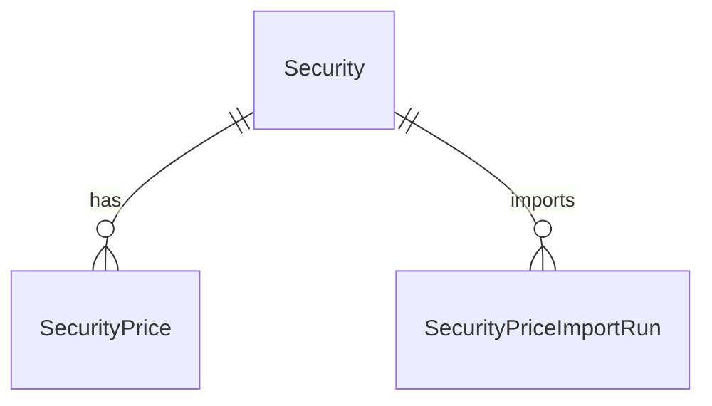

# Anforderungsanalyse: Wertpapierkurse-Import (ING CSV)

> **Primärquelle:** [`../../issue.md`](../../issue.md)  
> **Beispieldatei:** [`../../sample.csv`](../../sample.csv)  
> **Status:** ✅ Umgesetzt  
> **Version:** 1.0  
> **Datum:** 2026-07-02  
> **Autor:** planning-requirements-analysis

## 1. Überblick und Projektkontext

Die ING stellt Kursverläufe als CSV bereit. Für ein einzelnes Wertpapier soll auf der Wertpapier-Kursseite (`/list/securities/prices/{id}`) ein Upload angeboten werden, der Kurse importiert und bestehende Tageskurse bei abweichendem Betrag aktualisiert. Die Lösung muss über eine Factory auf weitere Anbieter erweiterbar sein.

**Geschäftsziele**
- Manuellen Kursimport aus ING-CSV ermöglichen.
- Bestehende Tageskurse deterministisch korrigieren.
- Anbieter-unabhängige Erweiterbarkeit sicherstellen.

**Stakeholder**
- Endnutzer (Portfolio-Pflege)
- Produktverantwortung
- Entwicklung/QA

**Abgrenzung**
- Fokus: Import-Workflow für Wertpapierkurse pro Security.
- Kein Fokus: vollautomatische Provider-Synchronisierung ohne Datei.

## 2. Funktionale Anforderungen

| Kennung | Beschreibung | Kategorie | Priorität | Status |
|---------|--------------|-----------|-----------|--------|
| **FR-1** | **Upload auf Kursseite:** Auf der Wertpapier-Kursseite (`/list/securities/prices/{id}`) steht eine Aktion zum Hochladen einer Kursdatei bereit; messbar durch sichtbare Aktion + erfolgreichem Upload-Dialog im Kurskontext. → [Architektur-Blueprint](../architecture/architecture-blueprint-wertpapierkurse-ing.md) · [Review](../improvements/review-architecture-wertpapierkurse-ing.md) | Kern-Feature | MUST HAVE | ✅ Umgesetzt |
| **FR-2** | **ING-CSV verarbeiten:** Der Import unterstützt das ING-Format aus `sample.csv` (Semikolon, deutsches Dezimaltrennzeichen, Datum+Uhrzeit). → [Architektur-Blueprint](../architecture/architecture-blueprint-wertpapierkurse-ing.md) · [ERM](../architecture/entity-relationship-model-wertpapierkurse-ing.md) | Datenverwaltung | MUST HAVE | ✅ Umgesetzt |
| **FR-3** | **Kurse anlegen:** Für neue Tage werden Kurswerte als `SecurityPrice` angelegt. → [ERM](../architecture/entity-relationship-model-wertpapierkurse-ing.md) | Kern-Feature | MUST HAVE | ✅ Umgesetzt |
| **FR-4** | **Kurse aktualisieren:** Existiert für ein Datum bereits ein Kurs, wird dieser nur bei abweichendem Betrag aktualisiert (idempotentes Re-Import-Verhalten). → [Architektur-Blueprint](../architecture/architecture-blueprint-wertpapierkurse-ing.md) · [ERM](../architecture/entity-relationship-model-wertpapierkurse-ing.md) | Kern-Feature | MUST HAVE | ✅ Umgesetzt |
| **FR-5** | **Factory-basierte Erweiterbarkeit:** Eine Factory erzeugt einen Importservice über ein definiertes Interface; die erste Implementierung ist `ING`. → [Architektur-Blueprint](../architecture/architecture-blueprint-wertpapierkurse-ing.md) · [Review](../improvements/review-architecture-wertpapierkurse-ing.md) | Wartbarkeit | MUST HAVE | ✅ Umgesetzt |
| **FR-6** | **Import-Ergebnis rückmelden:** API/UI geben Importstatistik zurück (neu/aktualisiert/unverändert/fehlerhaft). → [Architektur-Blueprint](../architecture/architecture-blueprint-wertpapierkurse-ing.md) | UX / Accessibility | HIGH | ✅ Umgesetzt |

## 3. Nicht-funktionale Anforderungen

| Kennung | Beschreibung | Kategorie | Priorität | Status |
|---------|--------------|-----------|-----------|--------|
| **NFR-1** | **Mandantensicherheit:** Import darf nur Kurse des angegebenen, besessenen Wertpapiers verändern. → [ERM](../architecture/entity-relationship-model-wertpapierkurse-ing.md) | Sicherheit | MUST HAVE | ✅ Umgesetzt |
| **NFR-2** | **Robustheit:** Fehlerhafte Zeilen werden nachvollziehbar gemeldet; gesamter Import endet kontrolliert mit ProblemDetails/Ergebnisobjekt. → [Architektur-Blueprint](../architecture/architecture-blueprint-wertpapierkurse-ing.md) | Zuverlässigkeit | HIGH | ✅ Umgesetzt |
| **NFR-3** | **Performance:** Import von typischen Jahresdateien (mehrere hundert Zeilen) läuft ohne Background-Job interaktiv im Request-Kontext. → [Architektur-Blueprint](../architecture/architecture-blueprint-wertpapierkurse-ing.md) | Performance | MEDIUM | ✅ Umgesetzt |
| **NFR-4** | **Nachvollziehbarkeit:** Strukturierte Logs enthalten SecurityId, Provider, Zeilenanzahl und Ergebniszähler ohne sensible Inhalte. → [Review](../improvements/review-architecture-wertpapierkurse-ing.md) | Wartbarkeit | HIGH | ✅ Umgesetzt |
| **NFR-5** | **Erweiterbarkeit:** Neue Anbieter werden ohne Controller-Änderung über zusätzliche Importservice-Implementierungen eingebunden. → [Architektur-Blueprint](../architecture/architecture-blueprint-wertpapierkurse-ing.md) | Skalierbarkeit | MUST HAVE | ✅ Umgesetzt |

## 4. Akzeptanzkriterien

### User Story US-1 – ING-CSV importieren
**Als** Nutzer **möchte ich** auf der Wertpapier-Kursseite eine ING-CSV hochladen, **damit** meine Kurse aktualisiert werden.
- AC-1.1: Upload-Aktion ist nur auf der Kursseite verfügbar.
- AC-1.2: `sample.csv` kann ohne Formatfehler importiert werden.
- AC-1.3: API liefert Zähler `inserted`, `updated`, `unchanged`, `skipped`, `errors`.

### User Story US-2 – Bestehende Tageskurse korrigieren
**Als** Nutzer **möchte ich** bei abweichenden Beträgen bestehende Tage überschreiben, **damit** historische Daten korrekt sind.
- AC-2.1: Existiert `(SecurityId, Date)` nicht, wird ein Datensatz angelegt.
- AC-2.2: Existiert `(SecurityId, Date)` mit anderem `Close`, wird aktualisiert.
- AC-2.3: Existiert `(SecurityId, Date)` mit identischem `Close`, bleibt unverändert.

### User Story US-3 – Architektur erweiterbar halten
**Als** Entwicklungsteam **möchte ich** eine providerbasierte Factory-Lösung, **damit** weitere Banken später ergänzt werden können.
- AC-3.1: Es existiert ein Import-Interface für Kursdateien.
- AC-3.2: Eine Factory selektiert die passende Implementierung.
- AC-3.3: ING ist als erste Implementierung registriert.

## 5. Annahmen und Abhängigkeiten

| Typ | Beschreibung | Einfluss |
|---|---|---|
| Annahme | CSV enthält `sep=;` Header und zwei Spalten: Zeit + Kurswert. | Parser-Implementierung |
| Annahme | Zeitanteil wird auf Tageswert (`Date`) normalisiert. | Upsert-Logik |
| Annahme | Kurswährung wird nicht aus CSV gelesen, sondern bleibt am Wertpapier hinterlegt. | Keine Währungsmigration |
| Abhängigkeit | Bestehendes `SecurityPrice`-Unique-Index (`SecurityId`,`Date`) bleibt erhalten. | Upsert statt blindem Insert |
| Abhängigkeit | UI-Ribbon/Dateiupload-Infrastruktur ist wiederverwendbar. | Implementierungsaufwand |

## 6. Scope und Out-of-Scope

### In-Scope ✅
- CSV-Upload für ING auf der Wertpapier-Kursseite.
- Parsing + Validierung + Upsert-Importlogik.
- Factory + Interface für Anbieter-Erweiterung.
- API/UX-Feedback zum Importergebnis.

### Out-of-Scope ❌
- Automatisches periodisches Einlesen lokaler Dateien.
- Unterstützung weiterer Anbieter im ersten Schritt.
- Umfassende Migration historischer Kursquellen.

## 7. Domänenmodell und Glossar

### Domänenmodell (vereinfacht)

### Glossar
- **Kursimportservice:** Provider-spezifischer Parser + Mapper auf Tageskurse.
- **Factory:** Selektor, der anhand Datei/Provider den passenden Importservice liefert.
- **Upsert:** Insert bei neuem Tag, Update bei abweichendem bestehendem Tageskurs.

## 8. Nutzungsfälle (Use Cases)

### UC-1: Erfolgreicher ING-Import
- Akteure: Nutzer, SecurityCard, SecuritiesController, ImportFactory, IngImportService, SecurityPriceService
- Ablauf: Datei wählen → API Upload → Factory resolves ING → Parse → Upsert → Ergebnis zurück
- Ergebnis: Kurse angelegt/aktualisiert, Statistik sichtbar

### UC-2: Teilweise fehlerhafte Datei
- Ablauf: Parser erkennt fehlerhafte Zeilen → gültige Zeilen werden verarbeitet → Fehlerliste zurückgegeben
- Ergebnis: Teilimport mit transparenter Fehlerdiagnose

## 9. Nächste Schritte

1. API-Contract für Import-Request/Result finalisieren.
2. Import-Interface + Factory + ING-Implementierung entwerfen.
3. Upsert-Methode im SecurityPrice-Service spezifizieren.
4. UI-Aktion auf der Kursseite + Upload-Flow planen.
5. Tests (Parser, Service, Controller, ViewModel) festlegen.

## 10. Approval & Versionierung

| Version | Datum | Autor | Änderung | Freigabestatus |
|---|---|---|---|---|
| 1.0 | 2026-07-02 | planning-requirements-analysis | Initiale vollständige Anforderungsanalyse für ING-Wertpapierkursimport erstellt | ✅ Umgesetzt |

**Approval-Status**
- Produktverantwortung: ⏳ Ausstehend
- Tech Lead: ⏳ Ausstehend
- QA: ⏳ Ausstehend

## 11. Konsistenzabgleich (Requirements ↔ Architektur ↔ API ↔ Tests)

- API-Vertrag umgesetzt unter: [`../api/SecuritiesController.md`](../api/SecuritiesController.md#post-apisecuritiesidpricesimport)
- Architekturabbildung: [`../architecture/architecture-blueprint-wertpapierkurse-ing.md`](../architecture/architecture-blueprint-wertpapierkurse-ing.md)
- Ablaufdarstellung: [`../flows/security-price-import-ing.md`](../flows/security-price-import-ing.md)
- Fachliche Nutzungssicht: [`../business/features/F007-wertpapierpreise-ing-csv-import.md`](../business/features/F007-wertpapierpreise-ing-csv-import.md)
- Testreferenz: [`../tests/wertpapierkurse-ing-testplan.md`](../tests/wertpapierkurse-ing-testplan.md)

Abgeglichen wurden insbesondere:
- `POST /api/securities/{id}/prices/import` mit `multipart/form-data` (`file`, optional `provider`)
- Ergebniszähler `inserted`, `updated`, `unchanged`, `skipped`, `errors`
- Upsert-Regel pro Datum inklusive idempotentem Re-Import-Verhalten
- Teilfehler als `200 OK` mit Fehlerliste; vollständig invalider Import als `400 Err_Invalid_Import`
