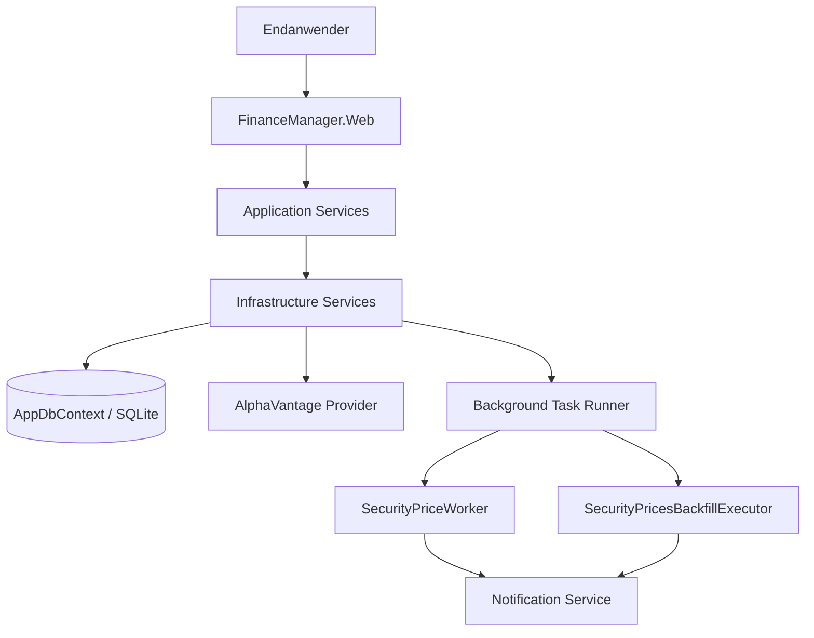
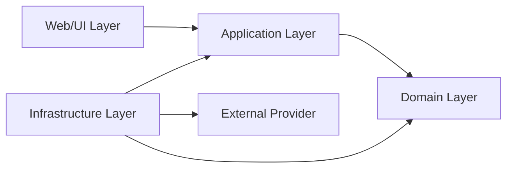
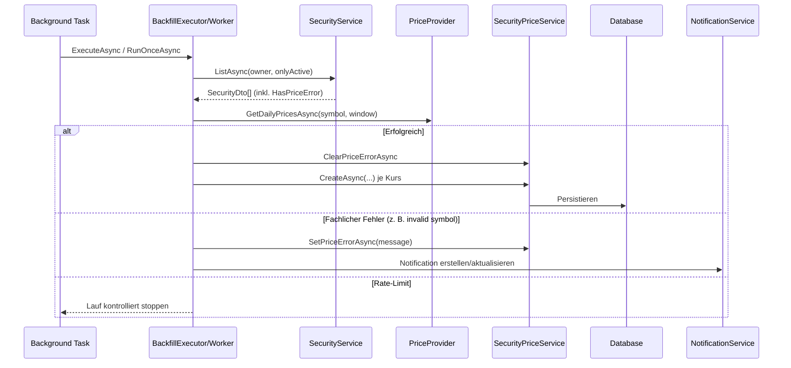
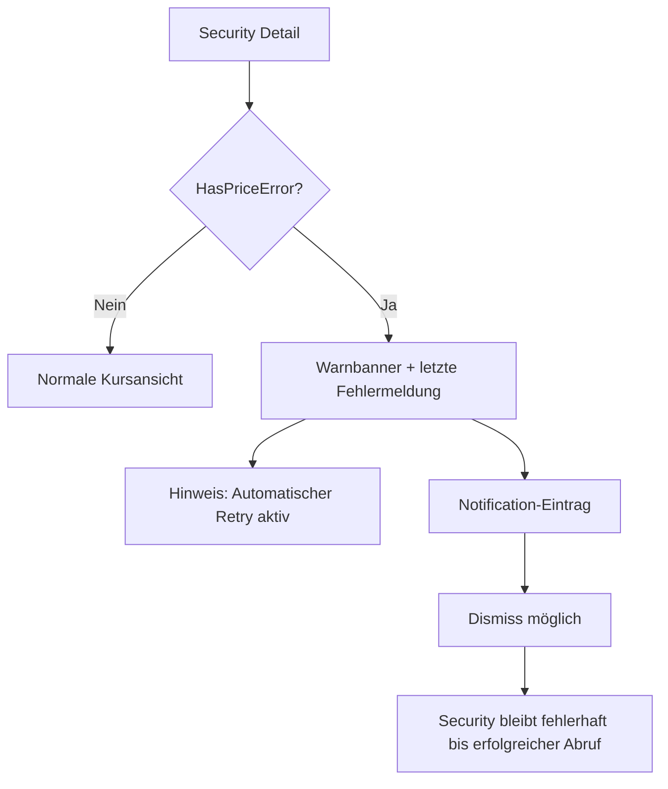

# Architektur-Blueprint: Stock-Price-Fetch-Error-Recovery

> **Feature:** Stock-Price-Fetch-Error-Recovery  
> **Status:** 🔄 In Arbeit  
> **Version:** 0.2  
> **Datum:** 2026-05-30  
> **Autor:** Architektur- & Lösungsdesign Agent  
> **Primärquelle:** [`../requirements/stock-price-fetch-error-requirements.md`](../requirements/stock-price-fetch-error-requirements.md)

---

## 1. Systemkontext

Das Feature stellt sicher, dass Kursabruf-Fehler je Wertpapier (`HasPriceError`) fachlich korrekt markiert, im Hintergrund erneut verarbeitet und bei Erfolg deterministisch geheilt werden.

### 1.1 Kontextdiagramm



### 1.2 Systemgrenzen und externe Integrationen

- **Innerhalb der Systemgrenze:** Web, Application, Domain, Infrastructure, DB, Background Tasks.
- **Außerhalb:** AlphaVantage API.
- **Fachlich kritisch:** Trennung zwischen Notification-Dismiss und Security-Fehlerstatus.

---

## 2. Schichtenmodell



- **Web/UI:** Triggern von Backfill/Worker, Fehlerdarstellung.
- **Application:** Schnittstellen `ISecurityService`, `ISecurityPriceService`, Provider-Abstraktion.
- **Domain:** `Security` mit `HasPriceError`, `SetPriceError`, `ClearPriceError`.
- **Infrastructure:** EF-Core-Implementierungen, Worker/Executor-Orchestrierung, Logging/Notification.

---

## 3. Komponenten und Verantwortlichkeiten

| Komponente | Verantwortung |
|---|---|
| `Security` (Domain) | Quelle des fachlichen Fehlerzustands (`HasPriceError`, Meldung, Timestamp). |
| `SecurityService` | Liefert `SecurityDto` inkl. `HasPriceError` mandantensicher. |
| `SecurityPriceService` | Setzt/löscht Fehlerstatus, schreibt Kursdaten, validiert Ownership. |
| `SecurityPriceWorker` | Geplante Kursupdates, Retry bei `HasPriceError=true`, Notification bei fachlichem Fehler. |
| `SecurityPricesBackfillExecutor` | Historischer Nachzug + Recovery, verarbeitet explizit Fehlerfälle erneut. |
| `IPriceProvider` (AlphaVantage) | Externe Kursdatenquelle, kann Rate-Limit/Domainfehler auslösen. |
| Notification-Service | Nutzerhinweise; darf Security-Fehlerstatus nicht automatisch löschen. |

---

## 4. Datenfluss



---

## 5. Fehlerbehandlung

### 5.1 Fehlerklassen

- **Domain-/Provider-Fehler (`InvalidOperationException`)**
  - `SetPriceErrorAsync` auf betroffener Security.
  - Weiterverarbeitung anderer Securities (bulk resilient).
- **Rate-Limit (`RequestLimitExceededException`)**
  - Kontrollierter Abbruch des Runs, Wiederholung im nächsten Lauf.
- **Unerwartete technische Fehler (`Exception`)**
  - Error-Logging inkl. Security-Kontext.
  - Kein blindes Setzen von `HasPriceError`, um false positives zu vermeiden.

### 5.2 Robuste Retry-/Error-Status-Strategie für `HasPriceError`

1. **Setzen nur bei fachlich reproduzierbarem Abruffehler** (z. B. Symbol ungültig).  
2. **Clearen nur nach erfolgreicher Provider-Antwort** für diese Security.  
3. **Retry-Prio erhöhen:** Securities mit `HasPriceError=true` werden nicht durch leere Zeitfenster (`toInclusive < fromInclusive`) ausgeschlossen.  
4. **Notification-Dedup:** Bei identischer Fehlermeldung keine wiederholte Notification-Flut.  
5. **Dismiss-Entkopplung:** Notification-Dismiss ändert `HasPriceError` nicht.

---

## 6. Technologieentscheidungen

| Entscheidung | Option | Begründung |
|---|---|---|
| Kursabruf | `IPriceProvider` + AlphaVantage | Bestehende Integration, einheitliche Fehlersemantik. |
| Persistenz | EF Core + SQLite | Vorhandener Standard im Projekt. |
| Fehlerstatusmodell | `Security`-Eigenschaften (`HasPriceError`, Message, SinceUtc) | Domänennah, nachvollziehbar und testbar. |
| Hintergrundverarbeitung | `SecurityPriceWorker` + `SecurityPricesBackfillExecutor` | Trennung von laufendem Sync und historischem Nachzug. |
| Build-Fix-Strategie CS1061 | **Typisierte Projektion/DTO-Nutzung statt unvollständiger anonymer Typen** | Compile-sicher, wartbar, verhindert Property-Drift. |

---

## 7. Konkrete technische Lösung: CS1061 in `SecurityPricesBackfillExecutor.cs(153,55)`

### 7.1 Ursachenanalyse

- Aktuelle Projektion:
  - `filtered.Select(s => new { Id, OwnerUserId, Name, Identifier, AlphaVantageCode })`
- Nutzung später:
  - `if (toInclusive < fromInclusive && !s.HasPriceError)`
- Problem:
  - Anonymer Typ enthält `HasPriceError` nicht ⇒ **CS1061**.

### 7.2 Architekturentscheidung (empfohlen)

**ADR-Entscheidung:** Keine anonyme Projektion für fachlich relevante Security-Kandidaten.  
Stattdessen:

- Entweder direkt auf `SecurityDto` iterieren, **oder**
- eine explizite interne Projektion nutzen (z. B. `record BackfillSecurityCandidate(...)` inkl. `HasPriceError`).

Empfehlung im aktuellen Kontext: **explizite Projektion mit `HasPriceError`** für minimale Änderung bei maximaler Lesbarkeit:

```csharp
private sealed record BackfillSecurityCandidate(
    Guid Id,
    Guid OwnerUserId,
    string Name,
    string Identifier,
    string? AlphaVantageCode,
    bool HasPriceError);
```

und:

```csharp
var list = filtered.Select(s => new BackfillSecurityCandidate(
    s.Id, context.UserId, s.Name, s.Identifier, s.AlphaVantageCode, s.HasPriceError)).ToList();
```

Damit ist die Retry-Bedingung compile-sicher:

```csharp
if (toInclusive < fromInclusive && !s.HasPriceError) { ... }
```

### 7.3 Warum nicht nur “Property schnell hinzufügen” im anonymen Typ?

- Kurzfristig möglich, aber architektonisch fragil.
- Bei späteren Erweiterungen steigt Risiko erneuter CS1061-Fehler.
- Typisierte Projektion dokumentiert Vertragsumfang explizit.

---

## 8. UI/UX-Konzept

### 8.1 Informationsarchitektur

- **Security-Liste/Detail:** Sichtbarer Fehlerindikator bei `HasPriceError=true`.
- **Notification Center/Home:** Fehlhinweis mit Kontext (Name, Identifier, Ursache).
- **Backfill/Worker Fortschritt:** Statusmeldungen zu verarbeitet/fehlgeschlagen/rate-limited.

### 8.2 Interaktionsdesign

- Nutzer kann Notification dismissen, ohne fachliche Daten zu verändern.
- Nach erfolgreichem Recovery verschwindet Fehlerindikator automatisch.
- Fehlermeldungen bleiben verständlich und handlungsorientiert.

### 8.3 UI-Skizze



---

## 9. Qualitätsziele und NFR-Abbildung

| Qualitätsziel | NFR | Architekturmaßnahme | Messkriterium |
|---|---|---|---|
| Build-Stabilität | NFR-1 | Typisierte Projektion/DTO-Vertrag im Backfill | `dotnet build ...` ohne CS1061 |
| Fehlertoleranz | NFR-2 | Fehlerklassifikation (Domain/RateLimit/Unexpected), Continue-Strategie | Lauf stoppt nur bei Rate-Limit |
| Mandantensicherheit | NFR-3 | Owner-scoped Service-Aufrufe | Keine Cross-User-Mutationen |
| Nachvollziehbarkeit | NFR-4 | Strukturierte Logs + Progress-Events | Security-Kontext im Log |
| Testbarkeit | NFR-5 | Unit/Integration-Tests für Recovery-Pfade | Grüne Tests in `SecurityPriceErrorRecoveryTests` |

---

## 10. Betriebs- und Monitoring-Aspekte

- **Logs (structured):**
  - SecurityId, Identifier, AlphaVantageCode, Fehlerklasse, Laufkontext (Worker/Backfill).
- **Metriken (empfohlen):**
  - `price_fetch_success_total`
  - `price_fetch_error_total{type=domain|rate_limit|unexpected}`
  - `securities_with_price_error_current`
  - `price_error_recovered_total`
- **Operational Runbook (kurz):**
  1. Bei Rate-Limit: Run beendet sich kontrolliert, später erneut starten.
  2. Bei dauerhaftem Domainfehler: Security prüfen (Symbol/Code), danach Backfill erneut ausführen.
  3. Bei Build-Fehler: Projektionstyp/DTO-Vertrag gegen Nutzung prüfen.

---

## 11. Teststrategie

### 11.1 Testebenen

- **Unit-Tests**
  - Fensterlogik (`fromInclusive`/`toInclusive`) inkl. Sonderfall `HasPriceError=true`.
- **Integrationstests**
  - `SecurityPriceErrorRecoveryTests`:
    - Worker verarbeitet fehlerhafte Security erneut.
    - Backfill inkludiert fehlerhafte Security und heilt Status.
    - Notification-Dismiss verändert Security-Fehlerstatus nicht.
- **Build-/CI-Gate**
  - `dotnet build FinanceManager.sln --no-restore` muss grün sein.

### 11.2 Abnahmekriterien aus Anforderungen

- FR-2.1 / NFR-1: CS1061 beseitigt.
- US-2: Backfill-Retry bei Fehlerstatus funktionsfähig.
- US-3: Build- und relevante Tests grün.

---

## 12. Konkrete Umsetzungssequenz mit Meilensteinen

1. **M1 – Compile-Fix (Blocker)**
   - Projektion in `SecurityPricesBackfillExecutor` auf typisierte Struktur inkl. `HasPriceError` umstellen.
   - Lokaler Build-Check.
2. **M2 – Recovery-Flow absichern**
   - Retry-Bedingung bei leerem Zeitfenster validieren.
   - `SetPriceErrorAsync`/`ClearPriceErrorAsync` Übergänge prüfen.
3. **M3 – Test-Freigabe**
   - `SecurityPriceErrorRecoveryTests` vollständig grün.
   - Zusätzliche Regressionstests für Fenster-/Retry-Logik ergänzen (falls Lücke).
4. **M4 – Operative Härtung**
   - Logging/Metrikfelder vereinheitlichen.
   - Review der Alert-/Progress-Texte.
5. **M5 – Dokumentationsabschluss**
   - Architektur-/Planungs-/Review-Artefakte konsistent verlinken.
   - Version und Änderungsprotokoll aktualisieren.

---

## 13. Verlinkte Artefakte

- Anforderungen: [`../requirements/stock-price-fetch-error-requirements.md`](../requirements/stock-price-fetch-error-requirements.md)
- ERM: [`./entity-relationship-model-stock-prices.md`](./entity-relationship-model-stock-prices.md)
- Review: [`../improvements/review-stock-price-fetch-error.md`](../improvements/review-stock-price-fetch-error.md)
- Plan: [`../planning/stock-price-fetch-plan.md`](../planning/stock-price-fetch-plan.md)

---

## 14. Versionshistorie

| Version | Datum | Autor | Änderung |
|---|---|---|---|
| 0.2 | 2026-05-30 | Architektur- & Lösungsdesign Agent | Blueprint gemäß Anforderungsanalyse geschärft: vollständige Architekturkapitel, CS1061-Ursachenanalyse, empfohlene typisierte Projektion/DTO-Entscheidung, robuste HasPriceError-Retry-Strategie, Meilensteinsequenz und Artefaktverlinkungen ergänzt. |
| 0.1 | 2026-05-30 | Architektur- & Lösungsdesign Agent | Initiale Erstellung des Architektur-Blueprints für Stock-Price-Fetch-Error-Recovery inkl. CS1061-Ursachenanalyse, Architekturentscheidung und Umsetzungssequenz. |
