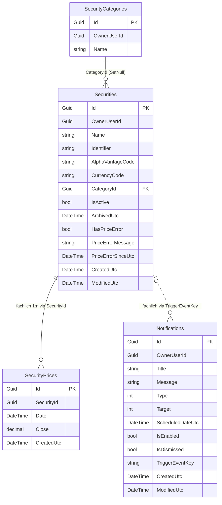

# Entity-Relationship-Modell: Stock-Price-Fetch-Error-Recovery

> **Feature:** Stock-Price-Fetch-Error-Recovery  
> **Status:** 🔄 In Arbeit  
> **Version:** 1.0  
> **Datum:** 2026-05-30  
> **Quellen / Querverweise:**  
> - Anforderungen: [`../requirements/stock-price-fetch-error-requirements.md`](../requirements/stock-price-fetch-error-requirements.md)  
> - Architektur-Blueprint: [`./architecture-blueprint-stock-price-fetch.md`](./architecture-blueprint-stock-price-fetch.md)  
> - Review: [`../improvements/review-stock-price-fetch-error.md`](../improvements/review-stock-price-fetch-error.md)  
> - Plan: [`../planning/stock-price-fetch-plan.md`](../planning/stock-price-fetch-plan.md)

---

## 1. Überblick

Dieses ERM modelliert:
- **persistierte Entitäten** für Kursabruf, Fehlerstatus und Recovery,
- **Beziehungen/Kardinalitäten/Constraints**,
- sowie **Worker-/Backfill-relevante Datenobjekte**, inkl. klarer Kennzeichnung nicht-persistierter Contracts.

Der Domänenstatus für Preisfehler ist explizit über `HasPriceError`, `PriceErrorMessage`, `PriceErrorSinceUtc` auf `Security` modelliert.

---

## 2. ERM-Diagramm (persistiert)

> Hinweis: `SecurityPrices.SecurityId` ist aktuell fachlich verwendet, aber im gezeigten Modell nicht als explizite DB-FK-Constraint konfiguriert.

---

## 3. Persistierte Entitäten, Felder, Constraints

| Entität | Persistiert | Relevante Felder | Schlüssel / Constraints |
|---|---|---|---|
| `Securities` | Ja | `Id`, `OwnerUserId`, `Name`, `Identifier`, `AlphaVantageCode`, `CurrencyCode`, `IsActive`, `HasPriceError`, `PriceErrorMessage`, `PriceErrorSinceUtc`, `CategoryId` | PK: `Id`; Unique: (`OwnerUserId`,`Name`); Index: (`OwnerUserId`,`Identifier`); FK: `CategoryId -> SecurityCategories.Id` (`SetNull`); Length: `Name(200)`, `Identifier(50)`, `CurrencyCode(10)`, `AlphaVantageCode(50)` |
| `SecurityPrices` | Ja | `Id`, `SecurityId`, `Date`, `Close`, `CreatedUtc` | PK: `Id`; Unique: (`SecurityId`,`Date`); `Close` precision `(18,4)`; **keine explizite DB-FK-Constraint auf `Securities`** |
| `Notifications` | Ja | `Id`, `OwnerUserId`, `Type`, `Target`, `ScheduledDateUtc`, `IsDismissed`, `TriggerEventKey`, `Title`, `Message` | PK: `Id`; Index: (`OwnerUserId`,`Type`,`ScheduledDateUtc`); Length: `Title(140)`, `Message(1000)`, `TriggerEventKey(120)` |
| `SecurityCategories` | Ja | `Id`, `OwnerUserId`, `Name` | PK: `Id`; Unique: (`OwnerUserId`,`Name`) |

### 3.1 Expliziter Domänenstatus Preisfehler

Der Preisfehler-Status ist auf `Securities` vollständig modelliert:
- `HasPriceError: bool` (Flag)
- `PriceErrorMessage: string?` (letzter fachlicher Fehlertext)
- `PriceErrorSinceUtc: DateTime?` (seit wann aktiv)

Zustandsübergänge:
- Fehler setzen (`SetPriceError*`): `HasPriceError=true`, Message/Timestamp setzen
- Recovery (`ClearPriceError*`): Flag und Detailfelder zurücksetzen

---

## 4. Beziehungen und Kardinalitäten

| Von | Nach | Kardinalität | Art | Technische Umsetzung |
|---|---|---|---|---|
| `SecurityCategory` | `Security` | 1 : n | Persistiert | FK `Security.CategoryId` mit `DeleteBehavior.SetNull` |
| `Security` | `SecurityPrice` | 1 : n | Fachlich persistiert | Unique (`SecurityId`,`Date`), Relation über `SecurityId`; Ownership-Validierung im Service |
| `Security` | `Notification` | 1 : n (fachlich) | Indirekt | Keine FK; Kopplung über `TriggerEventKey` (z. B. `security:error:{SecurityId}`) |

---

## 5. Backfill-/Worker-Datenobjekte (nicht persistiert)

| Objekt | Persistiert | Zweck | Relevante Felder |
|---|---|---|---|
| `SecurityDto` | Nein (DTO) | Service-Vertrag für Security-Liste im Backfill | `Id`, `Name`, `Identifier`, `AlphaVantageCode`, `HasPriceError` (`OwnerUserId` wird aus `BackgroundTaskContext.UserId` bereitgestellt) |
| `BackgroundTaskInfo` | Nein (in-memory) | Laufstatus/Progress für Backfill-Tasks | `Id`, `Type`, `UserId`, `Status`, `Processed`, `Total`, `Message`, `Payload` |
| `BackgroundTaskContext` | Nein (runtime) | Übergabe von Task-Kontext an Executor | `TaskId`, `UserId`, `Payload`, `ReportProgress` |
| `SecurityPricesBackfillExecutor.Payload` | Nein (runtime record) | Eingabefenster Backfill | `SecurityId`, `FromDateUtc`, `ToDateUtc` |
| Backfill-Kandidatenprojektion | Nein (runtime projection) | Iterationsobjekt im Executor | aktuell anonymer Typ; fachlich benötigt inkl. `HasPriceError` |

---

## 6. CS1061-Konflikt: datenmodellseitige Ursache und Regeln

### 6.1 Begünstigung durch Modellierung

Der Fehler **CS1061** entstand, weil im Backfill eine **anonyme Projektion** ohne `HasPriceError` erzeugt wurde, später aber `s.HasPriceError` abgefragt wird.  
Damit driftete der verwendete Datenvertrag von der fachlichen Entität/DTO-Semantik weg.

### 6.2 Modellierungsregeln für Projection-Verträge/DTOs

1. **Keine anonyme Projektion für fachlich relevante Entscheidungslogik** (Retry/Skip/Error-Recovery).  
2. **Explizite Projection-Contracts** (z. B. `record BackfillSecurityCandidate(..., bool HasPriceError)`) nutzen.  
3. **Vertragsfelder müssen featurekritische Domänenflags enthalten** (`HasPriceError`, bei Bedarf auch `PriceErrorMessage`, `PriceErrorSinceUtc`).  
4. **Consumer-first-Prüfung:** Jede im Flow verwendete Property muss im Projection-/DTO-Vertrag enthalten sein.  
5. **Contract-Regressionstests** für Backfill-/Worker-Selektionen ergänzen, um Property-Drift früh zu erkennen.

---

## 7. Abgleich mit Architektur-Blueprint

Abgleich zu [`./architecture-blueprint-stock-price-fetch.md`](./architecture-blueprint-stock-price-fetch.md):
- Fehlerstatus auf `Security` ist konsistent modelliert (`HasPriceError`, Message, SinceUtc). ✅
- Recovery über Worker/Backfill durch denselben Domänenstatus steuerbar. ✅
- Notification-Dismiss bleibt vom Security-Fehlerzustand entkoppelt (keine direkte FK/Statuskopplung). ✅
- CS1061-Gegenmaßnahme „typisierte Projektion/DTO-Vertrag“ ist im ERM als Modellierungsregel verankert. ✅

---

## 8. Versionshistorie

| Version | Datum | Autor | Änderung |
|---|---|---|---|
| 1.0 | 2026-05-30 | Entity-Relationship-Modeler | Initiales ERM für Stock-Price-Fetch-Error-Recovery erstellt: persistierte Entitäten/Felder/Constraints/Kardinalitäten dokumentiert, Preisfehlerstatus explizit modelliert, Backfill-/Worker-Datenobjekte (nicht-persistiert) ergänzt, CS1061-Ursache und Projection-Vertragsregeln festgelegt, Blueprint-Abgleich und Artefaktlinks ergänzt. |
