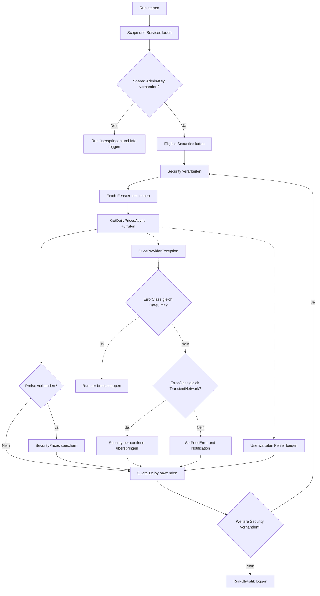
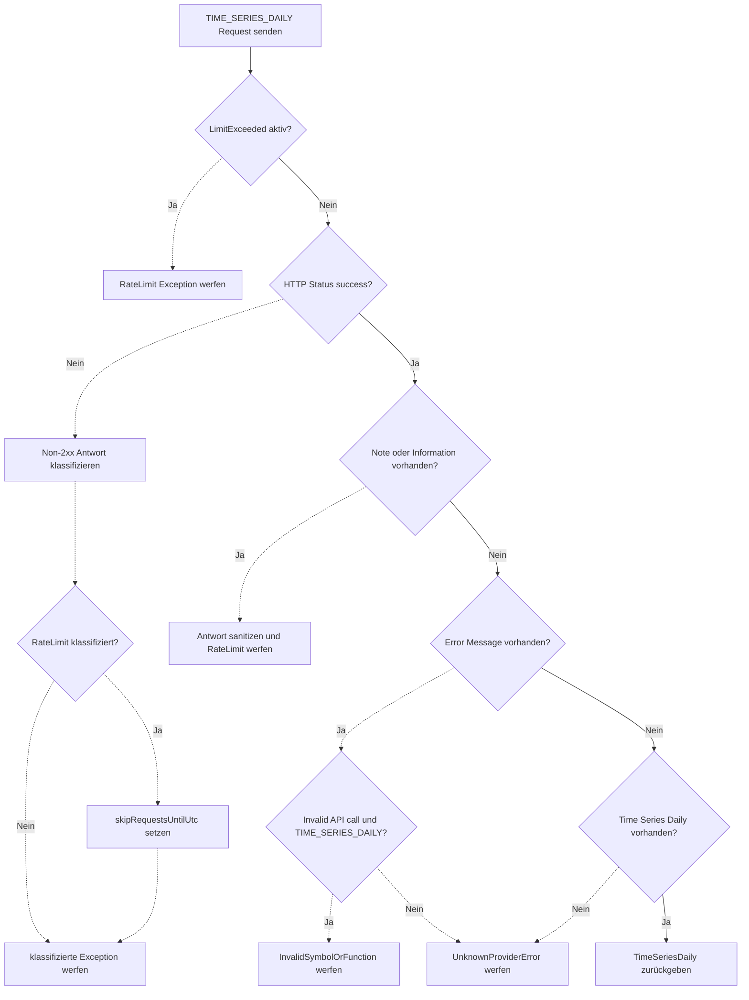

# SecurityPriceWorker – AlphaVantage, Klassifikation, Retry & Sanitizing

## Titel & Kontext

Dieser Ablauf beschreibt den Kursabruf rund um `SecurityPriceWorker`, `AlphaVantagePriceProvider` und `AlphaVantage`. Dokumentiert werden die Fehlerklassifikation über `PriceProviderException`, das Retry-Verhalten für transiente Fehler, Logging-/Sanitizing-Regeln sowie das Worker-Verhalten bei `RATE_LIMIT` gegenüber allen anderen Fehlerklassen. Zusätzlich werden Persistenz und Benutzerbenachrichtigung für klassifizierte Providerfehler nachvollziehbar gemacht.

## Diagramm 1 – Worker-Run mit Fehlerpfaden (`SecurityPriceWorker.RunOnceAsync`)

## Diagramm 2 – Klassifikation, Sanitizing und Retry (`AlphaVantage*`)

## Schrittbeschreibung

1. **Run vorbereiten und Scope aufbauen**  
   - **Code:** `FinanceManager.Web/Services/SecurityPriceWorker.cs` (`RunOnceAsync`)  
   - **Input:** `CancellationToken`, DI-Container  
   - **Output:** `runId`, `AppDbContext`, `IPriceProvider`, `INotificationWriter`, `IAlphaVantageKeyResolver`  
   - **Seiteneffekte:** noch keine Persistenz.

2. **Shared-Key-Check und Batch-Bildung**  
   - **Code:** `SecurityPriceWorker.cs` (`resolver.GetSharedAsync`, `db.Securities...Where(s => ... && !s.HasPriceError)`)  
   - **Input:** Shared-Key-Konfiguration, aktive Securities, bestehende Fehlerzustände  
   - **Output:** begrenztes Run-Batch (`MaxSymbolsPerRun`)  
   - **Seiteneffekte:** ohne Shared-Key wird der komplette Run nur geloggt und beendet.

3. **Provider-Aufruf je Security**  
   - **Code:** `SecurityPriceWorker.cs` (`prices.GetDailyPricesAsync`) → `FinanceManager.Web/Services/AlphaVantagePriceProvider.cs` (`GetDailyPricesAsync`)  
   - **Input:** `symbol`, `startDateExclusive`, `endDateInclusive`  
   - **Output:** Preisliste oder `PriceProviderException`  
   - **Seiteneffekte:** HTTP-Requests an AlphaVantage.

4. **Retry-Strategie für transiente Fehler**  
   - **Code:** `AlphaVantagePriceProvider.cs` (`ExecuteWithRetryAsync`, `IsTransient`)  
   - **Input:** Provider-Operation, `maxRetries`, `initialDelayMs`  
   - **Output:** Erfolgsergebnis oder finaler Fehler  
   - **Seiteneffekte:** exponentielles Backoff mit Jitter; Retry nur bei `TransientNetwork`, Timeout oder transientem `HttpRequestException`; kein Retry bei `RateLimit`/`InvalidSymbolOrFunction`.

5. **Fehlerklassifikation im AlphaVantage-Client**  
   - **Code:** `FinanceManager.Web/Services/AlphaVantage.cs` (`GetTimeSeriesDailyAsync`, `ClassifyNonSuccessResponse`, `ClassifyHttpTransportError`, `IsInvalidSymbolOrFunction`)  
   - **Input:** HTTP-Status, JSON-Felder (`Note`, `Information`, `Error Message`, `Time Series (Daily)`)  
   - **Output:** `PriceProviderErrorClass` (`RATE_LIMIT`, `TRANSIENT_NETWORK`, `INVALID_SYMBOL_OR_FUNCTION`, `UNKNOWN_PROVIDER_ERROR`) in `PriceProviderException`  
   - **Seiteneffekte:** `_skipRequestsUntilUtc` wird bei Rate-Limit gesetzt.

6. **Logging-Sanitizing für Provider-Daten**  
   - **Code:** `AlphaVantage.cs` (`SanitizeForLog`) und `SecurityPriceWorker.cs` (`SanitizeProviderRawMessage`)  
   - **Input:** Request-URL, Provider-Response, Exception-Text  
   - **Output:** bereinigte Log-/Persistenztexte  
   - **Seiteneffekte:** API-Key-Masking (`apikey=***`), Entfernen von Steuerzeichen, Längenbegrenzung (500 im Provider-Log, 2000 in Worker-Persistenz).

7. **Worker-Entscheidung pro Fehlerklasse**  
   - **Code:** `SecurityPriceWorker.cs` (`catch (PriceProviderException ex)`)  
   - **Input:** `ex.ErrorClass`, `ex.ErrorClassCode`, `ex.ProviderRawMessage`  
   - **Output:** Control-Flow je Security  
   - **Seiteneffekte:**  
     - `RateLimit` → `break` (Run stoppt)  
     - `TransientNetwork` → `continue` (kein persistenter Fehler)  
     - sonstige Klassen → persistenter Fehler inkl. Notification.

8. **Persistenz und Notification bei nicht-transienten Providerfehlern**  
   - **Code:** `SecurityPriceWorker.cs` (`BuildUserNotificationMessage`, `entity.SetPriceError`, `notifier.CreateForUserAsync`), `FinanceManager.Domain/Securities/Security.cs` (`SetPriceError`)  
   - **Input:** Fehlerklasse, sichere User-Meldung, sanitizte Provider-Details  
   - **Output:** `Security.HasPriceError`, `PriceErrorClass`, `PriceErrorMessage`, `PriceErrorProviderMessage`, `PriceErrorSinceUtc`  
   - **Seiteneffekte:** HomePage-Systemmeldung (`NotificationType.SystemAlert`) für den Owner.

9. **Erfolgsfall und Drosselung**  
   - **Code:** `SecurityPriceWorker.cs` (`db.SecurityPrices.Add`, `db.SaveChangesAsync`, Delay aus `RequestsPerMinute`)  
   - **Input:** valide `(date, close)`-Paare  
   - **Output:** persistierte `SecurityPrice`-Einträge  
   - **Seiteneffekte:** paced Verarbeitung zwischen Requests.

## Fehlerbehandlung

- **Kein Shared Admin-Key:** Run wird übersprungen (`LogInformation`), keine Verarbeitung.  
- **Rate-Limit (`RATE_LIMIT`):** Worker stoppt den aktuellen Run sofort (`break`), restliche Securities bleiben für später offen.  
- **Transientes Netzwerk (`TRANSIENT_NETWORK`):** Worker macht mit nächster Security weiter (`continue`), ohne `SetPriceError`.  
- **Klassifizierte nicht-transiente Providerfehler (`INVALID_SYMBOL_OR_FUNCTION`, `UNKNOWN_PROVIDER_ERROR`):** Fehler wird persistiert, Providertext sanitizt, Nutzerhinweis wird erzeugt.  
- **Unerwartete Exception pro Security:** Fehler wird geloggt; Run bleibt insgesamt aktiv.  
- **Ungültige/unerwartete Provider-Payload:** wird als `UNKNOWN_PROVIDER_ERROR` klassifiziert und wie oben behandelt.

## Abhängigkeiten

- **Interne Services/Komponenten:**  
  - `SecurityPriceWorker`  
  - `IPriceProvider`, `AlphaVantagePriceProvider`, `AlphaVantage`  
  - `IAlphaVantageKeyResolver`  
  - `INotificationWriter`  
  - `AppDbContext`
- **Domäne/Persistenz:**  
  - `Security`, `SecurityPrice`, `Notification`  
  - Fehlerfelder in `Security` (`PriceErrorClass`, `PriceErrorProviderMessage`, `PriceErrorSinceUtc`)
- **Externe Systeme:**  
  - AlphaVantage API (`TIME_SERIES_DAILY`)

## Verlinkte Artefakte (API, Business, Tests, Lifecycle)

- **API:** [docs/api/SecuritiesController.md](../api/SecuritiesController.md)  
- **Business:**  
  - [docs/business/features/F007-wertpapierpreise.md](../business/features/F007-wertpapierpreise.md)  
  - [docs/business/features/F007-wertpapierpreise-infrastructure.md](../business/features/F007-wertpapierpreise-infrastructure.md)
- **Tests (Code):**  
  - [FinanceManager.Tests/Web/Services/AlphaVantageErrorHandlingTests.cs](../../FinanceManager.Tests/Web/Services/AlphaVantageErrorHandlingTests.cs)  
  - [FinanceManager.Tests/Web/Services/AlphaVantagePriceProviderRetryTests.cs](../../FinanceManager.Tests/Web/Services/AlphaVantagePriceProviderRetryTests.cs)  
  - [FinanceManager.Tests/Web/Services/SecurityPriceWorkerErrorHandlingTests.cs](../../FinanceManager.Tests/Web/Services/SecurityPriceWorkerErrorHandlingTests.cs)  
  - [FinanceManager.Tests/Web/Services/PriceProviderErrorClassExtensionsTests.cs](../../FinanceManager.Tests/Web/Services/PriceProviderErrorClassExtensionsTests.cs)
- **Dokumentations-/Lifecycle-Report:**  
  - [docs/documentation-plan.md](../documentation-plan.md)
- **Code-Artefakte:**  
  - [FinanceManager.Web/Services/AlphaVantage.cs](../../FinanceManager.Web/Services/AlphaVantage.cs)  
  - [FinanceManager.Web/Services/AlphaVantagePriceProvider.cs](../../FinanceManager.Web/Services/AlphaVantagePriceProvider.cs)  
  - [FinanceManager.Web/Services/PriceProviderErrorClass.cs](../../FinanceManager.Web/Services/PriceProviderErrorClass.cs)  
  - [FinanceManager.Web/Services/SecurityPriceWorker.cs](../../FinanceManager.Web/Services/SecurityPriceWorker.cs)
