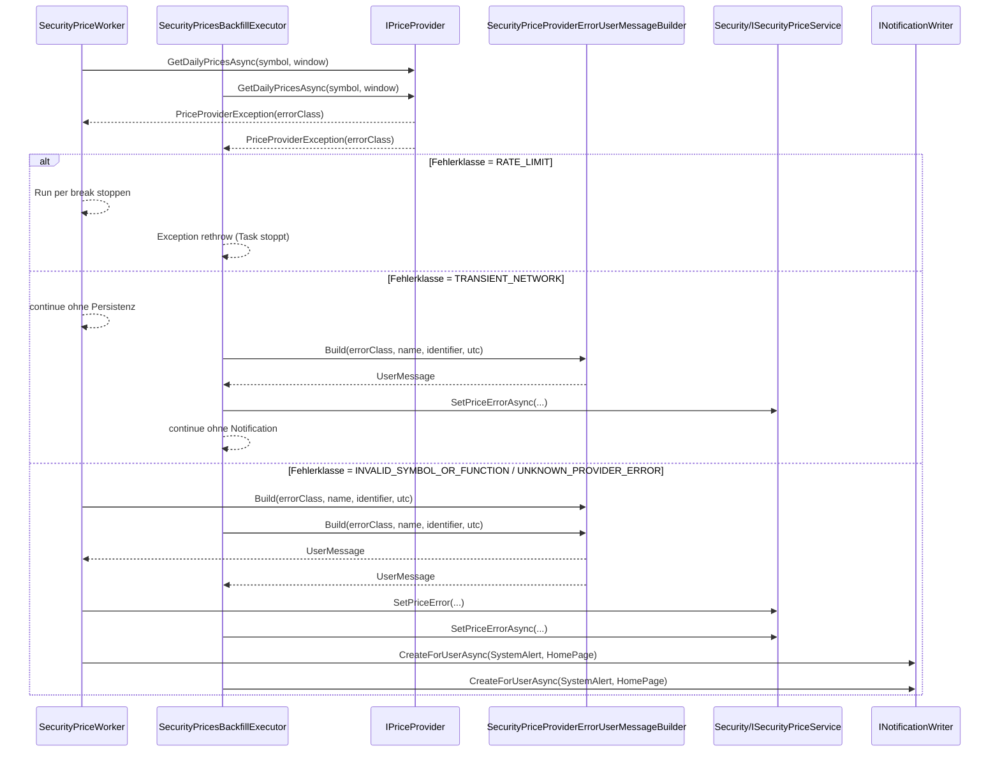
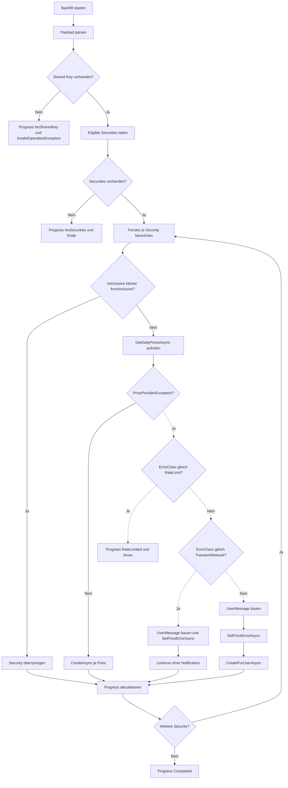

# Security-Preisabruf – Worker, Backfill & Fehlerbenachrichtigung

## Titel & Kontext

Dieser Ablauf dokumentiert die konsistente Fehler- und Benachrichtigungslogik für den regulären Kurs-Worker (`SecurityPriceWorker`) und den manuellen Backfill (`SecurityPricesBackfillExecutor`). Fokus ist das Feature **Backfill-Fehlerbenachrichtigung**: Klassifizierte Providerfehler werden einheitlich in User-Meldungen übersetzt und als Security-Fehlerzustand/Notification persistiert. Unterschiede im Stop-Verhalten (`break` vs. `throw`) sind explizit dargestellt.

## Diagramm 1 – Konsistenter Fehler-/Notification-Pfad (Worker + Backfill)

## Diagramm 2 – Backfill-Ablauf mit Entscheidungslogik (`SecurityPricesBackfillExecutor.ExecuteAsync`)

## Schrittbeschreibung

1. **Backfill-Input einlesen**  
   - **Code:** `FinanceManager.Web/Services/SecurityPricesBackfillExecutor.cs` (`ExecuteAsync`, Payload-Parsing)  
   - **Input:** `BackgroundTaskContext.Payload` (JSON mit `SecurityId`, `FromDateUtc`, `ToDateUtc`)  
   - **Output:** optionale Filter/Datumsgrenzen  
   - **Seiteneffekte:** bei ungültigem JSON nur `LogWarning`, Ablauf läuft weiter.

2. **Gemeinsame Voraussetzung: Shared Key**  
   - **Code:** `SecurityPricesBackfillExecutor.cs` (`keyResolver.GetSharedAsync`), `SecurityPriceWorker.cs` (`resolver.GetSharedAsync`)  
   - **Input:** Shared AlphaVantage-Konfiguration  
   - **Output:** Freigabe oder Abbruch  
   - **Seiteneffekte:** Backfill meldet `NoSharedKey` + `InvalidOperationException`; Worker loggt und skippt den Run.

3. **Security-Selektion ohne bestehende Price-Errors**  
   - **Code:** `SecurityPricesBackfillExecutor.cs` (`ListAsync(...).Where(... !HasPriceError)`), `SecurityPriceWorker.cs` (`db.Securities...Where(... && !s.HasPriceError)`)  
   - **Input:** aktive Securities, Owner-Kontext  
   - **Output:** verarbeitbare Liste/Batches  
   - **Seiteneffekte:** bereits fehlerhafte Securities werden in beiden Flows nicht erneut gezogen.

4. **Fensterermittlung pro Security**  
   - **Code:** `SecurityPricesBackfillExecutor.cs` (Berechnung `fromInclusive`/`toInclusive`), `SecurityPriceWorker.cs` (`startExclusive` aus letzter Persistenz)  
   - **Input:** letzte gespeicherte Kursdaten, optionales Backfill-Intervall  
   - **Output:** Provider-Fenster (`startExclusive`, `endInclusive`)  
   - **Seiteneffekte:** Wochenenden werden als Enddatum zurückgesetzt bzw. bei Insert übersprungen.

5. **Provider-Aufruf und Klassifikation**  
   - **Code:** `SecurityPricesBackfillExecutor.cs` / `SecurityPriceWorker.cs` (`GetDailyPricesAsync`), Klassifikation via `PriceProviderException`  
   - **Input:** Symbol + Zeitfenster  
   - **Output:** Preise oder klassifizierter Fehler (`RATE_LIMIT`, `TRANSIENT_NETWORK`, `INVALID_SYMBOL_OR_FUNCTION`, `UNKNOWN_PROVIDER_ERROR`)  
   - **Seiteneffekte:** externe Requests gegen AlphaVantage.

6. **Konsistente User-Meldung auf Basis der Fehlerklasse**  
   - **Code:** `FinanceManager.Web/Services/SecurityPriceProviderErrorUserMessageBuilder.cs` (`Build`)  
   - **Input:** `errorClass`, `securityName`, `securityIdentifier`, `occurredUtc`  
   - **Output:** deutschsprachige, user-sichere Nachricht mit UTC-Zeitstempel  
   - **Seiteneffekte:** keine; reine Mapping-Logik.

7. **Persistenz der Fehlerdetails**  
   - **Code:** `SecurityPriceWorker.cs` (`entity.SetPriceError`), `SecurityPricesBackfillExecutor.cs` (`priceService.SetPriceErrorAsync`)  
   - **Input:** `errorClassCode`, User-Message, Provider-Rohtext  
   - **Output:** gesetzte Price-Error-Felder auf Security  
   - **Seiteneffekte:** Security wird für weitere Läufe aus Eligible-Filter ausgeschlossen.

8. **Benachrichtigung für nicht-transiente Fehler**  
   - **Code:** `SecurityPriceWorker.cs` und `SecurityPricesBackfillExecutor.cs` (`notifier.CreateForUserAsync`)  
   - **Input:** Titel *Kursabruf fehlgeschlagen*, Message aus Builder, Trigger `security:error:{SecurityId}`  
   - **Output:** `NotificationType.SystemAlert` auf `NotificationTarget.HomePage`  
   - **Seiteneffekte:** sichtbare User-Notification.

9. **Unterschied im Stop-Verhalten bei `RATE_LIMIT`**  
   - **Code:** `SecurityPriceWorker.cs` (`break`), `SecurityPricesBackfillExecutor.cs` (`throw`)  
   - **Input:** `PriceProviderException` mit `RateLimit`  
   - **Output:** Worker beendet nur den aktuellen Run; Backfill beendet den Task mit Exception  
   - **Seiteneffekte:** keine Error-Persistenz/Notification bei Rate-Limit.

10. **Testabdeckung für Konsistenz**  
    - **Code:** `FinanceManager.Tests/Web/Services/SecurityPricesBackfillExecutorNotificationTests.cs`, `FinanceManager.Tests/Web/Services/SecurityPriceProviderErrorUserMessageBuilderTests.cs`, `FinanceManager.Tests/Web/Services/SecurityPriceWorkerErrorHandlingTests.cs`  
    - **Input:** klassifizierte Providerfehler in Testdoubles  
    - **Output:** verifizierte Erwartung pro Fehlerklasse (persistieren, notify, continue/stop)  
    - **Seiteneffekte:** Regression-Schutz für Backfill-/Worker-Konsistenz.

## Fehlerbehandlung

- **Ungültiges Backfill-Payload:** wird geloggt; Default-Parameter werden weiterverwendet.  
- **Kein Shared Key:** Worker skippt Run, Backfill wirft `InvalidOperationException`.  
- **`RATE_LIMIT`:** Worker stoppt Batch (`break`), Backfill bricht Task via `throw` ab; keine Notification.  
- **`TRANSIENT_NETWORK`:** Worker persistiert keinen Fehler und verarbeitet weitere Securities; Backfill persistiert den Fehlerstatus (`SetPriceErrorAsync`) ohne Notification und verarbeitet weitere Securities.  
- **Nicht-transiente Providerfehler (`INVALID_SYMBOL_OR_FUNCTION`, `UNKNOWN_PROVIDER_ERROR`):** in beiden Flows `SetPriceError` + `SystemAlert` für HomePage.  
- **Fehler in Backfill-Fehlerpersistenz (`SetPriceErrorAsync`/Notification):** werden intern abgefangen und geloggt, nächste Security wird weiter verarbeitet.  
- **Unerwartete Exceptions je Security:** werden geloggt; Rest des Batches wird weiterhin abgearbeitet.

## Abhängigkeiten

- **Interne Services/Komponenten:**  
  - `SecurityPriceWorker`  
  - `SecurityPricesBackfillExecutor`  
  - `SecurityPriceProviderErrorUserMessageBuilder`  
  - `IPriceProvider`, `IAlphaVantageKeyResolver`  
  - `ISecurityService`, `ISecurityPriceService`, `INotificationWriter`
- **Domäne/Persistenz:**  
  - `Security` (Price-Error-Felder)  
  - `SecurityPrice`  
  - `Notification`
- **Externe Systeme:**  
  - AlphaVantage API (`TIME_SERIES_DAILY`)

## Verlinkte Artefakte

- **Flow-Index:** [Docs/flows/README.md](./README.md)  
- **API:** [Docs/api/SecuritiesController.md](../api/SecuritiesController.md)  
- **Business:**  
  - [Docs/business/features/F007-wertpapierpreise.md](../business/features/F007-wertpapierpreise.md)  
  - [Docs/business/features/F013-benachrichtigungen.md](../business/features/F013-benachrichtigungen.md)
- **Tests (Code):**  
  - [FinanceManager.Tests/Web/Services/SecurityPricesBackfillExecutorNotificationTests.cs](../../FinanceManager.Tests/Web/Services/SecurityPricesBackfillExecutorNotificationTests.cs)  
  - [FinanceManager.Tests/Web/Services/SecurityPriceProviderErrorUserMessageBuilderTests.cs](../../FinanceManager.Tests/Web/Services/SecurityPriceProviderErrorUserMessageBuilderTests.cs)  
  - [FinanceManager.Tests/Web/Services/SecurityPriceWorkerErrorHandlingTests.cs](../../FinanceManager.Tests/Web/Services/SecurityPriceWorkerErrorHandlingTests.cs)
- **Code-Artefakte:**  
  - [FinanceManager.Web/Services/SecurityPricesBackfillExecutor.cs](../../FinanceManager.Web/Services/SecurityPricesBackfillExecutor.cs)  
  - [FinanceManager.Web/Services/SecurityPriceWorker.cs](../../FinanceManager.Web/Services/SecurityPriceWorker.cs)  
  - [FinanceManager.Web/Services/SecurityPriceProviderErrorUserMessageBuilder.cs](../../FinanceManager.Web/Services/SecurityPriceProviderErrorUserMessageBuilder.cs)
