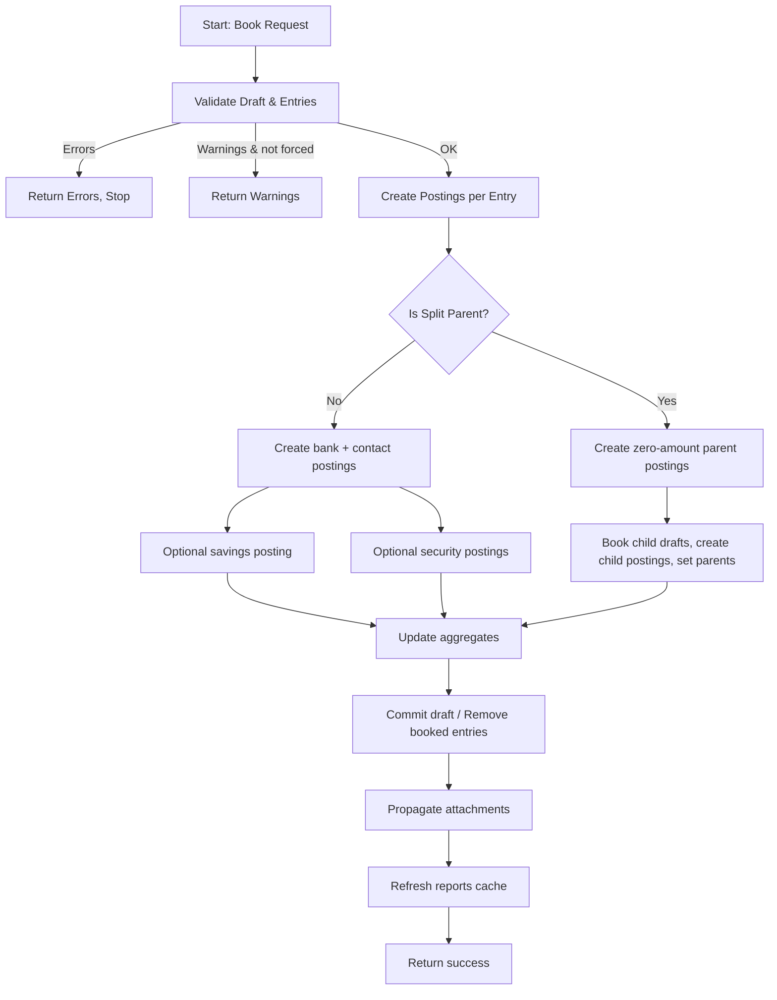

# Statement Draft Booking Flow

This document describes the booking flow for a statement draft entry (from validation to postings). It contains a Mermaid flowchart and a short explanation.

## Mermaid diagram

## Notes
- Validation ensures account and contact constraints, savings plan and security rules.
- Security postings are only created when the detected account allows security processing and the contact equals the bank contact of the account.
- Partial booking (single entry) keeps draft open and removes only processed entry.
- Split booking creates parent zero postings and books grouped child drafts.
