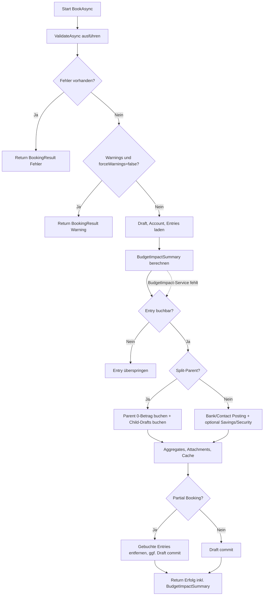

# Statement Draft Booking mit Budget-Impact und PurposePattern

## Titel & Kontext

Dieser Ablauf dokumentiert den Buchungspfad in `StatementDraftService.BookAsync(...)` inklusive vorgelagerter Budget-Impact-Summary. Die PurposePattern-Regeln wirken hier indirekt über `BudgetImpactEvaluationService` auf die Zusammenfassung vor der eigentlichen Buchung. Der eigentliche Posting-Write-Pfad bleibt unverändert und wird nicht durch Pattern blockiert.

## Diagramm

## Schrittbeschreibung

1. **Validierung vor Buchung**
   - Referenz: `FinanceManager.Infrastructure/Statements/StatementDraftService.cs` (`BookAsync`, `ValidateAsync`)
   - Eingabe: `draftId`, optional `entryId`, `ownerUserId`, `forceWarnings`.
   - Ausgabe: früher `BookingResult` bei Error/Warning.
   - Seiteneffekte: keine Persistenz bei frühem Return.

2. **Budget-Impact-Summary vor Write-Pfad**
   - Referenz: `.../StatementDraftService.cs` (Aufruf `EvaluateDraftImpactAsync`), `.../BudgetImpactEvaluationService.cs`
   - Eingabe: aktuelle Draft-Entries.
   - Ausgabe: `BookingImpactSummaryDto?` für `BookingResult.BudgetImpactSummary`.
   - Seiteneffekte: keine Datenänderung; nur Berechnung.
   - PurposePattern-Wirkung:
     - Keine Regeln oder leeres Pattern ⇒ kein Filter.
     - Contains: case-insensitive via `IndexOf(..., OrdinalIgnoreCase)`.
     - Regex: `IgnoreCase | CultureInvariant` mit 200ms Timeout.
     - Regex-Fehler/Timeout im Match ⇒ Regel wird ignoriert, kein Abbruch der Buchung.

3. **Buchungspfade**
   - Referenz: `.../StatementDraftService.cs` (`CreateBankAndContactPostingAsync`, `BookSplitDraftGroupAsync`, `CreateSecurityPostingsAsync`)
   - Eingabe: buchbare Entries (`AlreadyBooked`/`Announced` ausgeschlossen).
   - Ausgabe: erzeugte `Postings`, aktualisierte Aggregates, optional verlinkte Transfers.
   - Seiteneffekte: DB-Writes (`Postings`, Draft-Status, Attachments, ggf. SavingsPlan-Status), Cache-Refresh.

4. **Partial/Full Commit und Rückgabe**
   - Referenz: `.../StatementDraftService.cs` (Teilbuchung/Commit-Blöcke)
   - Eingabe: gebuchte Entries.
   - Ausgabe: `BookingResult` inkl. `BudgetImpactSummary`.
   - Seiteneffekte: Entfernen einzelner Entries bei Partial Booking oder Commit des gesamten Drafts.

5. **Validierungsbezug Regex beim Speichern von Regeln**
   - Referenz: `FinanceManager.Domain/Budget/BudgetRule.cs` (`SetPurposePattern`), `FinanceManager.Web/Controllers/BudgetRulesController.cs`
   - Bedeutung für diesen Flow: Der Buchungspfad erhält nur bereits persistierte Regeln; Regex-Syntaxfehler werden vorher bei Create/Update mit HTTP 400 abgefangen.

## Fehlerbehandlung

- Validation-Errors ⇒ Buchung wird abgebrochen.
- Warnings ohne `forceWarnings` ⇒ keine Buchung, nur Rückgabe.
- Child-Draft direkt buchen ⇒ abgebrochen (`false`-Result).
- Budget-Impact-Service `null` ⇒ Buchung läuft weiter, `BudgetImpactSummary = null`.
- Regex-Timeout/ungültiges Regex im Matching ⇒ kein Throw bis zum Caller; Regel greift nicht.

## Abhängigkeiten

- `FinanceManager.Infrastructure/Statements/StatementDraftService.cs`
- `FinanceManager.Infrastructure/Statements/BudgetImpactEvaluationService.cs`
- `FinanceManager.Infrastructure/Budget/BudgetReportService.cs` (gleiche Pattern-Logik im Reporting-Kontext)
- `FinanceManager.Domain/Budget/BudgetRule.cs` und `FinanceManager.Web/Controllers/BudgetRulesController.cs` (Compile-Validierung beim Speichern)
- `FinanceManager.Shared/Dtos/Statements/*` (Rückgabeobjekte)
