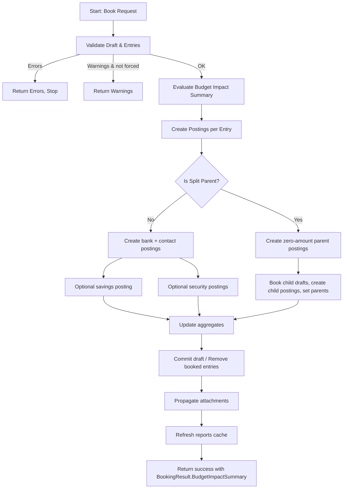

# Statement Draft Booking Flow

Dieses Dokument beschreibt den Buchungsfluss eines Statement-Drafts (Validierung → Buchung → Rückgabe) inkl. Budget-Impact-Summary.

## Mermaid diagram

## Kurzablauf

1. **Validierung** prüft Fehler/Warnungen.
2. Bei erfolgreicher Validierung wird vor dem eigentlichen Buchen eine **Budget-Impact-Summary** berechnet.
3. Danach laufen die bestehenden Buchungswege:
   - normales Posting
   - Split-Parent/-Child-Logik
   - optionale Savings/Security-Postings
4. Ergebnis enthält `BookingResult` inkl. optionalem `BudgetImpactSummary`.

## Budget-Impact-Einbindung

- Einstiegspunkt: `StatementDraftService.BookAsync(...)`
- Aufruf: `IBudgetImpactEvaluationService.EvaluateDraftImpactAsync(...)`
- Rückgabe:
  - bei Full-Booking und Partial-Booking jeweils im `BookingResult`
  - Felder: `highestSeverity`, `items[]` mit Vorher/Nachher/Delta je Budgetzweck

## Hinweise

- Bewertung erfolgt auf Basis von `BudgetPurpose.SourceType`, geplanten Sollwerten (`IBudgetPlanningService`) und Istwerten + simuliertem Draft-Delta.
- Nicht zuordenbare Kontexte werden als neutraler Hinweis geliefert.
- Die Budget-Impact-Berechnung blockiert das Booking nicht; fehlende Evaluation liefert `null`.

## Referenzen

- `FinanceManager.Infrastructure/Statements/StatementDraftService.cs`
- `FinanceManager.Infrastructure/Statements/BudgetImpactEvaluationService.cs`
- `FinanceManager.Shared/Dtos/Statements/BudgetImpactDtos.cs`
