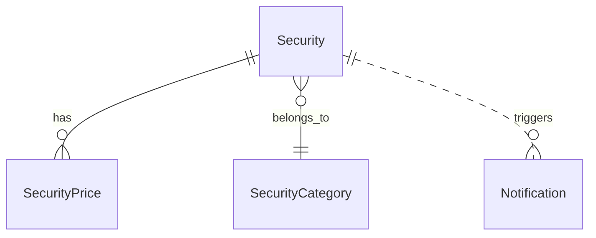

# Anforderungsanalyse: Stock-Price-Fetch-Error-Recovery

> **Primäranforderung:** [../../06102d51-0369-438d-b08a-8cd5f738ab23.copilot-task.md](../../06102d51-0369-438d-b08a-8cd5f738ab23.copilot-task.md)  
> **Status:** 🔄 In Arbeit  
> **Version:** 1.0  
> **Datum:** 2026-05-30  
> **Autor:** Requirements Analysis Agent

## 1 Überblick und Projektkontext

Die begonnenen Arbeiten zum Feature „Stock-Price-Fetch-Error-Recovery“ sind fachlich weitgehend modelliert, aber technisch nicht abschließend lieferfähig, da ein Build-Blocker (CS1061) im Backfill-Flow offen ist. Ziel ist eine verbindliche, releasefähige Recovery-Umsetzung mit konsistenter Dokumentationskette.

**Geschäftsziele**
- Kursabruf-Fehler pro Security fachlich korrekt führen (`HasPriceError`).
- Fehlerfälle automatisiert über Worker/Backfill erneut verarbeiten und nach Erfolg heilen.
- Build-/Test-Freigabefähigkeit für das Feature wiederherstellen.

**Stakeholder**
- Produktverantwortung/Fachseite
- Entwicklung/Tech Lead
- QA/Review
- Betrieb/Support

**Abgrenzung**
- Fokus: Recovery-Logik, Fehlerstatus, Build-Stabilisierung, testbare Abnahme, Artefaktkonsistenz.
- Nicht Fokus: generelle Modul-Neuarchitektur, neue Provider, umfassende UI-Neuentwicklung.

## 2 Funktionale Anforderungen

| Kennung | Beschreibung | Kategorie | Priorität | Status |
|---------|--------------|-----------|-----------|--------|
| **FR-1** | **Compile-Fix Backfill:** Der Backfill-Executor muss ohne Property-Drift kompilieren; messbar durch `dotnet build FinanceManager.sln --no-restore` mit **0** CS1061-Vorkommen im Featurekontext. → [Feature-Plan](../planning/stock-price-fetch-plan.md) · [Architektur-Blueprint](../architecture/architecture-blueprint-stock-price-fetch.md) · [Architektur-Review](../improvements/review-stock-price-fetch-error.md) | Kern-Feature | MUST HAVE | 📋 Geplant |
| **FR-1.1** | **Typisierte Backfill-Kandidaten:** Für Recovery-Entscheidungen wird ein expliziter Contract inkl. `HasPriceError` verwendet; messbar durch **100 %** Verfügbarkeit aller in der Skip-/Retry-Logik genutzten Felder. → [Architektur-Blueprint](../architecture/architecture-blueprint-stock-price-fetch.md) · [ERM](../architecture/entity-relationship-model-stock-prices.md) | Datenverwaltung | MUST HAVE | 📋 Geplant |
| **FR-2** | **Fachlich korrekte Fehlerstatusführung:** Domain-Fehler setzen `HasPriceError` inkl. Message/Timestamp, erfolgreicher Abruf löscht den Status; messbar durch **100 %** korrekte Statusübergänge in Recovery-Tests. → [Feature-Plan](../planning/stock-price-fetch-plan.md) · [ERM](../architecture/entity-relationship-model-stock-prices.md) | Kern-Feature | MUST HAVE | 🔄 In Arbeit |
| **FR-2.1** | **Retry bei aktivem Fehlerstatus:** Securities mit `HasPriceError=true` dürfen bei `toInclusive < fromInclusive` nicht übersprungen werden; messbar durch **0 %** Fehlüberspringungen in den definierten Testfällen. → [Architektur-Blueprint](../architecture/architecture-blueprint-stock-price-fetch.md) · [Architektur-Review](../improvements/review-stock-price-fetch-error.md) | Kern-Feature | MUST HAVE | 📋 Geplant |
| **FR-3** | **Recovery-Nachweis Worker + Backfill:** Relevante Worker-/Backfill-Recovery-Szenarien sind automatisiert abgedeckt; messbar durch **100 %** Passrate der zugeordneten Recovery-Tests. → [Feature-Plan](../planning/stock-price-fetch-plan.md) · [Architektur-Review](../improvements/review-stock-price-fetch-error.md) | Reporting & Analyse | HIGH | 🔄 In Arbeit |
| **FR-4** | **Notification-Dismiss entkoppeln:** Das Dismiss einer Security-Error-Notification darf den Security-Fehlerstatus nicht verändern; messbar durch **0** ungewollte Statusänderungen in validierten Szenarien. → [Architektur-Blueprint](../architecture/architecture-blueprint-stock-price-fetch.md) · [ERM](../architecture/entity-relationship-model-stock-prices.md) | UX / Accessibility | HIGH | ✅ Umgesetzt |
| **FR-5** | **Artefaktkette konsistent halten:** Requirements, Blueprint, ERM, Review und Plan sind gegenseitig konsistent verlinkt; messbar durch **100 %** auflösbare Referenzen in der Featurekette. → [Feature-Plan](../planning/stock-price-fetch-plan.md) · [Architektur-Blueprint](../architecture/architecture-blueprint-stock-price-fetch.md) · [ERM](../architecture/entity-relationship-model-stock-prices.md) · [Architektur-Review](../improvements/review-stock-price-fetch-error.md) | Wartbarkeit | HIGH | 🔄 In Arbeit |

## 3 Nicht-funktionale Anforderungen

| Kennung | Beschreibung | Kategorie | Priorität | Status |
|---------|--------------|-----------|-----------|--------|
| **NFR-1** | **Build-Stabilität:** Jeder abnahmefähige Stand liefert einen erfolgreichen Build (`dotnet build FinanceManager.sln --no-restore`) mit **0 Compile-Errors** im Scope dieses Features. → [Feature-Plan](../planning/stock-price-fetch-plan.md) · [Architektur-Review](../improvements/review-stock-price-fetch-error.md) | Zuverlässigkeit | MUST HAVE | 📋 Geplant |
| **NFR-2** | **Laufzeit-Resilienz:** Domainfehler werden pro Security isoliert behandelt, nur Rate-Limits dürfen den Lauf kontrolliert stoppen; messbar über **100 %** erwartete Ablaufpfade in Integrationsszenarien. → [Architektur-Blueprint](../architecture/architecture-blueprint-stock-price-fetch.md) | Zuverlässigkeit | HIGH | 🔄 In Arbeit |
| **NFR-3** | **Mandantensicherheit:** Alle Recovery-Mutationen bleiben owner-scoped (`OwnerUserId`); messbar durch **0 Cross-User-Mutationen** in Test- und Reviewnachweisen. → [ERM](../architecture/entity-relationship-model-stock-prices.md) | Sicherheit | MUST HAVE | ✅ Umgesetzt |
| **NFR-4** | **Operative Nachvollziehbarkeit:** Fehler-/Recovery-Flows sind über strukturierte Logs nachvollziehbar; messbar durch Logging von mindestens `SecurityId`, `Identifier`, Fehlerklasse, Laufkontext in **100 %** der Fehlerfälle. → [Architektur-Blueprint](../architecture/architecture-blueprint-stock-price-fetch.md) | Wartbarkeit | MEDIUM | 📋 Geplant |
| **NFR-5** | **Datenintegritätsentscheidung:** Die FK-Strategie zu `SecurityPrices.SecurityId` ist verbindlich dokumentiert; messbar durch **100 %** dokumentierten Entscheidungsstatus (entschieden oder begründet zurückgestellt). → [ERM](../architecture/entity-relationship-model-stock-prices.md) · [Architektur-Review](../improvements/review-stock-price-fetch-error.md) | Datenverwaltung | HIGH | 🔄 In Arbeit |

## 4 Akzeptanzkriterien

### User Story US-1 – Compile-Fix und Vertragsstabilisierung
**Als** Entwicklungsteam **möchte ich**, dass der Backfill-Executor compile-sicher ist, **damit** das Feature wieder lieferfähig wird.
- AC-1.1: `dotnet build FinanceManager.sln --no-restore` läuft erfolgreich.
- AC-1.2: Kein CS1061 in `SecurityPricesBackfillExecutor.cs` bezüglich `HasPriceError`.
- AC-1.3: Backfill nutzt einen typisierten oder vollständig deklarierten Kandidaten-Contract.

### User Story US-2 – Fachlich korrekte Recovery-Logik
**Als** Produktverantwortung **möchte ich**, dass Fehlerstatus korrekt gesetzt und geheilt wird, **damit** Nutzerzustände fachlich belastbar sind.
- AC-2.1: Bei fachlichem Providerfehler wird `HasPriceError=true` inkl. Message/Timestamp gesetzt.
- AC-2.2: Bei erfolgreichem Abruf wird der Fehlerstatus im selben Recovery-Flow gelöscht.
- AC-2.3: Bei `HasPriceError=true` wird eine Security trotz leerem Zeitfenster nicht übersprungen.

### User Story US-3 – Reproduzierbare Abnahmefähigkeit
**Als** QA/Tech Lead **möchte ich**, dass Recovery-Szenarien reproduzierbar nachgewiesen sind, **damit** die Freigabe objektiv erfolgt.
- AC-3.1: Relevante Recovery-Tests für Worker und Backfill haben 100 % Passrate.
- AC-3.2: Dismiss einer Notification verändert `HasPriceError` in keinem Testfall.
- AC-3.3: Artefaktkette Requirements ↔ Blueprint ↔ ERM ↔ Review ↔ Plan ist vollständig konsistent.

## 5 Annahmen und Abhängigkeiten

| Typ | Beschreibung | Einfluss |
|---|---|---|
| Annahme | `HasPriceError`, `PriceErrorMessage`, `PriceErrorSinceUtc` bleiben führender Domänenstatus auf `Security`. | Zentral für FR-2/FR-2.1 |
| Annahme | `IPriceProvider` unterscheidet fachliche Fehler und Rate-Limits stabil. | Voraussetzung für NFR-2 |
| Abhängigkeit | Recovery-Implementierung in Worker und Backfill wird konsistent abgeschlossen. | Direkter Einfluss auf FR-1 bis FR-3 |
| Abhängigkeit | Vorhandene Recovery-Tests werden als verbindliches Gate ausgeführt. | Direkter Einfluss auf AC-3.x |
| Abhängigkeit | Blueprint, ERM, Review und Plan bleiben mit Requirements synchronisiert. | Direkter Einfluss auf FR-5 |
| Risikoabhängigkeit | FK-Entscheidung zu `SecurityPrices.SecurityId` bleibt aktuell offen. | Einfluss auf NFR-5 |

## 6 Scope und Out-of-Scope

### In-Scope ✅
- Behebung des Build-Blockers im Backfill-Flow.
- Recovery-Logik für Fehlerstatus in Worker/Backfill fachlich korrekt abschließen.
- Dismiss-Entkopplung fachlich absichern.
- Testbare Abnahme und konsistente Feature-Dokumentation.

### Out-of-Scope ❌
- Vollständiger Abbau aller projektweiten Build-Warnings außerhalb dieses Features.
- Neue externe Kursprovider oder fundamentale Provider-Strategiewechsel.
- Großflächige UI-Redesigns außerhalb der Fehler-/Recovery-Darstellung.
- Umfassende DB-Refactorings ohne unmittelbaren Recovery-Bezug.

## 7 Domänenmodell und Glossar

### Domänenmodell (vereinfacht)

### Schlüsselentitäten
- `Security`: Führt Stammdaten und Fehlerstatus (`HasPriceError`, Message, SinceUtc).
- `SecurityPrice`: Persistierte Kursdaten pro Datum.
- `Notification`: Benutzerhinweise zu Fehler-/Recovery-Ereignissen.
- `SecurityCategory`: Gruppierung der Securities.

### Glossar
- **HasPriceError:** Fachliches Flag, dass für eine Security ein relevanter Kursabruf-Fehler aktiv ist.
- **Recovery:** Erneuter Abruf mit fachlicher Heilung des Fehlerstatus bei Erfolg.
- **Backfill:** Historischer Kursnachzug in einem Datumsfenster.
- **Worker:** Zyklischer Hintergrundlauf für Kursaktualisierung.
- **Property-Drift:** Logik nutzt Felder, die im tatsächlichen DTO/Projection-Contract nicht enthalten sind.

## 8 Nutzungsfälle (Use Cases)

### UC-1: Backfill heilt fehlerhafte Security
- **Akteure:** Background Task Runner, Backfill Executor, Price Provider, SecurityPriceService
- **Vorbedingungen:** Security mit `HasPriceError=true`
- **Hauptablauf:** Kandidat laden → Preise abrufen → Erfolg persistieren → `ClearPriceError`
- **Ergebnis:** Fehlerstatus ist zurückgesetzt, Kursdaten sind ergänzt

### UC-2: Fachlicher Abruffehler wird korrekt persistiert
- **Akteure:** Worker/Backfill, Price Provider, SecurityPriceService, Notification Service
- **Vorbedingungen:** Security aktiv, Provider liefert fachlichen Fehler
- **Hauptablauf:** Abruf scheitert fachlich → `SetPriceError` → Notification erzeugen/aktualisieren
- **Ergebnis:** Security bleibt bis zum späteren Erfolg als fehlerhaft markiert

### UC-3: Notification-Dismiss bleibt fachlich entkoppelt
- **Akteure:** Endnutzer, Notification Service
- **Vorbedingungen:** Security-Error-Notification vorhanden
- **Hauptablauf:** Nutzer dismisses Notification
- **Ergebnis:** Notification ist dismissed, `HasPriceError` bleibt unverändert

## 9 Nächste Schritte

1. Typisierte Backfill-Projektion inkl. `HasPriceError` verbindlich umsetzen.
2. Build-Gate (`dotnet build FinanceManager.sln --no-restore`) auf grün bringen.
3. Recovery-Testmatrix (Worker/Backfill/Dismiss) vollständig und reproduzierbar ausführen.
4. Offene FK-Entscheidung zu `SecurityPrices.SecurityId` dokumentieren.
5. FR-/NFR-Status und Freigabestatus nach technischer Umsetzung aktualisieren.

## 10 Approval & Versionierung

| Version | Datum | Autor | Änderung | Freigabestatus |
|---|---|---|---|---|
| 1.0 | 2026-05-30 | Requirements Analysis Agent | Verbindliche, konsolidierte Anforderungsanalyse gemäß Primäranforderung erstellt; FR/NFR-Tabellen mit messbaren Kriterien und Querverlinkungen auf Plan/Blueprint/ERM/Review aktualisiert. | 🔄 In Arbeit |

**Approval-Status**
- Produktverantwortung: ⏳ Ausstehend
- Tech Lead: ⏳ Ausstehend
- QA: ⏳ Ausstehend
